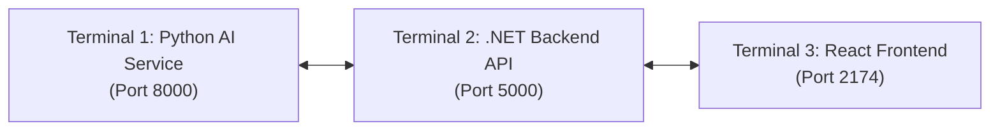

# EduFlow AI – Application Run & Deployment Guide 🚀

This guide provides end-to-end instructions for running the complete **EduFlow AI** ecosystem, including the **ASP.NET Core Backend API**, **Python LangGraph Multi-Agent Microservice**, **React Web Frontend**, and **Flutter Mobile Application**.

---

## 1. System Architecture & Port Mapping

| Subsystem | Technology | Default Port / URL | Documentation / UI |
|---|---|---|---|
| **Backend API** | ASP.NET Core (.NET 10), EF Core, PostgreSQL | `http://localhost:5000`<br>`https://localhost:5001` | `http://localhost:5000/swagger` |
| **Agentic AI Microservice** | Python 3.11+, FastAPI, LangGraph | `http://localhost:8000` | `http://localhost:8000/docs` |
| **Web Application** | React 18, Vite, Lucide Icons | `http://localhost:2174` | Web Dashboard & Portals |
| **Mobile App (Optional)** | Flutter 3.x, Dart | Device / Emulator | Student Mobile Interface |

---

## 2. Prerequisites

Ensure the following tools are installed on your machine:
- **.NET SDK** (v8.0 or v10.0+): `dotnet --version`
- **Node.js** (v18.0+ or v20.0+) and npm: `node -v` & `npm -v`
- **Python** (v3.10, v3.11, or v3.12+): `python --version`
- **Git**: `git --version`
- **Flutter SDK** *(optional, only for mobile app)*: `flutter --version`

> [!NOTE]
> The backend is already pre-configured to connect to an active PostgreSQL database instance via `backend/EduFlow.Api/appsettings.json`. Database migrations and initial seed data are applied automatically on startup.

---

## 3. Step-by-Step Execution Guide

To run the complete system locally, open **3 separate terminal windows** (one for each subsystem):



---

### Terminal 1: Python AI Multi-Agent Microservice

The AI microservice orchestrates the 7 interconnected agents (`CoordinatorPlannerAgent`, `DomainAnalysisAgent`, `ActionToolAgent`, `ValidationGuardAgent`, `QuizGeneratorAgent`, `RetentionBehaviorAgent`, `AiCoachAgent`).

1. Navigate to the `ai-agent` directory:
   ```powershell
   cd ai-agent
   ```

2. Activate the virtual environment (or create one if first time):
   ```powershell
   # Windows PowerShell
   .\venv\Scripts\Activate.ps1

   # If creating a new virtual environment:
   # python -m venv venv
   # .\venv\Scripts\Activate.ps1
   # pip install -r requirements.txt
   ```

3. *(Optional)* Configure OpenAI API Key:
   Create or edit `.env` inside `ai-agent/`:
   ```env
   OPENAI_API_KEY=your_openai_api_key_here
   ```
   *(If omitted, the service runs in intelligent pedagogical heuristic fallback mode with deterministic reasoning).*

4. Start the FastAPI server:
   ```powershell
   python -m uvicorn main:app --reload --host 0.0.0.0 --port 8000
   ```
   - **Health Check**: [http://localhost:8000/health](http://localhost:8000/health)
   - **Interactive Swagger Docs**: [http://localhost:8000/docs](http://localhost:8000/docs)
   - **Agent Topology Endpoint**: [http://localhost:8000/agents/topology](http://localhost:8000/agents/topology)

---

### Terminal 2: ASP.NET Core Backend Web API

The backend serves the REST API, JWT authentication, gamification engine, database persistence, and AI gateway forwarding.

1. Navigate to the API project directory:
   # powershell
   cd backend\EduFlow.Api


#2. Restore and run the application with **Build Reload / Recompile on Save**:
  
   # Clean rebuild and restart on save (no flaky delta hot-reload)
   dotnet watch --no-hot-reload run --non-interactive

   # Or standard delta watch
   dotnet watch run

   - **Swagger UI**: [http://localhost:5204/swagger](http://localhost:5204/swagger) or [http://localhost:5000/swagger](http://localhost:5000/swagger)
   - **API Base URL**: `http://localhost:5204/api`

---

### Terminal 3: React Web Frontend

The frontend provides the interactive **Instructor AI Review & Governance Workspace**, **Student Portal**, **Course Curriculum Management**, **Gamification Dashboard**, and **Cohort Analytics**.

1. Navigate to the frontend directory:
   ```powershell
   cd frontend
   ```

2. Install dependencies *(first time only)*:
   ```powershell
   npm install
   ```

3. Start the Vite development server:
   ```powershell
   npm run dev
   ```
   - **Web Application URL**: [http://localhost:2174](http://localhost:2174)

---

### Terminal 4: Flutter Mobile App *(Optional)*

1. Navigate to the mobile directory:
   ```powershell
   cd mobile
   ```

2. Fetch dependencies and launch:
   ```powershell
   flutter pub get
   flutter run
   ```

---

## 4. Pre-Seeded Accounts & Demo Credentials

The database comes pre-seeded with 3 authorized role-based user accounts:

| Role | Email | Password | Access Rights |
|---|---|---|---|
| **System Admin** | `admin@eduflow.ai` | `Password123!` | Full platform administration, system settings, user management, audit logs |
| **Instructor** | `instructor@eduflow.ai` | `Password123!` | Human-in-the-Loop AI proposal review, course authoring, assessment publishing |
| **Student** | `student@eduflow.ai` | `Password123!` | Student portal, study quests, gamification XP & streaks, AI Coach tutor |

---

## 5. Key Workflows to Explore

### 1. Human-in-the-Loop (HITL) AI Review Console
- Navigate to: **[http://localhost:2174](http://localhost:2174)** $\to$ Click **"AI Review"** in the sidebar.
- Click **"+ Orchestrate AI Proposal"** to trigger the 4-agent LangGraph workflow.
- Inspect the **Multi-Agent Audit Trail**, deterministic validation results, and milestone schedule.
- Click **"Approve & Dispatch"** to sign and publish the study plan to the student.

### 2. Live Student Learning Portal & AI Coach
- Navigate to: **[http://localhost:2174](http://localhost:2174)** $\to$ Click **"Student Portal"** in the navigation bar.
- Review your current level, active streak, and daily mission quests.
- Open the **"AI Coach"** tab and ask conceptual questions (e.g., *"How do composite B-Tree indexes work in PostgreSQL?"*).
- Complete interactive lessons and quizzes to earn XP, level up, and unlock achievements.

### 3. Gamification & Leaderboard System
- Navigate to: **"Gamification"** or **"Cohort Rankings"** to view real-time leaderboards, earned badges, and streak protections.

---

## 6. Running Automated Tests

### Python Multi-Agent Microservice Tests
```powershell
cd d:\Project\EduFlow\ai-agent
.\venv\Scripts\pytest.exe -v
```
*(Executes tests verifying all 7 agents, deterministic validations, schemas, and topology).*

### Backend Integration & Unit Tests
```powershell
cd d:\Project\EduFlow\backend\EduFlow.Tests
dotnet test
```

### Frontend Production Bundle Build
```powershell
cd d:\Project\EduFlow\frontend
npm run build
```

---

## 7. Continuous Rebuild Watcher ("Build Reload") 🔨

To automatically trigger a clean background re-compilation/rebuild whenever any file changes across the entire repository:

```powershell
# From root workspace directory (d:\Project\EduFlow):
npm run watch:build
```

- **Backend (.NET)**: Watches `backend/**/*.cs`, `*.csproj` and automatically runs `dotnet build`.
- **Frontend (React/Vite)**: Watches `frontend/src/**/*.{jsx,js,css}` and continuously rebuilds `dist/` bundle.
- **AI Agent (Python)**: Watches `ai-agent/**/*.py` and compiles bytecode/validates syntax instantly.

You can also run continuous watch-building for individual layers:
```powershell
npm run watch:frontend          # Continuous Vite production bundle build
npm run watch:backend           # dotnet watch build for .NET backend
npm run dev:backend:build-reload# dotnet watch run with clean rebuild on save
```

---

## 8. Troubleshooting & FAQ

### Q: Port 8000 or 5000 is already in use
- Check running processes or change the port in `ai-agent/main.py` (`port=8000`) or `backend/EduFlow.Api/Properties/launchSettings.json`.

### Q: Python script execution policy error on Windows
- If `.\venv\Scripts\Activate.ps1` gives an execution policy error, run:
  ```powershell
  Set-ExecutionPolicy -Scope Process -ExecutionPolicy Bypass
  .\venv\Scripts\Activate.ps1
  ```
  Or run without activating:
  ```powershell
  .\venv\Scripts\python.exe -m uvicorn main:app --reload --port 8000
  ```

### Q: OpenAI API Key missing warning
- An OpenAI API key is optional. When no key is provided in `ai-agent/.env`, the system automatically activates its built-in pedagogical heuristic engine to generate accurate, deterministic responses for all course topics.
