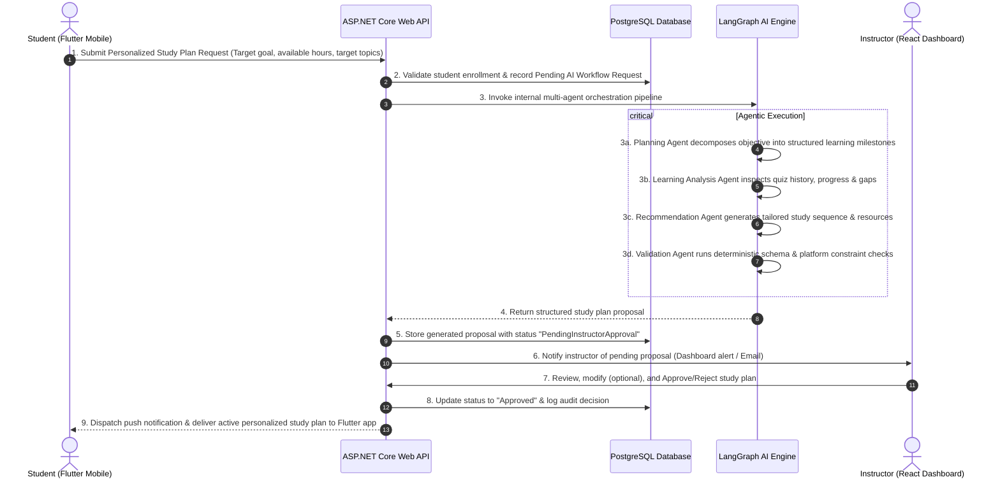

# EduFlow AI 🎓🤖
> **SE3090 – Software Engineering Frameworks | Assignment 1 Project**  
> **An Integrated Full-Stack Education Platform with Personalized Agentic AI**

[](https://github.com/organization/eduflow-ai/actions/workflows/ci.yml)
[](https://dotnet.microsoft.com/)
[](https://www.postgresql.org/)
[](https://reactjs.org/)
[](https://flutter.dev/)
[](https://langchain-ai.github.io/langgraph/)

---

## 1. Executive Summary & Problem Statement

### 1.1 The Real-World Problem
Modern educational platforms frequently lack proactive intelligence across the student learning lifecycle:
- **Delayed Academic Interventions**: Instructors typically identify struggling students only after midterm or semester exam failures.
- **One-Size-Fits-All Pacing**: Students receive static, identical curriculum pacing without dynamic adaptation to their learning velocity, strengths, or knowledge gaps.
- **Fragmented Tooling**: Course authoring, assessment grading, progress analytics, and communication channels exist in isolated silos.
- **Lack of Mobile-First Engagement**: Modern learners require ubiquitous mobile access to study plans, real-time feedback, and interactive assessments.

### 1.2 The EduFlow AI Solution
**EduFlow AI** is a cohesive, enterprise-grade educational ecosystem integrating a **React Web Dashboard** (for instructors and administrators), a **Flutter Mobile App** (for students), a secure **ASP.NET Core Web API Backend**, **PostgreSQL** relational persistence, and an **Agentic AI Subsystem (LangGraph)**.

Crucially, EduFlow AI enforces a **Human-in-the-Loop (HITL)** paradigm: AI-generated personalized study plans must be reviewed, fine-tuned, and approved by course instructors before being published to students, ensuring high educational fidelity, safety, and a complete audit trail.

---

## 2. Integrated Architecture & Cross-Platform Workflow

```
                                  +---------------------------------------+
                                  |         React Web Application         |
                                  |   (Instructors & Administrators)      |
                                  |  - Course Management & Enrollments    |
                                  |  - Progress Analytics & Gradebook     |
                                  |  - AI Study Plan Review & Approval    |
                                  +-------------------+-------------------+
                                                      |
                                           HTTPS REST | JWT Bearer
                                                      v
+---------------------------------+       +-----------+-----------+       +------------------------------------+
|     Flutter Mobile App          |       |                       |       |         PostgreSQL Database        |
|          (Students)             | ----> |  ASP.NET Core Web API | <---> |  - Normalized Relational Tables    |
| - Study Plan Requests           | HTTPS |   (Mandatory Gateway) |  EF   |  - Audit Trails & Timestamps       |
| - Lesson Viewing & Submissions  | REST  | - Auth & Role Policies| Core  |  - AI Workflow States & Approvals  |
| - Quizzes & Push Notifications  |       | - Business Validation |       +------------------------------------+
+---------------------------------+       +-----------+-----------+
                                                      |
                                       Internal HTTP  | (Internal Service Only)
                                                      v
                                  +---------------------------------------+
                                  |       Agentic AI Subsystem            |
                                  |        (LangGraph / Python)           |
                                  |  - Planning Agent                     |
                                  |  - Learning Analysis Agent            |
                                  |  - Recommendation Agent               |
                                  |  - Validation Agent (Deterministic)   |
                                  +-------------------+-------------------+
                                                      |
                                                      v
                                  +---------------------------------------+
                                  |       Third-Party Integrations        |
                                  |  - Email (SendGrid / SMTP)            |
                                  |  - Push Notifications (Firebase FCM)  |
                                  |  - Cloud Storage (S3 / Blob)          |
                                  +---------------------------------------+
```

### 2.1 End-to-End Cross-Platform Workflow Pattern


---

## 3. User Roles & Permission Matrix

| Capability / Resource | Administrator 🛡️ | Instructor 👨‍🏫 | Student 🎓 |
| :--- | :---: | :---: | :---: |
| **System Governance & User Management** | ✅ Full Access | ❌ Forbidden | ❌ Forbidden |
| **Course & Module Creation / Publishing** | ✅ Full Access | ✅ Owned Courses | ❌ Read-Only (Enrolled) |
| **Assignment / Quiz Creation & Auto-Grading** | ✅ Full Access | ✅ Manage & Grade | ❌ Submit Only |
| **Student Progress & Transcript Oversight** | ✅ System-Wide | ✅ Enrolled Cohorts | ❌ Own Progress Only |
| **Request AI Study Plan** | ❌ Forbidden | ❌ Forbidden | ✅ Submit Request |
| **Review & Approve/Reject AI Study Plan** | ✅ Full Access | ✅ Assigned Cohorts | ❌ Forbidden |
| **View Audit Trail & Agent Execution Logs** | ✅ Full Access | ✅ Assigned Workflows | ❌ Final Output Only |
| **Communication & Broadcast Announcements** | ✅ Global | ✅ Course-Level | ❌ Receive Only |

---

## 4. Business Component Breakdown & Student Ownership

As mandated by **SE3090 Assignment 1**, each student owns one primary business component across the entire stack (Backend, Database, React, Flutter, Testing, and a distinct Agentic AI contribution):

```
+---------------------------------------------------------------------------------------------------+
|                                      TEAM WORKLOAD ALLOCATION                                     |
+-------------------+----------------------------+-----------------------+--------------------------+
| Student           | Business Component         | Full-Stack Scope      | Agentic AI Ownership     |
+-------------------+----------------------------+-----------------------+--------------------------+
| Student 1         | Component A:               | Courses, Modules,     | Planning Agent           |
| (Lead / Core)     | Course Management          | Lessons, Enrollments  | (Decomposition & Milestones)
+-------------------+----------------------------+-----------------------+--------------------------+
| Student 2         | Component B:               | Activity Tracking,    | Learning Analysis Agent  |
| (Analytics)       | Progress Tracking          | Analytics, Transcripts| (Knowledge Gap Evaluator)|
+-------------------+----------------------------+-----------------------+--------------------------+
| Student 3         | Component C:               | Quizzes, Submissions, | Recommendation Agent     |
| (Assessments)     | Assessment Engine          | Auto-Grading, Rubrics | (Content Sequence Planner)
+-------------------+----------------------------+-----------------------+--------------------------+
| Student 4         | Component D:               | Notifications, Email, | Validation Agent         |
| (Comms & Safety)  | Communication Hub & Safety | Broadcasts, Audit Log | (Deterministic Rule Guard)
+-------------------+----------------------------+-----------------------+--------------------------+
```

### Component Details
1. **Student 1 – Course Management & Curriculum (Component A)**:
   - *Backend*: `CoursesController`, `ModulesController`, `EnrollmentsController`.
   - *DB*: `Courses`, `Modules`, `Lessons`, `Enrollments` tables with cascading relationships and indexes.
   - *React*: Course builder UI, rich text lesson editor, enrollment manager with pagination and filters.
   - *Flutter*: Course catalog, module navigation, lesson video/markdown reader.
   - *Agent*: **Planning Agent** – Decomposes student learning goals into structured, achievable academic phases.

2. **Student 2 – Progress Tracking & Analytics (Component B)**:
   - *Backend*: `ProgressController`, `AnalyticsController`, `TranscriptsController`.
   - *DB*: `LessonCompletions`, `StudentMetrics`, `AttendanceLogs`, `AuditLogs`.
   - *React*: Visual cohort analytics charts, at-risk student identifier, completion dashboards.
   - *Flutter*: Real-time student progress bar, milestone badges, personalized transcript view.
   - *Agent*: **Learning Analysis Agent** – Detects comprehension bottlenecks, pace velocity, and at-risk signals.

3. **Student 3 – Assessment Engine & Grading (Component C)**:
   - *Backend*: `AssessmentsController`, `SubmissionsController`, `GradesController`.
   - *DB*: `Assessments`, `Questions`, `Submissions`, `QuestionAnswers`, `Rubrics`.
   - *React*: Quiz creator, rubric scoring interface, batch submission reviewer with sorting and search.
   - *Flutter*: Interactive timed quiz interface, assignment file uploader (camera/doc picker), instant score view.
   - *Agent*: **Recommendation Agent** – Generates remedial exercises, targeted review topics, and tailored reading lists.

4. **Student 4 – Communication Hub, Governance & Safety (Component D)**:
   - *Backend*: `NotificationsController`, `AnnouncementsController`, `AiApprovalsController`.
   - *DB*: `Notifications`, `Announcements`, `AiWorkflowStates`, `AiAuditTrails`.
   - *React*: Instructor AI Study Plan Review & Approval interface (Approve/Reject/Modify), system announcement broadcast.
   - *Flutter*: In-app notification center, real-time push alerts, study reminder scheduler.
   - *Agent*: **Validation Agent** – Deterministic JSON schema verification, prerequisite course boundary validator, safety/policy checker.

---

## 5. Technology Stack Summary

| Layer | Framework / Technology | Justification & Role |
| :--- | :--- | :--- |
| **Backend API** | **ASP.NET Core 8.0 Web API** | Type-safe, high-performance RESTful API gateway, JWT auth, business validation, and agent coordinator. |
| **Database & ORM** | **PostgreSQL 16 + Entity Framework Core** | Normalized ACID relational storage, relational integrity, migrations, seed data, and audit tracking. |
| **Web Dashboard** | **React 18 (Vite, TypeScript/JS)** | Component-based, responsive instructor & admin dashboard utilizing Zustand / Context API and Axios. |
| **Mobile Client** | **Flutter 3.x (Dart)** | Cross-platform mobile client for students with clean BLoC/Provider architecture and secure storage. |
| **Agentic AI** | **LangGraph + LangChain (Python 3.11)** | Multi-agent state machine coordinating specialized agents with tool allow-listing and deterministic validation. |
| **Third-Party Services** | **SendGrid / FCM / Cloudinary** | Transactional emails, mobile push notifications, and assignment asset uploads. |
| **Testing & CI/CD** | **xUnit, Jest, Flutter Test, PyTest, GitHub Actions** | End-to-end automated testing, linting, and CI pipelines on every PR. |

---

## 6. Monorepo Directory Structure

```
EduHub/
├── .github/
│   └── workflows/
│       └── ci.yml                     # Multi-project GitHub Actions CI workflow
├── backend/                           # ASP.NET Core 8.0 Web API
│   ├── EduFlow.Api/                   # Controllers, Program.cs, Middleware, Swagger
│   ├── EduFlow.Core/                  # Domain Entities, Interfaces, Enums, DTOs
│   ├── EduFlow.Infrastructure/        # EF Core DbContext, Migrations, Repositories, Third-Party
│   ├── EduFlow.Tests/                 # xUnit Unit & Integration Tests
│   └── README.md                      # Backend specific documentation & guide
├── frontend/                          # React 18 Instructor/Admin Web Application
│   ├── src/
│   │   ├── components/                # Reusable UI components
│   │   ├── pages/                     # Dashboard, Courses, Assessments, AI Approval
│   │   ├── services/                  # Axios API client
│   │   └── store/                     # Zustand / Context API state stores
│   ├── package.json
│   └── README.md                      # Frontend specific documentation & guide
├── mobile/                            # Flutter 3.x Student Mobile Application
│   ├── lib/
│   │   ├── models/                    # Data models & JSON serialization
│   │   ├── providers/                 # BLoC / State management
│   │   ├── screens/                   # Auth, Courses, Quizzes, Study Plan, Notifications
│   │   └── services/                  # REST API client & Secure storage
│   ├── pubspec.yaml
│   └── README.md                      # Mobile specific documentation & APK guide
├── ai-agent/                          # Python LangGraph Agentic AI Microservice
│   ├── agents/                        # Planning, Analysis, Recommendation, Validation agents
│   ├── tools/                         # Allow-listed domain tools & schemas
│   ├── graph/                         # State graph & node definitions
│   ├── tests/                         # Golden test cases, schema validation, safety tests
│   ├── main.py                        # FastAPI internal server
│   ├── requirements.txt
│   └── README.md                      # Agentic AI architecture & evaluation guide
├── docs/                              # Comprehensive Project Documentation
│   ├── ADR.md                         # Architecture Decision Records (ADR 001 - 006)
│   ├── CI_CD.md                       # CI/CD pipelines & deployment architecture
│   ├── DATABASE_SCHEMA.md             # ER Diagram, table schemas, relationships & indexes
│   └── API_SPECIFICATION.md           # REST API endpoints & request/response contracts
└── README.md                          # Root README (this file)
```

---

## 7. Quick Start & Local Setup Guide

### 7.1 Prerequisites
Ensure the following are installed locally:
- [.NET 8.0 SDK](https://dotnet.microsoft.com/download/dotnet/8.0)
- [Node.js 18+ & npm](https://nodejs.org/)
- [Flutter SDK 3.19+](https://docs.flutter.dev/get-started/install) & Android Studio / VS Code
- [Python 3.11+](https://www.python.org/)
- [PostgreSQL 16](https://www.postgresql.org/) (or Docker Desktop)

### 7.2 Step 1: Clone the Repository
```bash
git clone https://github.com/organization/EduHub.git
cd EduHub
```

### 7.3 Step 2: Database Setup & Migrations
Create a PostgreSQL database named `eduflow_db`.
```bash
# Navigate to backend directory
cd backend/EduFlow.Api

# Update appsettings.json or set ConnectionStrings__DefaultConnection
# Run EF Core Migrations
dotnet ef database update --project ../EduFlow.Infrastructure --startup-project .
```

### 7.4 Step 3: Run the Backend API
```bash
dotnet run
# API will start at: https://localhost:7001 (Swagger: https://localhost:7001/swagger)
```

### 7.5 Step 4: Run the Internal Agentic AI Service
```bash
cd ../../ai-agent
python -m venv venv
# Windows:
.\venv\Scripts\activate
# Linux/macOS:
source venv/bin/activate

pip install -r requirements.txt
python main.py
# AI microservice starts at: http://localhost:8000
```

### 7.6 Step 5: Run the React Web Dashboard
```bash
cd ../frontend
npm install
npm run dev
# React Web App will start at: http://localhost:5173
```

### 7.7 Step 6: Run the Flutter Mobile Application
```bash
cd ../mobile
flutter pub get
flutter run
# Launches connected Android Emulator or Physical Device
```

---

## 8. Subsystem Documentation Quick Links

- 📖 [Backend ASP.NET Core & Database Guide](file:///d:/Project/EduHub/backend/README.md)
- 🖥️ [React Web Application Guide](file:///d:/Project/EduHub/frontend/README.md)
- 📱 [Flutter Mobile Application Guide](file:///d:/Project/EduHub/mobile/README.md)
- 🧠 [Agentic AI Subsystem & LangGraph Guide](file:///d:/Project/EduHub/ai-agent/README.md)
- 🏛️ [Architecture Decision Records (ADRs)](file:///d:/Project/EduHub/docs/ADR.md)
- 🗄️ [Database Schema & ER Diagram](file:///d:/Project/EduHub/docs/DATABASE_SCHEMA.md)
- 🚀 [CI/CD & DevOps Pipeline](file:///d:/Project/EduHub/docs/CI_CD.md)

---

## 9. Academic Integrity & AI Usage Declaration

This project has been developed in accordance with the **SLIIT Academic Integrity Guidelines** and the **CLEAR Framework / AI Assessment Scale (Level 4 - Full AI)** for SE3090.
- All AI tools used during development have been logged with dates, prompts, verification steps, and code refactorings in the individual student logs.
- All final business logic, security rules, data access abstractions, and agent orchestration workflows are fully understood and defended by the group members for the final demonstration and viva.

---

## 10. Authors & Contribution Acknowledgments

- **Student 1 (ITxxxxxxxx)**: Course Management & Planning Agent
- **Student 2 (ITxxxxxxxx)**: Progress Tracking & Learning Analysis Agent
- **Student 3 (ITxxxxxxxx)**: Assessment Engine & Recommendation Agent
- **Student 4 (ITxxxxxxxx)**: Communication Hub & Validation Agent
# EduFlowAi
