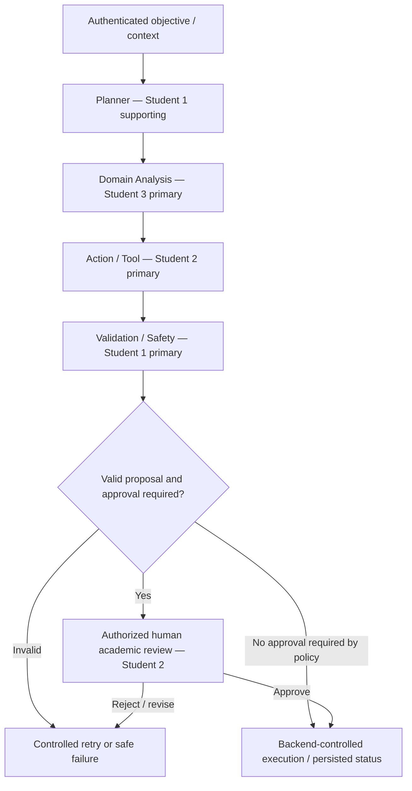

# EduFlow AI – Agentic AI Subsystem 🧠

> **Current ownership and status:** Read [RESPONSIBILITY_MATRIX.md](../docs/responsibilities/RESPONSIBILITY_MATRIX.md) first. Student 1 owns Validation / Safety and supports Planner/lifecycle; Student 2 owns Action / Tool and academic generation/evaluation; Student 3 owns Domain Analysis and learner guidance. Four core roles remain distinct. Group-size approval remains **TO CONFIRM**; new ownership does not prove past contribution. Graph durability, validation enforcement and approval execution remain PARTIAL.

> **Multi-Agent Adaptive Orchestration Engine built with LangGraph, LangChain, and Python 3.11**

---

## 1. Subsystem Overview

The EduFlow AI Agentic Subsystem is an internal Python microservice responsible for orchestrating **Adaptive Gamification**. Instead of generic chatbots, it operates a **multi-agent state machine** powered by **LangGraph** where specialized autonomous agents analyze student performance, pinpoint comprehension gaps, generate calibrated game challenges, and enforce **strict deterministic safety guardrails** before queueing items for instructor approval.

---

## 2. Core Workflow Architecture

The retained assessed sequence is Planner → Domain Analysis → Action / Tool → Validation / Safety → authorized human approval where required. This is the target handoff; current orchestration is not proof that all approval/publication safeguards or durable recovery work.



---

## 3. Four Core Agent Roles and Supporting Capabilities

The JSON and state examples below are design illustrations; actual contracts live in the agent schemas/registry. There are more implemented agent classes than the four core workflow roles.

### Core Role 1 — Coordinator / Planner (Student 1, supporting)

- Source: [planner.py](agents/planner.py).
- Input: authorized objective, context and permitted actions.
- Output: structured plan and delegation.
- Current limitation: planning/execution remains largely fixed and not consistently driven by a durable plan.

### Core Role 2 — Domain Analysis (Student 3)

- **Input**: Student profile, course progress, quiz attempt answer history, mistakes.
- **Output**: Detailed skill assessment:
  ```json
  {
    "studentId": "uuid",
    "courseId": "uuid",
    "strengths": ["Python Syntax", "Basic Loops"],
    "weakAreas": ["Nested Loops", "List Comprehensions"],
    "recommendedDifficulty": "Medium",
    "confidenceScore": 0.92
  }
  ```

### Core Role 3 — Action / Tool (Student 2)

- **Input**: Weak areas, target course curriculum, student level, difficulty target.
- **Output**: Adaptive challenge proposal:
  ```json
  {
    "title": "Nested Loop Navigator",
    "description": "Construct a 2D matrix traversal algorithm to escape the dungeon.",
    "difficulty": "Medium",
    "xpReward": 120,
    "coinReward": 40,
    "timeLimitMinutes": 15,
    "questions": [
      {
        "questionText": "What will be the output of the following nested loop?",
        "options": ["A", "B", "C", "D"],
        "correctIndex": 2,
        "explanation": "The inner loop executes 3 times for each of the 4 outer iterations."
      }
    ]
  }
  ```

### Core Role 4 — Validation / Safety (Student 1)

Target guard checks include the following; current application acceptance/publication can bypass validation, so universal enforcement is not claimed:

1. **Schema Integrity**: Validates full Pydantic models.
2. **Catalog Integrity**: Ensures all referenced `course_id`, `module_id`, and `lesson_id` exist.
3. **Reward Bounds**: Validates that $XP \le \text{MaxReward}(\text{Difficulty})$ (e.g., Easy $\le 50$, Medium $\le 150$, Hard $\le 300$).
4. **Answer Completeness**: Verifies every question has at least 2 options, exactly 1 valid `correctIndex`, and a non-empty explanation.

---

### Supporting Capability — AI Learning Coach (Student 3)

The coach makes model calls, but fully controlled-tool grounding is incomplete. The following is a proposed tool interface, not a claim that every listed function is registered or invoked:

- `get_student_progress()`: Queries current level, XP, and streak.
- `get_course_content()`: Reads authoritative lesson materials.
- `get_quiz_results()`: Inspects recent mistakes to give contextual hints without giving away the direct answer.
- `recommend_challenge()`: Suggests an instant 5-minute practice mission.
- `explain_question()`: Provides step-by-step conceptual walkthroughs.

Additional agent sources remain in scope: Student 2 maintains Quiz Generator, Slide Topic and Quiz Evaluator; Student 3 maintains Retention Behaviour and Next Best Action alongside AI Coach. Normal .NET submissions do not yet invoke the Python evaluator, and the public next-best-action route is incomplete. Shared graph/state/tool registry and gateway contracts are not exclusively owned by one student.

---

## 4. LangGraph State Machine

```python
class AdaptiveChallengeWorkflowState(TypedDict):
    workflow_id: str
    student_id: str
    course_id: str
    student_level: int
    raw_quiz_history: list[dict]
    analysis_report: dict
    generated_challenge: dict
    validation_passed: bool
    validation_errors: list[str]
    audit_trail: list[dict]
    status: str
```

---

## Canonical documentation and code entry points

Read [Start here](../docs/README.md) and [implementation status](../docs/project/17_IMPLEMENTATION_STATUS.md). Detailed contracts live in [AI orchestration](../docs/project/09_AI_ORCHESTRATION.md), [integration](../docs/project/08_COMPONENT_INTEGRATION.md) and [architecture decisions](../docs/project/14_ARCHITECTURE_DECISIONS.md); examples below are subsystem reference material, not a competing source of truth.

Code entry points: [FastAPI service](main.py), [workflow graph](graph/workflow.py), [agents](agents/) and [tests](tests/). Use the [whole-system run guide](../docs/project/18_RUN_AND_SETUP.md) for service configuration. Setup commands below are instructions, not passing test evidence.

## 5. Local Setup & Testing

For full system installation details, see the **[Local Setup Guide](../LOCAL_SETUP_GUIDE.md)** or **[Application Run Guide](../docs/project/18_RUN_AND_SETUP.md)**.

### 1. Virtual Environment & Dependencies

```powershell
# Navigate to AI agent directory
cd ai-agent

# Create virtual environment
python -m venv venv

# Activate virtual environment
# Windows PowerShell:
.\venv\Scripts\Activate.ps1
# Windows CMD:
# .\venv\Scripts\activate.bat
# Linux / macOS:
# source venv/bin/activate

# Install dependencies
pip install -r requirements.txt
```

### 2. Environment Configuration (Optional)
Create a `.env` file inside `ai-agent/`:
```env
OPENAI_API_KEY=your_openai_api_key_here
```

### 3. Run Tests & FastAPI Microservice

```powershell
# Run deterministic test suite (graph topology, validations, agent schemas)
pytest tests/

# Run FastAPI server with auto-reload
python main.py
# Or using uvicorn directly:
# python -m uvicorn main:app --reload --host 0.0.0.0 --port 8888
```

- **Health Check**: [http://localhost:8888/health](http://localhost:8888/health)
- **Interactive Swagger Docs**: [http://localhost:8888/docs](http://localhost:8888/docs)
- **Agent Topology**: [http://localhost:8888/agents/topology](http://localhost:8888/agents/topology)

