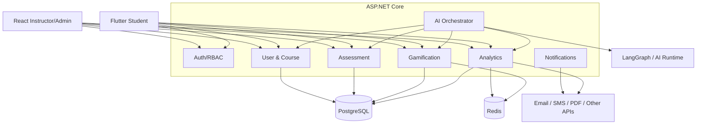
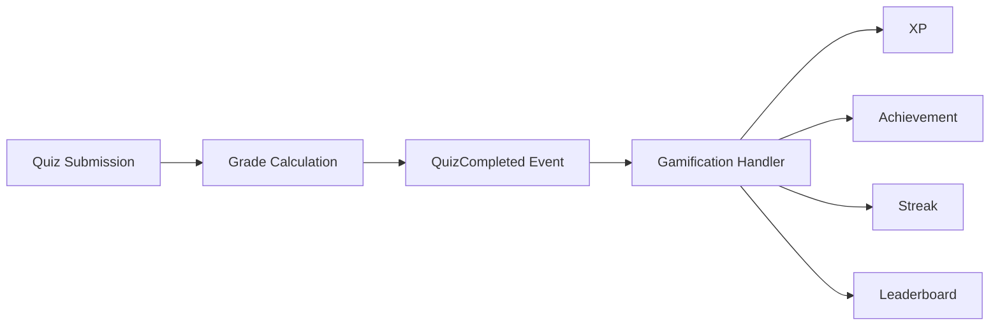

# EduFlow AI – System Architecture

## 1. Architectural Style

Use a **modular monolith with clear bounded components** for the first release.

The backend is one deployable ASP.NET Core application, but code is separated into modules:

```text
EduFlow.Api
EduFlow.Application
EduFlow.Domain
EduFlow.Infrastructure
```

This is preferable for the assignment because it:
- simplifies deployment
- keeps transactions straightforward
- avoids distributed-system overhead
- still demonstrates strong component boundaries
- allows later extraction into microservices

---

## 2. Logical Architecture



---

## 3. Request Flow

Every HTTP request follows:

```text
Client
 ↓
HTTPS
 ↓
ASP.NET Core Middleware
 ↓
JWT Authentication
 ↓
Authorization
 ↓
Controller
 ↓
Application Service
 ↓
Domain Logic
 ↓
Repository
 ↓
PostgreSQL
```

Do not put business logic in controllers.

---

## 4. Suggested Layers

### API Layer

Responsibilities:
- HTTP request/response
- DTO binding
- status codes
- authentication metadata

### Application Layer

Responsibilities:
- use cases
- orchestration
- transaction boundaries
- DTO mapping

### Domain Layer

Responsibilities:
- entities
- value objects
- business rules
- domain events

### Infrastructure

Responsibilities:
- EF Core
- PostgreSQL
- Redis
- external providers
- file storage
- messaging

---

## 5. Cross-Component Integration

### Course → Quiz

A quiz belongs to a course/module/lesson.

```text
Course
  └── Module
       └── Lesson
            └── Quiz
```

### Quiz → Gamification

After successful submission:



### Gamification → Analytics

Gamification events are aggregated into engagement metrics.

### Analytics → AI

AI reads analytics and performance features to recommend the next learning activity.

---

## 6. Synchronous vs Asynchronous Work

### Synchronous

Use synchronous request/response for:
- login
- fetching courses
- taking quiz
- quiz submission
- reading profile
- retrieving leaderboard

### Asynchronous/domain event flow

Use events/jobs for:
- XP calculation
- badge checking
- leaderboard refresh
- notification generation
- report generation
- AI analysis
- AI content generation
- external notification calls

This prevents slow actions from blocking the mobile UI.

---

## 7. Real-Time

Use ASP.NET Core SignalR for:

```text
XP updates
Level-up events
Badge unlocked events
Leaderboard changes
Instructor notifications
AI approval updates
```

Do not expose PostgreSQL directly to clients.
