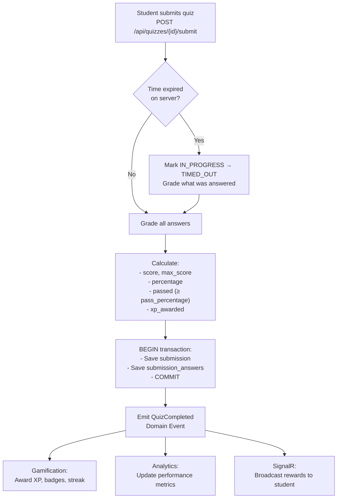

# Member 2 – Assessments & Quizzes

> **Component Owner**: Member 2  
> **AI Agent Responsibility**: Action / Tool Agent  
> **Interface**: React Web Portal (quiz builder, HITL review) + Flutter Mobile (quiz-taking)

---

## Business Component Scope

Member 2 owns the **complete assessment lifecycle** — from quiz creation and AI-assisted question generation through student attempts to grading and feedback.

**Owns:**
- Quiz configuration and settings
- Question bank (MCQ, fill-in-blank, true/false, dropdown, short answer)
- Quiz attempts, timing, and attempt limits
- Server-side auto-grading engine
- AI-generated question review workflow
- Personalized quiz feedback
- Action / Tool Agent

---

## 1. Database Schema

### 1.1 Quizzes

```sql
CREATE TABLE quizzes (
    id UUID PRIMARY KEY DEFAULT gen_random_uuid(),
    course_id UUID NOT NULL REFERENCES courses(id) ON DELETE CASCADE,
    module_id UUID REFERENCES modules(id),
    lesson_id UUID REFERENCES lessons(id),
    title VARCHAR(200) NOT NULL,
    description TEXT,
    quiz_type VARCHAR(20) NOT NULL DEFAULT 'STANDARD',
    -- STANDARD | ADAPTIVE | PRACTICE | BOSS_BATTLE | DAILY
    time_limit_minutes INTEGER,              -- NULL = no time limit
    pass_percentage DECIMAL(5,2) NOT NULL DEFAULT 60.0,
    max_attempts INTEGER NOT NULL DEFAULT 3,
    shuffle_questions BOOLEAN NOT NULL DEFAULT TRUE,
    shuffle_options BOOLEAN NOT NULL DEFAULT TRUE,
    show_feedback VARCHAR(20) NOT NULL DEFAULT 'AFTER_SUBMISSION',
    -- AFTER_EACH | AFTER_SUBMISSION | AFTER_DEADLINE | NEVER
    available_from TIMESTAMPTZ,
    available_until TIMESTAMPTZ,
    status VARCHAR(20) NOT NULL DEFAULT 'DRAFT',
    -- DRAFT | PUBLISHED | CLOSED | ARCHIVED
    created_by UUID NOT NULL REFERENCES users(id),
    created_at TIMESTAMPTZ NOT NULL DEFAULT NOW(),
    updated_at TIMESTAMPTZ NOT NULL DEFAULT NOW()
);

CREATE INDEX idx_quizzes_course ON quizzes(course_id, status);
```

### 1.2 Questions

```sql
CREATE TABLE questions (
    id UUID PRIMARY KEY DEFAULT gen_random_uuid(),
    course_id UUID NOT NULL REFERENCES courses(id),
    quiz_id UUID REFERENCES quizzes(id) ON DELETE SET NULL,
    question_type VARCHAR(30) NOT NULL,
    -- MCQ | MULTIPLE_SELECT | FILL_BLANK | TRUE_FALSE | DROPDOWN | SHORT_ANSWER
    question_text TEXT NOT NULL,
    explanation TEXT,          -- shown after grading
    difficulty VARCHAR(10) NOT NULL DEFAULT 'MEDIUM',
    topic_tag VARCHAR(100),
    xp_reward INTEGER NOT NULL DEFAULT 10,
    display_order INTEGER,
    ai_generated BOOLEAN NOT NULL DEFAULT FALSE,
    ai_review_status VARCHAR(20),
    -- NULL | PENDING_REVIEW | APPROVED | EDITED | REJECTED
    source_chunk_ids UUID[],   -- RAG traceability
    created_by UUID REFERENCES users(id),
    created_at TIMESTAMPTZ NOT NULL DEFAULT NOW(),
    updated_at TIMESTAMPTZ NOT NULL DEFAULT NOW()
);

CREATE INDEX idx_questions_course ON questions(course_id, topic_tag);
CREATE INDEX idx_questions_quiz ON questions(quiz_id);
```

### 1.3 Answer Options (for MCQ, Multiple Select, Dropdown)

```sql
CREATE TABLE question_options (
    id UUID PRIMARY KEY DEFAULT gen_random_uuid(),
    question_id UUID NOT NULL REFERENCES questions(id) ON DELETE CASCADE,
    option_text TEXT NOT NULL,
    is_correct BOOLEAN NOT NULL DEFAULT FALSE,
    display_order INTEGER NOT NULL
    -- NEVER expose is_correct to client before grading
);
```

### 1.4 Quiz Submissions (Attempts)

```sql
CREATE TABLE quiz_submissions (
    id UUID PRIMARY KEY DEFAULT gen_random_uuid(),
    quiz_id UUID NOT NULL REFERENCES quizzes(id),
    student_id UUID NOT NULL REFERENCES users(id),
    attempt_number INTEGER NOT NULL DEFAULT 1,
    started_at TIMESTAMPTZ NOT NULL DEFAULT NOW(),
    expires_at TIMESTAMPTZ,        -- started_at + time_limit (server-computed)
    submitted_at TIMESTAMPTZ,
    score DECIMAL(5,2),            -- raw marks earned
    max_score DECIMAL(5,2),        -- total possible marks
    percentage DECIMAL(5,2),       -- (score/max_score) * 100
    passed BOOLEAN,
    xp_awarded INTEGER,
    status VARCHAR(20) NOT NULL DEFAULT 'IN_PROGRESS',
    -- IN_PROGRESS | SUBMITTED | TIMED_OUT | ABANDONED
    created_at TIMESTAMPTZ NOT NULL DEFAULT NOW(),
    UNIQUE(student_id, quiz_id, attempt_number)
);

CREATE INDEX idx_submissions_student ON quiz_submissions(student_id, quiz_id);
CREATE INDEX idx_submissions_quiz ON quiz_submissions(quiz_id, status);
```

### 1.5 Submission Answers

```sql
CREATE TABLE submission_answers (
    id UUID PRIMARY KEY DEFAULT gen_random_uuid(),
    submission_id UUID NOT NULL REFERENCES quiz_submissions(id) ON DELETE CASCADE,
    question_id UUID NOT NULL REFERENCES questions(id),
    selected_option_ids UUID[],    -- for MCQ, Multiple Select, Dropdown
    text_answer TEXT,              -- for Fill Blank, Short Answer
    is_correct BOOLEAN,
    marks_awarded DECIMAL(5,2) NOT NULL DEFAULT 0,
    ai_grading_confidence DECIMAL(3,2),  -- for short answers (0.0–1.0)
    requires_human_review BOOLEAN NOT NULL DEFAULT FALSE
);
```

---

## 2. Grading Engine

### 2.1 Grading Flow



### 2.2 Grading Logic by Question Type

```python
def grade_answer(question, submission_answer):
    match question.question_type:
        
        case "MCQ":
            # Exact match on single correct option
            correct = question.options.filter(is_correct=True).first()
            is_correct = submission_answer.selected_option_ids == [correct.id]
            
        case "MULTIPLE_SELECT":
            # All correct options selected, no wrong options
            correct_ids = set(q.id for q in question.options if q.is_correct)
            selected_ids = set(submission_answer.selected_option_ids)
            is_correct = correct_ids == selected_ids
            
        case "FILL_BLANK":
            # Case-insensitive, trimmed match; check synonyms list
            student_ans = submission_answer.text_answer.strip().lower()
            accepted = [a.strip().lower() for a in question.accepted_answers]
            is_correct = student_ans in accepted
            
        case "TRUE_FALSE":
            correct = "true" if question.correct_bool else "false"
            is_correct = submission_answer.text_answer.lower() == correct
            
        case "DROPDOWN":
            correct = question.options.filter(is_correct=True).first()
            is_correct = submission_answer.selected_option_ids == [correct.id]
            
        case "SHORT_ANSWER":
            # AI-assisted grading
            result = ai_grade_short_answer(question, submission_answer.text_answer)
            is_correct = result.score >= 0.6  # 60% threshold
            if result.confidence < 0.8:
                submission_answer.requires_human_review = True

    marks = question.xp_reward if is_correct else 0
    return is_correct, marks
```

### 2.3 Score Calculation

```text
score     = Σ marks_awarded for each question
max_score = Σ xp_reward for each question

percentage = (score / max_score) × 100
passed     = percentage >= quiz.pass_percentage

xp_earned  = score
           + quiz_completion_bonus (20 XP)
           + perfect_score_bonus (50 XP if percentage == 100)

final_xp   = min(xp_earned, quiz.max_xp_cap)
```

### 2.4 Timing Security

```text
SERVER side (on submission):
    if current_utc_time > submission.expires_at:
        mark as TIMED_OUT
        grade only answers received so far
        do NOT reject (student still gets partial credit)

CLIENT side timer:
    displayed for UX only
    never trusted for grading decisions

starts_at stored when student hits [Start Quiz]
expires_at = started_at + (quiz.time_limit_minutes × 60 seconds)
```

---

## 3. API Endpoints

### 3.1 Quiz Management (Instructor/Admin)

```http
POST   /api/quizzes                        Create quiz [Instructor, Admin]
GET    /api/courses/{courseId}/quizzes     List quizzes for course
GET    /api/quizzes/{id}                   Get quiz detail
PUT    /api/quizzes/{id}                   Update quiz settings
DELETE /api/quizzes/{id}                   Delete quiz
POST   /api/quizzes/{id}/publish           Publish quiz to students
POST   /api/quizzes/{id}/close             Close quiz (no more attempts)
```

### 3.2 Question Management

```http
POST   /api/quizzes/{quizId}/questions     Add question manually
GET    /api/quizzes/{quizId}/questions     Get question list (with correct answers) [Instructor]
PUT    /api/questions/{id}                 Update question
DELETE /api/questions/{id}                 Remove question from quiz
GET    /api/courses/{courseId}/question-bank   Browse question bank [Instructor]
```

### 3.3 AI Quiz Generation & Review

```http
POST   /api/ai/quizzes/generate            Request AI quiz generation [Instructor]
GET    /api/ai/quiz-drafts                  List pending review drafts [Instructor]
GET    /api/ai/quiz-drafts/{draftId}       View draft questions
PATCH  /api/ai/quiz-drafts/{questionId}/approve   Approve a question
PATCH  /api/ai/quiz-drafts/{questionId}/edit      Edit + approve a question
PATCH  /api/ai/quiz-drafts/{questionId}/reject    Reject a question
POST   /api/ai/quiz-drafts/{draftId}/publish-all  Publish all approved questions
```

### 3.4 Student Quiz Flow

```http
GET    /api/students/me/quizzes             List available quizzes [Student]
GET    /api/quizzes/{id}/eligibility        Check can take (enrolled, attempts left, window) [Student]
POST   /api/quizzes/{id}/start             Start attempt → returns shuffled questions [Student]
POST   /api/quizzes/{id}/submit            Submit answers → returns graded result [Student]
GET    /api/submissions/{id}/result        Get submission result + feedback [Student]
GET    /api/quizzes/{id}/history           My attempt history [Student]
```

---

## 4. Action / Tool Agent

The Tool Agent executes controlled operations on behalf of the Planner. It has access to a **fixed, registered tool set** — it cannot invent new tools.

### 4.1 Tool Registry

```python
TOOL_REGISTRY = {
    "get_course_content": get_course_content,        # Fetch modules/lessons
    "get_lesson_content": get_lesson_content,        # Fetch specific lesson
    "get_student_quiz_history": get_quiz_history,    # Student's past results
    "get_question_bank": get_question_bank,          # Existing questions in course
    "create_quiz_draft": create_quiz_draft,          # Generate question draft (JSON)
    "check_question_duplicate": check_duplicate,     # Prevent repeated questions
    "generate_feedback_draft": generate_feedback,    # AI feedback for wrong answer
    "get_quiz_schema": get_quiz_schema,              # Pydantic validation schema
}
```

### 4.2 Tool Call Example

```json
{
  "tool": "create_quiz_draft",
  "input": {
    "courseId": "uuid",
    "moduleId": "uuid",
    "questionTypes": ["MCQ", "FILL_BLANK"],
    "difficulty": "MEDIUM",
    "questionCount": 10,
    "learningObjectives": [
      "Understand Python loops",
      "Apply list comprehension"
    ],
    "contextChunks": ["chunk_uuid_1", "chunk_uuid_2"]
  }
}
```

### 4.3 Generated Question Schema (Pydantic)

```python
class GeneratedQuestion(BaseModel):
    question_text: str
    question_type: Literal["MCQ", "FILL_BLANK", "TRUE_FALSE", "DROPDOWN", "SHORT_ANSWER"]
    options: Optional[List[str]] = None       # for MCQ, Dropdown
    correct_answer: str
    explanation: str
    difficulty: Literal["EASY", "MEDIUM", "HARD", "EXPERT"]
    topic_tag: str
    xp_reward: int = Field(ge=5, le=20)       # bounded range
    source_chunk_ids: List[str]               # traceability

class QuizDraft(BaseModel):
    questions: List[GeneratedQuestion]
    total_questions: int
    estimated_time_minutes: int
    topics_covered: List[str]
```

---

## 5. Short Answer AI Grading

```text
For short answer questions with confidence < 0.8:
1. Save submission with requires_human_review = true
2. Still award partial XP based on AI score
3. Instructor notified: "2 short answers need manual grading"
4. Instructor reviews via React dashboard
5. Instructor overrides → final marks updated
6. Student notified of final result
```

---

## 6. React Web Pages

```text
/instructor/courses/:id/quizzes          → Quiz list for course
/instructor/quizzes/create               → Quiz builder (settings + questions)
/instructor/quizzes/:id/edit             → Edit quiz
/instructor/quizzes/:id/results          → All student results + analytics
/instructor/ai-review                    → AI draft review queue
/instructor/ai-review/:draftId           → Question-by-question review interface
/instructor/question-bank                → Browse/search question bank
```

---

## 7. Flutter Screens (Student)

```text
Quiz List           → Available quizzes per course/module
Quiz Intro          → Rules, questions count, time limit, XP reward
Question Screen     → One question per screen with progress indicator
Timer Display       → Countdown (client-side display, server enforces)
Submit Screen       → "Are you sure?" confirmation
Results Screen      → Score, passed/failed, XP earned, badges unlocked
Answer Review       → Correct/incorrect breakdown with explanations
```

---

## 8. Testing Requirements

```text
Unit tests (must cover):
✓ Exact score calculation for each question type
✓ Pass/fail threshold logic (60% default)
✓ Timer expiry: server-side check must reject late submissions
✓ Attempt limit enforcement (3 by default)
✓ Duplicate submission prevention (UNIQUE constraint)
✓ Correct answer never exposed to client before grading
✓ XP cap enforcement (never exceed quiz.max_xp_cap)
✓ Short answer grading threshold (confidence < 0.8 → human review)

Integration tests (must cover):
✓ Start quiz → submit → receive graded result → XP appears
✓ Time limit exceeded → submission accepted with penalty
✓ Maximum attempts reached → 4th attempt returns 403
✓ Unenrolled student cannot access quiz → 403
✓ AI question generation → HITL approval → quiz published → student sees it
✓ Concurrent submissions from same student don't duplicate XP
```
