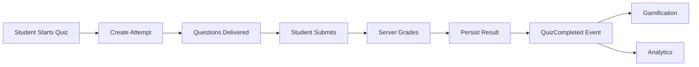
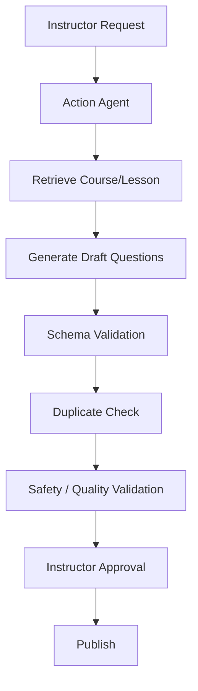

# Member 2 – Assessments & Quizzes

## Business Component

Owns:
- quizzes
- questions
- answer options
- submissions
- grading
- attempts
- feedback

Agentic AI responsibility:

> **Action / Tool Agent**

---

# 1. Database

## Quizzes

```text
quizzes
- id
- course_id
- lesson_id
- title
- description
- duration_minutes
- pass_percentage
- attempts_allowed
- status
- created_by
- created_at
```

## Questions

```text
questions
- id
- quiz_id
- type
- question_text
- marks
- explanation
- display_order
```

## Answers

```text
answers
- id
- question_id
- answer_text
- is_correct
```

Never expose `is_correct` to the client before grading.

## Submissions

```text
submissions
- id
- quiz_id
- student_id
- started_at
- submitted_at
- score
- percentage
- status
```

## Submission Answers

```text
submission_answers
- id
- submission_id
- question_id
- selected_answer_id
- awarded_marks
```

---

# 2. Grading Flow



---

# 3. API

```http
POST /api/quizzes
GET  /api/quizzes/{id}
PUT  /api/quizzes/{id}
DELETE /api/quizzes/{id}

POST /api/quizzes/{id}/questions
PUT  /api/questions/{id}
DELETE /api/questions/{id}

POST /api/quizzes/{id}/attempts
GET  /api/attempts/{id}
POST /api/attempts/{id}/submit
```

---

# 4. Timing Security

Do not trust the mobile timer.

The server stores:

```text
started_at
expires_at
```

On submission:

```text
current_time > expires_at
    => submission rejected / auto-submitted
```

---

# 5. Action / Tool Agent

The agent uses controlled tools such as:

```text
get_course_material(courseId)
get_lesson_content(lessonId)
get_quiz_schema()
generate_question(...)
generate_feedback(...)
check_question_duplicate(...)
```

Tool example:

```json
{
  "name": "generate_question",
  "input": {
    "lessonId": "uuid",
    "difficulty": "medium",
    "questionType": "multiple_choice",
    "learningObjective": "Understand Python loops"
  }
}
```

---

# 6. AI-Generated Quiz Workflow



AI should never directly publish a quiz.

---

# 7. Personalized Feedback

AI can draft feedback based on:
- selected answer
- correct answer
- explanation
- lesson context
- student's previous mistakes

The final grade remains deterministic.

---

# 8. Testing

Must test:
- exact score calculation
- pass/fail threshold
- timed submission
- attempt limits
- duplicate submissions
- unauthorized quiz access
- answer leakage
- generated question schema
- AI tool failure
