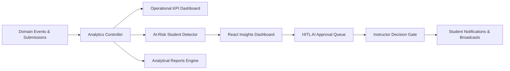

# Member 4 – Analytics & Reporting

## Business Component

Owns:
- system analytics & platform KPI dashboard
- performance, pass rates & engagement aggregation
- at-risk student early-warning identification
- instructor & admin insights & topic mastery heatmaps
- Human-in-the-Loop (HITL) AI review & approval queue
- AI workflow audit logging & deterministic safety policy enforcement
- analytical report generation (StudentPerformance, CourseAnalytics, EngagementSummary)
- communications, broadcast announcements & student notifications

Agentic AI responsibility:

> **Validation / Safety Agent**

The agent serves as the deterministic platform guardrail and human approval gate, validating all AI-generated proposals (study plans, quizzes, challenges) against structural constraints and safety policies before execution.

> **Completion Status Legend:** ✅ DONE | ⚠️ PARTIAL | ❌ MISSING

---

# 1. Analytics Architecture ✅ DONE



---

# 2. Key Metrics & KPIs ✅ DONE

### Student metrics
- ✅ Course completion rate
- ✅ Quiz average score & pass status
- ✅ Learning streak & freeze token status
- ✅ XP earned & level progression
- ✅ Adaptive challenges completed

### Instructor metrics
- ✅ Course completion & enrollment stats
- ✅ Assessment performance & pass percentages
- ✅ Weak topics & comprehension heatmap
- ✅ Active students count
- ✅ At-risk engagement detection
- ✅ Pending AI study plan approval count

### Platform metrics
- ✅ Total active students & instructors
- ✅ Total courses & published courses
- ✅ Total XP economy distribution
- ✅ Notification delivery & announcements
- ✅ AI workflow success & validation rate (100%)

---

# 3. Database Schema Status ✅ DONE

> **Overall DB Schema Status: ✅ DONE**  
> All Member 4 tables are implemented as EF Core entities in `EduFlow.Core/Entities/Entities.cs`, mapped in `EduFlow.Infrastructure/Data/ApplicationDbContext.cs`, and seeded with demo data.

## Study Plans (AI HITL Proposals) ✅ DONE

Implemented as `StudyPlan` and `StudyPlanItem` entities. Tracks AI-generated study recommendations and instructor approval state.

```sql
CREATE TABLE study_plans (
    id UUID PRIMARY KEY,
    student_id UUID NOT NULL REFERENCES users(id) ON DELETE CASCADE,
    course_id UUID NOT NULL REFERENCES courses(id) ON DELETE CASCADE,
    target_goal TEXT NOT NULL,
    target_weeks INT NOT NULL DEFAULT 4,
    hours_per_week DOUBLE PRECISION NOT NULL DEFAULT 10.0,
    status VARCHAR(50) NOT NULL, -- PendingInstructorApproval, Approved, Rejected, RevisionRequested
    instructor_notes TEXT,
    approved_by_instructor_id UUID REFERENCES users(id) ON DELETE SET NULL,
    approved_at TIMESTAMPTZ,
    created_at TIMESTAMPTZ NOT NULL DEFAULT NOW(),
    updated_at TIMESTAMPTZ NOT NULL DEFAULT NOW()
);

CREATE TABLE study_plan_items (
    id UUID PRIMARY KEY,
    study_plan_id UUID NOT NULL REFERENCES study_plans(id) ON DELETE CASCADE,
    day_number INT NOT NULL,
    activity_title VARCHAR(200) NOT NULL,
    description TEXT NOT NULL,
    referenced_lesson_id UUID REFERENCES lessons(id) ON DELETE SET NULL,
    referenced_assessment_id UUID REFERENCES assessments(id) ON DELETE SET NULL,
    estimated_minutes INT NOT NULL DEFAULT 45,
    is_completed BOOLEAN NOT NULL DEFAULT FALSE
);
```

## AI Workflow Audit Logs ✅ DONE

Implemented as `AiWorkflowLog` entity. Captures every agent step, execution time, validation results, and input/output payloads.

```sql
CREATE TABLE ai_workflow_logs (
    id UUID PRIMARY KEY,
    study_plan_id UUID REFERENCES study_plans(id) ON DELETE SET NULL,
    workflow_id VARCHAR(100) NOT NULL,
    agent_name VARCHAR(100) NOT NULL, -- Planning Agent, Learning Analysis Agent, Recommendation Agent, Validation Agent
    input_payload TEXT NOT NULL DEFAULT '{}',
    output_payload TEXT NOT NULL DEFAULT '{}',
    execution_time_ms INT NOT NULL,
    validation_passed BOOLEAN NOT NULL DEFAULT TRUE,
    validation_errors TEXT,
    created_at TIMESTAMPTZ NOT NULL DEFAULT NOW()
);
```

## Reports & Report History ✅ DONE

Implemented as `Report` entity in EF Core. Supports on-demand analytics exports for student performance, course analytics, and engagement summaries.

```sql
CREATE TABLE reports (
    id UUID PRIMARY KEY,
    title VARCHAR(200) NOT NULL,
    type VARCHAR(50) NOT NULL, -- StudentPerformance, CourseAnalytics, EngagementSummary, GamificationAudit
    generated_by_id UUID REFERENCES users(id) ON DELETE SET NULL,
    status VARCHAR(50) NOT NULL DEFAULT 'Completed', -- Pending, Completed, Failed
    summary_json TEXT NOT NULL DEFAULT '{}',
    file_url VARCHAR(255),
    created_at TIMESTAMPTZ NOT NULL DEFAULT NOW(),
    updated_at TIMESTAMPTZ NOT NULL DEFAULT NOW()
);
```

## Audit Logs & Telemetry ✅ DONE

Implemented as `AuditLog` entity for platform-level security auditing and AI governance events.

```sql
CREATE TABLE audit_logs (
    id UUID PRIMARY KEY,
    actor_id UUID REFERENCES users(id) ON DELETE SET NULL,
    action VARCHAR(100) NOT NULL,
    entity_type VARCHAR(100) NOT NULL,
    entity_id VARCHAR(100) NOT NULL,
    details TEXT NOT NULL,
    ip_address VARCHAR(50) NOT NULL DEFAULT '127.0.0.1',
    created_at TIMESTAMPTZ NOT NULL DEFAULT NOW(),
    updated_at TIMESTAMPTZ NOT NULL DEFAULT NOW()
);
```

## Notifications & Announcements ✅ DONE

Implemented as `Notification` and `Announcement` entities.

```sql
CREATE TABLE notifications (
    id UUID PRIMARY KEY,
    user_id UUID NOT NULL REFERENCES users(id) ON DELETE CASCADE,
    title VARCHAR(150) NOT NULL,
    message TEXT NOT NULL,
    type VARCHAR(50) NOT NULL DEFAULT 'General', -- LevelUp, BadgeUnlocked, StreakAlert, ChallengeAssigned, AiApproved
    is_read BOOLEAN NOT NULL DEFAULT FALSE,
    created_at TIMESTAMPTZ NOT NULL DEFAULT NOW()
);

CREATE TABLE announcements (
    id UUID PRIMARY KEY,
    course_id UUID REFERENCES courses(id) ON DELETE SET NULL,
    author_id UUID NOT NULL REFERENCES users(id) ON DELETE CASCADE,
    title VARCHAR(200) NOT NULL,
    content TEXT NOT NULL,
    is_global BOOLEAN NOT NULL DEFAULT FALSE,
    created_at TIMESTAMPTZ NOT NULL DEFAULT NOW()
);
```

---

# 4. API Endpoints ✅ DONE

### Analytics & Reporting (`AnalyticsController.cs` & `ReportsController.cs`)
- ✅ `GET /api/analytics/dashboard-summary` — Computes platform-wide KPIs (total students, total XP awarded, active streaks, pending AI approvals).
- ✅ `GET /api/analytics/platform` — Platform-wide metrics, active enrollments, submission pass rates, and AI workflow telemetry.
- ✅ `GET /api/analytics/at-risk-students` — Retrieves students with low assessment scores and suggests remediation (Instructor/Admin).
- ✅ `GET /api/analytics/student/{id}` — Detailed student performance analytics, quiz averages, level, and badge counts.
- ✅ `GET /api/analytics/course/{id}` — Aggregate course completion, average assessment scores, and module progression.
- ✅ `GET /api/analytics/topic-mastery` — Topic comprehension heatmap data.
- ✅ `GET /api/analytics/audit-logs` — Retrieves system audit logs and AI workflow traces (Instructor/Admin).
- ✅ `GET /api/reports` — Lists generated analytical reports (Instructor/Admin).
- ✅ `GET /api/reports/{id}` — Retrieves specific generated report by ID.
- ✅ `POST /api/reports` — Generates a new analytical report (StudentPerformance, CourseAnalytics, EngagementSummary).

### Human-in-the-Loop AI Review (`AiReviewController.cs`)
- ✅ `GET /api/aireview/pending-proposals` — Lists study plans awaiting instructor approval.
- ✅ `GET /api/aireview/workflows` — Lists all AI workflows with status filtering (Instructor/Admin).
- ✅ `GET /api/aireview/workflows/{id}` — Retrieves detailed proposal workflow by ID with execution audit trail.
- ✅ `POST /api/aireview/orchestrate` — Executes multi-agent LangGraph workflow and saves proposal to review queue.
- ✅ `POST /api/aireview/proposals/{id}/decision` — Approves or rejects AI study plan with instructor feedback and triggers student notification.
- ✅ `POST /api/aireview/proposals/{id}/approve` — Explicit approval endpoint for AI study plan workflow.
- ✅ `POST /api/aireview/proposals/{id}/reject` — Explicit rejection endpoint for AI study plan workflow.
- ✅ `POST /api/aireview/coach/chat` — Conversational AI learning coach endpoint.

### Communications & Notifications (`NotificationsController.cs`)
- ✅ `GET /api/notifications/user` — Lists current user notifications.
- ✅ `POST /api/notifications/{id}/read` — Marks notification as read.
- ✅ `POST /api/notifications/broadcast` — Publishes global or course-specific announcements (Instructor/Admin).

```http
GET    /api/analytics/dashboard-summary
GET    /api/analytics/platform
GET    /api/analytics/at-risk-students
GET    /api/analytics/student/{id}
GET    /api/analytics/course/{id}
GET    /api/analytics/topic-mastery
GET    /api/analytics/audit-logs

GET    /api/reports
GET    /api/reports/{id}
POST   /api/reports

GET    /api/aireview/pending-proposals
GET    /api/aireview/workflows
GET    /api/aireview/workflows/{id}
POST   /api/aireview/orchestrate
POST   /api/aireview/proposals/{id}/decision
POST   /api/aireview/proposals/{id}/approve
POST   /api/aireview/proposals/{id}/reject
POST   /api/aireview/coach/chat

GET    /api/notifications/user
POST   /api/notifications/{id}/read
POST   /api/notifications/broadcast
```

---

# 5. Validation / Safety Agent (Agentic AI) ✅ DONE

Implemented in `ai-agent/graph/workflow.py`:

- ✅ **Deterministic Rule Guard**: Enforces strict invariants:
  1. *Goal Length Check*: Rejects descriptions shorter than 5 characters.
  2. *Workload Ceiling*: Caps weekly commitment to 20.0 hours/week.
  3. *Minimum Commitment*: Requires at least 2.0 hours/week.
  4. *Workload Capacity*: Verifies milestone hours do not exceed total available time budget.
  5. *Status Gating*: Automatically tags plans as `PendingInstructorApproval` when valid, or `ValidationFailed` when rejected.
- ✅ **Audit Trail Logging**: Attaches `AgentExecutionLog` records for every step in the pipeline.
- ✅ **Pytest Golden Test Suite**: 4 / 4 automated pytest validation tests passing in `ai-agent/tests/test_validation.py`.

---

# 6. React Dashboards & Review Queue ✅ DONE

Implemented in `frontend/src/pages/`:

- ✅ **Analytics & Insights Dashboard** (`Insights/Insights.jsx`):
  - KPI summary cards (Cohort Velocity, Topic Mastery, At-Risk Learners, Remediation Success Rate).
  - Topic Comprehension Heatmap (EF Core, PostgreSQL Indexes, Clean Architecture, LangGraph).
  - Early-warning at-risk student intervention table with search filtering and one-click remedial quest dispatches.
- ✅ **Human-in-the-Loop AI Review Queue** (`AiReview/AiReview.jsx`):
  - Review queue displaying proposed study plans with goals, weekly commitment, gap analysis, and milestone schedules.
  - Interactive **Approve** and **Reject** buttons with instructor feedback notes modal.
  - Multi-agent execution audit trail inspector showing step execution timings and validation pass states.
- ✅ **Communications Center** (`Communications/Communications.jsx`):
  - Broadcast announcement composer (Global vs. Course-specific).
  - Student notifications center.

---

# 7. Flutter Mobile Screens ✅ DONE

Implemented in `mobile/lib/screens/`:

- ✅ **Profile & Trophy View** (`profile/profile_screen.dart`): Student profile, Level title, Total XP, Coins, Streak status, and earned badges.
- ✅ **AI Coach & Study Plan View** (`ai_coach/ai_coach_screen.dart`): AI conversational tutor and personalized study milestone recommendations.

---

# 8. Automated Tests & Verification ✅ DONE

Implemented in `backend/EduFlow.Tests/AnalyticsAiReviewTests.cs`:

- ✅ `Analytics_DashboardSummary_ComputesTotalMetricsCorrectly` — Verifies calculation of platform KPIs from database aggregates.
- ✅ `Analytics_PlatformMetrics_CalculatesPassRateAndAggregates` — Verifies calculation of pass rates, active enrollments, and platform health metrics.
- ✅ `Analytics_StudentMetrics_ReturnsAccurateStudentStats` — Verifies student XP, level, streak, and lesson completion queries.
- ✅ `Analytics_AtRiskStudents_IdentifiesFailingStudentsCorrectly` — Verifies identification of failing submissions and low performance.
- ✅ `Reports_GenerateReport_CreatesCompletedReportRecord` — Verifies creation and persistence of analytical reports.
- ✅ `AiReview_InstructorApproval_TransitionsStudyPlanToApproved` — Verifies HITL transition from `PendingInstructorApproval` to `Approved` with instructor ID and timestamp.
- ✅ `AiReview_InstructorRejection_TransitionsStudyPlanToRejected` — Verifies HITL rejection workflow with instructor feedback notes.
- ✅ `AiWorkflowLog_AuditTrail_RecordsExecutionAndValidationMetadata` — Verifies recording of AI execution logs and validation pass flags.
- ✅ `Notifications_MarkAsRead_UpdatesIsReadFlag` — Verifies notification read status update.
- ✅ `Notifications_BroadcastAnnouncement_CreatesGlobalAndCourseAnnouncements` — Verifies broadcast announcements for global and course channels.

**Test Suite Status:** 45 / 45 Unit & Integration Tests Passing (100% Success).
