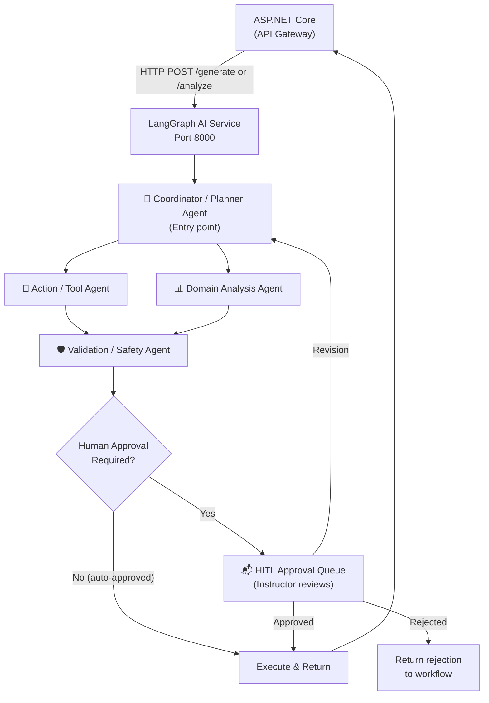
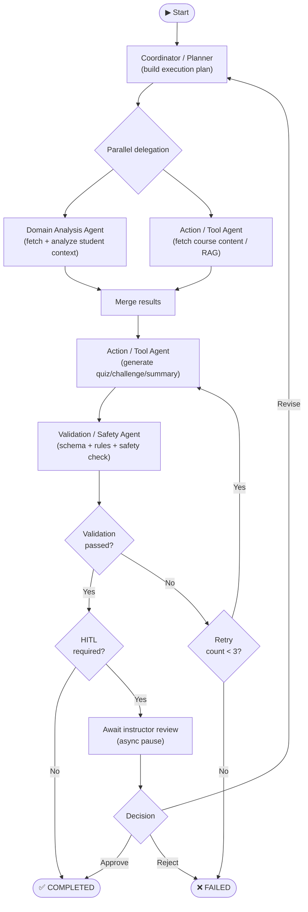
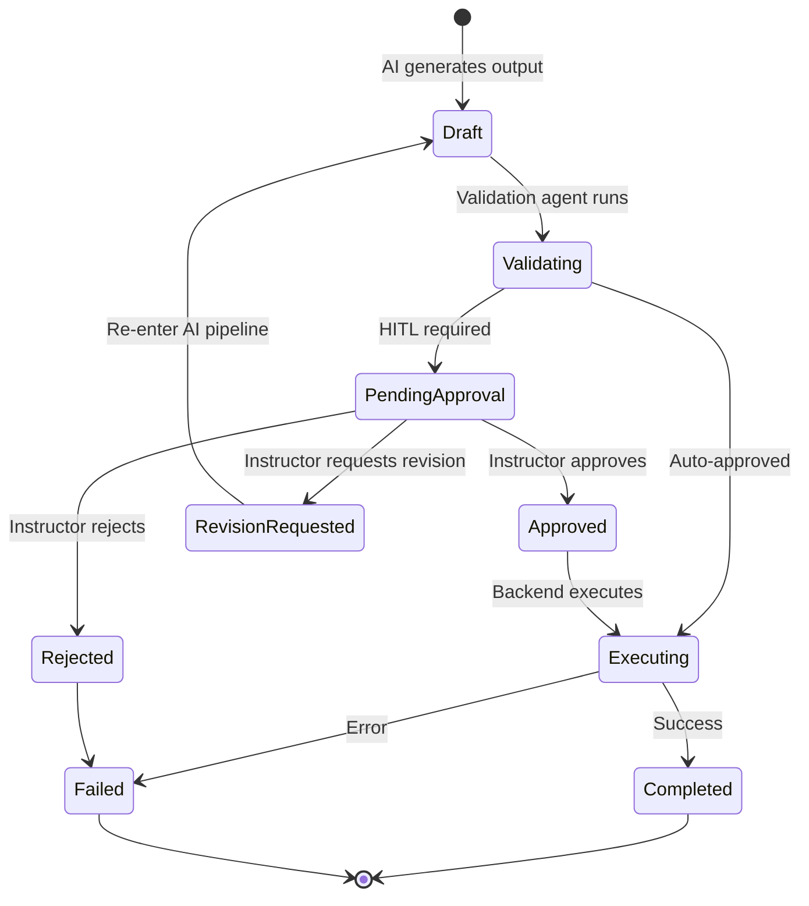

# EduFlow AI – Agentic AI Architecture

> This document defines the multi-agent AI architecture, LangGraph workflow graph, agent responsibilities, tool registries, validation rules, HITL approval process, and safety boundaries for EduFlow AI.

---

## 1. AI Architecture Overview

EduFlow AI uses a **LangGraph multi-agent swarm** running as a separate Python + FastAPI microservice. It communicates with the ASP.NET Core backend exclusively via HTTP — the AI never has direct database access.



---

## 2. Agent Roles & Ownership

| Agent | Team Member | Primary Responsibility |
|-------|------------|----------------------|
| **Coordinator / Planner** | Member 1 | Understand objective → build multi-step plan → delegate to specialists |
| **Action / Tool Agent** | Member 2 | Execute controlled education tools (quiz gen, summaries, content fetch) |
| **Domain Analysis Agent** | Member 3 | Analyze student performance → recommend difficulty, challenge type, next action |
| **Validation / Safety Agent** | Member 4 | Validate AI output → enforce business rules → manage HITL approval gate |

---

## 3. Shared Agent State (LangGraph StateGraph)

All agents read from and write to a shared, typed state object:

```python
from typing import TypedDict, Literal, List, Optional
from pydantic import BaseModel

class AgentWorkflowState(TypedDict):
    # Workflow identity
    workflow_id: str
    trigger_type: Literal["INSTRUCTOR_REQUEST", "AUTO_TRIGGER", "STUDENT_OBJECTIVE"]
    
    # Context
    student_id: str
    course_id: str
    instructor_id: Optional[str]
    
    # Objective
    objective_type: Literal["QUIZ_GENERATION", "CHALLENGE", "STUDY_PLAN", 
                            "ANALYSIS", "SUMMARY", "CHAT_RESPONSE"]
    objective_parameters: dict
    
    # Plan (set by Coordinator)
    execution_plan: List[dict]
    current_step: int
    
    # Context retrieved
    student_context: Optional[dict]      # performance, streak, level
    course_context: Optional[dict]       # modules, lessons, topics
    retrieved_chunks: Optional[List[dict]]  # RAG results
    
    # Agent outputs
    analysis_result: Optional[dict]      # from Domain Analysis Agent
    candidate_output: Optional[dict]     # from Tool Agent (quiz draft, etc.)
    
    # Validation
    validation_result: Optional[dict]    # from Validation Agent
    validation_errors: List[dict]
    
    # HITL
    approval_status: Literal["NOT_REQUIRED", "PENDING", "APPROVED", 
                             "REJECTED", "REVISION_REQUESTED"]
    approval_notes: Optional[str]
    
    # Execution
    final_output: Optional[dict]
    status: Literal["RUNNING", "PENDING_APPROVAL", "COMPLETED", "FAILED"]
    error_message: Optional[str]
    
    # Observability
    started_at: str
    steps_log: List[dict]
    token_usage: dict
```

> **Rule**: Never store unbounded text blobs in state. Store references (chunk_ids, document_ids) for large content.

---

## 4. LangGraph Workflow Graph



---

## 5. Coordinator / Planner Agent

### 5.1 Responsibilities

```text
1. Receive structured objective from ASP.NET Core API
2. Validate objective schema (Pydantic)
3. Retrieve available tools from registry
4. Build structured multi-step execution plan
5. Delegate steps to Domain Analysis and Tool agents
6. Merge results into unified state
7. Track step execution and status
8. Handle failures with retry / escalation
9. Pass final candidate to Validation Agent
```

### 5.2 Execution Plan Schema

```python
class ExecutionStep(BaseModel):
    step_id: str
    action: str          # e.g., "ANALYZE_STUDENT", "FETCH_CONTENT", "GENERATE_QUIZ"
    owner: str           # "DOMAIN_ANALYSIS" | "TOOL_AGENT" | "VALIDATION" | "HITL"
    depends_on: List[str]  # step_ids that must complete first
    retry_on_failure: bool = True
    max_retries: int = 3

class ExecutionPlan(BaseModel):
    plan_id: str
    objective_type: str
    steps: List[ExecutionStep]
    estimated_duration_seconds: int
```

### 5.3 Failure Handling

```python
# Exponential backoff retry
async def execute_with_retry(step, max_retries=3):
    for attempt in range(max_retries):
        try:
            return await execute_step(step)
        except ToolUnavailableError:
            if attempt == max_retries - 1:
                raise WorkflowFailedError(f"Step {step.step_id} failed after {max_retries} attempts")
            wait = 2 ** attempt + random.uniform(0, 1)  # jitter
            await asyncio.sleep(wait)
```

---

## 6. Action / Tool Agent

### 6.1 Tool Registry

The Tool Agent only executes tools from a **fixed, registered list**. It cannot call arbitrary code or external APIs not in the registry.

```python
TOOL_REGISTRY = {
    # Course & Content Tools
    "get_course_structure":       get_course_structure,    # Fetches course/module/lesson tree
    "get_lesson_content":         get_lesson_content,      # Fetches specific lesson text
    "search_knowledge_base":      search_knowledge_base,   # RAG search (course-scoped)
    "get_quiz_schema":            get_quiz_schema,         # Pydantic schema for quiz questions
    
    # Generation Tools
    "generate_quiz_draft":        generate_quiz_draft,     # Create question drafts (JSON)
    "generate_challenge_draft":   generate_challenge_draft,
    "generate_summary":           generate_summary,        # Document summary
    "generate_study_plan":        generate_study_plan,
    "generate_feedback":          generate_feedback,       # Per-question feedback
    
    # Validation Helpers
    "check_question_duplicate":   check_duplicate,         # Check question bank
    "check_quiz_schema":          validate_schema,         # Pydantic validation
}
```

### 6.2 Tool Call Audit

Every tool call is logged:

```python
async def call_tool(tool_name: str, input: dict, state: AgentWorkflowState):
    # Log before execution
    step_log = { "tool": tool_name, "input_keys": list(input.keys()), "started_at": now() }
    
    result = await TOOL_REGISTRY[tool_name](input)
    
    # Log after execution
    step_log["completed_at"] = now()
    step_log["output_type"] = type(result).__name__
    state["steps_log"].append(step_log)
    state["token_usage"]["total"] += result.get("tokens_used", 0)
    
    return result
```

---

## 7. Domain Analysis Agent

### 7.1 Feature Inputs

```python
class StudentPerformanceContext(BaseModel):
    student_id: str
    course_id: str
    
    # Quiz performance (last 30 days)
    quiz_scores: List[dict]           # [{topic, score, passed, date}]
    topic_fail_rates: dict            # {topic: fail_rate_0_to_1}
    
    # Engagement metrics
    lesson_completion_rate: float     # 0.0 to 1.0
    challenge_completion_rate: float
    current_streak: int
    streak_trend: str                 # "GROWING" | "STABLE" | "DECLINING" | "BROKEN"
    
    # XP / level
    current_level: int
    weekly_xp_trend: List[int]        # last 7 days
    avg_session_minutes: float
    
    # Recency
    days_since_last_activity: int
    last_quiz_result: Optional[str]   # "PASSED" | "FAILED"
```

### 7.2 Output Schema

```python
class AnalysisResult(BaseModel):
    engagement_level: Literal["HIGH", "MEDIUM", "LOW", "AT_RISK"]
    learning_gaps: List[str]           # topic tags
    strengths: List[str]               # topic tags
    recommended_difficulty: Literal["EASY", "MEDIUM", "HARD", "EXPERT"]
    next_best_action: Literal[
        "CONTINUE_LESSON", "PRACTICE_CHALLENGE", "QUIZ", 
        "BOSS_BATTLE", "TAKE_BREAK", "INSTRUCTOR_INTERVENTION"
    ]
    reason: str                         # human-readable explanation
    confidence: float                   # 0.0 to 1.0
    requires_instructor_alert: bool
```

### 7.3 Agent Rules

```text
✓ Analysis must be grounded in available data — no fabrication
✓ If data is insufficient, confidence must be < 0.5 and reason must state why
✓ The agent CANNOT recommend: "INSTRUCTOR_INTERVENTION" without requires_instructor_alert = true
✓ All topic tags referenced must exist in the course's actual topics
✓ Recommended difficulty cannot skip more than 2 levels above current
```

---

## 8. Validation / Safety Agent

### 8.1 Validation Pipeline

Every AI-generated output passes through a **deterministic validation pipeline** before HITL or execution:

```text
AI Output Draft
    │
    ▼
Step 1: JSON Schema Validation (Pydantic)
    ├── All required fields present
    ├── Types match schema
    └── → Error: SCHEMA_INVALID

Step 2: Business Rule Checks
    ├── XP ≤ max_xp_cap
    ├── question_count within allowed range
    ├── difficulty matches requested level
    └── → Error: BUSINESS_RULE_VIOLATION

Step 3: Duplicate Check
    ├── No question text matches existing question bank (> 85% similarity)
    └── → Error: DUPLICATE_CONTENT

Step 4: Content Safety
    ├── No prohibited topics / language
    ├── Educational relevance check
    └── → Error: CONTENT_SAFETY_VIOLATION

Step 5: Data Reference Validation
    ├── source_chunk_ids exist in database
    ├── course_id matches request
    └── → Error: INVALID_REFERENCE

Step 6: Approval Decision
    ├── AUTO_APPROVE: if all checks pass + low risk
    └── REQUIRE_HUMAN: if any flag raised or rule requires it
```

### 8.2 Validation Result Schema

```python
class ValidationResult(BaseModel):
    status: Literal["VALIDATION_PASSED", "VALIDATION_FAILED", "PARTIAL_PASS"]
    requires_human_approval: bool
    errors: List[ValidationError]
    warnings: List[str]
    auto_fixed_items: List[str]   # e.g., "Capped XP from 300 to 150"
    validated_at: str

class ValidationError(BaseModel):
    error_code: str
    field: Optional[str]
    message: str
    severity: Literal["BLOCKING", "WARNING"]
```

### 8.3 Human Approval Required When

```text
Always require HITL for:
✓ Any AI-generated quiz question before publication
✓ AI-generated study plans
✓ AI-assigned challenges to students
✓ Short-answer questions requiring grading rubric review

Auto-approve (no HITL) for:
✓ AI document summaries (read-only, no student grading impact)
✓ AI tutor chat responses (real-time, no permanent record in question bank)
✓ Analytics insights for instructor (informational only)
```

---

## 9. Human-in-the-Loop (HITL) State Machine



### HITL Timeout Handling

```text
If instructor does not review within 48 hours:
    → Send reminder notification
If not reviewed within 72 hours:
    → Auto-expire workflow (status = EXPIRED)
    → Notify instructor: "Quiz draft expired — please generate a new one"
    → Do NOT auto-publish — human approval is mandatory
```

---

## 10. AI Safety Boundary

The AI must **never** directly:

| Prohibited Action | Why |
|------------------|-----|
| Write to database | Backend is the sole authoritative writer |
| Assign final grades | Grading is deterministic server-side |
| Modify XP or leaderboard | Only backend XP engine can do this |
| Publish content to students | Requires instructor HITL approval |
| Change user roles or permissions | Admin-only action |
| Access unenrolled course documents | Course-scoped privacy boundary |
| Delete any records | No destructive operations |
| Call external APIs directly | All external calls go through backend |

---

## 11. AI Observability & Monitoring

### 11.1 Metrics to Track

```text
Per workflow:
✓ Total workflow duration (ms)
✓ Duration per agent step
✓ Token usage (input + output)
✓ Validation pass/fail rate
✓ HITL approval rate / rejection rate
✓ HITL turnaround time (hours)
✓ Retry count (per step)

Platform-wide:
✓ Workflows per day (by type)
✓ AI error rate (by error_code)
✓ Average approval time
✓ Most common validation errors
✓ Cost per workflow (token cost × price)
```

### 11.2 Logging Rules

```text
✓ Log: workflow_id, step_name, duration, status, token_count
✓ Log: validation errors with error_code (not full AI output)
✓ Log: HITL decisions (who, when, decision)
❌ Never log: raw student query text (privacy)
❌ Never log: full AI prompt with PII
❌ Never log: API keys or secrets
❌ Never log: unanonymized student answers
```

---

## 12. Error Classification & Retry Policy

| Error Type | Retryable | Policy |
|-----------|-----------|--------|
| `SCHEMA_INVALID` | Yes | Retry with corrective prompt (max 3) |
| `CONTENT_SAFETY_VIOLATION` | No | Fail immediately, alert admin |
| `ToolUnavailable` | Yes | Retry with backoff (max 3) |
| `RateLimit` | Yes | Wait for backoff period |
| `Timeout` | Yes | Retry once after 30s |
| `ModelFailure` | Yes | Retry with fallback model |
| `INVALID_REFERENCE` | No | Fail, request new context from backend |
| `DUPLICATE_CONTENT` | Yes | Regenerate with uniqueness instruction |
| `ApprovalTimeout` | No | Expire workflow gracefully |
