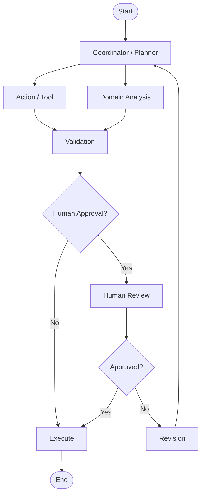

# EduFlow AI – Agentic AI Architecture

## 1. Agent Roles

| Agent | Ownership | Responsibility |
|---|---|---|
| Coordinator / Planner | Member 1 | Understand objective, build multi-step plan and delegate |
| Action / Tool | Member 2 | Execute controlled education/assessment tools |
| Domain Analysis | Member 3 | Analyze performance and engagement and recommend next action |
| Validation / Safety | Member 4 | Validate, enforce constraints and manage approval gate |

---

# 2. Shared Agent State

Recommended state:

```json
{
  "workflowId": "uuid",
  "studentId": "uuid",
  "objective": {},
  "studentContext": {},
  "plan": [],
  "toolResults": [],
  "analysis": {},
  "candidateOutput": {},
  "validation": {},
  "approval": {},
  "status": "RUNNING"
}
```

Do not put arbitrary unbounded text into state. Store references for large content.

---

# 3. LangGraph-Style Graph



---

# 4. Planner

### Input

Student objective + authorized context.

### Output

Structured plan:

```json
{
  "steps": [
    {
      "stepId": "1",
      "action": "ANALYZE_PROGRESS",
      "owner": "DOMAIN_ANALYSIS"
    }
  ]
}
```

The planner must not invent tools.

Maintain a registry of permitted tools.

---

# 5. Tool Agent

Example tool registry:

```text
get_course_content
get_student_progress
get_quiz_results
create_quiz_draft
create_challenge_draft
generate_feedback_draft
get_gamification_rules
```

Tool permissions should be explicit.

---

# 6. Domain Analysis

Feature inputs:

```text
recent quiz scores
topic-level performance
lesson completion
challenge completion
streak
XP trend
time-on-task
recent mistakes
```

Output should be structured:

```json
{
  "learningGaps": [],
  "strengths": [],
  "recommendedDifficulty": "medium",
  "engagementState": "healthy",
  "nextBestAction": "CHALLENGE"
}
```

The agent must provide reasons linked to available data, not invented evidence.

---

# 7. Validation Agent

Validation should be deterministic-first.

```text
AI draft
 ↓
JSON schema
 ↓
data references
 ↓
business rules
 ↓
safety
 ↓
approval decision
```

For example:

```text
AI proposes:
XP = 500

Rule:
Maximum challenge XP = 150

Result:
INVALID_REWARD
```

---

# 8. Human Approval

Use state machine:

```text
DRAFT
 ↓
VALIDATING
 ↓
PENDING_APPROVAL
 ↓
APPROVED
 ↓
EXECUTING
 ↓
COMPLETED
```

Alternative:

```text
PENDING_APPROVAL
 ↓
REJECTED
```

or:

```text
PENDING_APPROVAL
 ↓
REVISION_REQUESTED
 ↓
VALIDATING
```

---

# 9. AI Error Handling

Classify errors:

```text
ValidationError
ToolUnavailable
Timeout
RateLimit
ModelFailure
InvalidOutput
ApprovalTimeout
```

Retry only errors that are safe to retry.

Use exponential backoff with jitter.

---

# 10. AI Observability

Track:

```text
workflow duration
agent duration
tool latency
token usage
validation failures
approval duration
success rate
failure rate
```

Never log secrets or raw sensitive student information unnecessarily.

---

# 11. AI Safety Boundary

AI must not directly:
- assign grades
- alter final scores
- modify permissions
- allocate unlimited XP
- delete user data
- publish content outside authorization
- bypass instructor approval rules

Use backend services/tools for actual mutations.
