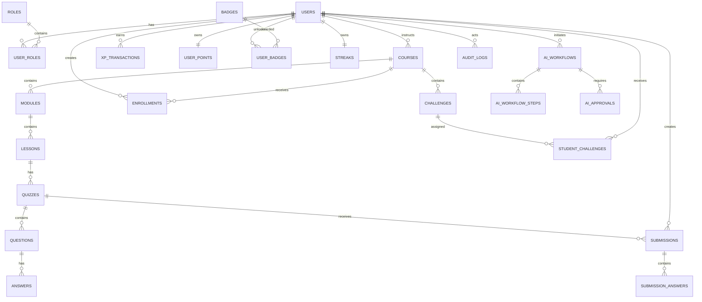

# EduFlow AI – Database Relationships & Rules

## 1. Entity Relationship Diagram



---

# 2. Referential Integrity

Use foreign keys.

Avoid hard deletes where auditability matters.

For users, courses and AI workflow records, prefer:
- soft delete
- status changes
- archival

---

# 3. Indexes

Important indexes:

```text
users(email)
enrollments(student_id, course_id)
courses(instructor_id, status)
quizzes(course_id)
submissions(student_id, quiz_id)
xp_transactions(student_id, created_at)
challenges(course_id, difficulty, status)
student_challenges(student_id, completed_at)
audit_logs(actor_id, created_at)
ai_workflows(student_id, created_at)
```

---

# 4. Transactions

Use DB transactions for:

```text
Quiz submission
XP allocation
Badge award
Enrollment
Approval execution
```

Example:

```text
BEGIN
  persist submission
  calculate result
  create XP transaction
  update points
  commit
```

If any critical step fails, roll back.

---

# 5. Concurrency

Gamification is concurrency-sensitive.

Example:

Two quiz submissions arrive simultaneously.

The XP system must prevent:
- duplicate XP
- duplicate badge
- inconsistent level
- broken leaderboard

Use:
- unique constraints
- transactions
- idempotency keys
- row/version checks where appropriate
