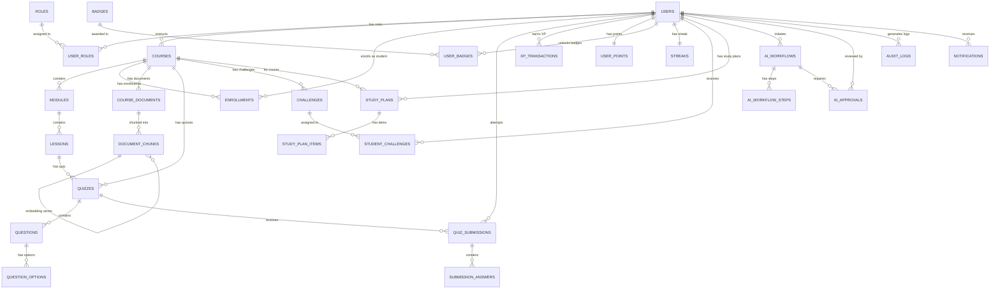

# EduFlow AI – Database Entity Relationships & Rules

> This document defines the complete PostgreSQL 16 database schema, entity relationships, integrity rules, indexing strategy, and concurrency handling for EduFlow AI.

---

## 1. Entity Relationship Diagram



---

## 2. Schema Owner Map

| Table(s) | Owned by | Component |
|----------|----------|-----------|
| users, roles, user_roles | Member 1 | User & Course |
| courses, modules, lessons | Member 1 | User & Course |
| enrollments | Member 1 | User & Course |
| course_documents, document_chunks | Member 1 | User & Course / RAG |
| quizzes, questions, question_options | Member 2 | Assessment |
| quiz_submissions, submission_answers | Member 2 | Assessment |
| xp_transactions, user_points | Member 3 | Gamification |
| badges, user_badges, streaks | Member 3 | Gamification |
| challenges, student_challenges | Member 3 | Gamification |
| study_plans, study_plan_items | Member 4 | Analytics |
| ai_workflows, ai_workflow_steps, ai_approvals | Member 4 | Analytics |
| audit_logs, notifications | Member 4 | Analytics |

---

## 3. Complete Table Specifications

### 3.1 Core User Tables

```sql
-- Users (Member 1)
CREATE TABLE users (
    id UUID PRIMARY KEY DEFAULT gen_random_uuid(),
    email VARCHAR(320) UNIQUE NOT NULL,
    password_hash TEXT NOT NULL,
    first_name VARCHAR(100) NOT NULL,
    last_name VARCHAR(100) NOT NULL,
    is_active BOOLEAN NOT NULL DEFAULT TRUE,
    avatar_url TEXT,
    timezone VARCHAR(50) DEFAULT 'UTC',
    last_login_at TIMESTAMPTZ,
    created_at TIMESTAMPTZ NOT NULL DEFAULT NOW(),
    updated_at TIMESTAMPTZ NOT NULL DEFAULT NOW()
);

CREATE TABLE roles (
    id UUID PRIMARY KEY DEFAULT gen_random_uuid(),
    name VARCHAR(50) UNIQUE NOT NULL  -- 'Admin', 'Instructor', 'Student'
);

CREATE TABLE user_roles (
    user_id UUID NOT NULL REFERENCES users(id) ON DELETE CASCADE,
    role_id UUID NOT NULL REFERENCES roles(id) ON DELETE CASCADE,
    PRIMARY KEY (user_id, role_id)
);
```

### 3.2 Course Hierarchy

```sql
CREATE TABLE courses (
    id UUID PRIMARY KEY DEFAULT gen_random_uuid(),
    title VARCHAR(200) NOT NULL,
    description TEXT,
    instructor_id UUID NOT NULL REFERENCES users(id),
    status VARCHAR(20) NOT NULL DEFAULT 'DRAFT',
    difficulty VARCHAR(10) NOT NULL DEFAULT 'MEDIUM',
    thumbnail_url TEXT,
    enrollment_mode VARCHAR(20) NOT NULL DEFAULT 'INVITE_ONLY',
    created_at TIMESTAMPTZ NOT NULL DEFAULT NOW(),
    updated_at TIMESTAMPTZ NOT NULL DEFAULT NOW()
);

CREATE TABLE modules (
    id UUID PRIMARY KEY DEFAULT gen_random_uuid(),
    course_id UUID NOT NULL REFERENCES courses(id) ON DELETE CASCADE,
    title VARCHAR(200) NOT NULL,
    description TEXT,
    display_order INTEGER NOT NULL,
    is_published BOOLEAN NOT NULL DEFAULT FALSE,
    created_at TIMESTAMPTZ NOT NULL DEFAULT NOW()
);

CREATE TABLE lessons (
    id UUID PRIMARY KEY DEFAULT gen_random_uuid(),
    module_id UUID NOT NULL REFERENCES modules(id) ON DELETE CASCADE,
    title VARCHAR(200) NOT NULL,
    content_type VARCHAR(20) NOT NULL,  -- TEXT | VIDEO | SLIDES | MIXED
    content TEXT,
    video_url TEXT,
    duration_minutes INTEGER,
    display_order INTEGER NOT NULL,
    is_published BOOLEAN NOT NULL DEFAULT FALSE,
    created_at TIMESTAMPTZ NOT NULL DEFAULT NOW()
);

CREATE TABLE enrollments (
    id UUID PRIMARY KEY DEFAULT gen_random_uuid(),
    student_id UUID NOT NULL REFERENCES users(id) ON DELETE CASCADE,
    course_id UUID NOT NULL REFERENCES courses(id) ON DELETE CASCADE,
    status VARCHAR(20) NOT NULL DEFAULT 'PENDING',
    enrolled_at TIMESTAMPTZ,
    completion_percentage DECIMAL(5,2) NOT NULL DEFAULT 0,
    created_at TIMESTAMPTZ NOT NULL DEFAULT NOW(),
    UNIQUE(student_id, course_id)
);
```

### 3.3 RAG Pipeline Tables (pgvector)

```sql
CREATE EXTENSION IF NOT EXISTS vector;

CREATE TABLE course_documents (
    id UUID PRIMARY KEY DEFAULT gen_random_uuid(),
    course_id UUID NOT NULL REFERENCES courses(id) ON DELETE CASCADE,
    module_id UUID REFERENCES modules(id),
    uploaded_by UUID NOT NULL REFERENCES users(id),
    original_filename VARCHAR(500) NOT NULL,
    stored_filename VARCHAR(500) NOT NULL,
    file_size_bytes BIGINT NOT NULL,
    mime_type VARCHAR(100) NOT NULL,
    processing_status VARCHAR(20) NOT NULL DEFAULT 'PENDING',
    chunk_count INTEGER,
    uploaded_at TIMESTAMPTZ NOT NULL DEFAULT NOW()
);

CREATE TABLE document_chunks (
    id UUID PRIMARY KEY DEFAULT gen_random_uuid(),
    document_id UUID NOT NULL REFERENCES course_documents(id) ON DELETE CASCADE,
    course_id UUID NOT NULL REFERENCES courses(id) ON DELETE CASCADE,
    chunk_index INTEGER NOT NULL,
    content TEXT NOT NULL,
    embedding vector(1536),   -- OpenAI text-embedding-3-small dimensions
    page_number INTEGER,
    token_count INTEGER,
    metadata JSONB,
    created_at TIMESTAMPTZ NOT NULL DEFAULT NOW()
);

-- HNSW index for fast approximate nearest-neighbour search
CREATE INDEX idx_chunks_embedding ON document_chunks
    USING hnsw (embedding vector_cosine_ops)
    WITH (m = 16, ef_construction = 64);

-- Full-text search index for keyword retrieval
CREATE INDEX idx_chunks_fts ON document_chunks
    USING gin(to_tsvector('english', content));

-- Course-scoped lookup
CREATE INDEX idx_chunks_course ON document_chunks(course_id, document_id);
```

### 3.4 Assessment Tables

```sql
CREATE TABLE quizzes (
    id UUID PRIMARY KEY DEFAULT gen_random_uuid(),
    course_id UUID NOT NULL REFERENCES courses(id) ON DELETE CASCADE,
    module_id UUID REFERENCES modules(id),
    title VARCHAR(200) NOT NULL,
    time_limit_minutes INTEGER,
    pass_percentage DECIMAL(5,2) NOT NULL DEFAULT 60.0,
    max_attempts INTEGER NOT NULL DEFAULT 3,
    shuffle_questions BOOLEAN NOT NULL DEFAULT TRUE,
    shuffle_options BOOLEAN NOT NULL DEFAULT TRUE,
    status VARCHAR(20) NOT NULL DEFAULT 'DRAFT',
    created_by UUID NOT NULL REFERENCES users(id),
    created_at TIMESTAMPTZ NOT NULL DEFAULT NOW()
);

CREATE TABLE questions (
    id UUID PRIMARY KEY DEFAULT gen_random_uuid(),
    course_id UUID NOT NULL REFERENCES courses(id),
    quiz_id UUID REFERENCES quizzes(id) ON DELETE SET NULL,
    question_type VARCHAR(30) NOT NULL,
    question_text TEXT NOT NULL,
    explanation TEXT,
    difficulty VARCHAR(10) NOT NULL DEFAULT 'MEDIUM',
    topic_tag VARCHAR(100),
    xp_reward INTEGER NOT NULL DEFAULT 10,
    ai_generated BOOLEAN NOT NULL DEFAULT FALSE,
    ai_review_status VARCHAR(20),
    source_chunk_ids UUID[],
    created_at TIMESTAMPTZ NOT NULL DEFAULT NOW()
);

CREATE TABLE question_options (
    id UUID PRIMARY KEY DEFAULT gen_random_uuid(),
    question_id UUID NOT NULL REFERENCES questions(id) ON DELETE CASCADE,
    option_text TEXT NOT NULL,
    is_correct BOOLEAN NOT NULL DEFAULT FALSE,
    display_order INTEGER NOT NULL
);

CREATE TABLE quiz_submissions (
    id UUID PRIMARY KEY DEFAULT gen_random_uuid(),
    quiz_id UUID NOT NULL REFERENCES quizzes(id),
    student_id UUID NOT NULL REFERENCES users(id),
    attempt_number INTEGER NOT NULL DEFAULT 1,
    started_at TIMESTAMPTZ NOT NULL DEFAULT NOW(),
    expires_at TIMESTAMPTZ,
    submitted_at TIMESTAMPTZ,
    score DECIMAL(5,2),
    max_score DECIMAL(5,2),
    percentage DECIMAL(5,2),
    passed BOOLEAN,
    xp_awarded INTEGER,
    status VARCHAR(20) NOT NULL DEFAULT 'IN_PROGRESS',
    UNIQUE(student_id, quiz_id, attempt_number)
);

CREATE TABLE submission_answers (
    id UUID PRIMARY KEY DEFAULT gen_random_uuid(),
    submission_id UUID NOT NULL REFERENCES quiz_submissions(id) ON DELETE CASCADE,
    question_id UUID NOT NULL REFERENCES questions(id),
    selected_option_ids UUID[],
    text_answer TEXT,
    is_correct BOOLEAN,
    marks_awarded DECIMAL(5,2) NOT NULL DEFAULT 0,
    requires_human_review BOOLEAN NOT NULL DEFAULT FALSE
);
```

### 3.5 Gamification Tables

```sql
-- Immutable XP ledger
CREATE TABLE xp_transactions (
    id UUID PRIMARY KEY DEFAULT gen_random_uuid(),
    student_id UUID NOT NULL REFERENCES users(id),
    source_type VARCHAR(50) NOT NULL,
    source_id UUID,
    xp_amount INTEGER NOT NULL,
    description TEXT,
    created_at TIMESTAMPTZ NOT NULL DEFAULT NOW()
);

CREATE TABLE user_points (
    student_id UUID PRIMARY KEY REFERENCES users(id) ON DELETE CASCADE,
    total_xp INTEGER NOT NULL DEFAULT 0,
    weekly_xp INTEGER NOT NULL DEFAULT 0,
    lifetime_xp INTEGER NOT NULL DEFAULT 0,
    current_level INTEGER NOT NULL DEFAULT 1,
    last_level_up_at TIMESTAMPTZ,
    updated_at TIMESTAMPTZ NOT NULL DEFAULT NOW()
);

CREATE TABLE badges (
    id UUID PRIMARY KEY DEFAULT gen_random_uuid(),
    code VARCHAR(50) UNIQUE NOT NULL,
    name VARCHAR(100) NOT NULL,
    description TEXT NOT NULL,
    icon_url TEXT NOT NULL,
    category VARCHAR(30) NOT NULL,
    rarity VARCHAR(20) NOT NULL DEFAULT 'COMMON',
    criteria_json JSONB NOT NULL,
    is_active BOOLEAN NOT NULL DEFAULT TRUE
);

CREATE TABLE user_badges (
    student_id UUID NOT NULL REFERENCES users(id) ON DELETE CASCADE,
    badge_id UUID NOT NULL REFERENCES badges(id),
    unlocked_at TIMESTAMPTZ NOT NULL DEFAULT NOW(),
    PRIMARY KEY (student_id, badge_id)
);

CREATE TABLE streaks (
    student_id UUID PRIMARY KEY REFERENCES users(id) ON DELETE CASCADE,
    current_streak INTEGER NOT NULL DEFAULT 0,
    longest_streak INTEGER NOT NULL DEFAULT 0,
    last_activity_date DATE,
    updated_at TIMESTAMPTZ NOT NULL DEFAULT NOW()
);

CREATE TABLE challenges (
    id UUID PRIMARY KEY DEFAULT gen_random_uuid(),
    course_id UUID REFERENCES courses(id),
    title VARCHAR(200) NOT NULL,
    description TEXT NOT NULL,
    challenge_type VARCHAR(30) NOT NULL,
    difficulty VARCHAR(10) NOT NULL,
    linked_quiz_id UUID REFERENCES quizzes(id),
    xp_reward INTEGER NOT NULL,
    max_xp_cap INTEGER NOT NULL DEFAULT 150,
    valid_from TIMESTAMPTZ,
    valid_until TIMESTAMPTZ,
    status VARCHAR(20) NOT NULL DEFAULT 'ACTIVE',
    generated_by_ai BOOLEAN NOT NULL DEFAULT FALSE,
    created_at TIMESTAMPTZ NOT NULL DEFAULT NOW()
);

CREATE TABLE student_challenges (
    id UUID PRIMARY KEY DEFAULT gen_random_uuid(),
    student_id UUID NOT NULL REFERENCES users(id),
    challenge_id UUID NOT NULL REFERENCES challenges(id),
    assigned_at TIMESTAMPTZ NOT NULL DEFAULT NOW(),
    completed_at TIMESTAMPTZ,
    xp_awarded INTEGER,
    result VARCHAR(20),
    UNIQUE(student_id, challenge_id)
);
```

### 3.6 Analytics & AI Tables

```sql
CREATE TABLE study_plans (
    id UUID PRIMARY KEY DEFAULT gen_random_uuid(),
    student_id UUID NOT NULL REFERENCES users(id) ON DELETE CASCADE,
    course_id UUID NOT NULL REFERENCES courses(id) ON DELETE CASCADE,
    target_goal TEXT NOT NULL,
    status VARCHAR(50) NOT NULL DEFAULT 'PendingInstructorApproval',
    instructor_notes TEXT,
    approved_by_instructor_id UUID REFERENCES users(id),
    approved_at TIMESTAMPTZ,
    created_at TIMESTAMPTZ NOT NULL DEFAULT NOW()
);

CREATE TABLE ai_workflows (
    id UUID PRIMARY KEY DEFAULT gen_random_uuid(),
    student_id UUID NOT NULL REFERENCES users(id),
    course_id UUID REFERENCES courses(id),
    workflow_type VARCHAR(50) NOT NULL,  -- QUIZ_GENERATION | CHALLENGE | STUDY_PLAN | CHAT
    status VARCHAR(30) NOT NULL DEFAULT 'RUNNING',
    created_at TIMESTAMPTZ NOT NULL DEFAULT NOW(),
    completed_at TIMESTAMPTZ
);

CREATE TABLE ai_approvals (
    id UUID PRIMARY KEY DEFAULT gen_random_uuid(),
    workflow_id UUID NOT NULL REFERENCES ai_workflows(id),
    reviewed_by UUID REFERENCES users(id),
    decision VARCHAR(20),  -- APPROVED | REJECTED | REVISION_REQUESTED
    notes TEXT,
    decided_at TIMESTAMPTZ,
    created_at TIMESTAMPTZ NOT NULL DEFAULT NOW()
);

CREATE TABLE audit_logs (
    id UUID PRIMARY KEY DEFAULT gen_random_uuid(),
    actor_id UUID,
    actor_role VARCHAR(50),
    action VARCHAR(100) NOT NULL,
    resource_type VARCHAR(100),
    resource_id UUID,
    ip_address INET,
    details JSONB,
    occurred_at TIMESTAMPTZ NOT NULL DEFAULT NOW()
);
-- audit_logs is INSERT-ONLY — no updates, no deletes

CREATE TABLE notifications (
    id UUID PRIMARY KEY DEFAULT gen_random_uuid(),
    user_id UUID NOT NULL REFERENCES users(id) ON DELETE CASCADE,
    type VARCHAR(50) NOT NULL,
    title VARCHAR(200) NOT NULL,
    body TEXT,
    is_read BOOLEAN NOT NULL DEFAULT FALSE,
    read_at TIMESTAMPTZ,
    metadata JSONB,
    created_at TIMESTAMPTZ NOT NULL DEFAULT NOW()
);
```

---

## 4. Index Strategy

```sql
-- Users
CREATE INDEX idx_users_email ON users(email);
CREATE INDEX idx_users_active ON users(is_active) WHERE is_active = FALSE;

-- Courses
CREATE INDEX idx_courses_instructor ON courses(instructor_id, status);
CREATE INDEX idx_courses_status ON courses(status) WHERE status = 'PUBLISHED';

-- Enrollments
CREATE INDEX idx_enrollments_student ON enrollments(student_id, status);
CREATE INDEX idx_enrollments_course ON enrollments(course_id, status);

-- Assessments
CREATE INDEX idx_quizzes_course ON quizzes(course_id, status);
CREATE INDEX idx_questions_course ON questions(course_id, topic_tag);
CREATE INDEX idx_submissions_student ON quiz_submissions(student_id, quiz_id);
CREATE INDEX idx_submissions_status ON quiz_submissions(status);

-- Gamification
CREATE INDEX idx_xp_student_time ON xp_transactions(student_id, created_at DESC);
CREATE INDEX idx_xp_source ON xp_transactions(student_id, source_type, source_id);

-- Analytics
CREATE INDEX idx_audit_actor ON audit_logs(actor_id, occurred_at DESC);
CREATE INDEX idx_audit_action ON audit_logs(action, occurred_at DESC);
CREATE INDEX idx_notifications_user ON notifications(user_id, is_read, created_at DESC);
CREATE INDEX idx_workflows_student ON ai_workflows(student_id, status);
```

---

## 5. Referential Integrity & Soft Deletes

```text
Hard deletes: NEVER for users, courses, quiz submissions, xp_transactions, audit_logs
Soft deletes: Use status columns (is_active, status = 'ARCHIVED')
Cascade deletes: Allowed for child entities (modules → lessons, quiz → questions)

Pattern:
    users.is_active = FALSE     → account deactivated (not deleted)
    courses.status = 'ARCHIVED' → course hidden from students
    xp_transactions             → append-only, never modified
    audit_logs                  → INSERT-ONLY, never modified
```

---

## 6. Transaction Boundaries

All multi-step operations that must be atomic:

```text
Quiz submission:
    BEGIN
      INSERT quiz_submissions (status = SUBMITTED)
      INSERT submission_answers (one per question)
      UPDATE quiz_submissions (score, percentage, passed)
    COMMIT
    → THEN emit domain events (outside transaction)

XP award:
    BEGIN
      INSERT xp_transactions
      UPDATE user_points (total_xp, weekly_xp, lifetime_xp)
    COMMIT
    → THEN check level up, check badges

Badge award:
    BEGIN
      INSERT user_badges
    COMMIT
    → THEN emit BadgeUnlocked event

Enrollment:
    BEGIN
      INSERT enrollments
    COMMIT
    → THEN send welcome notification
```

---

## 7. Concurrency & Race Conditions

The gamification system is the most concurrency-sensitive area.

### Scenario: Two quiz submissions arrive simultaneously

```text
Problem:
    Student submits quiz tab 1 AND tab 2 within 50ms
    Both submissions try to create XP transaction for same source_id

Solution:
    UNIQUE constraint on xp_transactions(student_id, source_type, source_id)
    → Second insert fails with 409
    → Application catches and silently ignores (idempotent)

Also applies to:
    user_badges PRIMARY KEY (student_id, badge_id) → duplicate badge impossible
    enrollments UNIQUE(student_id, course_id) → duplicate enrollment impossible
    student_challenges UNIQUE(student_id, challenge_id) → double-complete impossible
```

### Scenario: User points counter races

```text
Problem:
    Two concurrent XP grants try to UPDATE user_points.total_xp simultaneously
    → Lost update: one transaction's increment overwrites the other

Solution:
    Use optimistic concurrency (row version) OR
    Use database-level atomic increment:
        UPDATE user_points 
        SET total_xp = total_xp + @amount 
        WHERE student_id = @id
    
    This is atomic at the PostgreSQL level — no lost update possible
```

---

## 8. Migration Strategy

```bash
# EF Core migration workflow
dotnet ef migrations add {MigrationName} --project EduFlow.Infrastructure
dotnet ef database update --project EduFlow.Infrastructure

# Each member creates migrations for their own tables
# Shared/cross-component FK migrations require team coordination

# Migration naming convention:
M001_CreateUserAndRoleTables        (Member 1)
M002_CreateCoursesAndEnrollments    (Member 1)
M003_CreateAssessmentTables         (Member 2)
M004_CreateGamificationTables       (Member 3)
M005_CreateAnalyticsTables          (Member 4)
M006_AddPgvectorExtension           (Member 1 / shared)
M007_CreateDocumentChunkTable       (Member 1 / shared)
```
