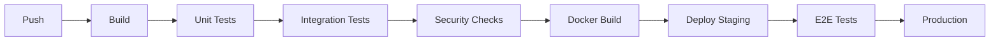

# EduFlow AI – Git, Testing, CI/CD and Delivery

## 1. Branching

```text
main
develop
feature/member1-course-management
feature/member2-assessment
feature/member3-gamification
feature/member4-analytics
```

Pull requests are mandatory.

---

# 2. Commit Convention

```text
feat:
fix:
test:
docs:
refactor:
chore:
```

Example:

```text
feat(gamification): add XP transaction service
```

---

# 3. Test Pyramid

```text
          E2E
       Integration
     Unit / Domain
```

---

# 4. Unit Tests

### Member 1
- enrollment rules
- role checks
- course publishing

### Member 2
- grading
- attempt limits
- timer rules

### Member 3
- XP calculation
- level calculation
- badge conditions
- streaks
- ranking

### Member 4
- aggregation
- report generation
- validation state transitions

---

# 5. Integration Tests

Critical flows:

```text
Register → Login → Enroll
Enroll → Course → Lesson
Quiz → Submit → Grade
Quiz → Grade → XP
XP → Level Up
Challenge → Complete → Badge
Activity → Analytics
AI → Validation → Approval → Publish
```

---

# 6. End-to-End Test

Recommended demo scenario:

```text
Student registers
↓
Enrolls in Python course
↓
Completes lesson
↓
Takes quiz
↓
Gets score
↓
Receives XP
↓
Unlocks achievement
↓
Leaderboard updates
↓
AI analyzes performance
↓
AI proposes challenge
↓
Validation passes
↓
Instructor approves
↓
Challenge appears in Flutter
↓
Student completes challenge
```

---

# 7. CI/CD

Pipeline:



---

# 8. Quality Gates

PR should fail if:
- build fails
- unit tests fail
- integration tests fail
- lint/type checks fail
- critical security scan fails

---

# 9. Documentation

Every endpoint must have:
- purpose
- request
- response
- error cases
- authorization requirement
- example

Each member maintains their component README.
