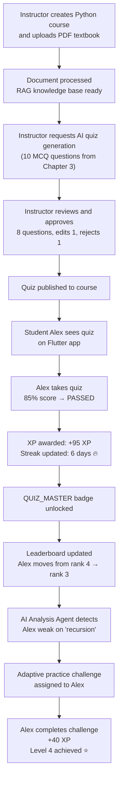
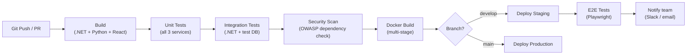

# EduFlow AI – Git, Testing, CI/CD & Delivery

> This document defines the branching strategy, commit conventions, test pyramid, CI/CD pipeline, and quality gates for EduFlow AI.

---

## 1. Branching Strategy

```
main           ← Production-ready code only. Merge via PR. Protected branch.
develop        ← Integration branch. All features merge here first.
    │
    ├── feature/m1-user-course-management   (Member 1)
    ├── feature/m1-enrollment-flow          (Member 1)
    ├── feature/m2-quiz-engine              (Member 2)
    ├── feature/m2-ai-quiz-review           (Member 2)
    ├── feature/m3-xp-ledger               (Member 3)
    ├── feature/m3-leaderboard             (Member 3)
    ├── feature/m4-analytics-dashboard     (Member 4)
    ├── feature/m4-hitl-approval           (Member 4)
    ├── fix/quiz-timer-server-side         (any member)
    └── hotfix/auth-token-expiry           (critical prod fix → merge to main + develop)
```

### Branch Rules

```text
✅ main:     Protected. PRs require 1 reviewer + all CI checks green.
✅ develop:  PRs require build + unit tests green.
✅ feature:  Prefixed with m1/m2/m3/m4 for traceability.
✅ hotfix:   Branched from main, merged to main AND develop.
❌ Never commit directly to main or develop.
❌ Never merge a feature branch with failing tests.
```

---

## 2. Commit Message Convention

All commits follow **Conventional Commits** format:

```text
<type>(<scope>): <short description>

[optional body]

[optional footer: BREAKING CHANGE or closes #issue]
```

### Types

| Type | When to use |
|------|------------|
| `feat` | New feature |
| `fix` | Bug fix |
| `test` | Adding or updating tests |
| `docs` | Documentation changes |
| `refactor` | Code refactor (no feature change) |
| `chore` | Build, config, dependency updates |
| `perf` | Performance improvement |
| `ci` | CI/CD configuration changes |

### Examples

```text
feat(auth): add JWT refresh token rotation
fix(quiz): enforce server-side timer on submission
test(gamification): add XP idempotency unit tests
docs(api): update enrollment endpoint descriptions
feat(ai): integrate LangGraph planner agent
refactor(leaderboard): migrate from PostgreSQL to Redis sorted sets
chore: update .NET SDK to 8.0.7
```

---

## 3. Test Pyramid

```
          ┌───────────┐
          │   E2E     │   ~5 scenarios (Playwright / Flutter integration)
          └─────┬─────┘
        ┌───────┴────────┐
        │  Integration   │   ~20 tests per component
        └───────┬────────┘
    ┌───────────┴───────────┐
    │   Unit / Domain Tests  │   ~50+ tests across all components
    └───────────────────────┘
```

**Rule**: Don't skip the base of the pyramid. Unit tests are cheap and fast; E2E tests are slow and fragile. Build the foundation first.

---

## 4. Unit Tests

### 4.1 Member 1 — User & Course

```text
AuthService:
✓ Register → password hashed (never stored plain)
✓ Login with correct credentials → JWT issued
✓ Login with wrong password → 401
✓ Inactive account → login rejected
✓ JWT claims contain correct userId and roles

CourseService:
✓ Create course → status = DRAFT
✓ Publish course with 0 published modules → fails (business rule)
✓ Publish course with published modules → succeeds

EnrollmentService:
✓ Student enrolls in open course → status = ACTIVE
✓ Student enrolls in invite-only → status = PENDING
✓ Duplicate enrollment → rejected (ALREADY_EXISTS)
✓ Instructor accepts enrollment → status = ACTIVE
✓ Student unenrolls → record deleted

DocumentService:
✓ Upload valid PDF → processing_status = PENDING
✓ Upload oversized file → rejected (> 50MB)
✓ Upload invalid MIME type → rejected
```

### 4.2 Member 2 — Assessment

```text
GradingEngine:
✓ MCQ correct answer → full marks
✓ MCQ wrong answer → 0 marks
✓ Multiple select: all correct → full marks
✓ Multiple select: partial → 0 marks
✓ Fill blank: exact match (case-insensitive) → correct
✓ Fill blank: not in accepted answers → incorrect
✓ True/False: correct → full marks

ScoreCalculation:
✓ Score = Σ marks for each correct question
✓ Percentage = (score / max_score) × 100
✓ Passed = percentage >= pass_percentage
✓ XP = score + quiz_completion_bonus (+ perfect_bonus if 100%)
✓ XP capped at quiz.max_xp_cap

TimerEnforcement:
✓ Submission at expires_at - 1s → accepted
✓ Submission at expires_at + 1s → TIMED_OUT applied server-side

AttemptLimits:
✓ 3rd attempt → accepted
✓ 4th attempt → 403 BUSINESS_RULE_VIOLATION
✓ Concurrent submissions → second fails (UNIQUE constraint)
```

### 4.3 Member 3 — Gamification

```text
XpEngine:
✓ Award XP for lesson → xp_transactions record created
✓ Award XP same source twice → idempotent (second call no-op)
✓ Daily cap: lesson XP capped at 200/day
✓ Difficulty multiplier: HARD = 2.0× base
✓ Final XP never exceeds max_xp_cap

LevelEngine:
✓ Level 1 threshold = 100 XP
✓ Level 2 threshold = 283 XP (100 × 2^1.5)
✓ Level up event emitted when threshold crossed
✓ Level up is idempotent (no double level up)

BadgeEngine:
✓ FIRST_LESSON badge awarded on first lesson completion
✓ Badge awarded only once (idempotent)
✓ Badge NOT awarded until qualifying event
✓ SEVEN_DAY_STREAK badge awarded after 7th consecutive day

StreakEngine:
✓ Activity today → streak incremented (if yesterday was last)
✓ Activity same day twice → streak unchanged (idempotent)
✓ Day gap → streak resets to 1
✓ Streak comparison uses student timezone, not UTC

LeaderboardService:
✓ XP update → Redis ZADD updates score
✓ Rank retrieval → ZREVRANK returns correct 0-indexed rank
✓ Weekly reset → ZADD with 0 resets all scores
✓ Tiebreak: lower last_activity_at wins (achieved earlier)
```

### 4.4 Member 4 — Analytics & AI Validation

```text
ValidationAgent:
✓ XP > max_xp_cap → INVALID_REWARD error
✓ Question with no correct answer → INVALID_SCHEMA
✓ Duplicate question (same text in bank) → DUPLICATE_QUESTION
✓ Safety trigger: question with prohibited content → CONTENT_SAFETY_VIOLATION
✓ Valid question → VALIDATION_PASSED

StudyPlanService:
✓ AI study plan → status = PendingInstructorApproval
✓ Instructor approves → status = Approved
✓ Instructor rejects → status = Rejected
✓ Approved plan items delivered to student

AuditLog:
✓ Login → audit log created (actor_id, action = 'UserLoggedIn')
✓ AI quiz approval → audit log created
✓ Admin XP adjustment → audit log created
✓ Audit log cannot be updated (throws exception)
```

---

## 5. Integration Tests

### 5.1 Critical End-to-End Flows

```text
Auth flow:
✓ POST /auth/register → 201 Created + verify email stored
✓ POST /auth/login → 200 + access_token + refresh cookie
✓ GET /users/me with valid token → 200
✓ GET /users/me with expired token → 401

Course + enrollment:
✓ Instructor creates course + publishes → GET /courses shows it
✓ Student requests enrollment → instructor approves → student can access lessons
✓ Unenrolled student accesses lesson → 403

Quiz lifecycle:
✓ Instructor creates quiz → publishes → student can see it
✓ Student starts quiz → submits answers → receives score
✓ XP created in xp_transactions after submission
✓ Student exceeds max attempts → 403

Gamification integration:
✓ Submit passing quiz → XP awarded → user_points.total_xp updated
✓ Lesson completed → streak updated
✓ XP crosses level threshold → level up event fires → user_points.current_level updated
✓ FIRST_QUIZ badge awarded on first quiz submission

AI pipeline:
✓ Instructor requests quiz generation → workflow created (RUNNING status)
✓ AI generates questions → status = PENDING_REVIEW
✓ Instructor approves question → status = APPROVED
✓ Draft published → questions appear in question bank
✓ Student takes quiz with AI questions → normal grading applies
```

### 5.2 Security Integration Tests

```text
✓ Unauthenticated request to protected endpoint → 401
✓ Student accessing instructor-only endpoint → 403
✓ Instructor accessing admin-only endpoint → 403
✓ Instructor accessing another instructor's course → 403
✓ Student accessing quiz for unenrolled course → 403
✓ Invalid JWT signature → 401
✓ Expired access token → 401 (not 403)
✓ Revoked refresh token → 401
```

---

## 6. End-to-End Demo Scenario

This is the scenario to demonstrate in the final presentation:



---

## 7. CI/CD Pipeline

### 7.1 GitHub Actions Pipeline

```yaml
name: EduFlow AI CI/CD

on:
  push:
    branches: [develop, main]
  pull_request:
    branches: [develop, main]

jobs:
  backend:
    runs-on: ubuntu-latest
    services:
      postgres:
        image: pgvector/pgvector:pg16
        env:
          POSTGRES_DB: eduflow_test
          POSTGRES_PASSWORD: test
        options: --health-cmd pg_isready
      redis:
        image: redis:7-alpine
    steps:
      - uses: actions/checkout@v4
      - uses: actions/setup-dotnet@v4
        with: { dotnet-version: '8.0.x' }
      - run: dotnet restore backend/
      - run: dotnet build backend/ --no-restore
      - run: dotnet test backend/EduFlow.Tests/ --no-build
        env:
          DB_CONNECTION: Host=localhost;Database=eduflow_test;Username=postgres;Password=test
      - run: dotnet publish backend/EduFlow.Api/ -c Release -o publish/

  ai-service:
    runs-on: ubuntu-latest
    steps:
      - uses: actions/checkout@v4
      - uses: actions/setup-python@v5
        with: { python-version: '3.11' }
      - run: pip install -r ai-agent/requirements.txt
      - run: python -m pytest ai-agent/tests/ -v

  frontend:
    runs-on: ubuntu-latest
    steps:
      - uses: actions/checkout@v4
      - uses: actions/setup-node@v4
        with: { node-version: '20' }
      - run: npm ci
        working-directory: frontend
      - run: npm run build
        working-directory: frontend
      - run: npx playwright test
        working-directory: frontend

  deploy-staging:
    needs: [backend, ai-service, frontend]
    if: github.ref == 'refs/heads/develop'
    runs-on: ubuntu-latest
    steps:
      - run: docker compose up -d
        # Staging deployment
```

### 7.2 Pipeline Stages



---

## 8. Quality Gates

A Pull Request is **blocked from merging** if any of these fail:

| Gate | Tool | Threshold |
|------|------|-----------|
| Build | dotnet build, npm build | 0 errors |
| Unit tests | dotnet test, pytest | 0 failures |
| Test coverage | dotnet-coverage | ≥ 70% line coverage |
| Frontend build | npm run build | 0 errors |
| Linting | ESLint (frontend), dotnet-format | 0 warnings |
| Security scan | OWASP DependencyCheck | No critical CVEs |
| Secrets scan | TruffleHog | No secrets in diff |

---

## 9. Docker Compose (Local Development)

```yaml
# docker-compose.yml (simplified)
version: '3.9'
services:
  db:
    image: pgvector/pgvector:pg16
    environment:
      POSTGRES_DB: eduflow
      POSTGRES_PASSWORD: localpassword
    ports:
      - "5432:5432"
    volumes:
      - pgdata:/var/lib/postgresql/data

  redis:
    image: redis:7-alpine
    ports:
      - "6379:6379"

  backend:
    build: ./backend
    ports:
      - "5000:5000"
    environment:
      - DB_CONNECTION=Host=db;Database=eduflow;Username=postgres;Password=localpassword
      - REDIS_CONNECTION=redis:6379
      - AI_SERVICE_URL=http://ai-agent:8000
    depends_on: [db, redis]

  ai-agent:
    build: ./ai-agent
    ports:
      - "8000:8000"
    environment:
      - OPENAI_API_KEY=${OPENAI_API_KEY}
      - DB_CONNECTION=Host=db;Database=eduflow;...

  frontend:
    build: ./frontend
    ports:
      - "2174:2174"
    environment:
      - VITE_API_URL=http://localhost:5000

volumes:
  pgdata:
```

---

## 10. API Documentation

Each component member must document their endpoints:

```text
Per endpoint:
✓ Purpose and description
✓ HTTP method + URL
✓ Authorization requirements (role + ownership)
✓ Request body schema (JSON example)
✓ Success response schema (JSON example)
✓ All error cases (status codes + error codes)
✓ Example cURL command

Format: Swagger/OpenAPI 3.0 annotations in C# controllers
Tool: Swashbuckle → auto-generates /swagger UI
```
