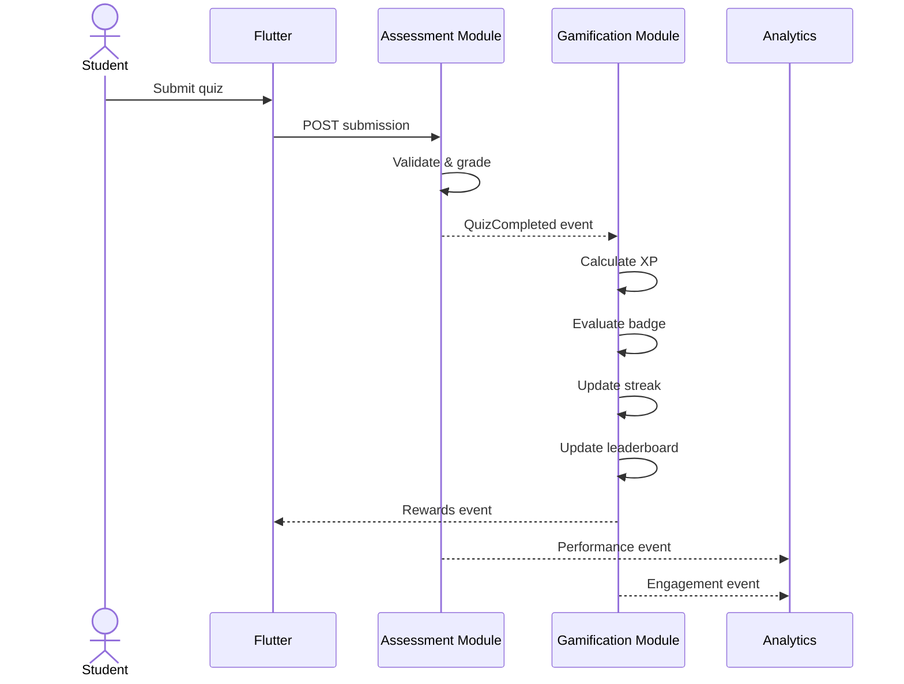
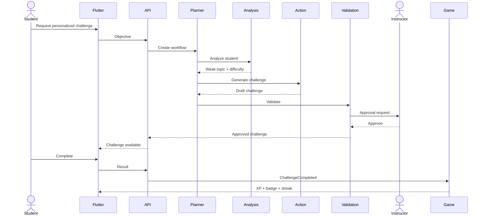

# EduFlow AI – Component Integration Matrix

## 1. Member-to-Member Dependencies

| Producer | Event / API | Consumer | Purpose |
|---|---|---|---|
| Member 1 | StudentEnrolled | Member 3 | Initialize gamification profile |
| Member 1 | CoursePublished | Member 4 | Update course analytics |
| Member 1 | LessonCompleted | Member 3 | Award XP / update streak |
| Member 2 | QuizCompleted | Member 3 | Award XP / achievements |
| Member 2 | QuizCompleted | Member 4 | Update performance analytics |
| Member 3 | XPGranted | Member 4 | Update engagement analytics |
| Member 3 | LevelUp | Member 4 | Track progression |
| Member 4 | AI Recommendation | Member 3 | Trigger suitable challenge |
| Member 4 | ApprovalCompleted | Member 2/3 | Publish approved AI content |
| Member 4 | NotificationRequested | External provider | Deliver email/SMS/push |

---

# 2. Critical Workflow: Quiz to Gamification



---

# 3. Critical Workflow: AI Personalized Challenge



---

# 4. Shared Contract Rule

Members must not directly access another member's database tables.

Use:
- application service interfaces
- API endpoints
- domain events

Example:

Bad:

```text
Gamification repository directly querying quiz tables
```

Better:

```text
QuizCompleted event
        ↓
Gamification event handler
```

This keeps ownership clear.

---

# 5. Shared DTO Contracts

Example:

```json
{
  "studentId": "uuid",
  "courseId": "uuid",
  "activityId": "uuid",
  "activityType": "QUIZ",
  "result": {
    "percentage": 85,
    "passed": true
  },
  "occurredAt": "2026-08-16T18:00:00Z"
}
```

---

# 6. Integration Testing Ownership

Every owner is responsible for its local tests.

The team jointly owns cross-component tests.

The final submission should demonstrate the system as **one integrated product**, not four unrelated modules.
