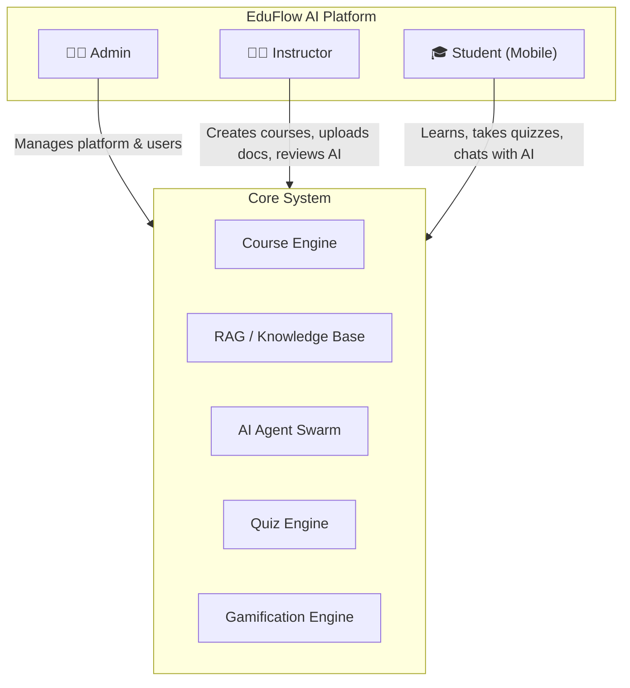
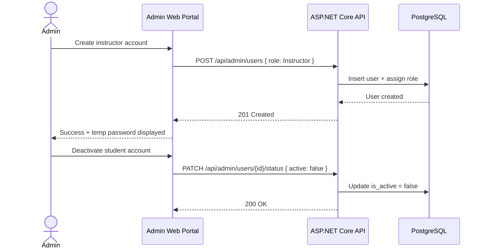
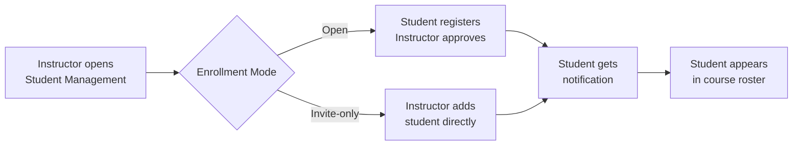
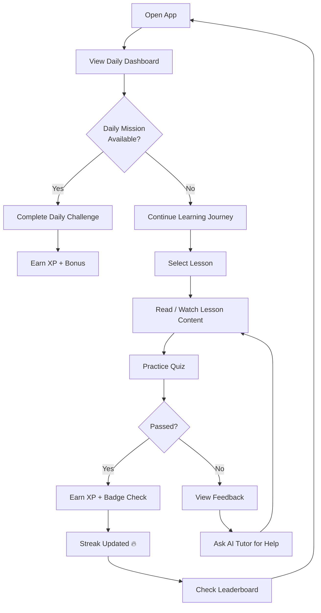
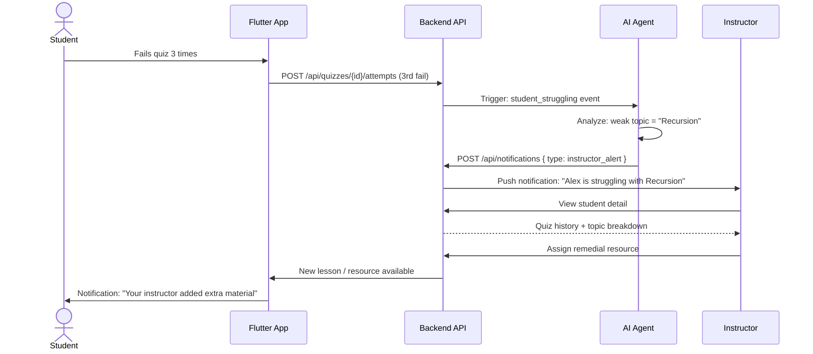
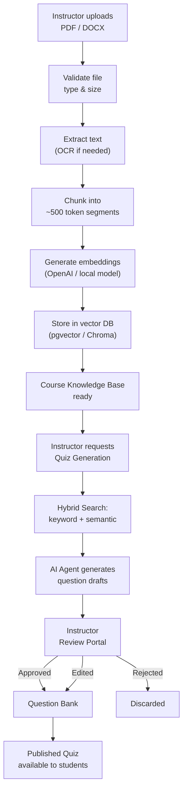

# EduFlow AI – System Workflow

> This document describes the complete real-world workflows for each of the three user roles: **Admin**, **Instructor**, and **Student**. It also covers the cross-role workflows that involve collaboration between roles.

---

## Overview Diagram



---

## 1. Platform Setup Workflow (Admin)

### 1.1 Initial Platform Configuration

```
Admin logs in
    │
    ├── Configure platform settings
    │       ├── Set institution name & branding
    │       ├── Configure email/notification provider
    │       └── Set global gamification rules (XP caps, badge rules)
    │
    ├── Manage user roles
    │       ├── Create Instructor accounts
    │       ├── Assign roles (Student / Instructor / Admin)
    │       └── Activate / deactivate accounts
    │
    └── Monitor platform health
            ├── View active sessions
            ├── Review audit logs
            └── View system-wide analytics
```

### 1.2 Admin User Management Workflow



---

## 2. Instructor Workflows {#instructor-workflows}

### 2.1 Course Creation & Setup

```
Instructor logs in to React Web Dashboard
    │
    ├── Create Course
    │       ├── Enter title, description, difficulty level
    │       ├── Set prerequisites (if any)
    │       └── Upload thumbnail
    │
    ├── Add Modules (chapters/units)
    │       ├── Module 1: Introduction
    │       ├── Module 2: Core Concepts
    │       └── Module N: ...
    │
    ├── Add Lessons to each Module
    │       ├── Lesson content (text, video URL, slides)
    │       ├── Reading materials
    │       └── Set lesson duration estimate
    │
    ├── Upload Reference Documents (PDFs, DOCX)
    │       └── → Triggers RAG Pipeline (see doc 13)
    │
    └── Publish Course
            ├── Set enrollment mode (open / invite-only)
            └── Course becomes visible to students
```

### 2.2 Student Enrollment Management



### 2.3 AI Quiz Generation & Review Pipeline

```
Instructor triggers quiz generation
    │
    ├── Select course / module / document
    ├── Choose question types:
    │       ├── Multiple Choice (MCQ)
    │       ├── Fill in the Blanks
    │       ├── True / False
    │       └── Dropdown Match
    ├── Set number of questions
    │
    ▼
AI Agent generates draft quiz
    │
    ├── Uses RAG to pull relevant content from uploaded documents
    ├── Generates questions with correct answers
    └── Validates schema, prerequisite coverage, and XP range
    │
    ▼
Instructor Review Dashboard
    │
    ├── View all AI-generated questions
    ├── For each question:
    │       ├── ✅ Approve → added to question bank
    │       ├── ✏️ Edit → modify wording, options, correct answer
    │       └── ❌ Reject → removed from this batch
    │
    └── Publish approved quiz to course
            └── Students in the course are notified
```

### 2.4 Document Summary Request

```
Instructor uploads PDF/DOCX to a course module
    │
    ▼
RAG pipeline processes document
    │
    ├── Extract text / OCR
    ├── Chunk into segments
    ├── Generate embeddings
    └── Store in course knowledge base
    │
    ▼
Instructor can request:
    ├── "Generate summary of Chapter 3"
    │       └── AI returns structured summary from RAG context
    └── "What topics does this document cover?"
            └── AI returns topic list with page references
```

### 2.5 Instructor Analytics & Monitoring

```
Instructor Dashboard → Analytics Tab
    │
    ├── Course overview
    │       ├── Enrollment count
    │       ├── Average completion %
    │       └── Quiz pass rate
    │
    ├── Student performance
    │       ├── Per-student progress table
    │       ├── Quiz attempt history
    │       └── AI flag: students struggling
    │
    └── AI-generated insights
            ├── "3 students have not attempted Module 2 quiz"
            └── "Topic: Recursion has 40% fail rate → consider extra material"
```

---

## 3. Student Workflows {#student-workflows}

### 3.1 Registration & Enrollment

```
Student downloads mobile app
    │
    ├── Register with email + password
    ├── Verify email
    │
    ├── Browse course catalog
    │       └── View course details (modules, instructor, difficulty)
    │
    ├── Request enrollment
    │       └── Instructor / Admin receives notification → approves
    │
    └── Student gains access to enrolled course
```

### 3.2 Daily Learning Loop



### 3.3 AI Tutor Conversation Flow

```
Student opens AI Chat
    │
    ├── Ask any question related to enrolled courses
    │       Example: "Explain recursion with an example"
    │
    ▼
AI Tutor Agent
    │
    ├── Retrieves relevant content from course knowledge base (RAG)
    ├── Provides explanation with course-specific context
    ├── Suggests related lesson or quiz
    │
    ▼
Student Response
    │
    ├── "I still don't understand"
    │       └── AI provides alternative explanation / simpler analogy
    │
    └── "Give me a practice question"
            └── AI generates inline practice question
                    └── Student answers → AI gives feedback
```

### 3.4 Quiz Attempt Flow

```
Student selects quiz
    │
    ├── View quiz info: questions, time limit, XP reward
    ├── Start quiz
    │
    ▼
Answer Questions
    ├── Multiple Choice → tap option
    ├── Fill in Blank → type answer
    └── Dropdown → select from list
    │
    ▼
Submit Quiz
    │
    ├── Auto-graded instantly
    ├── Score calculated
    │
    ├── XP awarded via Gamification Engine
    │       ├── Base XP × difficulty multiplier
    │       ├── Perfect score bonus
    │       └── Capped by daily XP limit
    │
    ├── Badges evaluated
    │       └── "Quiz Master", "Perfect Score" etc.
    │
    ├── Streak updated (if first quiz of the day)
    │
    └── Results screen
            ├── Score + correct/incorrect breakdown
            ├── Topic-level feedback
            └── Recommended next action (lesson or retry)
```

### 3.5 Gamification & Progress Flow

```
All student actions → Domain Events
    │
    ├── LessonCompleted → +20 XP
    ├── QuizPassed → +20 XP  
    ├── PerfectScore → +50 XP bonus
    ├── DailyChallenge → +40 XP
    ├── CourseCompleted → +300 XP
    │
    ▼
XP Ledger (immutable transactions)
    │
    ▼
Level Engine
    │
    ├── XP threshold: Level N requires 100 × N^1.5 XP
    ├── Level up → notification + celebration screen
    └── Level milestone → new avatar frame unlocked
    │
    ▼
Badge Engine
    │
    ├── Rules evaluated on every domain event
    └── Badge awarded once (idempotent)
    │
    ▼
Leaderboard (Redis)
    │
    ├── Weekly reset
    ├── Course-specific rankings
    └── Global rankings
```

---

## 4. Cross-Role Workflows

### 4.1 Student Struggles → AI Detects → Instructor Notified



### 4.2 Document Upload → RAG → Quiz Generation Pipeline



---

## 5. Key Business Rules

| Rule | Description |
|------|-------------|
| **Instructor must approve AI quizzes** | No AI-generated question reaches students without instructor approval |
| **Only instructors/admins add students to courses** | Students can request enrollment; final approval is instructor/admin |
| **XP is server-side only** | Client-provided XP values are always ignored |
| **AI never modifies the database directly** | AI agents generate drafts → backend tools execute mutations |
| **Streaks count calendar days** | One activity per calendar day counts; multiple activities same day = one streak increment |
| **Documents are course-scoped** | A student can only query documents from their enrolled courses |
| **Quiz retries are rate-limited** | Same quiz cannot be taken unlimited times to farm XP |
