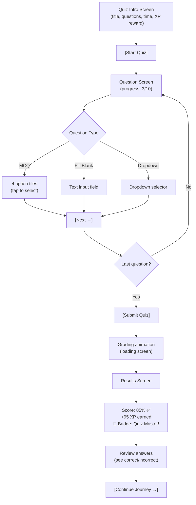

# EduFlow AI – Flutter Student Mobile App Guide

> The Flutter student mobile app is the **primary interface for students**. It is designed as a gamified, AI-powered learning experience that makes studying engaging, self-directed, and effective.

---

## 1. App Philosophy

```
Traditional LMS App               EduFlow AI Student App
─────────────────────             ──────────────────────
📋 List of PDFs         vs.       🎮 Learning journey map
📝 Static quizzes       vs.       ⚡ Adaptive AI challenges
😴 No motivation        vs.       🔥 Streaks + XP + Badges
No help available       vs.       🤖 24/7 AI Tutor
Boring leaderboard      vs.       🏆 Weekly competition podium
```

**Core design principle**: The app must feel more like a game than a classroom.

---

## 2. Screen Map

```
App Root
│
├── 🔐 Auth
│   ├── Login Screen
│   ├── Register Screen
│   └── Email Verification
│
├── 🏠 Home / Dashboard
│   ├── Daily Mission Card
│   ├── Streak Display 🔥
│   ├── XP Progress Bar
│   ├── Enrolled Courses (quick access)
│   └── AI Tutor Quick Launch
│
├── 🗺️ Learning Journey
│   ├── Course selection
│   └── Visual path: Nodes → Boss Battles → Milestones
│
├── 📚 Course Detail
│   ├── Module list
│   ├── Lesson view (text / video)
│   ├── Document summary (AI)
│   └── Quiz launcher
│
├── ⚡ Quiz
│   ├── Quiz intro (rules, XP reward)
│   ├── Question screen (MCQ / Fill Blank / Dropdown)
│   ├── Timer
│   └── Results screen (score + XP + badges)
│
├── 🤖 AI Tutor Chat
│   ├── Chat interface
│   ├── Source references
│   └── Practice question generator
│
├── 🏆 Leaderboard / Podium
│   ├── Weekly ranking
│   ├── Course ranking
│   └── Squads / Teams
│
├── 👤 Profile
│   ├── Avatar + level badge
│   ├── XP / Level progress
│   ├── Badge showcase
│   ├── Stats (quizzes taken, streak, courses completed)
│   └── Activity history
│
└── 🔔 Notifications
    ├── Streak reminders
    ├── New quiz available
    ├── Badge unlocked
    └── Instructor messages
```

---

## 3. Screen Specifications

### 3.1 Home / Dashboard

```
┌────────────────────────────────┐
│  Good morning, Alex! 🌅        │
│  🔥 5-day streak               │
│  Level 3 ──────████░░─── Level 4│
│  1,250 / 2,000 XP              │
├────────────────────────────────┤
│  ⚡ DAILY MISSION              │
│  "Complete Module 3 Quiz"      │
│  Reward: +40 XP                │
│  [Start Now →]                 │
├────────────────────────────────┤
│  📚 My Courses                 │
│  [Python Basics    65% ████░]  │
│  [Data Structures  30% ██░░░]  │
├────────────────────────────────┤
│  🤖 Ask AI Tutor               │
│  "What do you want to learn?"  │
└────────────────────────────────┘
```

### 3.2 Learning Journey Map

The journey is a **visual node map** inspired by Duolingo's path:

```
  ○ MODULE 1 COMPLETE ✓
  │
  ○ MODULE 2 IN PROGRESS ◐
  │   ├── Lesson 1 ✓
  │   ├── Lesson 2 ✓
  │   ├── Lesson 3 → [START]
  │   └── Quiz (locked until lessons done)
  │
  ⭐ MILESTONE: "Halfway Hero" badge
  │
  ○ MODULE 3 (locked)
  │
  🔥 BOSS BATTLE: "Chapter Challenge"
  │
  🏆 COURSE COMPLETE
```

### 3.3 Quiz Screen Flow



### 3.4 AI Tutor Chat

```
┌────────────────────────────────────┐
│  🤖 AI Tutor – Python Basics      │
│  (Course-scoped knowledge)         │
├────────────────────────────────────┤
│                                    │
│  👤 What is recursion?             │
│                                    │
│  🤖 Recursion is when a function  │
│  calls itself to solve a smaller  │
│  version of the same problem...   │
│                                    │
│  📄 Source: Chapter 4, Page 23    │
│                                    │
│  💡 Want to try a practice Q?     │
│  [Yes, give me one!]              │
│                                    │
│  🤖 Q: What is the purpose of    │
│  a base case in recursion?        │
│  [Type your answer...]            │
│                                    │
├────────────────────────────────────┤
│  [Ask a question...]              │
└────────────────────────────────────┘
```

### 3.5 Profile Screen

```
┌────────────────────────────────┐
│         👤 [AVATAR]            │
│     Alex Rivera                │
│     ⭐ Level 3 — Apprentice     │
│                                │
│  XP: 1,250 / 2,000 ██████░░░  │
│  🔥 Streak: 5 days             │
│                                │
│  🏅 BADGES (6 earned)          │
│  [🥇][📚][⚡][🎯][🔥][🏆]    │
│                                │
│  📊 STATS                      │
│  Quizzes taken:     18         │
│  Perfect scores:     3         │
│  Lessons completed: 24         │
│  Courses enrolled:   2         │
│                                │
│  [View Full History]           │
└────────────────────────────────┘
```

---

## 4. Gamification UX Details

### 4.1 XP Gain Animation

When a student earns XP:
```
1. "+95 XP" toast slides in from top (500ms)
2. XP bar fills with animation (800ms)
3. If level up: full-screen celebration overlay
   - Confetti animation
   - "LEVEL UP! You're now Level 4 ⭐"
   - New avatar frame revealed
```

### 4.2 Badge Unlock Flow

```
1. Badge check runs server-side after every domain event
2. If badge earned: push notification + in-app modal
3. Modal shows:
   - Badge image (animated reveal)
   - Badge name & description
   - Share button (optional)
4. Badge added to profile showcase
```

### 4.3 Streak Mechanics

```
Daily streak rules:
- Streak increments if student completes ≥ 1 learning activity per calendar day
- Activities that count: lesson complete, quiz attempt, AI chat interaction
- Streak frozen at 11 PM if student has a "streak freeze" item (future feature)
- Streak broken if no activity in a full calendar day
- Notifications:
  - 6 PM: "Don't break your streak! 🔥 You haven't learned today"
  - 8 PM: "Last chance! 2 hours to keep your streak alive"
```

### 4.4 Leaderboard / Podium

```
🏆 WEEKLY PODIUM
Week of Sep 7 – Sep 13

🥇 Maya Patel          8,420 XP
🥈 Chen Wei            4,650 XP  
🥉 Elena Rostova       2,940 XP
4.  Alex Rivera        1,250 XP ← You
...

[Course Ranking] [Global] [Your Squad]
```

---

## 5. Flutter Technical Architecture

### 5.1 Package Structure

```
lib/
├── main.dart
├── app.dart
├── core/
│   ├── constants/
│   ├── theme/          # Dark theme, colors, typography
│   ├── utils/
│   └── network/        # Dio HTTP client, interceptors
├── features/
│   ├── auth/
│   │   ├── data/
│   │   ├── domain/
│   │   └── presentation/
│   ├── home/
│   ├── journey/
│   ├── course/
│   ├── quiz/
│   ├── ai_tutor/
│   ├── gamification/
│   ├── leaderboard/
│   └── profile/
└── shared/
    ├── widgets/
    └── services/
```

### 5.2 State Management

| Tool | Usage |
|------|-------|
| **Riverpod** | Global state (auth, user profile, XP) |
| **StateNotifier** | Screen-level state (quiz session, chat) |
| **FutureProvider** | Async data loading (course list, leaderboard) |

### 5.3 Real-Time Features (SignalR)

```dart
// Connect to SignalR hub on login
final hubConnection = HubConnectionBuilder()
    .withUrl('https://api.eduflow.ai/hubs/game')
    .withAutomaticReconnect()
    .build();

// Listen for XP events
hubConnection.on('XpGranted', (args) {
  // Show +XP toast
  ref.read(xpProvider.notifier).addXP(args!.first['amount']);
});

// Listen for badge unlocks
hubConnection.on('BadgeUnlocked', (args) {
  // Show badge modal
  showBadgeModal(context, args!.first['badge']);
});

// Listen for leaderboard changes
hubConnection.on('LeaderboardUpdated', (args) {
  ref.invalidate(leaderboardProvider);
});
```

### 5.4 Offline Support

| Feature | Offline Behavior |
|---------|-----------------|
| Lesson content | Cached for 24 hours |
| Course structure | Cached on enrollment |
| Quiz | Cannot take offline (needs server grading) |
| AI Tutor | Not available offline |
| Profile | Read-only from cache |

---

## 6. API Endpoints Used by Mobile App

```http
# Auth
POST   /api/auth/login
POST   /api/auth/register
POST   /api/auth/refresh

# Courses & Learning
GET    /api/students/me/courses
GET    /api/courses/{id}/modules
GET    /api/modules/{id}/lessons
GET    /api/lessons/{id}

# Quizzes
GET    /api/courses/{id}/quizzes
GET    /api/quizzes/{id}
POST   /api/quizzes/{id}/start
POST   /api/quizzes/{id}/submit

# AI Tutor
POST   /api/ai/chat
GET    /api/ai/chat/history

# Gamification
GET    /api/students/me/xp
GET    /api/students/me/badges
GET    /api/students/me/streak
GET    /api/leaderboard/weekly
GET    /api/leaderboard/course/{courseId}

# Profile
GET    /api/students/me/profile
PUT    /api/students/me/profile
GET    /api/students/me/stats

# Notifications
GET    /api/notifications
PATCH  /api/notifications/{id}/read
```

---

## 7. Accessibility & UX Standards

```text
✅ Minimum touch target size: 48×48 dp (WCAG 2.1)
✅ Color contrast ratio: ≥ 4.5:1 for text
✅ Screen reader support: Semantics widgets on all interactive elements
✅ Font scaling: Respects system font size preferences
✅ Dark mode: Full dark theme support
✅ Loading states: Skeleton screens, not spinners
✅ Error states: Clear error messages with retry actions
✅ Empty states: Illustrated empty states with call to action
```
