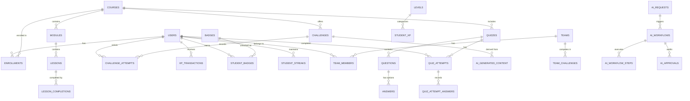

# EduFlow AI – Database Schema & ER Model 🗄️
> **PostgreSQL 16 Normalized Relational Schema & Entity Framework Core Model**

---

## 1. Complete Entity Relationship (ER) Diagram



---

## 2. Table Schemas by Domain

### 2.1 Identity & Authentication
```sql
CREATE TABLE users (
    id UUID PRIMARY KEY DEFAULT gen_random_uuid(),
    full_name VARCHAR(120) NOT NULL,
    email VARCHAR(255) UNIQUE NOT NULL,
    password_hash VARCHAR(255) NOT NULL,
    avatar_url VARCHAR(500),
    role VARCHAR(50) NOT NULL, -- 'Student', 'Instructor', 'Admin'
    created_at TIMESTAMP WITH TIME ZONE DEFAULT NOW(),
    updated_at TIMESTAMP WITH TIME ZONE DEFAULT NOW()
);

CREATE TABLE refresh_tokens (
    id UUID PRIMARY KEY DEFAULT gen_random_uuid(),
    user_id UUID NOT NULL REFERENCES users(id) ON DELETE CASCADE,
    token VARCHAR(500) NOT NULL,
    expires_at TIMESTAMP WITH TIME ZONE NOT NULL,
    is_revoked BOOLEAN DEFAULT FALSE,
    created_at TIMESTAMP WITH TIME ZONE DEFAULT NOW()
);
```

### 2.2 Education & Curriculum
```sql
CREATE TABLE courses (
    id UUID PRIMARY KEY DEFAULT gen_random_uuid(),
    title VARCHAR(200) NOT NULL,
    code VARCHAR(50) UNIQUE NOT NULL,
    description TEXT,
    instructor_id UUID NOT NULL REFERENCES users(id),
    is_published BOOLEAN DEFAULT FALSE,
    created_at TIMESTAMP WITH TIME ZONE DEFAULT NOW()
);

CREATE TABLE modules (
    id UUID PRIMARY KEY DEFAULT gen_random_uuid(),
    course_id UUID NOT NULL REFERENCES courses(id) ON DELETE CASCADE,
    title VARCHAR(200) NOT NULL,
    order_index INT NOT NULL DEFAULT 0
);

CREATE TABLE lessons (
    id UUID PRIMARY KEY DEFAULT gen_random_uuid(),
    module_id UUID NOT NULL REFERENCES modules(id) ON DELETE CASCADE,
    title VARCHAR(200) NOT NULL,
    content_markdown TEXT,
    video_url VARCHAR(500),
    xp_reward INT NOT NULL DEFAULT 20,
    order_index INT NOT NULL DEFAULT 0
);

CREATE TABLE enrollments (
    id UUID PRIMARY KEY DEFAULT gen_random_uuid(),
    student_id UUID NOT NULL REFERENCES users(id) ON DELETE CASCADE,
    course_id UUID NOT NULL REFERENCES courses(id) ON DELETE CASCADE,
    enrolled_at TIMESTAMP WITH TIME ZONE DEFAULT NOW(),
    is_active BOOLEAN DEFAULT TRUE,
    UNIQUE(student_id, course_id)
);
```

### 2.3 Assessment Engine
```sql
CREATE TABLE quizzes (
    id UUID PRIMARY KEY DEFAULT gen_random_uuid(),
    course_id UUID NOT NULL REFERENCES courses(id) ON DELETE CASCADE,
    title VARCHAR(200) NOT NULL,
    time_limit_minutes INT DEFAULT 15,
    passing_score_percent INT DEFAULT 70,
    xp_reward INT DEFAULT 50,
    created_at TIMESTAMP WITH TIME ZONE DEFAULT NOW()
);

CREATE TABLE questions (
    id UUID PRIMARY KEY DEFAULT gen_random_uuid(),
    quiz_id UUID NOT NULL REFERENCES quizzes(id) ON DELETE CASCADE,
    question_text TEXT NOT NULL,
    question_type VARCHAR(50) NOT NULL, -- 'MultipleChoice', 'CodeSnippet', 'TrueFalse'
    points INT DEFAULT 10,
    order_index INT DEFAULT 0
);

CREATE TABLE answers (
    id UUID PRIMARY KEY DEFAULT gen_random_uuid(),
    question_id UUID NOT NULL REFERENCES questions(id) ON DELETE CASCADE,
    answer_text TEXT NOT NULL,
    is_correct BOOLEAN NOT NULL DEFAULT FALSE,
    explanation TEXT
);

CREATE TABLE quiz_attempts (
    id UUID PRIMARY KEY DEFAULT gen_random_uuid(),
    quiz_id UUID NOT NULL REFERENCES quizzes(id),
    student_id UUID NOT NULL REFERENCES users(id),
    score INT NOT NULL DEFAULT 0,
    max_score INT NOT NULL,
    passed BOOLEAN NOT NULL DEFAULT FALSE,
    started_at TIMESTAMP WITH TIME ZONE DEFAULT NOW(),
    completed_at TIMESTAMP WITH TIME ZONE
);
```

### 2.4 Gamification: XP, Levels, Badges, Streaks & Challenges
```sql
CREATE TABLE xp_transactions (
    id UUID PRIMARY KEY DEFAULT gen_random_uuid(),
    student_id UUID NOT NULL REFERENCES users(id) ON DELETE CASCADE,
    source_type VARCHAR(50) NOT NULL, -- 'LessonCompleted', 'QuizCompleted', 'DailyChallenge', 'StreakBonus'
    source_id UUID NOT NULL,
    xp_amount INT NOT NULL,
    created_at TIMESTAMP WITH TIME ZONE DEFAULT NOW()
);

CREATE TABLE student_xp (
    student_id UUID PRIMARY KEY REFERENCES users(id) ON DELETE CASCADE,
    total_xp INT NOT NULL DEFAULT 0,
    current_level INT NOT NULL DEFAULT 1,
    coins INT NOT NULL DEFAULT 0,
    updated_at TIMESTAMP WITH TIME ZONE DEFAULT NOW()
);

CREATE TABLE levels (
    id INT PRIMARY KEY,
    name VARCHAR(100) NOT NULL,
    minimum_xp INT NOT NULL,
    maximum_xp INT NOT NULL,
    reward_coins INT DEFAULT 0
);

CREATE TABLE badges (
    id VARCHAR(100) PRIMARY KEY, -- 'FIRST_LESSON', 'QUIZ_MASTER', 'SEVEN_DAY_STREAK'
    title VARCHAR(150) NOT NULL,
    description TEXT NOT NULL,
    icon_url VARCHAR(500),
    xp_bonus INT DEFAULT 100
);

CREATE TABLE student_badges (
    id UUID PRIMARY KEY DEFAULT gen_random_uuid(),
    student_id UUID NOT NULL REFERENCES users(id) ON DELETE CASCADE,
    badge_id VARCHAR(100) NOT NULL REFERENCES badges(id),
    unlocked_at TIMESTAMP WITH TIME ZONE DEFAULT NOW(),
    UNIQUE(student_id, badge_id)
);

CREATE TABLE student_streaks (
    student_id UUID PRIMARY KEY REFERENCES users(id) ON DELETE CASCADE,
    current_streak INT NOT NULL DEFAULT 0,
    longest_streak INT NOT NULL DEFAULT 0,
    freeze_tokens_available INT NOT NULL DEFAULT 2,
    last_activity_date DATE,
    updated_at TIMESTAMP WITH TIME ZONE DEFAULT NOW()
);

CREATE TABLE challenges (
    id UUID PRIMARY KEY DEFAULT gen_random_uuid(),
    course_id UUID REFERENCES courses(id),
    title VARCHAR(200) NOT NULL,
    description TEXT NOT NULL,
    difficulty VARCHAR(50) NOT NULL, -- 'Easy', 'Medium', 'Hard', 'Boss'
    xp_reward INT NOT NULL,
    coin_reward INT NOT NULL DEFAULT 0,
    time_limit_minutes INT DEFAULT 15,
    generated_by_ai BOOLEAN DEFAULT FALSE,
    is_active BOOLEAN DEFAULT TRUE,
    created_at TIMESTAMP WITH TIME ZONE DEFAULT NOW()
);

CREATE TABLE student_challenges (
    id UUID PRIMARY KEY DEFAULT gen_random_uuid(),
    challenge_id UUID NOT NULL REFERENCES challenges(id),
    student_id UUID NOT NULL REFERENCES users(id),
    status VARCHAR(50) NOT NULL, -- 'Assigned', 'InProgress', 'Completed', 'Failed'
    completed_at TIMESTAMP WITH TIME ZONE,
    created_at TIMESTAMP WITH TIME ZONE DEFAULT NOW()
);
```

### 2.5 Social, Teams & Leaderboards
```sql
CREATE TABLE teams (
    id UUID PRIMARY KEY DEFAULT gen_random_uuid(),
    name VARCHAR(150) NOT NULL,
    leader_id UUID NOT NULL REFERENCES users(id),
    created_at TIMESTAMP WITH TIME ZONE DEFAULT NOW()
);

CREATE TABLE team_members (
    id UUID PRIMARY KEY DEFAULT gen_random_uuid(),
    team_id UUID NOT NULL REFERENCES teams(id) ON DELETE CASCADE,
    student_id UUID NOT NULL REFERENCES users(id) ON DELETE CASCADE,
    joined_at TIMESTAMP WITH TIME ZONE DEFAULT NOW(),
    UNIQUE(team_id, student_id)
);
```

### 2.6 AI Governance & Audit Logging
```sql
CREATE TABLE ai_workflows (
    id VARCHAR(100) PRIMARY KEY,
    student_id UUID NOT NULL REFERENCES users(id),
    course_id UUID NOT NULL REFERENCES courses(id),
    workflow_type VARCHAR(100) NOT NULL, -- 'AdaptiveChallenge', 'GapAnalysis'
    status VARCHAR(50) NOT NULL, -- 'InProgress', 'PendingApproval', 'Approved', 'Rejected'
    created_at TIMESTAMP WITH TIME ZONE DEFAULT NOW()
);

CREATE TABLE ai_approvals (
    id UUID PRIMARY KEY DEFAULT gen_random_uuid(),
    workflow_id VARCHAR(100) NOT NULL REFERENCES ai_workflows(id),
    instructor_id UUID REFERENCES users(id),
    decision VARCHAR(50) NOT NULL, -- 'Approved', 'Rejected', 'Modified'
    review_comments TEXT,
    decided_at TIMESTAMP WITH TIME ZONE DEFAULT NOW()
);
```
