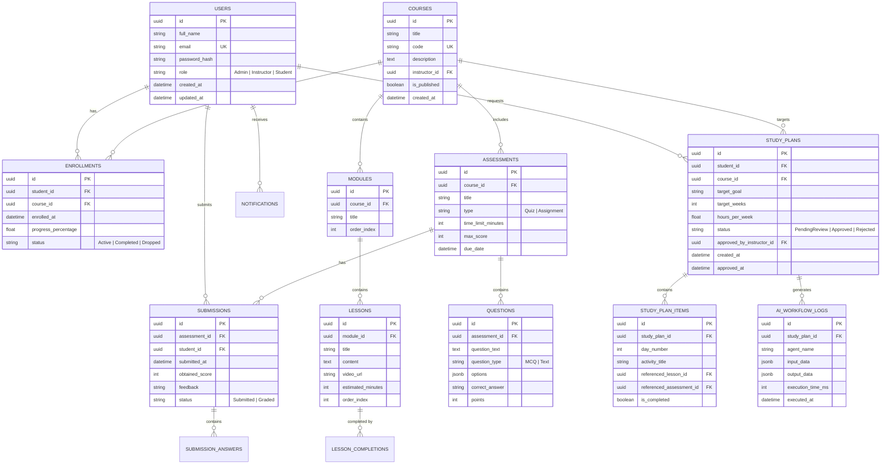

# EduFlow AI – Database Schema & ER Model 🗄️
> **PostgreSQL 16 Normalized Relational Schema & Entity Framework Core Model**

---

## 1. Entity Relationship (ER) Diagram



---

## 2. Table Schemas & Relational Constraints

### 2.1 Core Platform Tables
- `Users`: Stores student, instructor, and admin credentials, password hashes, and assigned roles. Unique constraint on `email`.
- `Courses`: Academic courses managed by instructors. Foreign key reference to `Users(id)`.
- `Modules` & `Lessons`: Hierarchical curriculum units with `order_index` constraints for ordered playback.
- `Enrollments`: Join table tracking student participation in courses, completion percentages, and active status.

### 2.2 Assessment & Grading Tables
- `Assessments`: Quizzes and homework assignments attached to specific courses.
- `Questions`: Multiple-choice and essay questions storing options and answer keys.
- `Submissions` & `SubmissionAnswers`: Student answers, auto-graded marks, and instructor rubric overrides.

### 2.3 Agentic AI Workflow & Audit Tables
- `StudyPlans`: AI-generated study recommendations tied to student goals and instructor approval status.
- `StudyPlanItems`: Granular daily/weekly actionable learning tasks proposed by the Recommendation Agent.
- `AiWorkflowLogs`: Immutable audit logs capturing agent names, tool execution timings, input payloads, and validation results.

---

## 3. Database Indexes & Performance Optimization

```sql
-- Indexes for rapid enrollment & progress lookup
CREATE INDEX idx_enrollments_student ON enrollments(student_id);
CREATE INDEX idx_enrollments_course ON enrollments(course_id);

-- Indexes for assessment submissions & gradebook querying
CREATE INDEX idx_submissions_assessment_student ON submissions(assessment_id, student_id);

-- Index for instructor pending AI approvals dashboard
CREATE INDEX idx_study_plans_status ON study_plans(status) WHERE status = 'PendingReview';

-- GIN Index on JSONB execution logs for fast audit inspection
CREATE INDEX idx_ai_workflow_logs_data ON ai_workflow_logs USING gin(output_data);
```
