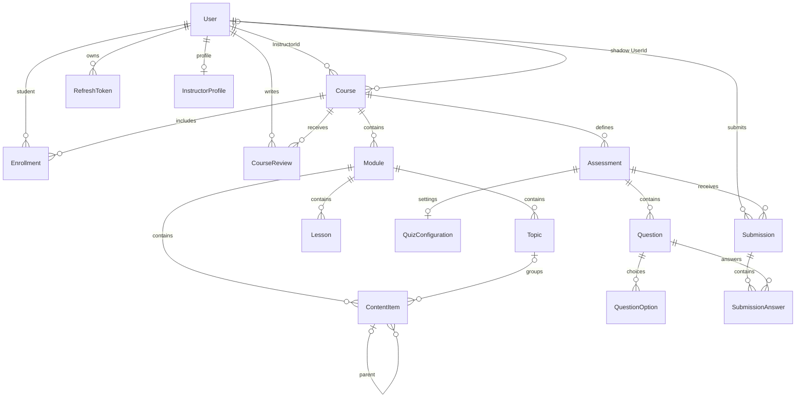
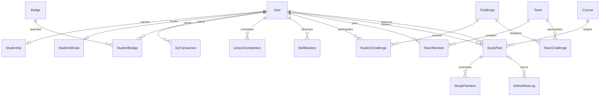
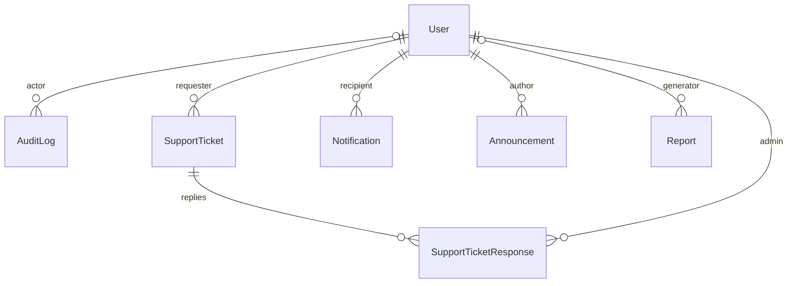

# Phase 2 — Backend, Database and Security Source Verification

Prepared 2026-10-01. Repository root: `C:/Users/WAZNI/Desktop/SLIIT/PROJECTS/Y3/Y3-S1/SEF/PROJECTS/EduFlowAi/EduFlowAi`.

## 1. Scope and Verification Method

This is a static source review of the current backend, informed by [Phase 0](00_REQUIREMENTS_AND_REPORT_MAP.md), [Phase 1](01_CURRENT_SCOPE_AND_EVIDENCE_PLAN.md), the permitted current documents and relevant Wazni backend/governance documentation. The assignment requirements are those extracted from the official specification in Phase 0; application source controls claims about implementation.

No application changes, dependency installation, builds, test execution, migrations, database operations, service startup, Git inspection or deployment checks were performed. React, Flutter, Python AI internals, legacy documentation and generated backend directories were excluded. The outer workspace's documentation is not project evidence.

| Code | Classification | Meaning in this document |
|---|---|---|
| A | VERIFIED IN SOURCE | A directly observable static fact, declaration or control exists. |
| B | PRESENT IN SOURCE BUT RUNTIME NOT VERIFIED | Executable behavior is implemented in source; successful execution is unverified. |
| C | PARTIAL | Related implementation exists but a concrete gap, inconsistent enforcement or fallback limits the claim. |
| D | DOCUMENTED/PLANNED ONLY | Documentation/comment describes behavior without the corresponding implementation in this scope. |
| E | NOT FOUND / UNVERIFIED | Evidence was not found in the inspected scope, or requires runtime/another phase. |

A never means a passing test or a secure deployed system. Route inventory status B describes source availability, not endorsement of every permission or business rule. Important exceptions are discussed separately. Source links identify files; method names identify the relevant implementation without copying source bodies.

Phase 1 refined the provisional Phase 0 schedule: Phase 3 React, Phase 4 Flutter, Phase 5 AI, Phase 6 tests/performance/CI/deployment, Phase 7 contribution/Git evidence. Use that refined schedule below. No earlier planning file was changed.

## 2. Backend Solution Structure

**A —** [EduFlow.slnx](../../backend/EduFlow.slnx) contains four projects, all targeting **net8.0**:

| Project | Actual responsibility | Project references | Relevant package declarations |
|---|---|---|---|
| [EduFlow.Api](../../backend/EduFlow.Api/EduFlow.Api.csproj) | Controllers, HTTP/auth pipeline, gateway-facing routes, considerable business logic | Core, Infrastructure | JwtBearer 8.0.0; EF Core Design 8.0.0; Swashbuckle.AspNetCore 6.6.2 |
| [EduFlow.Core](../../backend/EduFlow.Core/EduFlow.Core.csproj) | Entities, enums, DTOs, business service interfaces and audit registry | None | No separate application-service implementation layer |
| [EduFlow.Infrastructure](../../backend/EduFlow.Infrastructure/EduFlow.Infrastructure.csproj) | EF context/migrations/seeding; business services; HTTP AI gateway | Core | EF Core/Design 8.0.0; Npgsql.EntityFrameworkCore.PostgreSQL 8.0.0; BCrypt.Net-Next 4.2.0; JWT/IdentityModel packages 8.6.0 |
| [EduFlow.Tests](../../backend/EduFlow.Tests/EduFlow.Tests.csproj) | Unit, controller and integration-style test source | Api, Core, Infrastructure | xUnit 2.9.3; runner 3.1.4; Moq 4.20.72; FluentAssertions 8.10.0; EF InMemory 8.0.0; Test SDK 17.14.1; coverlet 6.0.4 |

```text
EduFlow.Api ───────────────→ EduFlow.Core
    └→ EduFlow.Infrastructure ─→ EduFlow.Core
EduFlow.Tests ─────────────→ all three
```

[global.json](../../global.json) selects SDK 10.0.401; this is distinct from the projects' .NET 8 target. API roll-forward/user-secrets declarations exist; neither proves the required SDK is installed or secrets are managed safely at runtime.

**C — Architecture:** There is no separate Application project or repository interface layer. EF DbContext/DbSet supplies the data-access abstraction, frequently consumed directly by controllers. Core interfaces abstract selected services, not every business operation. Describe this as API/Core/Infrastructure with mixed controller/service logic, not a fully isolated Clean Architecture implementation.

## 3. Runtime/Startup Configuration

Evidence: [Program.cs](../../backend/EduFlow.Api/Program.cs), [DbInitializer.cs](../../backend/EduFlow.Infrastructure/Data/DbInitializer.cs), [appsettings.json](../../backend/EduFlow.Api/appsettings.json).

| Area | Source finding | Classification / limitation |
|---|---|---|
| Database | ApplicationDbContext registered with UseNpgsql and retry-on-failure (3 retries); connection configuration required | A registration; B connection/runtime |
| DI | Scoped auth, gamification, team, payment verification, rating, support, audit writer and admin audit services; ReviewModeration options | A |
| AI | Typed HttpClient for IAiGatewayClient/AiGatewayClient | A; gateway interface lives in Infrastructure |
| Authentication | JWT bearer validates signing key, issuer and audience; zero clock skew; SaveToken enabled; RequireHttpsMetadata false | A; runtime transport/session posture unverified |
| Authorization | AdminOnly, InstructorOnly, StudentOnly and InstructorOrAdmin policies; controllers also use role attributes | A; resource enforcement varies |
| JSON | Controllers use IgnoreCycles | A; cycle handling is not sensitive-field filtering |
| Swagger | Swagger/OpenAPI and bearer security definition registered; Swagger middleware runs in Development | A; hosted Swagger accessibility E |
| Startup persistence | DbInitializer.Initialize called before serving; initializer calls Database.Migrate and seeds data | B; never executed in this phase |
| Errors | Global UseExceptionHandler logs exceptions and emits generic 500 JSON; exception message included only in Development | A; details §15 |
| Pipeline | Non-Development HTTPS redirection; CORS and static files before authentication/authorization; controllers mapped | A |
| Health | /health and /api/health return process/status payloads | B; not a database/AI readiness probe |

Configuration **names only**: `ConnectionStrings:DefaultConnection`, `JwtSettings:Secret`, `JwtSettings:Issuer`, `JwtSettings:Audience`, `JwtSettings:ExpiryMinutes`, `AiService:BaseUrl`, `AiService:ApiKey`, `AiService:TimeoutSeconds`, `ReviewModeration`, `Logging`, `AllowedHosts`, `Redis:ConnectionString`. Standard environment overrides use double underscores, for example `ConnectionStrings__DefaultConnection`. A Redis configuration key alone is not proof of a Redis-backed implementation.

**SECURITY ISSUE — HARDCODED SECRET FOUND.** The inspected API configuration contains populated literal values for the database connection configuration, JWT signing secret and internal AI API key. All values are redacted here. Environment support does not neutralize committed literals. Credential rotation/removal is follow-up work requiring a separate change scope.

**C — Startup seeding:** The initializer is not gated to Development. It creates demo accounts/content and resets existing demo account password hashes and active status. Model seed declarations also contain demo identity data. Do not start the API against an existing or production database merely to collect documentation evidence; startup is database-mutating. No secret, demo password or hash is reproduced.

## 4. Controllers and REST API

**A — Inventory:** 20 actionable controllers plus BaseApiController; 175 action methods with 185 HTTP attribute declarations, including aliases. The table below groups both base-route variants where appropriate; it is not a count of unique HTTP URLs. Minimal health endpoints are recorded in §3. BaseApiController supplies identity/ownership helpers and is not a separate business endpoint.

Authorization text records class/method attributes and, for public-looking curriculum routes, the explicit access helper. Class and method authorization both apply: a weaker method attribute does not remove a class role restriction. Resource checks must be read with §8. “Beyond CRUD” identifies a business/workflow or analytical operation in source; it does not certify the operation works correctly.

| Controller (source) | Base route | Endpoint (all aliases) | HTTP method | Authorization requirement | Primary roles | Business purpose/action | Beyond CRUD | Status |
|---|---|---|---|---|---|---|---|---|
| [AdminAuditLogs](../../backend/EduFlow.Api/Controllers/AdminAuditLogsController.cs) | `/api/admin/audit-logs` | `/api/admin/audit-logs` | GET | Roles = "Admin" | Admin | Get Audit Logs | Yes — GetAuditLogs | B |
| [AdminAuditLogs](../../backend/EduFlow.Api/Controllers/AdminAuditLogsController.cs) | `/api/admin/audit-logs` | `/api/admin/audit-logs/options` | GET | Roles = "Admin" | Admin | Get Options | CRUD/read/supporting operation | B |
| [AdminAuditLogs](../../backend/EduFlow.Api/Controllers/AdminAuditLogsController.cs) | `/api/admin/audit-logs` | `/api/admin/audit-logs/{id:guid}` | GET | Roles = "Admin" | Admin | Get Audit Log By Id | Yes — GetAuditLogById | B |
| [Admin](../../backend/EduFlow.Api/Controllers/AdminController.cs) | `/api/admin` | `/api/admin/users` | POST | Roles = "Admin" AND Roles = "Admin" | Admin | Create User | CRUD/read/supporting operation | B |
| [Admin](../../backend/EduFlow.Api/Controllers/AdminController.cs) | `/api/admin` | `/api/admin/users` | GET | Roles = "Admin" | Admin | Get All Users | CRUD/read/supporting operation | B |
| [Admin](../../backend/EduFlow.Api/Controllers/AdminController.cs) | `/api/admin` | `/api/admin/users/{id:guid}` | DELETE | Roles = "Admin" AND Roles = "Admin" | Admin | Delete User | CRUD/read/supporting operation | B |
| [Admin](../../backend/EduFlow.Api/Controllers/AdminController.cs) | `/api/admin` | `/api/admin/users/{id}/toggle-status` | POST | Roles = "Admin" | Admin | Toggle User Status | Yes — ToggleUserStatus | B |
| [Admin](../../backend/EduFlow.Api/Controllers/AdminController.cs) | `/api/admin` | `/api/admin/users/{id}/change-role` | POST | Roles = "Admin" | Admin | Change User Role | Yes — ChangeUserRole | B |
| [Admin](../../backend/EduFlow.Api/Controllers/AdminController.cs) | `/api/admin` | `/api/admin/system-health` | GET | Roles = "Admin" | Admin | Get System Health | Yes — GetSystemHealth | B |
| [Admin](../../backend/EduFlow.Api/Controllers/AdminController.cs) | `/api/admin` | `/api/admin/ai-telemetry` | GET | Roles = "Admin" | Admin | Get Ai Telemetry | Yes — GetAiTelemetry | C |
| [Admin](../../backend/EduFlow.Api/Controllers/AdminController.cs) | `/api/admin` | `/api/admin/reviews` | GET | Roles = "Admin" | Admin | Get All Reviews | CRUD/read/supporting operation | B |
| [Admin](../../backend/EduFlow.Api/Controllers/AdminController.cs) | `/api/admin` | `/api/admin/reviews/{id:guid}/approve` | POST | Roles = "Admin" | Admin | Approve Review | Yes — ApproveReview | B |
| [Admin](../../backend/EduFlow.Api/Controllers/AdminController.cs) | `/api/admin` | `/api/admin/reviews/{id:guid}/reject` | POST | Roles = "Admin" | Admin | Reject Review | Yes — RejectReview | B |
| [Admin](../../backend/EduFlow.Api/Controllers/AdminController.cs) | `/api/admin` | `/api/admin/reviews/{id:guid}` | DELETE | Roles = "Admin" | Admin | Delete Review | CRUD/read/supporting operation | B |
| [AdminSupport](../../backend/EduFlow.Api/Controllers/AdminSupportController.cs) | `/api/admin/support-tickets` | `/api/admin/support-tickets` | GET | Roles = "Admin" | Admin | Get Admin Tickets | CRUD/read/supporting operation | B |
| [AdminSupport](../../backend/EduFlow.Api/Controllers/AdminSupportController.cs) | `/api/admin/support-tickets` | `/api/admin/support-tickets/{id:guid}` | GET | Roles = "Admin" | Admin | Get Admin Ticket By Id | CRUD/read/supporting operation | B |
| [AdminSupport](../../backend/EduFlow.Api/Controllers/AdminSupportController.cs) | `/api/admin/support-tickets` | `/api/admin/support-tickets/{id:guid}` | PUT | Roles = "Admin" | Admin | Update Admin Ticket | CRUD/read/supporting operation | B |
| [AiReview](../../backend/EduFlow.Api/Controllers/AiReviewController.cs) | `/api/aireview` | `/api/aireview/pending-proposals` | GET | Roles = "Instructor,Admin" | Instructor,Admin | Get Pending Proposals | CRUD/read/supporting operation | B |
| [AiReview](../../backend/EduFlow.Api/Controllers/AiReviewController.cs) | `/api/aireview` | `/api/aireview/workflows` | GET | Roles = "Instructor,Admin" | Instructor,Admin | Get Workflows | CRUD/read/supporting operation | C |
| [AiReview](../../backend/EduFlow.Api/Controllers/AiReviewController.cs) | `/api/aireview` | `/api/aireview/workflows/{id}` | GET | Roles = "Instructor,Admin" | Instructor,Admin | Get Workflow By Id | CRUD/read/supporting operation | B |
| [AiReview](../../backend/EduFlow.Api/Controllers/AiReviewController.cs) | `/api/aireview` | `/api/aireview/proposals/{id}` | GET | Roles = "Instructor,Admin" | Instructor,Admin | Get Workflow By Id | CRUD/read/supporting operation | B |
| [AiReview](../../backend/EduFlow.Api/Controllers/AiReviewController.cs) | `/api/aireview` | `/api/aireview/orchestrate` | POST | Roles = "Instructor,Admin" | Instructor,Admin | Orchestrate Study Plan | Yes — OrchestrateStudyPlan | B |
| [AiReview](../../backend/EduFlow.Api/Controllers/AiReviewController.cs) | `/api/aireview` | `/api/aireview/proposals/{id}` | PUT | Roles = "Instructor,Admin" | Instructor,Admin | Update Proposal | CRUD/read/supporting operation | B |
| [AiReview](../../backend/EduFlow.Api/Controllers/AiReviewController.cs) | `/api/aireview` | `/api/aireview/proposals/{id}/decision` | POST | Roles = "Instructor,Admin" | Instructor,Admin | Submit Decision | Yes — SubmitDecision | C |
| [AiReview](../../backend/EduFlow.Api/Controllers/AiReviewController.cs) | `/api/aireview` | `/api/aireview/proposals/{id}/approve` | POST | Roles = "Instructor,Admin" | Instructor,Admin | Approve Proposal | Yes — ApproveProposal | C |
| [AiReview](../../backend/EduFlow.Api/Controllers/AiReviewController.cs) | `/api/aireview` | `/api/aireview/workflows/{id}/approve` | POST | Roles = "Instructor,Admin" | Instructor,Admin | Approve Proposal | Yes — ApproveProposal | C |
| [AiReview](../../backend/EduFlow.Api/Controllers/AiReviewController.cs) | `/api/aireview` | `/api/aireview/proposals/{id}/reject` | POST | Roles = "Instructor,Admin" | Instructor,Admin | Reject Proposal | Yes — RejectProposal | C |
| [AiReview](../../backend/EduFlow.Api/Controllers/AiReviewController.cs) | `/api/aireview` | `/api/aireview/workflows/{id}/reject` | POST | Roles = "Instructor,Admin" | Instructor,Admin | Reject Proposal | Yes — RejectProposal | C |
| [AiReview](../../backend/EduFlow.Api/Controllers/AiReviewController.cs) | `/api/aireview` | `/api/aireview/proposals/{id}/revise` | POST | Roles = "Instructor,Admin" | Instructor,Admin | Request Revision | Yes — RequestRevision | C |
| [AiReview](../../backend/EduFlow.Api/Controllers/AiReviewController.cs) | `/api/aireview` | `/api/aireview/workflows/{id}/revise` | POST | Roles = "Instructor,Admin" | Instructor,Admin | Request Revision | Yes — RequestRevision | C |
| [AiReview](../../backend/EduFlow.Api/Controllers/AiReviewController.cs) | `/api/aireview` | `/api/aireview/agents-topology` | GET | public/no attribute | Public | Get Agents Topology | Yes — GetAgentsTopology | B |
| [AiReview](../../backend/EduFlow.Api/Controllers/AiReviewController.cs) | `/api/aireview` | `/api/aireview/tools-registry` | GET | public/no attribute | Public | Get Tools Registry | Yes — GetToolsRegistry | B |
| [AiReview](../../backend/EduFlow.Api/Controllers/AiReviewController.cs) | `/api/aireview` | `/api/aireview/observability-metrics` | GET | public/no attribute | Public | Get Observability Metrics | Yes — GetObservabilityMetrics | B |
| [AiReview](../../backend/EduFlow.Api/Controllers/AiReviewController.cs) | `/api/aireview` | `/api/aireview/generate-quiz` | POST | Roles = "Instructor,Admin" | Instructor,Admin | Generate Quiz | Yes — GenerateQuiz | B |
| [AiReview](../../backend/EduFlow.Api/Controllers/AiReviewController.cs) | `/api/aireview` | `/api/aireview/retention-insights` | POST | authenticated | Any authenticated role | Get Retention Insights | CRUD/read/supporting operation | C |
| [AiReview](../../backend/EduFlow.Api/Controllers/AiReviewController.cs) | `/api/aireview` | `/api/aireview/coach/chat` | POST | authenticated | Any authenticated role | Chat With Coach | Yes — ChatWithCoach | B |
| [AiReview](../../backend/EduFlow.Api/Controllers/AiReviewController.cs) | `/api/aireview` | `/api/aireview/learn` | POST | authenticated | Any authenticated role | Learn | Yes — Learn | B |
| [AiReview](../../backend/EduFlow.Api/Controllers/AiReviewController.cs) | `/api/aireview` | `/api/aireview/learning/slide-decks` | GET | authenticated | Any authenticated role | Get Learning Slide Decks | Yes — GetLearningSlideDecks | B |
| [AiReview](../../backend/EduFlow.Api/Controllers/AiReviewController.cs) | `/api/aireview` | `/api/aireview/rag/chat` | POST | authenticated | Any authenticated role | Rag Chat | Yes — RagChat | B |
| [AiStudent](../../backend/EduFlow.Api/Controllers/AiStudentController.cs) | `/api/ai` | `/api/ai/next-best-action` | POST | authenticated | Any authenticated role | Get Next Best Action | Yes — GetNextBestAction | C |
| [Analytics](../../backend/EduFlow.Api/Controllers/AnalyticsController.cs) | `/api/analytics` | `/api/analytics/dashboard-summary` | GET | Roles = "Instructor,Admin" | Instructor,Admin | Get Dashboard Summary | Yes — GetDashboardSummary | B |
| [Analytics](../../backend/EduFlow.Api/Controllers/AnalyticsController.cs) | `/api/analytics` | `/api/analytics/platform` | GET | Roles = "Instructor,Admin" | Instructor,Admin | Get Platform Analytics | Yes — GetPlatformAnalytics | B |
| [Analytics](../../backend/EduFlow.Api/Controllers/AnalyticsController.cs) | `/api/analytics` | `/api/analytics/at-risk-students` | GET | Roles = "Instructor,Admin" AND Roles = "Instructor,Admin" | Instructor,Admin | Get At Risk Students | Yes — GetAtRiskStudents | B |
| [Analytics](../../backend/EduFlow.Api/Controllers/AnalyticsController.cs) | `/api/analytics` | `/api/analytics/student/{id}` | GET | Roles = "Instructor,Admin" AND authenticated | Instructor,Admin | Get Student Analytics | Yes — GetStudentAnalytics | C |
| [Analytics](../../backend/EduFlow.Api/Controllers/AnalyticsController.cs) | `/api/analytics` | `/api/analytics/course/{id}` | GET | Roles = "Instructor,Admin" AND Roles = "Instructor,Admin" | Instructor,Admin | Get Course Analytics | Yes — GetCourseAnalytics | B |
| [Analytics](../../backend/EduFlow.Api/Controllers/AnalyticsController.cs) | `/api/analytics` | `/api/analytics/topic-mastery` | GET | Roles = "Instructor,Admin" | Instructor,Admin | Get Topic Mastery Heatmap | Yes — GetTopicMasteryHeatmap | B |
| [Analytics](../../backend/EduFlow.Api/Controllers/AnalyticsController.cs) | `/api/analytics` | `/api/analytics/audit-logs` | GET | Roles = "Instructor,Admin" AND Roles = "Instructor,Admin" | Instructor,Admin | Get Audit Logs | Yes — GetAuditLogs | B |
| [Analytics](../../backend/EduFlow.Api/Controllers/AnalyticsController.cs) | `/api/analytics` | `/api/analytics/recent-activity` | GET | Roles = "Instructor,Admin" | Instructor,Admin | Get Recent Activity | CRUD/read/supporting operation | B |
| [Auth](../../backend/EduFlow.Api/Controllers/AuthController.cs) | `/api/auth` | `/api/auth/register` | POST | public/no attribute | Public | Register | CRUD/read/supporting operation | B |
| [Auth](../../backend/EduFlow.Api/Controllers/AuthController.cs) | `/api/auth` | `/api/auth/login` | POST | public/no attribute | Public | Login | CRUD/read/supporting operation | B |
| [Auth](../../backend/EduFlow.Api/Controllers/AuthController.cs) | `/api/auth` | `/api/auth/refresh` | POST | public/no attribute | Public | Refresh Token | Yes — RefreshToken | B |
| [Auth](../../backend/EduFlow.Api/Controllers/AuthController.cs) | `/api/auth` | `/api/auth/logout` | POST | public/no attribute | Public | Logout | Yes — Logout | B |
| [Auth](../../backend/EduFlow.Api/Controllers/AuthController.cs) | `/api/auth` | `/api/auth/me` | GET | authenticated | Any authenticated role | Get Profile | CRUD/read/supporting operation | B |
| [Auth](../../backend/EduFlow.Api/Controllers/AuthController.cs) | `/api/auth` | `/api/auth/users/{id:guid}` | GET | authenticated | Any authenticated role | Get User By Id | CRUD/read/supporting operation | B |
| [Auth](../../backend/EduFlow.Api/Controllers/AuthController.cs) | `/api/auth` | `/api/auth/users/{id:guid}` | PUT | authenticated | Any authenticated role | Update Profile | CRUD/read/supporting operation | B |
| [Challenges](../../backend/EduFlow.Api/Controllers/ChallengesController.cs) | `/api/challenges` | `/api/challenges/daily` | GET | authenticated | Any authenticated role | Get Daily Missions | CRUD/read/supporting operation | B |
| [Challenges](../../backend/EduFlow.Api/Controllers/ChallengesController.cs) | `/api/challenges` | `/api/challenges/course/{courseId}` | GET | authenticated | Any authenticated role | Get Course Challenges | CRUD/read/supporting operation | B |
| [Challenges](../../backend/EduFlow.Api/Controllers/ChallengesController.cs) | `/api/challenges` | `/api/challenges` | POST | Roles = "Instructor,Admin" | Instructor,Admin | Create Challenge | CRUD/read/supporting operation | B |
| [Challenges](../../backend/EduFlow.Api/Controllers/ChallengesController.cs) | `/api/challenges` | `/api/challenges/{id}` | PUT | Roles = "Instructor,Admin" | Instructor,Admin | Update Challenge | CRUD/read/supporting operation | B |
| [Challenges](../../backend/EduFlow.Api/Controllers/ChallengesController.cs) | `/api/challenges` | `/api/challenges/{id}` | DELETE | Roles = "Instructor,Admin" | Instructor,Admin | Delete Challenge | CRUD/read/supporting operation | B |
| [Challenges](../../backend/EduFlow.Api/Controllers/ChallengesController.cs) | `/api/challenges` | `/api/challenges/{id}/submit` | POST | authenticated | Any authenticated role | Submit Challenge | Yes — SubmitChallenge | C |
| [Courses](../../backend/EduFlow.Api/Controllers/CoursesController.cs) | `/api/courses` | `/api/courses` | GET | public/no attribute | Public | Get Courses | CRUD/read/supporting operation | B |
| [Courses](../../backend/EduFlow.Api/Controllers/CoursesController.cs) | `/api/courses` | `/api/courses/{id:guid}` | GET | public/no attribute | Public | Get Course By Id | CRUD/read/supporting operation | B |
| [Courses](../../backend/EduFlow.Api/Controllers/CoursesController.cs) | `/api/courses` | `/api/courses` | POST | Roles = "Instructor,Admin" | Instructor,Admin | Create Course | CRUD/read/supporting operation | B |
| [Courses](../../backend/EduFlow.Api/Controllers/CoursesController.cs) | `/api/courses` | `/api/courses/{id:guid}` | PUT | Roles = "Instructor,Admin" | Instructor,Admin | Update Course | CRUD/read/supporting operation | B |
| [Courses](../../backend/EduFlow.Api/Controllers/CoursesController.cs) | `/api/courses` | `/api/courses/{id:guid}` | DELETE | Roles = "Instructor,Admin" | Instructor,Admin | Delete Course | CRUD/read/supporting operation | B |
| [Courses](../../backend/EduFlow.Api/Controllers/CoursesController.cs) | `/api/courses` | `/api/courses/{id:guid}/publish` | POST | Roles = "Instructor,Admin" | Instructor,Admin | Publish Course | Yes — PublishCourse | B |
| [Courses](../../backend/EduFlow.Api/Controllers/CoursesController.cs) | `/api/courses` | `/api/courses/{id:guid}/reviews` | GET | public/no attribute | Public | Get Course Reviews | CRUD/read/supporting operation | B |
| [Courses](../../backend/EduFlow.Api/Controllers/CoursesController.cs) | `/api/courses` | `/api/courses/{id:guid}/reviews/mine` | GET | Roles = "Student" | Student | Get My Course Review | CRUD/read/supporting operation | B |
| [Courses](../../backend/EduFlow.Api/Controllers/CoursesController.cs) | `/api/courses` | `/api/courses/{id:guid}/reviews` | POST | Roles = "Student" | Student | Create Or Update Review | CRUD/read/supporting operation | B |
| [Courses](../../backend/EduFlow.Api/Controllers/CoursesController.cs) | `/api/courses` | `/api/courses/{id:guid}/reviews/{reviewId:guid}` | DELETE | authenticated | Any authenticated role | Delete Review | CRUD/read/supporting operation | B |
| [Courses](../../backend/EduFlow.Api/Controllers/CoursesController.cs) | `/api/courses` | `/api/courses/{courseId:guid}/modules` | GET | No attribute; authenticated/enrollment helper inside | Any authenticated role | Get Modules | CRUD/read/supporting operation | B |
| [Courses](../../backend/EduFlow.Api/Controllers/CoursesController.cs) | `/api/courses` | `/api/courses/{courseId:guid}/modules` | POST | Roles = "Instructor,Admin" | Instructor,Admin | Create Module | CRUD/read/supporting operation | B |
| [Courses](../../backend/EduFlow.Api/Controllers/CoursesController.cs) | `/api/courses` | `/api/courses/modules/{moduleId:guid}` | PUT | Roles = "Instructor,Admin" | Instructor,Admin | Update Module | CRUD/read/supporting operation | B |
| [Courses](../../backend/EduFlow.Api/Controllers/CoursesController.cs) | `/api/courses` | `/api/courses/modules/{moduleId:guid}` | DELETE | Roles = "Instructor,Admin" | Instructor,Admin | Delete Module | CRUD/read/supporting operation | B |
| [Courses](../../backend/EduFlow.Api/Controllers/CoursesController.cs) | `/api/courses` | `/api/courses/lessons/{lessonId:guid}` | GET | authenticated | Any authenticated role | Get Lesson Detail | CRUD/read/supporting operation | B |
| [Courses](../../backend/EduFlow.Api/Controllers/CoursesController.cs) | `/api/courses` | `/api/courses/lessons/{lessonId:guid}/preview` | GET | public | Public | Get Free Preview Lesson | CRUD/read/supporting operation | B |
| [Courses](../../backend/EduFlow.Api/Controllers/CoursesController.cs) | `/api/courses` | `/api/courses/{id:guid}/xp-summary` | GET | public | Public | Get Course Xp Summary | Yes — GetCourseXpSummary | B |
| [Courses](../../backend/EduFlow.Api/Controllers/CoursesController.cs) | `/api/courses` | `/api/courses/modules/{moduleId:guid}/lessons` | POST | Roles = "Instructor,Admin" | Instructor,Admin | Create Lesson | CRUD/read/supporting operation | B |
| [Courses](../../backend/EduFlow.Api/Controllers/CoursesController.cs) | `/api/courses` | `/api/courses/lessons/{lessonId:guid}` | PUT | Roles = "Instructor,Admin" | Instructor,Admin | Update Lesson | CRUD/read/supporting operation | B |
| [Courses](../../backend/EduFlow.Api/Controllers/CoursesController.cs) | `/api/courses` | `/api/courses/upload-pdf` | POST | Roles = "Instructor,Admin" | Instructor,Admin | Upload Pdf | CRUD/read/supporting operation | B |
| [Courses](../../backend/EduFlow.Api/Controllers/CoursesController.cs) | `/api/courses` | `/api/courses/upload-slide` | POST | Roles = "Instructor,Admin" | Instructor,Admin | Upload Pdf | CRUD/read/supporting operation | B |
| [Courses](../../backend/EduFlow.Api/Controllers/CoursesController.cs) | `/api/courses` | `/api/courses/modules/{moduleId:guid}/categorize-topics` | POST | Roles = "Instructor,Admin" | Instructor,Admin | Categorize Module Slide Topics | Yes — CategorizeModuleSlideTopics | B |
| [Courses](../../backend/EduFlow.Api/Controllers/CoursesController.cs) | `/api/courses` | `/api/courses/{id:guid}/enroll` | POST | authenticated | Any authenticated role | Enroll In Course | Yes — EnrollInCourse | B |
| [Courses](../../backend/EduFlow.Api/Controllers/CoursesController.cs) | `/api/courses` | `/api/courses/{courseId:guid}/enroll` | DELETE | authenticated | Any authenticated role | Unenroll From Course | Yes — UnenrollFromCourse | B |
| [Courses](../../backend/EduFlow.Api/Controllers/CoursesController.cs) | `/api/courses` | `/api/students/me/enrollment-requests` | GET | authenticated | Any authenticated role | Get My Enrollment Requests | Yes — GetMyEnrollmentRequests | B |
| [Courses](../../backend/EduFlow.Api/Controllers/CoursesController.cs) | `/api/courses` | `/api/courses/{courseId:guid}/access` | GET | authenticated | Any authenticated role | Get Course Access | Yes — GetCourseAccess | B |
| [Courses](../../backend/EduFlow.Api/Controllers/CoursesController.cs) | `/api/courses` | `/api/students/me/courses` | GET | authenticated | Any authenticated role | Get My Courses | CRUD/read/supporting operation | B |
| [Courses](../../backend/EduFlow.Api/Controllers/CoursesController.cs) | `/api/courses` | `/api/courses/{courseId:guid}/students` | POST | Roles = "Instructor,Admin" | Instructor,Admin | Add Student To Course | CRUD/read/supporting operation | B |
| [Courses](../../backend/EduFlow.Api/Controllers/CoursesController.cs) | `/api/courses` | `/api/courses/{courseId:guid}/enrolled-students` | GET | Roles = "Instructor,Admin" | Instructor,Admin | Get Enrolled Students | Yes — GetEnrolledStudents | B |
| [Courses](../../backend/EduFlow.Api/Controllers/CoursesController.cs) | `/api/courses` | `/api/courses/students/available` | GET | Roles = "Instructor,Admin" | Instructor,Admin | Get Available Students | CRUD/read/supporting operation | B |
| [Courses](../../backend/EduFlow.Api/Controllers/CoursesController.cs) | `/api/courses` | `/api/courses/{courseId:guid}/students/{studentId:guid}` | DELETE | Roles = "Instructor,Admin" | Instructor,Admin | Remove Student From Course | CRUD/read/supporting operation | B |
| [Courses](../../backend/EduFlow.Api/Controllers/CoursesController.cs) | `/api/courses` | `/api/courses/lessons/{lessonId:guid}/complete` | POST | authenticated | Any authenticated role | Complete Lesson | Yes — CompleteLesson | B |
| [Courses](../../backend/EduFlow.Api/Controllers/CoursesController.cs) | `/api/courses` | `/api/courses/{courseId:guid}/hierarchy` | GET | No attribute; authenticated/enrollment helper inside | Any authenticated role | Get Course Hierarchy | CRUD/read/supporting operation | B |
| [Courses](../../backend/EduFlow.Api/Controllers/CoursesController.cs) | `/api/courses` | `/api/courses/modules/{moduleId:guid}/topics` | POST | Roles = "Instructor,Admin" | Instructor,Admin | Create Topic | CRUD/read/supporting operation | B |
| [Courses](../../backend/EduFlow.Api/Controllers/CoursesController.cs) | `/api/courses` | `/api/courses/topics/{topicId:guid}` | PUT | Roles = "Instructor,Admin" | Instructor,Admin | Update Topic | CRUD/read/supporting operation | B |
| [Courses](../../backend/EduFlow.Api/Controllers/CoursesController.cs) | `/api/courses` | `/api/courses/topics/{topicId:guid}` | DELETE | Roles = "Instructor,Admin" | Instructor,Admin | Delete Topic | CRUD/read/supporting operation | B |
| [Courses](../../backend/EduFlow.Api/Controllers/CoursesController.cs) | `/api/courses` | `/api/courses/topics/{topicId:guid}/content-items` | POST | Roles = "Instructor,Admin" | Instructor,Admin | Create Content Item | CRUD/read/supporting operation | B |
| [Courses](../../backend/EduFlow.Api/Controllers/CoursesController.cs) | `/api/courses` | `/api/courses/content-items/{contentItemId:guid}` | PUT | Roles = "Instructor,Admin" | Instructor,Admin | Update Content Item | CRUD/read/supporting operation | B |
| [Courses](../../backend/EduFlow.Api/Controllers/CoursesController.cs) | `/api/courses` | `/api/courses/content-items/{contentItemId:guid}` | DELETE | Roles = "Instructor,Admin" | Instructor,Admin | Delete Content Item | CRUD/read/supporting operation | B |
| [Gamification](../../backend/EduFlow.Api/Controllers/GamificationController.cs) | `/api/gamification` | `/api/gamification/dashboard/{studentId:guid}` | GET | authenticated | Any authenticated role | Get Dashboard | Yes — GetDashboard | B |
| [Gamification](../../backend/EduFlow.Api/Controllers/GamificationController.cs) | `/api/gamification` | `/api/gamification/profile/{studentId:guid}` | GET | authenticated | Any authenticated role | Get Profile | CRUD/read/supporting operation | B |
| [Gamification](../../backend/EduFlow.Api/Controllers/GamificationController.cs) | `/api/gamification` | `/api/gamification/ledger/{studentId:guid}` | GET | authenticated | Any authenticated role | Get Ledger | Yes — GetLedger | B |
| [Gamification](../../backend/EduFlow.Api/Controllers/GamificationController.cs) | `/api/gamification` | `/api/gamification/mastery/{studentId:guid}` | GET | authenticated | Any authenticated role | Get Mastery Matrix | Yes — GetMasteryMatrix | B |
| [Gamification](../../backend/EduFlow.Api/Controllers/GamificationController.cs) | `/api/gamification` | `/api/gamification/missions/claim-grand/{studentId:guid}` | POST | authenticated | Any authenticated role | Claim Grand Reward | Yes — ClaimGrandReward | B |
| [Gamification](../../backend/EduFlow.Api/Controllers/GamificationController.cs) | `/api/gamification` | `/api/gamification/streak/freeze/{studentId:guid}` | POST | authenticated | Any authenticated role | Use Streak Freeze | Yes — UseStreakFreeze | B |
| [Gamification](../../backend/EduFlow.Api/Controllers/GamificationController.cs) | `/api/gamification` | `/api/gamification/badges` | GET | public/no attribute | Public | Get All Badges | CRUD/read/supporting operation | B |
| [Gamification](../../backend/EduFlow.Api/Controllers/GamificationController.cs) | `/api/gamification` | `/api/gamification/leaderboard` | GET | public/no attribute | Public | Get Leaderboard | Yes — GetLeaderboard | B |
| [Gamification](../../backend/EduFlow.Api/Controllers/GamificationController.cs) | `/api/gamification` | `/api/gamification/focus-session` | POST | authenticated | Any authenticated role | Record Focus Session | Yes — RecordFocusSession | C |
| [Gamification](../../backend/EduFlow.Api/Controllers/GamificationController.cs) | `/api/gamification` | `/api/gamification/multiplier` | GET | public/no attribute | Public | Get Multiplier | Yes — GetMultiplier | B |
| [Gamification](../../backend/EduFlow.Api/Controllers/GamificationController.cs) | `/api/gamification` | `/api/gamification/multiplier` | POST | Roles = "Instructor,Admin" | Instructor,Admin | Set Multiplier | Yes — SetMultiplier | B |
| [Instructor](../../backend/EduFlow.Api/Controllers/InstructorController.cs) | `/api/instructor` | `/api/instructor/dashboard` | GET | Roles = "Instructor,Admin" | Instructor,Admin | Get Dashboard | Yes — GetDashboard | B |
| [Instructor](../../backend/EduFlow.Api/Controllers/InstructorController.cs) | `/api/instructor` | `/api/instructor/courses` | GET | Roles = "Instructor,Admin" | Instructor,Admin | Get My Courses | CRUD/read/supporting operation | B |
| [Instructor](../../backend/EduFlow.Api/Controllers/InstructorController.cs) | `/api/instructor` | `/api/instructor/courses/{id:guid}` | GET | Roles = "Instructor,Admin" | Instructor,Admin | Get My Course By Id | CRUD/read/supporting operation | B |
| [Instructor](../../backend/EduFlow.Api/Controllers/InstructorController.cs) | `/api/instructor` | `/api/instructor/enrollment-requests` | GET | Roles = "Instructor,Admin" | Instructor,Admin | Get Enrollment Requests | Yes — GetEnrollmentRequests | B |
| [Instructor](../../backend/EduFlow.Api/Controllers/InstructorController.cs) | `/api/instructor` | `/api/instructor/enrollment-requests/summary` | GET | Roles = "Instructor,Admin" | Instructor,Admin | Get Enrollment Request Summary | Yes — GetEnrollmentRequestSummary | B |
| [Instructor](../../backend/EduFlow.Api/Controllers/InstructorController.cs) | `/api/instructor` | `/api/instructor/enrollment-requests/{enrollmentId:guid}/approve` | POST | Roles = "Instructor,Admin" | Instructor,Admin | Approve Enrollment Request | Yes — ApproveEnrollmentRequest | B |
| [Instructor](../../backend/EduFlow.Api/Controllers/InstructorController.cs) | `/api/instructor` | `/api/instructor/enrollment-requests/{enrollmentId:guid}/reject` | POST | Roles = "Instructor,Admin" | Instructor,Admin | Reject Enrollment Request | Yes — RejectEnrollmentRequest | B |
| [Instructor](../../backend/EduFlow.Api/Controllers/InstructorController.cs) | `/api/instructor` | `/api/instructor/enrollment-requests/{enrollmentId:guid}/decline` | POST | Roles = "Instructor,Admin" | Instructor,Admin | Reject Enrollment Request | Yes — RejectEnrollmentRequest | B |
| [Instructor](../../backend/EduFlow.Api/Controllers/InstructorController.cs) | `/api/instructor` | `/api/instructor/students` | GET | Roles = "Instructor,Admin" | Instructor,Admin | Get My Students | CRUD/read/supporting operation | B |
| [Instructor](../../backend/EduFlow.Api/Controllers/InstructorController.cs) | `/api/instructor` | `/api/instructor/reviews` | GET | Roles = "Instructor,Admin" | Instructor,Admin | Get My Reviews | CRUD/read/supporting operation | B |
| [Instructor](../../backend/EduFlow.Api/Controllers/InstructorController.cs) | `/api/instructor` | `/api/instructor/profile` | GET | Roles = "Instructor,Admin" | Instructor,Admin | Get Profile | CRUD/read/supporting operation | B |
| [Instructors](../../backend/EduFlow.Api/Controllers/InstructorsController.cs) | `/api/instructors` | `/api/instructors` | GET | public | Public | Get Instructors | CRUD/read/supporting operation | B |
| [Instructors](../../backend/EduFlow.Api/Controllers/InstructorsController.cs) | `/api/instructors` | `/api/instructors/{id:guid}` | GET | public | Public | Get Instructor Profile | CRUD/read/supporting operation | B |
| [Instructors](../../backend/EduFlow.Api/Controllers/InstructorsController.cs) | `/api/instructors` | `/api/instructors/{id:guid}/reviews` | GET | public | Public | Get Instructor Reviews | CRUD/read/supporting operation | B |
| [Instructors](../../backend/EduFlow.Api/Controllers/InstructorsController.cs) | `/api/instructors` | `/api/instructors/me/profile` | GET | Roles = "Instructor,Admin" | Instructor,Admin | Get My Profile | CRUD/read/supporting operation | B |
| [Instructors](../../backend/EduFlow.Api/Controllers/InstructorsController.cs) | `/api/instructors` | `/api/instructors/me/profile` | PUT | Roles = "Instructor,Admin" | Instructor,Admin | Update My Profile | CRUD/read/supporting operation | B |
| [InternalAiTools](../../backend/EduFlow.Api/Controllers/InternalAiToolsController.cs) | `/internal/ai-tools` | `/internal/ai-tools/curriculum/hierarchy` | GET | X-Internal-Api-Key filter; fails open if unset | Internal service | Get Curriculum Hierarchy | CRUD/read/supporting operation | C |
| [InternalAiTools](../../backend/EduFlow.Api/Controllers/InternalAiToolsController.cs) | `/internal/ai-tools` | `/internal/ai-tools/curriculum/content` | GET | X-Internal-Api-Key filter; fails open if unset | Internal service | Get Curriculum Content | CRUD/read/supporting operation | C |
| [InternalAiTools](../../backend/EduFlow.Api/Controllers/InternalAiToolsController.cs) | `/internal/ai-tools` | `/internal/ai-tools/assessments/existing-questions` | GET | X-Internal-Api-Key filter; fails open if unset | Internal service | Get Existing Questions | CRUD/read/supporting operation | C |
| [InternalAiTools](../../backend/EduFlow.Api/Controllers/InternalAiToolsController.cs) | `/internal/ai-tools` | `/internal/ai-tools/students/{studentId:guid}/progress` | GET | X-Internal-Api-Key filter; fails open if unset | Internal service | Get Student Progress | CRUD/read/supporting operation | C |
| [InternalAiTools](../../backend/EduFlow.Api/Controllers/InternalAiToolsController.cs) | `/internal/ai-tools` | `/internal/ai-tools/students/{studentId:guid}/quiz-results` | GET | X-Internal-Api-Key filter; fails open if unset | Internal service | Get Student Quiz Results | CRUD/read/supporting operation | C |
| [InternalAiTools](../../backend/EduFlow.Api/Controllers/InternalAiToolsController.cs) | `/internal/ai-tools` | `/internal/ai-tools/gamification/rules` | GET | X-Internal-Api-Key filter; fails open if unset | Internal service | Get Gamification Rules | CRUD/read/supporting operation | C |
| [Leaderboard](../../backend/EduFlow.Api/Controllers/LeaderboardController.cs) | `/api/leaderboard` | `/api/leaderboard/weekly` | GET | public/no attribute | Public | Get Weekly Leaderboard | Yes — GetWeeklyLeaderboard | B |
| [Leaderboard](../../backend/EduFlow.Api/Controllers/LeaderboardController.cs) | `/api/leaderboard` | `/api/leaderboard/course/{courseId}` | GET | public/no attribute | Public | Get Course Leaderboard | Yes — GetCourseLeaderboard | B |
| [Leaderboard](../../backend/EduFlow.Api/Controllers/LeaderboardController.cs) | `/api/leaderboard` | `/api/leaderboard/global` | GET | public/no attribute | Public | Get Global Leaderboard | Yes — GetGlobalLeaderboard | B |
| [Marketplace](../../backend/EduFlow.Api/Controllers/MarketplaceController.cs) | `/api/marketplace` | `/api/marketplace/stats` | GET | public | Public | Get Stats | CRUD/read/supporting operation | B |
| [Marketplace](../../backend/EduFlow.Api/Controllers/MarketplaceController.cs) | `/api/marketplace` | `/api/marketplace/categories` | GET | public | Public | Get Categories | CRUD/read/supporting operation | B |
| [Marketplace](../../backend/EduFlow.Api/Controllers/MarketplaceController.cs) | `/api/marketplace` | `/api/marketplace/instructors` | GET | public | Public | Get Instructors | CRUD/read/supporting operation | B |
| [Marketplace](../../backend/EduFlow.Api/Controllers/MarketplaceController.cs) | `/api/marketplace` | `/api/marketplace/courses` | GET | public | Public | Get Courses | CRUD/read/supporting operation | B |
| [Marketplace](../../backend/EduFlow.Api/Controllers/MarketplaceController.cs) | `/api/marketplace` | `/api/marketplace/courses/{id:guid}` | GET | public | Public | Get Course Detail | CRUD/read/supporting operation | B |
| [Marketplace](../../backend/EduFlow.Api/Controllers/MarketplaceController.cs) | `/api/marketplace` | `/api/marketplace/courses/{id:guid}/similar` | GET | public | Public | Get Similar Courses | CRUD/read/supporting operation | B |
| [Notifications](../../backend/EduFlow.Api/Controllers/NotificationsController.cs) | `/api/notifications` | `/api/notifications/user` | GET | authenticated | Any authenticated role | Get User Notifications | CRUD/read/supporting operation | B |
| [Notifications](../../backend/EduFlow.Api/Controllers/NotificationsController.cs) | `/api/notifications` | `/api/notifications/{id}/read` | POST | authenticated | Any authenticated role | Mark As Read | CRUD/read/supporting operation | B |
| [Notifications](../../backend/EduFlow.Api/Controllers/NotificationsController.cs) | `/api/notifications` | `/api/notifications/broadcast` | POST | Roles = "Instructor,Admin" | Instructor,Admin | Broadcast Announcement | Yes — BroadcastAnnouncement | C |
| [Notifications](../../backend/EduFlow.Api/Controllers/NotificationsController.cs) | `/api/notifications` | `/api/notifications/broadcasts` | GET | Roles = "Instructor,Admin" | Instructor,Admin | Get Recent Broadcasts | Yes — GetRecentBroadcasts | B |
| [Quizzes](../../backend/EduFlow.Api/Controllers/QuizzesController.cs) | `/api/quizzes`<br>`/api/v1/quizzes` | `/api/quizzes/course/{courseId:guid}`<br>`/api/v1/quizzes/course/{courseId:guid}` | GET | public/no attribute | Public | Get Course Quizzes | CRUD/read/supporting operation | C |
| [Quizzes](../../backend/EduFlow.Api/Controllers/QuizzesController.cs) | `/api/quizzes`<br>`/api/v1/quizzes` | `/api/v1/content/{scopeType}/{scopeId:guid}/quizzes` | GET | public/no attribute | Public | Get Quizzes By Scope | CRUD/read/supporting operation | C |
| [Quizzes](../../backend/EduFlow.Api/Controllers/QuizzesController.cs) | `/api/quizzes`<br>`/api/v1/quizzes` | `/api/quizzes/scope/{scopeType}/{scopeId:guid}`<br>`/api/v1/quizzes/scope/{scopeType}/{scopeId:guid}` | GET | public/no attribute | Public | Get Quizzes By Scope | CRUD/read/supporting operation | C |
| [Quizzes](../../backend/EduFlow.Api/Controllers/QuizzesController.cs) | `/api/quizzes`<br>`/api/v1/quizzes` | `/api/quizzes/{id:guid}`<br>`/api/v1/quizzes/{id:guid}` | GET | public/no attribute | Public | Get Quiz By Id | CRUD/read/supporting operation | C |
| [Quizzes](../../backend/EduFlow.Api/Controllers/QuizzesController.cs) | `/api/quizzes`<br>`/api/v1/quizzes` | `/api/quizzes`<br>`/api/v1/quizzes` | POST | Roles = "Instructor,Admin" | Instructor,Admin | Create Quiz | CRUD/read/supporting operation | B |
| [Quizzes](../../backend/EduFlow.Api/Controllers/QuizzesController.cs) | `/api/quizzes`<br>`/api/v1/quizzes` | `/api/quizzes/upload-quiz`<br>`/api/v1/quizzes/upload-quiz` | POST | Roles = "Instructor,Admin" | Instructor,Admin | Upload Quiz | CRUD/read/supporting operation | B |
| [Quizzes](../../backend/EduFlow.Api/Controllers/QuizzesController.cs) | `/api/quizzes`<br>`/api/v1/quizzes` | `/api/quizzes/{id:guid}`<br>`/api/v1/quizzes/{id:guid}` | PUT | Roles = "Instructor,Admin" | Instructor,Admin | Update Quiz | CRUD/read/supporting operation | B |
| [Quizzes](../../backend/EduFlow.Api/Controllers/QuizzesController.cs) | `/api/quizzes`<br>`/api/v1/quizzes` | `/api/quizzes/{id:guid}`<br>`/api/v1/quizzes/{id:guid}` | DELETE | Roles = "Instructor,Admin" | Instructor,Admin | Delete Quiz | CRUD/read/supporting operation | B |
| [Quizzes](../../backend/EduFlow.Api/Controllers/QuizzesController.cs) | `/api/quizzes`<br>`/api/v1/quizzes` | `/api/quizzes/{id:guid}/validate`<br>`/api/v1/quizzes/{id:guid}/validate` | POST | Roles = "Instructor,Admin" | Instructor,Admin | Validate Quiz | Yes — ValidateQuiz | B |
| [Quizzes](../../backend/EduFlow.Api/Controllers/QuizzesController.cs) | `/api/quizzes`<br>`/api/v1/quizzes` | `/api/quizzes/{id:guid}/publish`<br>`/api/v1/quizzes/{id:guid}/publish` | POST | Roles = "Instructor,Admin" | Instructor,Admin | Publish Quiz | Yes — PublishQuiz | B |
| [Quizzes](../../backend/EduFlow.Api/Controllers/QuizzesController.cs) | `/api/quizzes`<br>`/api/v1/quizzes` | `/api/quizzes/{id:guid}/unpublish`<br>`/api/v1/quizzes/{id:guid}/unpublish` | POST | Roles = "Instructor,Admin" | Instructor,Admin | Unpublish Quiz | Yes — UnpublishQuiz | B |
| [Quizzes](../../backend/EduFlow.Api/Controllers/QuizzesController.cs) | `/api/quizzes`<br>`/api/v1/quizzes` | `/api/quizzes/{id:guid}/duplicate`<br>`/api/v1/quizzes/{id:guid}/duplicate` | POST | Roles = "Instructor,Admin" | Instructor,Admin | Duplicate Quiz | Yes — DuplicateQuiz | B |
| [Quizzes](../../backend/EduFlow.Api/Controllers/QuizzesController.cs) | `/api/quizzes`<br>`/api/v1/quizzes` | `/api/quizzes/ai-status`<br>`/api/v1/quizzes/ai-status` | GET | public | Public | Get Ai Status | CRUD/read/supporting operation | B |
| [Quizzes](../../backend/EduFlow.Api/Controllers/QuizzesController.cs) | `/api/quizzes`<br>`/api/v1/quizzes` | `/api/v1/ai/status` | GET | public | Public | Get Ai Status | CRUD/read/supporting operation | B |
| [Quizzes](../../backend/EduFlow.Api/Controllers/QuizzesController.cs) | `/api/quizzes`<br>`/api/v1/quizzes` | `/api/quizzes/generate-ai`<br>`/api/v1/quizzes/generate-ai` | POST | Roles = "Instructor,Admin" | Instructor,Admin | Generate Ai Quiz | Yes — GenerateAiQuiz | B |
| [Quizzes](../../backend/EduFlow.Api/Controllers/QuizzesController.cs) | `/api/quizzes`<br>`/api/v1/quizzes` | `/api/v1/ai/quiz-generation` | POST | Roles = "Instructor,Admin" | Instructor,Admin | Generate Ai Quiz | Yes — GenerateAiQuiz | B |
| [Quizzes](../../backend/EduFlow.Api/Controllers/QuizzesController.cs) | `/api/quizzes`<br>`/api/v1/quizzes` | `/api/v1/ai/questions/{questionId:guid}/regenerate` | POST | Roles = "Instructor,Admin" | Instructor,Admin | Regenerate Single Question | Yes — RegenerateSingleQuestion | C |
| [Quizzes](../../backend/EduFlow.Api/Controllers/QuizzesController.cs) | `/api/quizzes`<br>`/api/v1/quizzes` | `/api/quizzes/questions/{questionId:guid}/regenerate`<br>`/api/v1/quizzes/questions/{questionId:guid}/regenerate` | POST | Roles = "Instructor,Admin" | Instructor,Admin | Regenerate Single Question | Yes — RegenerateSingleQuestion | C |
| [Quizzes](../../backend/EduFlow.Api/Controllers/QuizzesController.cs) | `/api/quizzes`<br>`/api/v1/quizzes` | `/api/quizzes/{id:guid}/start`<br>`/api/v1/quizzes/{id:guid}/start` | POST | authenticated | Any authenticated role | Start Quiz Attempt | CRUD/read/supporting operation | C |
| [Quizzes](../../backend/EduFlow.Api/Controllers/QuizzesController.cs) | `/api/quizzes`<br>`/api/v1/quizzes` | `/api/quizzes/submit`<br>`/api/v1/quizzes/submit` | POST | authenticated | Any authenticated role | Submit Quiz | Yes — SubmitQuiz | C |
| [Quizzes](../../backend/EduFlow.Api/Controllers/QuizzesController.cs) | `/api/quizzes`<br>`/api/v1/quizzes` | `/api/quizzes/{id:guid}/submissions`<br>`/api/v1/quizzes/{id:guid}/submissions` | GET | Roles = "Instructor,Admin" | Instructor,Admin | Get Quiz Submissions | CRUD/read/supporting operation | B |
| [Quizzes](../../backend/EduFlow.Api/Controllers/QuizzesController.cs) | `/api/quizzes`<br>`/api/v1/quizzes` | `/api/quizzes/submissions/{submissionId:guid}/feedback`<br>`/api/v1/quizzes/submissions/{submissionId:guid}/feedback` | POST | Roles = "Instructor,Admin" | Instructor,Admin | Send Submission Feedback | Yes — SendSubmissionFeedback | B |
| [Reports](../../backend/EduFlow.Api/Controllers/ReportsController.cs) | `/api/reports` | `/api/reports` | GET | Roles = "Instructor,Admin" | Instructor,Admin | Get Reports | CRUD/read/supporting operation | B |
| [Reports](../../backend/EduFlow.Api/Controllers/ReportsController.cs) | `/api/reports` | `/api/reports/{id}` | GET | Roles = "Instructor,Admin" | Instructor,Admin | Get Report By Id | CRUD/read/supporting operation | B |
| [Reports](../../backend/EduFlow.Api/Controllers/ReportsController.cs) | `/api/reports` | `/api/reports` | POST | Roles = "Instructor,Admin" | Instructor,Admin | Generate Report | Yes — GenerateReport | C |
| [Support](../../backend/EduFlow.Api/Controllers/SupportController.cs) | `/api/support` | `/api/support/tickets` | POST | Roles = "Student,Instructor" | Student,Instructor | Create Ticket | CRUD/read/supporting operation | B |
| [Support](../../backend/EduFlow.Api/Controllers/SupportController.cs) | `/api/support` | `/api/support/tickets` | GET | Roles = "Student,Instructor" | Student,Instructor | Get My Tickets | CRUD/read/supporting operation | B |
| [Support](../../backend/EduFlow.Api/Controllers/SupportController.cs) | `/api/support` | `/api/support/tickets/{id:guid}` | GET | Roles = "Student,Instructor" | Student,Instructor | Get My Ticket By Id | CRUD/read/supporting operation | B |
| [Teams](../../backend/EduFlow.Api/Controllers/TeamsController.cs) | `/api/v1/gamification/squads` | `/api/v1/gamification/squads/{studentId:guid}` | GET | authenticated | Any authenticated role | Get Student Squad | CRUD/read/supporting operation | B |
| [Teams](../../backend/EduFlow.Api/Controllers/TeamsController.cs) | `/api/v1/gamification/squads` | `/api/v1/gamification/squads/leaderboard` | GET | authenticated | Any authenticated role | Get Leaderboard | Yes — GetLeaderboard | B |
| [Teams](../../backend/EduFlow.Api/Controllers/TeamsController.cs) | `/api/v1/gamification/squads` | `/api/v1/gamification/squads` | POST | authenticated AND authenticated | Any authenticated role | Create Squad | CRUD/read/supporting operation | B |
| [Teams](../../backend/EduFlow.Api/Controllers/TeamsController.cs) | `/api/v1/gamification/squads` | `/api/v1/gamification/squads` | GET | authenticated | Any authenticated role | Get All Squads | CRUD/read/supporting operation | B |
| [Teams](../../backend/EduFlow.Api/Controllers/TeamsController.cs) | `/api/v1/gamification/squads` | `/api/v1/gamification/squads/eligible-students` | GET | authenticated | Any authenticated role | Get Eligible Students | CRUD/read/supporting operation | B |
| [Teams](../../backend/EduFlow.Api/Controllers/TeamsController.cs) | `/api/v1/gamification/squads` | `/api/v1/gamification/squads/instructor-create` | POST | authenticated AND Roles = "Instructor,Admin" | Instructor,Admin | Instructor Create Squad | CRUD/read/supporting operation | B |
| [Teams](../../backend/EduFlow.Api/Controllers/TeamsController.cs) | `/api/v1/gamification/squads` | `/api/v1/gamification/squads/{id:guid}` | PUT | authenticated AND Roles = "Instructor,Admin" | Instructor,Admin | Update Squad | CRUD/read/supporting operation | B |
| [Teams](../../backend/EduFlow.Api/Controllers/TeamsController.cs) | `/api/v1/gamification/squads` | `/api/v1/gamification/squads/{id:guid}/members` | POST | authenticated AND Roles = "Instructor,Admin" | Instructor,Admin | Add Member | CRUD/read/supporting operation | B |
| [Teams](../../backend/EduFlow.Api/Controllers/TeamsController.cs) | `/api/v1/gamification/squads` | `/api/v1/gamification/squads/{id:guid}/members/{studentId:guid}` | DELETE | authenticated AND Roles = "Instructor,Admin" | Instructor,Admin | Remove Member | CRUD/read/supporting operation | B |
| [Teams](../../backend/EduFlow.Api/Controllers/TeamsController.cs) | `/api/v1/gamification/squads` | `/api/v1/gamification/squads/{id:guid}` | DELETE | authenticated AND Roles = "Instructor,Admin" | Instructor,Admin | Delete Squad | CRUD/read/supporting operation | B |
| [Teams](../../backend/EduFlow.Api/Controllers/TeamsController.cs) | `/api/v1/gamification/squads` | `/api/v1/gamification/squads/{id:guid}/join` | POST | authenticated AND authenticated | Any authenticated role | Join Squad | Yes — JoinSquad | B |

### Member-aligned component coverage

“Relevant to documented responsibility” follows the [current responsibility matrix](../current/RESPONSIBILITY_MATRIX.md). It does not establish authorship or individual marks.

| Component | CRUD/API evidence | Search/filter/sort/pagination | Beyond CRUD | Assessment |
|---|---|---|---|---|
| Wazni — Admin user/platform course/governance | Admin create/list/delete users, role/status changes; shared course/module operations; support and audit routes | User/course filtering; marketplace search/filter/sort/page; admin audit/support paged queries | Guarded user deletion, enrollment approval/access, support resolution, audit trail, live platform summary | B/C; permission/retention controls are real source; runtime and ownership evidence pending |
| Raashidh — curriculum/content/assessment | Courses/modules/topics/content/lessons and quiz/question operations | Course/scope filters and instructor-scoped lists; no uniform pagination contract across academic routes | Quiz validate/publish/unpublish/duplicate/generate, grading, feedback and enrollment review | B/C; uneven quiz access checks and generation ownership must be resolved |
| Atheek — participation/progress/gamification | Enrollment requests/withdrawal, completion, attempts/submissions, squads and progress reads | My-course/status lists, leaderboard and ledger queries; not a full uniform CRUD/search/sort/page suite | XP, streak freeze, rewards, challenge submission, focus sessions, squad participation | B/C; identity trust, replay and compound-write gaps prevent completion claims |
| Shared identity/database/AI boundary | Authentication, DbContext, migrations, gateway and API schemas | Service-specific contracts | Token rotation, study-plan decisions and Learning gateway | B/C; no exclusive member ownership inferred |

HTTP verbs generally distinguish reads, creates, updates and deletes, with POST action routes for workflow commands. Responses use a mixture of DTOs, entities and anonymous payloads; REST consistency is partial. Both /api/quizzes and /api/v1/quizzes exist. Source uses async EF and HTTP operations extensively, but includes synchronous startup migration/seeding and mixed cancellation propagation.

## 5. DTO and Validation Design

Evidence: [Core DTO directory](../../backend/EduFlow.Core/DTOs), [AuthService](../../backend/EduFlow.Infrastructure/Services/AuthService.cs), [QuizzesController](../../backend/EduFlow.Api/Controllers/QuizzesController.cs), [SupportTicketService](../../backend/EduFlow.Infrastructure/Services/SupportTicketService.cs).

**A/B —** Core DTOs cover authentication, course/curriculum, assessment, gamification, marketplace, reviews, support, audit and platform summaries. Additional request records/classes are declared alongside controllers. Mapping uses explicit projections/construction rather than an observed AutoMapper layer. Support includes PagedResult<T>; marketplace has a dedicated paged course response.

**C — Validation:** [ApiController] supports binding/model-state handling. The inspected DTOs do not establish a comprehensive DataAnnotations or dedicated validator layer. Services/controllers perform substantive manual rules: registration/email/password checks; quiz publication structure; upload size/type checks; review rating; support message/transition/version checks. Their presence does not imply equivalent validation on profile changes, reward requests or every assessment submission.

**C — Output isolation:** Public catalog/instructor and governance APIs use selected DTO/projection fields, but study-plan, notification and challenge routes also return entities. Study-plan queries Include user/course navigations and return the plan object; field-level output/privacy review remains necessary. IgnoreCycles only limits graph cycles. Do not claim a universal DTO-only boundary.

Responses vary between plain DTOs, arrays/entities, anonymous message/error objects, governance message/code pairs and upstream AI ContentResult bodies. There is no universal error envelope or uniform pagination model.

## 6. Service and Business Logic

| Implementation | Source-supported behavior | Limitation |
|---|---|---|
| [AuthService](../../backend/EduFlow.Infrastructure/Services/AuthService.cs) / IAuthService | Registration, login, JWT/refresh rotation, profile reads/updates | Account status is not globally revalidated for existing access tokens |
| [GamificationService](../../backend/EduFlow.Infrastructure/Services/GamificationService.cs) / IGamificationService | XP ledger/cache, dashboards, streaks, badges, rewards and focus sessions | Replay/concurrency and caller-supplied focus identity gaps |
| [TeamService](../../backend/EduFlow.Infrastructure/Services/TeamService.cs) / ITeamService | Squads, membership, leaderboards | Multiple-save operations and broad staff scope |
| [PaymentVerificationService](../../backend/EduFlow.Infrastructure/Services/PaymentVerificationService.cs) | Enrollment payment gate; paid access fails closed without verification | Not proof of a working payment-provider integration |
| [RatingService](../../backend/EduFlow.Infrastructure/Services/RatingService.cs) | Student reviews, moderation, aggregate course ratings | Recalculation can be separate from the initiating save |
| [SupportTicketService](../../backend/EduFlow.Infrastructure/Services/SupportTicketService.cs) | Request isolation, replay key, response/status workflow, version control and atomic admin updates | Runtime PostgreSQL race/rollback evidence pending |
| [AuditLogWriter](../../backend/EduFlow.Infrastructure/Services/AuditLogWriter.cs), [AdminAuditLogService](../../backend/EduFlow.Infrastructure/Services/AdminAuditLogService.cs) | Allow-listed safe metadata; admin-filtered audit reads | Deliberately bounded event coverage, not exhaustive activity logging |
| [AiGatewayClient](../../backend/EduFlow.Infrastructure/Services/AiGatewayClient.cs) | Internal HTTP boundary, Learning pass-through and other AI contracts | Several non-Learning contracts synthesize fallback output |
| Controllers and [BaseApiController](../../backend/EduFlow.Api/Controllers/BaseApiController.cs) | Academic CRUD, ownership/access checks, grading, approval and analytics | Much logic remains in API classes rather than an application service |

**C — Assessment behavior:** SubmitQuiz performs .NET grading, including keyword-based short/open response handling; this is not proof of Python autograding. It persists a submission then invokes reward logic separately. The reward calculation is supplied a fixed timeSpentSeconds value of 480, not a measured duration. StartQuizAttempt creates an attempt identifier without persisting a corresponding attempt record or enforcing a complete attempt lifecycle.

**C — Other business stubs:** SubmitChallenge does not evaluate the supplied answer before awarding configured XP and updating participation. GenerateReport stores report metadata and a generated PDF-looking path; no corresponding PDF generation is present in that action. AI telemetry contains fixed model/agent/cost/latency data; it must not become performance evidence.

## 7. Authentication

Evidence: [AuthController](../../backend/EduFlow.Api/Controllers/AuthController.cs), [AuthService](../../backend/EduFlow.Infrastructure/Services/AuthService.cs), [Program.cs](../../backend/EduFlow.Api/Program.cs).

| Concern | Source result | Classification |
|---|---|---|
| Public registration | Student-only; trimmed name, normalized/email-format checks and password constraints; Admin provisioning uses separate authorized route | B |
| Password hashing | BCrypt work factor 12; password minimum 8 characters and maximum 72 UTF-8 bytes | A |
| Duplicate identity | Unique email index; provider-specific 23505 conflict handling for the expected index | B |
| Login | Password verification and IsActive check before issue | B |
| JWT | HS256; sub, email, name, role, uid and jti claims; configured expiry with fallback 720 minutes | A |
| Bearer validation | Signing key/issuer/audience validation, zero skew; standard token-lifetime validation applies | A; no runtime acceptance/rejection proof |
| Refresh | Random 64-byte Base64 token, 7-day expiry, nonrevoked/expiry checks; rotate by revoking old token and saving new token | B/C |
| Token storage | Raw refresh tokens persisted with a unique index; no refresh-token hashing observed | C |
| Logout | Revokes the supplied refresh token; endpoint is public and idempotent | B; does not revoke an issued access JWT |
| Active/role changes | Login checks active status; refresh does not recheck IsActive; no global bearer event/security-stamp lookup for account state | C |
| Profile isolation | User-by-id/profile changes restricted to self or Admin at controller boundary | B; update validation is comparatively limited |

No blanket “all sessions revoked on disable/role change” claim is supported. Role claims in an existing JWT can remain effective until expiry; selected governance APIs separately validate current database account/role. Brute-force/rate-limit and MFA controls were not found in the inspected authentication/startup source (E within this scope).

## 8. Authorization and Resource Security

Evidence: controller methods listed in §4, [BaseApiController](../../backend/EduFlow.Api/Controllers/BaseApiController.cs), [InternalServiceAuthFilter](../../backend/EduFlow.Api/Filters/InternalServiceAuthFilter.cs).

| Operation | Allowed roles | Source enforcement | Resource-level check | Status | Notes |
|---|---|---|---|---|---|
| Admin user create/status/role/delete | Admin | Role attributes | Delete guards self/last active Admin and retained references | B/C | Status/role changes lack general session revocation |
| Audit/support Admin reads and mutations | Admin | Attributes plus live active/Admin validation | Ticket/version rules and safe audit projections | B | Stronger than claim-only authorization |
| Platform Admin summary | Admin branch of staff analytics route | Current DB account/role checks | Aggregate-only read, repeatable-read transaction | B | Actual implementation found; not merely a specification |
| Course/curriculum mutations | Instructor, Admin | Role attribute + helper chain | Owning instructor; Admin bypass | B | Admin academic/delete endpoints exist despite narrower documented UI |
| Private course modules/hierarchy/lesson access | Authenticated caller | Explicit access helper | Owner/Admin or access-granting enrollment and payment checks | B | Read routes without attribute still invoke helper |
| Catalog/free preview | Public | Publication/preview predicates | Published catalog and explicit preview controls | B | Must distinguish from unguarded quiz reads |
| Enrollment request/withdrawal | Authenticated | Claims-based student identity | Request/access lifecycle and unique student/course relation | B/C | General authentication is broader than Student-only role |
| Enrollment approve/reject | Instructor, Admin | Roles, owner check, pending-state checks | Course ownership, payment gate, serializable recheck | B | No runtime race proof |
| Quiz definitions/detail | Public | No auth on list/detail actions | No enrollment/publication gate on those actions | C | Detail projects correct answers, explanations and correct-option flags |
| Quiz authoring/publish | Instructor, Admin | Ownership helpers and publication validation | Owned assessment/course | B | Does not remedy public answer access |
| Single-question regenerate | Instructor, Admin | Role attribute | No corresponding question/course ownership check found in action | C | Role alone does not provide instructor isolation |
| Quiz start/submit | Any authenticated role | Claim identity | No complete published/enrolled/attempt/deadline gate found | C | Attempt identifier not persisted; rewards not atomic with submission |
| Challenge submit | Authenticated | Claim identity | Answer not graded before reward; replay guard incomplete | C | Must not describe as validated assessment |
| Focus-session rewards | Authenticated | Attribute only for caller | Request.StudentId passed to service without caller equality | C | Client duration controls reward; source checks minimum, not a complete trusted timer |
| Other personal XP/dashboard/streak routes | Authenticated | Self checks | Requested identity compared to caller | B | Do not generalize focus-session exception away |
| Notifications | Authenticated; staff broadcast | Self checks for reads/read-state | Broadcast course/global fields not owner-scoped | C | Staff recent-broadcast view is broad |
| Student analytics | Instructor, Admin | Class role restriction remains | Arbitrary requested student not checked against instructor course | C | Method [Authorize] does not grant Student access |
| AI pending/detail/decision | Instructor, Admin | Roles and course-owner/Admin check | Pending/detail/decision scoped | B/C | Workflow list differs; see next row |
| AI workflow list | Instructor, Admin | Role attribute | GetWorkflows loads latest plans without instructor course predicate | C | Entity/navigation output merits privacy review |
| Learning/chat/RAG gateway | Authenticated | Replace student_id with caller claim | No corresponding full enrollment/source-scope authorization established | C | Identity propagation is present, authorization completeness unproven |
| Retention/generic AI generation | Authenticated or staff per route | Attributes | Retention target forwarded; generic generation body not owner-resolved | C | Do not infer Python enforcement |
| Internal AI tools | Service key | Header filter | Service-wide curriculum/progress/results access | C | Missing configured key logs warning and permits request |
| Teams/reports | Authenticated or staff per route | Role/claim controls | Several global staff/list operations, arbitrary student squad lookup | C | No blanket per-instructor tenancy guarantee |
| Uploaded files | Static-file middleware | No bearer/enrollment gate on static serving | Generated URL under public wwwroot/uploads | C | Private curriculum route checks do not protect direct static URL |

**Phase 1 reconciliation:** Current source retains broad Admin academic mutation rights, including course/module DELETE, through Admin bypass in ownership helpers. Hidden navigation cannot be cited as server denial. Conversely, private modules/hierarchy use explicit enrollment/access checks even where route attributes look public. Admin self-profile and live platform summary behavior exists in source; UI verification remains Phase 3. Scope/allocation is not exclusive authorship.

These are static control-flow findings, not exploited vulnerabilities or observed data disclosure. Phase 6 needs isolated negative tests for caller identity, cross-instructor access, unpublished assessments, direct static downloads and internal-key absence.

## 9. PostgreSQL / EF Core Design

Evidence: [ApplicationDbContext](../../backend/EduFlow.Infrastructure/Data/ApplicationDbContext.cs), [Entities.cs](../../backend/EduFlow.Core/Entities/Entities.cs), [model snapshot](../../backend/EduFlow.Infrastructure/Data/Migrations/ApplicationDbContextModelSnapshot.cs).

**A —** Npgsql/EF Core and inline OnModelCreating mappings exist. The snapshot maps **41 entity types**. Entity declarations include **DailyChallenge**, but it is not a mapped snapshot entity/DbSet; do not invent a DailyChallenges table. TeamChallenge is mapped through relationships despite no explicit DbSet property.

Most entities inherit BaseEntity with UUID Id and UTC-initialized CreatedAt/UpdatedAt. StudentXp and StudentStreak use StudentId as primary key; Level uses an integer key and Badge a string key. There is no observed general SaveChanges timestamp interceptor/override maintaining every UpdatedAt automatically: updates are set manually in selected flows.

The model includes PostgreSQL uuid, timestamp with time zone, date, integer, boolean, numeric and text mappings; course price is numeric(18,2). Several enums use string conversion. JSON-named payload/metadata properties are generally text here, not evidence of PostgreSQL jsonb or a vector store.

Relationships support relational curriculum, assessment, learner and governance data; cached XP/rating totals and JSON payloads are deliberate denormalized representations needing consistency controls. A normalized-schema claim should discuss those exceptions. The actual deployed database schema/version and query plans are E.

## 10. Entity and Relationship Inventory

**A — Static model inventory.** FKs/indexes below come from the current migration snapshot, cross-read with the context/entity declarations. Explicit delete behavior is shown where present; an omitted behavior is not a “no action” guarantee. UUID Id applies unless noted in §9. Index lists exclude the primary-key index. Audit fields are declarations, not proof every update maintains them.

All member references mean **Relevant to documented responsibility**; shared tables are not assigned exclusively. Academic questions/submissions bridge Raashidh's assessment work and Atheek's learner experience; governance, course and identity also overlap.

| Entity | Purpose | Primary key | Important foreign keys / explicit delete behavior | Constraints/indexes | Audit fields | Business/member relevance |
|---|---|---|---|---|---|---|
| AiWorkflowLog | AI execution/log payload | Id | StudyPlanId → StudyPlan | StudyPlanId | CreatedAt, UpdatedAt | Shared AI boundary |
| Announcement | Staff broadcast | Id | AuthorId → User (Cascade); CourseId → Course | AuthorId; CourseId | CreatedAt, UpdatedAt | Learner/shared course; Atheek relevance |
| Assessment | Quiz/assessment definition | Id | ContentItemScopeId → ContentItem; CourseId → Course (Cascade); ModuleScopeId → Module; TopicScopeId → Topic | ContentItemScopeId; CourseId; ModuleScopeId; TopicScopeId | CreatedAt, UpdatedAt | Academic; Raashidh relevance |
| AuditLog | Governance event | Id | ActorId → User (SetNull) | ActorId | CreatedAt, UpdatedAt | Governance/shared identity; Wazni relevance |
| Badge | Badge definition | Id | None mapped | PK only | CreatedAt | Learner/shared course; Atheek relevance |
| Challenge | Course challenge definition | Id | CourseId → Course (SetNull) | CourseId | CreatedAt, UpdatedAt | Learner/shared course; Atheek relevance |
| ContentItem | Structured academic content | Id | ModuleId → Module (Cascade); ParentContentId → ContentItem (Cascade); TopicId → Topic (SetNull) | ModuleId; ParentContentId; TopicId | CreatedAt, UpdatedAt | Academic; Raashidh relevance |
| Course | Owned catalog/course record | Id | InstructorId → User (Restrict); UserId → User | Code UNIQUE; InstructorId; UserId | CreatedAt, UpdatedAt | Shared course; Wazni/Raashidh relevance |
| CourseReview | Student rating and moderation | Id | CourseId → Course (Cascade); StudentId → User (Cascade) | StudentId; CourseId, Status; CourseId, StudentId UNIQUE; Rating 1–5 CHECK | CreatedAt, UpdatedAt | Learner/shared course; Atheek relevance |
| Enrollment | Student access/request lifecycle | Id | CourseId → Course (Cascade); ReviewedByInstructorId → User (SetNull); StudentId → User (Cascade) | ReviewedByInstructorId; Status; StudentId; CourseId, StudentId UNIQUE | CreatedAt, UpdatedAt | Learner/shared course; Atheek relevance |
| InstructorProfile | Public instructor biography | Id | UserId → User (Cascade) | UserId UNIQUE | CreatedAt, UpdatedAt | Academic; Raashidh relevance |
| Lesson | Lesson content/free preview | Id | ModuleId → Module (Cascade) | ModuleId | CreatedAt, UpdatedAt | Academic; Raashidh relevance |
| LessonCompletion | Learner completion | Id | ContentItemId → ContentItem (Cascade); LessonId → Lesson (Cascade); StudentId → User (Cascade) | ContentItemId; LessonId; StudentId | CreatedAt, UpdatedAt | Learner/shared course; Atheek relevance |
| Level | Level thresholds | Id | None mapped | PK only | None | Learner/shared course; Atheek relevance |
| Module | Course curriculum grouping | Id | CourseId → Course (Cascade) | CourseId | CreatedAt, UpdatedAt | Academic; Raashidh relevance |
| Notification | User notification | Id | UserId → User (Cascade) | UserId | CreatedAt, UpdatedAt | Learner/shared course; Atheek relevance |
| PersonalBestRecord | Learner best performance | Id | AssessmentId → Assessment (Cascade); StudentId → User (Cascade) | AssessmentId; StudentId | CreatedAt, UpdatedAt | Learner/shared course; Atheek relevance |
| Question | Assessment question and answer key | Id | AssessmentId → Assessment (Cascade); SourceContentId → ContentItem (SetNull) | AssessmentId; SourceContentId | CreatedAt, UpdatedAt | Academic; Raashidh relevance |
| QuestionOption | Question choices | Id | QuestionId → Question (Cascade) | QuestionId | CreatedAt, UpdatedAt | Academic; Raashidh relevance |
| QuizConfiguration | Quiz delivery settings | Id | QuizId → Assessment (Cascade) | QuizId UNIQUE | CreatedAt, UpdatedAt | Academic; Raashidh relevance |
| RefreshToken | Refresh session rotation | Id | UserId → User (Cascade) | Token UNIQUE; UserId | CreatedAt, UpdatedAt | Governance/shared identity; Wazni relevance |
| Report | Report metadata | Id | GeneratedById → User (SetNull) | GeneratedById | CreatedAt, UpdatedAt | Governance/shared identity; Wazni relevance |
| SkillMastery | Learner skill score | Id | CourseId → Course; ModuleId → Module; StudentId → User (Cascade); TopicId → Topic | CourseId; ModuleId; StudentId; TopicId | CreatedAt, UpdatedAt | Learner/shared course; Atheek relevance |
| StreakHistory | Streak event | Id | StudentId → User (Cascade) | StudentId | CreatedAt, UpdatedAt | Learner/shared course; Atheek relevance |
| StudentBadge | Earned badge | Id | BadgeId → Badge (Cascade); StudentId → User (Cascade) | BadgeId; StudentId, BadgeId UNIQUE | CreatedAt, UpdatedAt | Learner/shared course; Atheek relevance |
| StudentChallenge | Challenge participation | Id | ChallengeId → Challenge (Cascade); StudentId → User (Cascade) | ChallengeId; StudentId | CreatedAt, UpdatedAt | Learner/shared course; Atheek relevance |
| StudentDailyMission | Daily mission progress | Id | StudentId → User (Cascade) | StudentId | CreatedAt, UpdatedAt | Learner/shared course; Atheek relevance |
| StudentStreak | Cached streak state | StudentId | StudentId → User (Cascade) | PK only | UpdatedAt | Learner/shared course; Atheek relevance |
| StudentXp | Cached XP/coins/level | StudentId | StudentId → User (Cascade) | PK only | UpdatedAt | Learner/shared course; Atheek relevance |
| StudyPlan | Approval-bearing study plan | Id | ApprovedByInstructorId → User (SetNull); CourseId → Course (Cascade); StudentId → User (Cascade) | ApprovedByInstructorId; CourseId; StudentId | CreatedAt, UpdatedAt | Shared AI boundary |
| StudyPlanItem | Scheduled learning activity | Id | ReferencedAssessmentId → Assessment; ReferencedLessonId → Lesson; StudyPlanId → StudyPlan (Cascade) | ReferencedAssessmentId; ReferencedLessonId; StudyPlanId | CreatedAt, UpdatedAt | Shared AI boundary |
| Submission | Student assessment result | Id | AssessmentId → Assessment (Cascade); StudentId → User (Cascade) | AssessmentId; StudentId | CreatedAt, UpdatedAt | Learner/shared course; Atheek relevance |
| SubmissionAnswer | Per-question submitted answer | Id | QuestionId → Question (Restrict); SubmissionId → Submission (Cascade) | QuestionId; SubmissionId | CreatedAt, UpdatedAt | Learner/shared course; Atheek relevance |
| SupportTicket | Private support request | Id | SubmittedByUserId → User (Restrict) | CreatedAt, Id; Status, CreatedAt, Id; Type, CreatedAt, Id; SubmittedByUserId, ClientRequestId UNIQUE; SubmittedByUserId, CreatedAt, Id; Version UUID concurrency token | CreatedAt, UpdatedAt | Governance/shared identity; Wazni relevance |
| SupportTicketResponse | Admin support reply | Id | AdminUserId → User (Restrict); SupportTicketId → SupportTicket (Restrict) | AdminUserId; SupportTicketId, CreatedAt, Id | CreatedAt, UpdatedAt | Governance/shared identity; Wazni relevance |
| Team | Squad record | Id | LeaderId → User (Restrict) | LeaderId | CreatedAt, UpdatedAt | Learner/shared course; Atheek relevance |
| TeamChallenge | Squad challenge link | Id | ChallengeId → Challenge (Cascade); TeamId → Team (Cascade) | ChallengeId; TeamId | CreatedAt, UpdatedAt | Learner/shared course; Atheek relevance |
| TeamMember | Squad membership | Id | StudentId → User (Cascade); TeamId → Team (Cascade) | StudentId; TeamId, StudentId UNIQUE | CreatedAt, UpdatedAt | Learner/shared course; Atheek relevance |
| Topic | Module topic | Id | ModuleId → Module (Cascade) | ModuleId | CreatedAt, UpdatedAt | Academic; Raashidh relevance |
| User | Identity, role and account status | Id | None mapped | Email UNIQUE | CreatedAt, UpdatedAt | Governance/shared identity; Wazni relevance |
| XpTransaction | Reward ledger | Id | StudentId → User (Cascade) | StudentId | CreatedAt, UpdatedAt | Learner/shared course; Atheek relevance |

Important modeling observations: Course has its intended InstructorId relationship **and an additional nullable shadow UserId relationship** associated with User.InstructedCourses. This is visible in the snapshot, not a claim of deployment drift. Assessment.ScopeId is not interchangeable with its explicit scope FKs. AuditLog.EntityId and some actor/moderator identifiers are scalar fields rather than enforced FKs. No unique learner/lesson completion or reward source/id replay constraint was found comparable to Enrollment's course/student uniqueness.

## 11. ER Diagram

**SOURCE-DERIVED ER MODEL — RUNTIME DATABASE VERIFICATION PENDING**

These diagrams show selected actual mapped relationships, not every column/index. The complete FK inventory is §10. Optional parent ends are shown where the selected relationship is nullable. Cascade/Restrict/SetNull semantics must be read from §10 rather than inferred from diagram layout.







No Python, RAG/vector-store, external payment or runtime-only relationship is inferred.

## 12. Migrations, Constraints and Indexes

Evidence: [migrations directory](../../backend/EduFlow.Infrastructure/Data/Migrations), context and snapshot linked above. **A — Seven migration source files exist** (designer/snapshot companions are not extra migrations):

| Migration | Actual visible schema evolution |
|---|---|
| 20260825191012_InitialCreate | Initial 37 tables, keys/FKs/indexes and seeded users/levels/badges |
| 20260907100901_AddCoursesAndCurriculumTables | Seed timestamp UpdateData changes; its name does not prove new curriculum tables were added here |
| 20260929013425_AddCourseOwnershipAndReviews | Course commercial/rating fields and review schema |
| 20260929021800_AddInstructorProfilesAndReviewModeration | Instructor profiles, enrollment review/request fields, moderation, rating constraint/indexes |
| 20260929044854_AddCourseMarketplaceMetadata | Catalog metadata and lesson free-preview support |
| 20260929214500_AddSupportDeskSchema | Ticket/reply schema, replay/query indexes and initial version column |
| 20260929221500_AddSupportTicketResponseUpdatedAt | Reply UpdatedAt and support version evolution to UUID |

Unique indexes include Users.Email, Courses.Code, RefreshTokens.Token, Enrollment(CourseId, StudentId), InstructorProfile.UserId, QuizConfiguration.QuizId, CourseReview(CourseId, StudentId), StudentBadge(StudentId, BadgeId), TeamMember(TeamId, StudentId) and SupportTicket(SubmittedByUserId, ClientRequestId). CourseReview has a rating-range check. Support has composite status/type/requester/date/id indexes and message/status length constraints.

The latest support model/snapshot fields visibly agree on UUID concurrency and reply UpdatedAt. This limited static agreement does not establish a clean model diff across all entities, successful migration ordering or a current deployed database. Date-dependent seed declarations and repeated timestamp updates create migration noise.

**C — Seeding** is both model-based and initializer-based; initializer startup runs migrations and extensive demo initialization. This is not a production-safe migration/deployment policy or a substitute for isolated test fixtures. No migration or seed command was executed.

## 13. Transactions and Data Integrity

Evidence: [AdminController](../../backend/EduFlow.Api/Controllers/AdminController.cs), [InstructorController](../../backend/EduFlow.Api/Controllers/InstructorController.cs), [SupportTicketService](../../backend/EduFlow.Infrastructure/Services/SupportTicketService.cs), [AnalyticsController](../../backend/EduFlow.Api/Controllers/AnalyticsController.cs), other services/actions in §6.

| Operation | Integrity mechanism observed | Transaction finding | Classification / remaining evidence |
|---|---|---|---|
| User deletion | Execution strategy; relational transaction; metadata-derived PostgreSQL SHARE ROW EXCLUSIVE locks; self/last active Admin and reference guards; audit staged with deletion | VERIFIED transaction usage in source | B; lock contention, rollback and deletion race need real PostgreSQL |
| Enrollment approve/reject | Execution strategy, serializable transaction, pending-state reread; notification and audit staged; stable audit ID/retry checks | VERIFIED transaction usage in source | B; duplicate/concurrent decisions and payment outcomes untested |
| Admin support update/reply/resolve | Relational transaction within retry strategy; expected UUID Version, legal transition and response checks; reply/audit/notification/status saved together | VERIFIED transaction usage in source | B; concurrency conflicts mapped; uncertain-commit/retry cases still need evidence |
| Admin platform aggregate | RepeatableRead relational transaction with execution strategy | VERIFIED transaction usage in source | B; consistent snapshot behavior untested |
| Support create | Ticket and audit in one save; requester/client-request unique index with replay handling | DATABASE-CONSTRAINT RELIANCE; no explicit outer transaction | B; prove replay and concurrent duplicate semantics |
| Registration/refresh | Unique email/token constraints; rotation changes saved together | DATABASE-CONSTRAINT RELIANCE | B/C; refresh state gaps remain |
| Quiz submission + XP | Submission save followed by separate reward-service operation | NO EXPLICIT TRANSACTION FOUND spanning both | C; partial success/reward retry/replay risk |
| Lesson completion + reward | Completion save followed by reward work | NO EXPLICIT TRANSACTION FOUND spanning both | C; uniqueness/replay/race checks required |
| Challenge submission + reward | Reward before participation update | NO EXPLICIT TRANSACTION FOUND spanning both | C; answer-validation/replay gaps compound atomicity |
| Instructor squad creation | Multiple saves in service | NO EXPLICIT TRANSACTION FOUND spanning all writes | C |
| Review aggregate recalculation | Review mutation and derived rating updates can be separate saves | NO EXPLICIT TRANSACTION FOUND spanning all writes | C |
| AI decision + upstream state | Local decision and remote HTTP call have no distributed/outbox completion protocol | UNRESOLVED cross-service integrity | C; remote failure can coexist with local success |

EF's transactional behavior for an individual relational SaveChanges is useful but does not make an entire multi-save/HTTP workflow atomic. FK/unique constraints also do not prove business idempotency. The XP source/id fields are not protected by a demonstrated unique replay key; no broad optimistic-concurrency mechanism was found for rewards.

User-deletion guards inspect model references, including shadow FKs, and permit only specific auxiliary/baseline cases; this is stronger than blindly relying on cascades. Conversely, retained course/module hard-delete routes and their cascades need separate retention analysis.

## 14. Audit, Governance and Privacy

Evidence: [AuditEventRegistry](../../backend/EduFlow.Core/Interfaces/AuditEventRegistry.cs), [AuditLogWriter](../../backend/EduFlow.Infrastructure/Services/AuditLogWriter.cs), [AdminAuditLogService](../../backend/EduFlow.Infrastructure/Services/AdminAuditLogService.cs), [AdminAuditLogsController](../../backend/EduFlow.Api/Controllers/AdminAuditLogsController.cs), support services/controllers.

**A — Fifteen registered event types:**

- SupportTicket.Created, SupportTicket.Replied, SupportTicket.StatusChanged, SupportTicket.Resolved.
- User.Deleted.
- Course.Created, Course.Updated, Course.Published, Course.Unpublished, Course.Deleted.
- Enrollment.Approved, Enrollment.Rejected, Enrollment.Added, Enrollment.Dropped, Enrollment.Cancelled.

**B — Audit writer:** validates allow-listed action/entity categories, canonical nonempty resource IDs and actor role/identity; builds a bounded metadata envelope with schemaVersion, actorUserId, actorRole and safe data. Metadata is limited to 2048 characters. Changed-field names are retained without copying old/new sensitive values. It does not call SaveChanges itself, allowing the caller to stage the audit alongside its mutation. Free-form support text, credentials and raw sensitive values are excluded from the permitted governance metadata; IP is not populated by this writer.

Admin audit reads require current active Admin state, use no-store response handling, filter/page results and re-parse safe metadata. Malformed historical metadata is marked unavailable instead of blindly exposed. Source supports the later scoped hardening claim in [AUDIT_HARDENING](../members/member-1-wazni/software/AUDIT_HARDENING.md), not universal audit coverage.

**B — Support privacy:** Student/Instructor users access their own requests through live account/role and requester checks. Admin operations have current-role checks, restrictive FKs, expected-version concurrency and reply/status rules. Idempotent creation uses the requester/client-request unique key. Atomicity is scoped as §13.

**C — Deferred/mixed coverage:** Account creation, role/status changes and authentication events are not among the fifteen registry entries. AiWorkflowLog and analytics “audit logs” are distinct from governance AuditLog and may carry raw AI payloads. Broad instructor workflow/student analytics access and entity serialization require privacy review. Do not describe these different logs as equally redacted or equally tenant-scoped.

User deletion stages a safe deletion event and checks retained references; scalar audit resource references participate in guards. Auth self-profile updates and Admin platform summary have actual source implementations. Neither source nor a member report establishes the corresponding current UI or deployed behavior.

## 15. Error Handling, Logging and CORS

**A — Global handling:** Program.UseExceptionHandler catches unhandled request exceptions, records them with ILogger.LogError and returns a generic JSON 500; Development additionally includes the exception message. Per-action/service handling provides combinations of 400, 401, 403, 404, 409 and payment-related 402. Learning gateway adds 503/504 and preserves upstream status/content. A consistent global ProblemDetails/error-code convention is not implemented across these branches.

**B/C — Logging:** Structured logger calls exist around startup failures, gateway failures and governance/service actions. This is evidence of application logging, not centralized log retention, correlation, complete redaction or production monitoring. Fixed AI telemetry is not measured observability.

**C — CORS:** The configured origin predicate accepts hosts localhost or 127.0.0.1, permits any headers/methods and credentials, without a separate production-origin allowlist in this registration. It is not AllowAnyOrigin, but accepts broad local origins across ports/schemes. Production client origins and actual preflight behavior remain unverified.

**C — Upload/configuration:** Upload handling enforces a size ceiling, allow-listed document extensions/MIME types, filename/path sanitization and generated storage names. It does not establish content-byte validation, malware scanning, extension/MIME pairing or private file delivery. Files are stored under publicly served wwwroot/uploads. The upload action does not prove lecture indexing into RAG.

**E —** No source/runtime claim is made here for externally terminated TLS, deployed secret storage, production ingress filtering, rate limiting, centralized monitoring or backup/restore. The concrete hardcoded-secret issue is §3; no sensitive values are included.

## 16. ASP.NET → AI Gateway

Evidence: [AiGatewayClient](../../backend/EduFlow.Infrastructure/Services/AiGatewayClient.cs), [AiReviewController](../../backend/EduFlow.Api/Controllers/AiReviewController.cs), [AiStudentController](../../backend/EduFlow.Api/Controllers/AiStudentController.cs), [InternalAiToolsController](../../backend/EduFlow.Api/Controllers/InternalAiToolsController.cs), [InternalServiceAuthFilter](../../backend/EduFlow.Api/Filters/InternalServiceAuthFilter.cs).

**A/B — Boundary:** Typed HttpClient reads AiService:BaseUrl, AiService:ApiKey and AiService:TimeoutSeconds, applies timeout (fallback 30 seconds) and adds X-Internal-Api-Key when configured. The concrete configured URL/key is intentionally omitted. This verifies the .NET caller, not reachability or Python-side protection.

| Contract/path at internal boundary | .NET behavior | Classification |
|---|---|---|
| /api/v1/agent/learn | Authenticated public gateway, caller student_id replacement, upstream status/body pass-through | B/C; source/enrollment authorization still needs proof |
| /ai-coach-chat | Authenticated caller identity propagated | B; real agent execution unverified |
| /api/v1/rag/chat | Caller identity replacement and upstream pass-through | B/C; document scope is not proven authorization |
| /api/v1/rag/slide-decks | Authenticated discovery proxy | B/C; no demonstrated per-enrollment discovery filtering |
| /orchestrate-study-plan | Staff/owner initiation; validate Student identity and resolve owned course; persist pending plan and parsed items/logs | C; no student-enrollment validation; fallback/trace issues |
| /workflows/{id}/decision | Owner/Admin decision route calls internal service and persists local decision/notification | C; local plan UUID lacks verified provider correlation; caught remote failure does not prevent local completion |
| Generation/retention/topology/tools/metrics contracts | Proxy/helper implementations, some public monitoring routes and fallback objects | C; not evidence of the current assessed agent architecture |
| AiStudent next-best-action | Returns fallback; gateway integration is commented/planned | C endpoint, D real upstream integration |
| /internal/ai-tools routes | Curriculum, content, existing questions, student progress/results and reward-rule access | C; missing-key filter fails open |

Learning proxy timeout returns 504 and network failure 503 rather than fabricating a Learning response. Other gateway methods do synthesize fallback study plans, adaptive recommendations, topology, metrics or decisions. One decision fallback labels approval independently of requested decision; do not equate fallback JSON with verified authorized completion.

**Human approval API found: YES, with limitations.** Pending proposals, status/list/detail, update, approve/reject/revise and generic decision routes exist. StudyPlan, StudyPlanItem and AiWorkflowLog provide local persistence. Decision mapping supports Approved, Rejected and RevisionRequested, but a complete legal prior-state/concurrency protocol is not enforced. The workflow list is broader than ownership-scoped detail/pending APIs.

Some orchestration log fields are hardcoded (agent labels, execution milliseconds and validation-success flag). Such records do not prove deterministic validation, real latency, distinct agent execution or successful human-in-the-loop integration. Legacy-style method comments are not authority for the current two-agent direction.

**E — Direct-client bypass protection remains unverified.** .NET outbound/internal-header support exists, but the internal filter allows requests when the key is absent from configuration; Python network exposure/key validation and React/Flutter call paths are outside this phase. Phase 5 must verify actual tools, validation, state and approval correlation; Phase 6 must capture the complete Flutter → ASP.NET → AI → authorized review → persisted status → client scenario.

## 17. Backend Test Source Inventory

All rows below mean **TEST SOURCE EXISTS**. No row means TEST PASSES. Source classification A; runtime results E. Files are under [EduFlow.Tests](../../backend/EduFlow.Tests).

| Area | Test source files | What the source can support / limitation |
|---|---|---|
| Authentication/session/RBAC | AuthSessionRbacTests.cs; Phase1SecurityTests.cs; Phase4_AuthorizationTests.cs | Token/role/negative-case test intent; custom identities/handlers are not full production JWT proof |
| User/course and ownership | UserCourseManagementTests.cs; InstructorOwnershipTests.cs; InstructorDashboardScopingTests.cs; EnrollmentLifecycleTests.cs | Admin guards, scoped reads and enrollment lifecycle; PG opt-in checks need a real isolated database |
| Catalog/profiles/reviews | MarketplaceDiscoveryTests.cs; InstructorProfilesAndReviewsTests.cs | Discovery/publication/moderation contracts; does not certify live catalog behavior |
| Assessment/curriculum | AssessmentQuizTests.cs; QuizPublicationTests.cs; Phase4_CurriculumTests.cs; Phase4_ContractTests.cs; Phase4_GradingTests.cs | Quiz rules and grading intentions; some tests assert model state rather than exercising route enforcement |
| Progress/rewards | GamificationServiceTests.cs | Service reward/progress cases; replay/race/identity coverage needs assessment |
| Governance | AdminAuditLogTests.cs; GovernanceAuditIntegrationTests.cs; AdminPlatformSummaryTests.cs | Audit metadata, access/atomicity and summary behavior; database-dependent cases remain environment-dependent |
| Support | SupportDeskTests.cs | Request isolation, version/transition/replay and governance cases; relational host paths require configuration |
| AI boundary/analytics | LearningAgentGatewayTests.cs; AnalyticsAiReviewTests.cs | Stubbed HTTP/client/controller behavior; not real Python/provider execution |
| Integration/mandatory scenario | MandatoryScenarioTests.cs; Phase2FullStackIntegrationTests.cs | Backend integration-style scenarios; names do not establish React/Flutter/AI E2E |
| Database | Phase4_DatabaseIntegrationTests.cs; relational cases in governance/support/user tests | The named Phase4 database suite uses EF InMemory; not proof of PostgreSQL constraints/migrations |
| Placeholder | UnitTest1.cs | Empty/basic placeholder; not meaningful feature coverage |

Most tests use EF InMemory and/or direct controllers; some host tests replace authentication. Learning tests use mocked HTTP transport. Opt-in PostgreSQL names include `EDUFLOW_DELETE_POSTGRES_CONNECTION` and `EDUFLOW_AUDIT_TEST_POSTGRES`; no values are recorded or used here.

A notable limitation: the test named UnpublishedAssessment_StudentSubmission_ShouldBeBlocked in Phase4_ContractTests checks an assessment's Draft/Published condition rather than calling the submit endpoint. It cannot refute the missing submission guard observed in §8. Likewise, InMemory does not enforce all relational constraints/transactions.

Earlier member hardening reports are historical attributed evidence only; this document does not promote their recorded outcomes into a current passing suite. Phase 6 must record dated commands, environment, actual pass/fail/skip counts, blockers and meaningful negative/relational/E2E coverage.

## 18. Assignment Requirement Mapping

Requirement authority: [Phase 0 official-specification extraction](00_REQUIREMENTS_AND_REPORT_MAP.md), backend/database/security and integration sections. This matrix assesses inspected evidence, not marks or full assignment compliance.

| Requirement | Source evidence | Classification | Gap | Later evidence required |
|---|---|---|---|---|
| Controllers | 20 actionable controllers; §4 routes | A/B | Runtime contracts untested | Phase 6 HTTP contract runs |
| DTOs | Core DTOs/projections and inline request types | C | Entity exposure and varied envelopes | Phase 6 serialization/privacy checks |
| Service/application layer | Core interfaces and Infrastructure services | C | Significant controller business logic; no separate Application layer | ADR justification; behavior tests |
| Suitable data-access abstraction | EF DbContext/DbSet, shared context | A/C | Direct controller coupling; no repository layer (not automatically a requirement failure) | Explain chosen abstraction/ADR |
| Dependency injection | Program registrations | A | Resolution/startup not run | Phase 6 startup evidence |
| REST conventions | Verb attributes and action routes | B/C | Mixed responses/version aliases | Contract/error evidence |
| Async operations | Async EF/HTTP service/controller methods | A/B | Not every operation async/cancellable | Execution/timeout evidence |
| JWT | Issuer/signature/audience/lifetime and claims | B/C | Existing tokens survive role/status changes | Phase 6 expiry/disable/refresh negative tests |
| RBAC/resource checks | Policies, role attributes, ownership helpers | C | Quiz/reward/analytics/workflow exceptions | Cross-user/course denial tests |
| Password hashing | BCrypt 12 | A/B | Seeded demo credential lifecycle | Provisioning/security evidence |
| Secure configuration | Config/standard environment override names | C | Hardcoded secret values found, redacted | Separate remediation; deployed config evidence |
| CRUD | User/course/curriculum/quiz/review/support/team routes | B | Not all client/backend workflows complete | Phase 3–4 clients; Phase 6 persisted runs |
| Search/filter/sort/pagination | Marketplace, audit, support, various staff lists | B/C | Inconsistent coverage across components | Per-component acceptance evidence |
| History/analytics | XP ledger, audit, submissions and dashboards | B/C | Synthetic AI telemetry; report file generation absent | Real history/report/metric artifacts |
| Business-specific operations | Enrollment review, publish/grade, reward, support resolution | B/C | Validation/atomicity/replay gaps | Positive/negative business scenarios |
| Server validation | Registration, quiz publication, support and upload checks | C | Uneven input and business-state controls | Boundary/invalid-state tests |
| Global error handling | Program.UseExceptionHandler | A/B | Mixed local conventions | Safe 4xx/5xx responses |
| Logging | ILogger plus bounded governance events | B/C | Synthetic AI traces; incomplete operational correlation | Real redacted logs/traces |
| CORS | Local-host predicate/credentials policy | C | Production origin configuration unverified | Deployed preflight evidence |
| Swagger/OpenAPI | Swashbuckle and development middleware | A/B | Required hosted accessibility unverified | Phase 6 evaluator-accessible artifact |
| AI initiation/status/approval | AiReview routes and StudyPlan persistence | C | Remote correlation/failure/state and scope limitations | Phases 5–6 end-to-end approval/rejection |
| PostgreSQL / EF provider | UseNpgsql, Npgsql package/migrations | A/B | No live connection/schema check | Isolated PostgreSQL integration |
| Keys/FKs/relationships | 41 mapped entities; §10 | A/B | Shadow Course.UserId; deployment state unknown | Model diff/migration/schema verification |
| Constraints | Unique indexes, rating check, bounded support fields | A/B | Missing replay/uniqueness in learner flows | Relational violation/race evidence |
| Indexes | FK/unique/composite query indexes | A/B | No execution plans/measured effectiveness | Phase 6 database performance |
| EF migrations | Seven migration sources | A/B | No execution or deployed version proof | Clean install/upgrade evidence |
| Seed data | HasData + startup initializer | C | Unconditional demo mutation/password reset | Separate production-safe strategy and evidence |
| Transactions | User/enrollment/support/summary boundaries | B/C | Reward/multi-save/remote gaps | PostgreSQL rollback/concurrency tests |
| Audit fields | BaseEntity and exception models | C | UpdatedAt not universally maintained | Update-path checks |
| AI workflow-state persistence | StudyPlan/Items/Logs | B/C | Not verified current assessed agent state or durable remote correlation | Phase 5 contracts; Phase 6 restart/recovery |
| Shared public ASP.NET API | Business routes and internal gateway | B/E | Client behavior/network bypass not inspected | Phases 3–5, then Phase 6 cross-platform trace |
| Third-party service | AI HTTP boundary; payment abstraction | E for complete requirement | No verified meaningful provider/payment deployment in this scope | Phase 5 provider source; Phase 6 live success/failure |
| Backend/database testing | 25 test source files | A/E | No current execution; InMemory limitations | Phase 6 dated test artifacts |
| Deployment/CI/Git/ADRs | Out of Phase 2 execution/inspection scope | E | Source presence does not establish these requirements | Phase 6 deployment/CI; Phase 7 Git; student-justified ADRs |

## 19. Confirmed Strengths

These are source strengths, not production readiness claims:

- A real four-project .NET solution with EF/Npgsql, DI, JWT/BCrypt, Swagger, exception handling and broad business API coverage.
- Concrete instructor ownership and enrolled-content checks across important curriculum flows; Student-only public registration.
- Relational keys/unique indexes plus explicit transaction/retry logic in guarded deletion, enrollment review and support updates.
- Bounded governance metadata, active-Admin validation, private support scope and UUID optimistic concurrency.
- A Learning gateway that propagates authenticated identity and preserves failure status rather than inventing successful Learning output.
- Substantial test source that can seed Phase 6 verification once relational and integration gaps are addressed.

## 20. Gaps / Partial / Unverified Areas

| Priority for evidence/remediation | Finding | Classification |
|---|---|---|
| Security | SECURITY ISSUE — HARDCODED SECRET FOUND; values redacted. Startup also resets seeded demo accounts without environment gating | C |
| Authorization | Public quiz answer projection; incomplete submission gates; question regeneration/focus-session/workflow/student-analytics scope gaps | C |
| Internal boundary | Missing AI key permits internal tool requests; Python ingress/direct-client protection not inspected | C/E |
| Sessions | Refresh lacks active-account recheck; no general access-token revocation/current-role refresh | C |
| Private content | Static uploaded files bypass enrolled-content controller checks | C |
| Data integrity | Missing explicit compound reward transactions/idempotency; manual timestamp maintenance; duplicate Course user relationship | C |
| AI acceptance | Local human-decision APIs exist but current assessed agent correlation, safe state transition, validation and recovery are unproven | C/E |
| Evidence quality | Hardcoded AI telemetry/trace fields, fallback next action and report paths cannot support runtime/performance/generated-PDF claims | C |
| Testing | Tests not run; InMemory and model-only assertions leave PostgreSQL/security behavior unproven | E |
| External scope | React, Flutter, AI internals, cloud, CI/Git and final individual contributions not verified | E |

No code was fixed in this documentation phase. Follow-up changes must have their own authorization and regression evidence; this report should not silently convert gaps into completed features.

## 21. Evidence Inputs for Final Report

These are qualified evidence inputs, not polished final chapters.

| Final section | Safe inputs from Phase 2 | Missing evidence and next phase |
|---|---|---|
| G3 Integrated Architecture | API/Core/Infrastructure dependency map; DI; EF/PostgreSQL and typed AI HTTP boundary; shared-controller surface | Phase 3 React callers; Phase 4 Flutter callers; Phase 5 actual AI/tool/provider contracts; Phase 6 live integrated trace |
| G4 Database Design | 41-entity inventory, source-derived ER diagrams, keys/indexes/FKs/delete behavior, seven migrations, transaction and audit-state design | Phase 6 deployed schema/migration version, PostgreSQL constraint/race/rollback tests and query performance; explain shadow relation/denormalization |
| G5 Backend/API Technical Report | .NET 8 projects/packages; route inventory; representative DTO/services; authentication, business operations, response/error patterns and source limitations | Phase 6 runtime contract examples/negative cases; Phase 3–4 client integration and required meaningful third-party-service evidence |
| G12 Security Considerations | JWT/BCrypt/RBAC/resource checks; bounded governance metadata; support isolation; secret/CORS/static-file/internal-key/session gaps | Separate remediation plus Phase 6 negative tests; Phase 3–4 token handling; Phase 5 tool/prompt boundaries; deployed controls |

ADR inputs: justify actual controller/service/data-access boundaries, EF/PostgreSQL relational/denormalized choices, authentication/session tradeoffs, local-file delivery, internal AI authorization and remote-workflow consistency. Record decisions and consequences personally with supporting evidence; this phase does not invent an ADR history.

Relevant to documented responsibility: Wazni — administration/governance and Learning boundary; Raashidh — academic/curriculum/assessment rules; Atheek — learner participation/progress/gamification. Authentication, database, course contracts and gateway are shared. Phase 7 must establish Git/PR/contribution evidence; filenames/comments alone do not establish authorship.

Personal AI reflections, individual AI logs and signed declarations remain student-supplied requirements from Phase 0. No student's reflection or final report chapter was written here.
