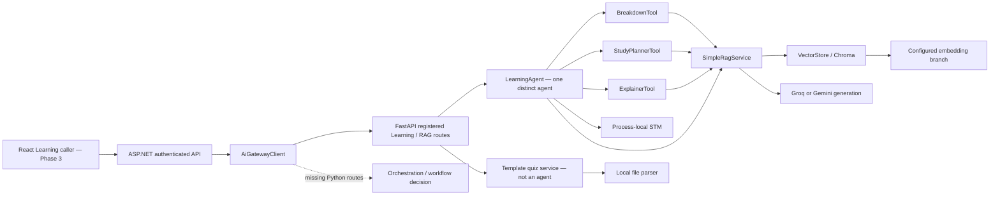
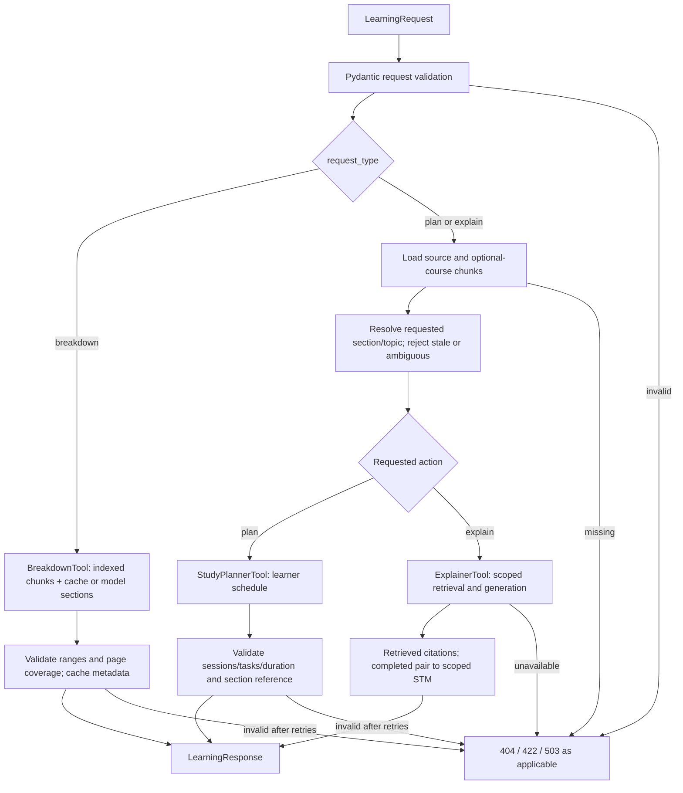
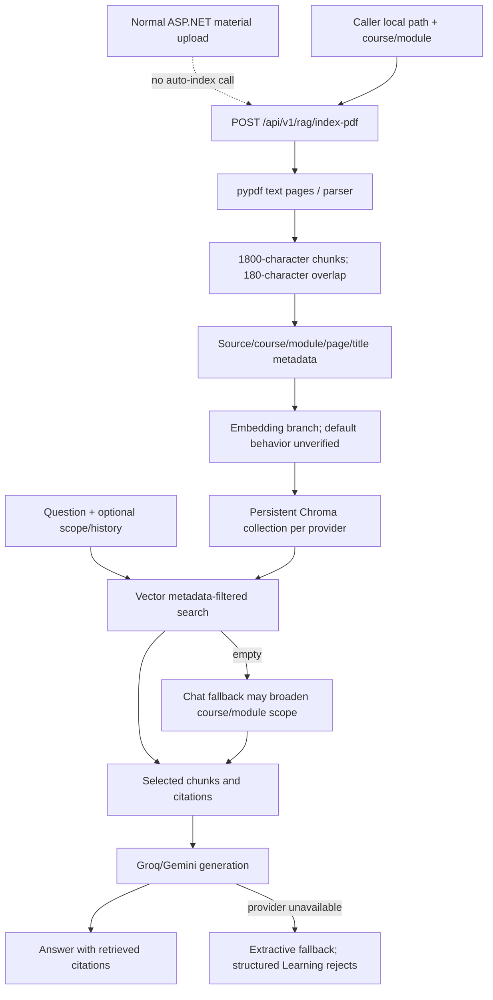
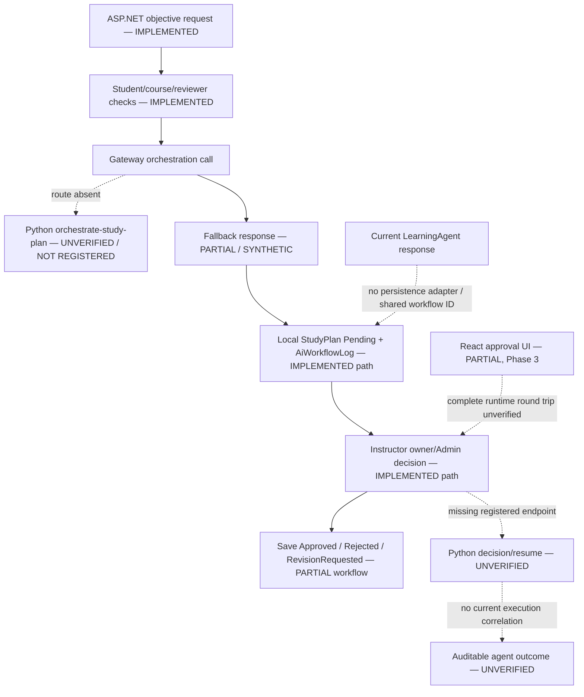

# Phase 5 — Agentic AI and RAG Source Verification

Prepared 2026-10-01. Priority Phase 5 only. Repository: `C:/Users/WAZNI/Desktop/SLIIT/PROJECTS/Y3/Y3-S1/SEF/PROJECTS/EduFlowAi/EduFlowAi`.

## 1. Scope and Verification Method

**Source conclusion:** one distinct Learning Agent exists, with three fixed tools and a RAG foundation. A distinct Quiz Generator Agent is not verified. No complete current workflow satisfies the official minimum assessed workflow: execution planning, distinct-role delegation, correlated durable state and high-impact approval are missing or disconnected.

This is a static source assessment, not runtime certification. Read meaningful current `ai-agent` modules, three test files, the specified current/member documents and the necessary ASP.NET AI gateway, review/student/internal-tool controllers, auth filter and entity definitions. Reused [Phase 0](00_REQUIREMENTS_AND_REPORT_MAP.md), [Phase 1](01_CURRENT_SCOPE_AND_EVIDENCE_PLAN.md), [Phase 2](02_BACKEND_DATABASE_SECURITY.md) and [Phase 3](03_REACT_WEB.md). No Git inspection, general frontend/mobile audit, legacy documents, dependency/generated/vector binaries, application execution, tests, indexing, external provider calls or database changes. No source files changed. Configuration variable names were inspected; actual secret values were not used as evidence.

Authority: official requirements preserved in Phase 0; current source over implementation claims in documentation. [API contracts](../current/API_CONTRACTS.md), [architecture](../current/CURRENT_ARCHITECTURE.md), [implementation status](../current/IMPLEMENTATION_STATUS.md), [RAG pipeline](../current/RAG_PIPELINE.md), [dual-agent plan](../current/DUAL_AGENT_RAG_PLAN.md) and [responsibilities](../current/RESPONSIBILITY_MATRIX.md) establish intended scope. The dual-agent plan's illustrative original body is superseded where its current notes say so.

Classification used throughout:

| Code | Meaning | Interpretation |
|---|---|---|
| A | VERIFIED IN SOURCE | Control flow, declarations or checks directly verified; does not mean executed successfully. |
| B | PRESENT IN SOURCE BUT RUNTIME NOT VERIFIED | Integration/provider/persistence mechanism exists; operation remains untested here. |
| C | PARTIAL | Useful implementation exists but the stated requirement is incomplete. |
| D | DOCUMENTED/PLANNED ONLY | Current documentation describes it without matching implementation. |
| E | NOT FOUND / UNVERIFIED | Not found in the bounded current source, or evidence unavailable. |

Negative findings concern this inspected current application, not hypothetical external services. “Agent” means an identifiable responsibility, input/output contract, controlled tools and visible workflow participation. Tools, labels and service functions are not counted as separate agents.

## 2. AI Service Structure

```text
ai-agent/
  main.py                         FastAPI app; singleton RAG and Learning Agent
  agents/learning_agent.py         LearningAgent; fixed request dispatch and chat
  agents/short_term_memory.py      process-local ShortTermMemory
  tools/breakdown_tool.py          BreakdownTool
  tools/planner_tool.py            StudyPlannerTool
  tools/explainer_tool.py          ExplainerTool
  tools/learning_support.py       context construction, provider/JSON validation
  models/schemas.py               Pydantic request/response and learning models
  rag/parser.py                   PDF / presentation / text extraction
  rag/chunker.py                  character windows and metadata
  rag/vector_store.py             Chroma persistence, embeddings and filtering
  rag/rag_service.py              RAG chat, provider calls, slide/quiz services
  tests/test_learning_agent.py    focused learning, scope, memory, provider tests
  tests/test_simple_rag.py        RAG/API integration-shaped test source
  tests/test_phase4_reliability.py obsolete core imports and local transition tests
  .env.example; requirements.txt  configuration names and dependencies
  setup_check.py; check_rag.py     diagnostics that can INDEX content
```

[main.py](../../ai-agent/main.py) registers routes directly; no extra router registration exposes a hidden multi-agent workflow. Provider logic lives inside RAG modules, not a separate agent. No current `core/` directory or `core/internal_auth.py` exists. No implemented LangGraph/orchestrator is found in the meaningful current source/dependency declaration.

Importing the application constructs the RAG/vector service: directory/collection creation and a configured Gemini embedding probe can occur. Therefore even a route-import or superficially small test was not run.

## 3. Registered FastAPI Endpoints

All handlers below are in [main.py](../../ai-agent/main.py). These are nine explicit application routes, excluding FastAPI's framework-generated documentation/schema routes. “Called by ASP.NET” means a matching gateway call exists, not a successful live round trip.

| Endpoint | Method | Handler / purpose | Called by ASP.NET? | Agent involved | Status |
|---|---|---|---|---|---|
| `/api/v1/agent/learn` | POST | `learn`: breakdown, plan, explain | Yes: `LearnAsync` | LearningAgent | A registered; B runtime |
| `/health` | GET | `health_check`: service/count response | No matching call in inspected gateway | None | A registered; not provider readiness |
| `/api/v1/ai/status` | GET | `ai_status`: status/count | Yes: `GetAiStatusAsync` | None | A registered; healthy/green/generation flags are constants |
| `/api/v1/rag/index-pdf` | POST | `index_pdf`: local file indexing | No index call in inspected gateway | None | A registered; B indexing |
| `/api/v1/rag/chat` | POST | `rag_chat`: scoped chat | Yes: `RagChatAsync` | LearningAgent.chat | A registered; B runtime |
| `/ai-coach-chat` | POST | `ai_coach_chat`: chat contract bridge | Yes: `ChatWithCoachAsync` | Same LearningAgent | A registered; not another agent |
| `/api/v1/rag/slide-decks` | GET | `list_slide_decks`: vector metadata discovery | Yes: `GetLearningSlideDecksAsync` | None | A registered; B store access |
| `/api/v1/ai/slides/categorize-topics` | POST | `categorize_topics`: slide-topic service | Yes: `CategorizeSlideTopicsAsync` | None | A registered; not an agent |
| `/api/v1/ai/slides/generate-quiz` | POST | `generate_slide_quiz`: template quiz service | Yes: `GenerateSlideRAGQuizAsync` | None | A registered; C meaningful generation |

[Gateway](../../backend/EduFlow.Infrastructure/Services/AiGatewayClient.cs) targets with **no current Python registration**: `/orchestrate-study-plan`, `/generate-adaptive-challenge`, `/generate-quiz`, `/api/v1/ai/questions/{id}/regenerate`, `/analyze-retention`, `/agents/topology`, `/workflows/execute`, `/workflows/{id}/decision`, `/tools/registry`, `/observability/metrics`, and `/api/v1/ai/quizzes/auto-grade`. These are obsolete/disconnected gateway concepts, not current Python endpoints. In particular, the gateway regeneration comment claiming route confirmation is contradicted by current registration. Gateway fallback JSON does not establish Python functionality.

The documented `/api/v1/agent/quiz`, `/api/v1/tools/breakdown`, `/api/v1/tools/planner`, `/api/v1/tools/explain` and `/api/v1/sub-lectures/{source_file}` are planned/unregistered API concepts. Tool classes are reachable internally through LearningAgent, not separately registered tool endpoints. Nothing was restored.

## 4. Distinct Agent Inventory

Contracts are in [schemas.py](../../ai-agent/models/schemas.py); implementations in [learning_agent.py](../../ai-agent/agents/learning_agent.py) and [rag_service.py](../../ai-agent/rag/rag_service.py).

| Candidate / source | Responsibility and input → output | Allowed tools / state | Workflow participation | Distinct? / reason |
|---|---|---|---|---|
| LearningAgent / `agents/learning_agent.py:LearningAgent` | Source-grounded tutoring; LearningRequest → LearningResponse; chat request values → RagChatResponse | Fixed BreakdownTool, StudyPlannerTool, ExplainerTool; RAG dependency; scoped STM and section metadata | Registered learn/chat/coach handlers execute its dispatch | **YES (A)**: identifiable tutoring role, contracts, fixed tool access and visible request workflow. Does not prove multi-agent compliance. |
| Quiz Generator / no dedicated module/class found | Intended assessment generation; actual GenerateSlideQuizRequest → GenerateSlideQuizResponse belongs to a service | No agent tool permissions/state; template locals only | Handler calls `SimpleRagService.generate_quiz` directly | **NO (E)** as distinct agent; C quiz service |
| Coach / `main.ai_coach_chat` | CoachChatRequest → CoachChatResponse adaptation | Same LearningAgent.chat and STM | Alternate route to same behavior | **NO (A)**: adapter, not distinct responsibility/tool boundary |
| Planner / `tools/planner_tool.py:StudyPlannerTool` | Lecture/topic context → student StudyPlan | RAG generation helper; request-local values | Called by LearningAgent | **NO (A)**: tool, not execution coordinator |
| Breakdown / Explainer tool classes | Lecture → sections; query/context → explanation/citations | Restricted code calls through LearningAgent | Internal tool calls | **NO (A)**: tools |
| RAG / `SimpleRagService`, `VectorStore` | Files/query → chunks, retrieval, answer, metadata | Chroma and model SDKs | Shared infrastructure | **NO (A)**: infrastructure/service |
| Domain Analysis / Action Agent | No current agent class or I/O contract found | No implemented per-agent tool scope | No current handoff found | **NO (E)**: labels/concepts |
| Validation / Safety Agent | Backend log/topology labels; no Python agent implementation | Deterministic tool validators are functions, not agents | No distinct execution participation | **NO (E)** |
| Coordinator / orchestration labels | Gateway routes/fallbacks and planned architecture | No executable plan/assignment state | Missing registered Python workflow | **NO (E/D)** |

Tool permissions for LearningAgent are constrained by fixed code dispatch rather than a dynamic capability registry. That is sufficient evidence of a limited distinct implementation, not of service-level authorization or the full assessed tool architecture.

## 5. Learning Agent

**A — distinct current implementation.** [LearningAgent](../../ai-agent/agents/learning_agent.py) constructs three tools and short-term memory. `POST /api/v1/agent/learn` accepts `request_type = breakdown | plan | explain`, required nonblank `source_file`, optional `course_id`, `student_id`, bounded `session_id`, `sub_lecture_id`, `topic`, `message`. Response contains request/source, sections, optional plan or answer, citations and a source label.

- **Breakdown:** calls BreakdownTool for indexed source/course; returns stable sections.
- **Plan/explain:** load indexed lecture chunks; no chunks raises missing-index failure. If a section/topic is requested, run/reuse breakdown, resolve a unique ID/topic/title, reject stale/ambiguous selections and constrain pages. This is conditional sequential tool orchestration.
- **Plan:** whole-lecture or selected-section context becomes a validated student study schedule.
- **Explain:** retrieves scoped chunks, generates an answer and attaches retrieved citations. Successful completed exchanges can enter STM.
- **Chat:** delegates to RAG chat with scoped history; chat and coach share the same agent. Prior questions influence retrieval; prior messages influence generation. Coach fields are an adapter, not a diagnostic weak-topic agent.
- **Scope caveat:** the learning tools use source plus optional course. Chat explicitly passes no course filter when a source filename is selected. Service-level empty-result fallback can broaden filtering (§13). Student/course claims are not authenticated by Python.
- **Failure:** invalid request/selection 422, missing lecture 404, unavailable structured generation 503; generic learning error maps to a safe 503. JSON/schema generation has at most two attempts (§15); provider fallback is separate.

The student schedule is not an agent execution plan, and calls between these tools are not delegation to distinct agents.

## 6. Learning Tools

[Support](../../ai-agent/tools/learning_support.py) centralizes context/provider/JSON handling.

| Tool / source | Purpose; allowed caller | Input and validation | Output contract | RAG dependency | Failure |
|---|---|---|---|---|---|
| [BreakdownTool](../../ai-agent/tools/breakdown_tool.py) | Group a lecture; fixed LearningAgent call path | Source/course; nonempty indexed chunks; validates section endpoints, ordering, nonoverlap and exact coverage of actual indexed pages | Validated LectureSection → SubLecture list, stable fingerprint/page IDs | All lecture chunks; LLM JSON; Chroma section-metadata cache | Missing index; invalid model JSON/sections retried then unavailable |
| [StudyPlannerTool](../../ai-agent/tools/planner_tool.py) | Create student schedule; fixed LearningAgent call path | Loaded chunks and optional selected section/topic; valid selection upstream; nonblank title/tasks; minutes 1–480 | StudyPlan with nonempty StudySession list; session numbers normalized; selected section ID enforced | Full or section-bounded context and provider generation | Invalid/empty/extractive output rejected; unavailable failure |
| [ExplainerTool](../../ai-agent/tools/explainer_tool.py) | Explain lecture topic/question; fixed LearningAgent call path | LearningRequest, selected section/history; nonblank question/topic; search then source/course/section/page checks | Answer plus SlideCitation list, assembled into LearningResponse | Top-four scoped search; provider text generation | No eligible chunks or unavailable provider fails safely |

“Allowed caller” is a code-path restriction, not an independently authenticated tool API. No Python route exposes arbitrary tool names or executes a model-specified arbitrary function.

Breakdown fingerprints sorted chunk identity/text/page data with SHA-256; cache requires matching fingerprint and section metadata, parsed as SubLecture. A process-local lock coordinates generation. Cache hits do not rerun the complete newly-generated page-coverage validator. Saving section metadata **mutates Chroma during ordinary learning requests** without re-embedding. This phase did not call those requests.

Support rejects context over 120,000 characters instead of silently truncating. The explainer prompt requests a short answer, but its word limit is not a deterministic output check.

## 7. Learning Memory and State

[ShortTermMemory](../../ai-agent/agents/short_term_memory.py) uses a locked dictionary of `deque(maxlen=3)`: **three completed question/answer pairs, six messages**, per scope.

| State type | Current contents / scope | Persistence and limitations |
|---|---|---|
| PROCESS-LOCAL MEMORY | Key: student_id, session_id, course_id-or-None, source_file-or-None, module_id-or-None | Missing/blank student or session disables storage. Restart clears it; instances do not share it. No TTL or cap on total scope keys. Caller IDs are not authenticated Python identities. |
| PERSISTENT VECTOR STORE | Documents, embeddings, course/module/source/page metadata | Chroma disk configuration exists (B); not a workflow ledger. |
| CACHED METADATA | Learning sections and content fingerprint on Chroma chunks | Potentially survives restart with same directory/collection; no time expiry; provider/collection dependent. |
| POSTGRESQL WORKFLOW STATE | ASP.NET StudyPlan/StudyPlanItem/AiWorkflowLog | Separate approval path; not correlated to current Python Learning sessions (§18). |
| REQUEST STATE | Selected section, retrieved context, parsed model output, returned student plan | Temporary; no current Python execution checkpoint or restart/resume mechanism. |

Chat records completed non-fallback answers; `rag_fallback` and `extractive_rag` do not enter memory. Failed explanations do not add pairs. Chat and explain share memory only when the scope tuple matches; module-specific chat and explanation without module do not necessarily share a key. Source/course filters and memory scoping are different mechanisms.

## 8. Quiz Generator Agent

**DISTINCT QUIZ GENERATOR AGENT NOT VERIFIED.** No dedicated current agent module, planning loop, permission boundary, tool set, memory or distinct-agent test was found.

The actual [`SimpleRagService.generate_quiz`](../../ai-agent/rag/rag_service.py) is a template service reached by the registered slide-quiz handler:

| Aspect | Source behavior / classification |
|---|---|
| Contract | GenerateSlideQuizRequest accepts optional local slide_path/module_id/module_title, topics, integer question count and difficulty string; GenerateSlideQuizResponse returns IDs/title/topics/difficulty/points/questions/status. A |
| Generation | Parses a supplied existing file; samples/reuses pages and constructs generic primary-role questions, fixed distractors and correct_index=0. No LLM generation or vector retrieval in this method. A |
| Missing material | Uses a generic dependency-inversion template, including when no pages are available. Can return apparently ready output instead of a failure. A / C meaningful content |
| Scope | Module ID is not forwarded into generation by the handler; target topics do not enforce page selection when pages exist. No enrolled-course boundary. C |
| Difficulty | Echo/title use, not verified difficulty adaptation. C |
| Validation | Pydantic shape, but no semantic correctness/deduplication validation; validation_passed=True and status=Ready are asserted. C |
| Counts | num_questions has no positive bounded constraint; zero can divide by zero with pages; excessive count can repeat page-based questions. C |
| Planning/tools | No agent execution plan, delegation or controlled agent tools. E |
| State | Random quiz/workflow IDs in response are not stored as correlated execution state. E |
| Publication/review | ASP.NET/React assessment features from Phases 2–3 exist separately; no proven current Python generate → validated draft → durable approval/publication workflow. C/E |
| Tests | No dedicated distinct quiz-agent or generation-quality suite in inspected AI tests. E |

The endpoint name and `source=rag` response label are not proof of RAG-based quiz generation, grounded correctness or a second agent.

## 9. Planning and Delegation

| Required behavior | Current finding |
|---|---|
| Parse a domain objective into executable work | Learning accepts a request-type literal and query/topic; no execution-objective decomposition. E |
| Structured multi-step execution plan | StudyPlan is a learner schedule, not steps assigned to agents/tools with execution status. E |
| Agent assignment / handoff | No current assignment schema or distinct-role handoff. E |
| Sequential / parallel delegation | Fixed LearningAgent calls to tools exist; no agent-to-agent delegation. E |
| Completion tracking / resume | No durable current step tracking or checkpoint resume. E |

The gateway's orchestration/workflow URLs and hardcoded topology cannot fill this gap. Framework choice is flexible under the specification; absence of a particular framework is not itself a failure. Absence of the required behavior is.

## 10. Controlled Tool Architecture

**C — partial overall.** Actual enforced dispatch is the LearningRequest literal and fixed Python branches to three known tools; their model cannot dynamically request arbitrary functions. This is stronger than a displayed tool list, but there is no independent per-agent capability registry, authenticated Python caller permission check, general execution budget or audit trail.

The ASP.NET [InternalAiToolsController](../../backend/EduFlow.Api/Controllers/InternalAiToolsController.cs) exposes six read-oriented categories under `/internal/ai-tools`: curriculum hierarchy, curriculum content, existing questions, student progress, assessment results and gamification. No current Python call to those endpoints was found. Do not count these as executed Learning tools.

The [InternalServiceAuthFilter](../../backend/EduFlow.Api/Filters/InternalServiceAuthFilter.cs) checks the internal header only when the expected key is configured; absent configuration fails open. A static gateway tool-registry fallback is display data, not runtime enforcement.

Schema/selection/output checks exist for Learning tools. LLM calls have bounded timeout/fallback behavior (§14), but there is no overall per-workflow deadline or bounded embedding operation demonstrated. The indexing/path and identity boundaries remain incomplete (§16).

## 11. RAG Architecture

**A — RAG implementation exists; B — configured end-to-end operation not verified.** [Parser](../../ai-agent/rag/parser.py) → [chunker](../../ai-agent/rag/chunker.py) → [vector store](../../ai-agent/rag/vector_store.py) → [RAG service](../../ai-agent/rag/rag_service.py) implements extraction, metadata, embeddings, persistence, retrieval, provider generation and citations.

- PDF extraction uses `pypdf.PdfReader`, page-based text extraction and one-based page numbers; first nonempty line supplies a title (truncated to 100 characters). No OCR pipeline was found.
- Presentation handling uses ZIP/XML. Both `.pptx` and `.ppt` are routed there; this is not verified support for binary legacy PPT. Other extensions use a text fallback. Parser exceptions can print a diagnostic and return empty/partial pages.
- Chunking preserves short pages; long pages use **1,800-character windows with 180-character overlap**. Token-count comments are approximations, not an actual tokenizer. Prefixes contain slide/page/title; blank text is skipped.
- Chunk metadata includes source filename, course, optional module, page, title and chunk index.
- Chroma `PersistentClient` uses `CHROMA_PERSIST_DIR` or the source-derived default `ai-agent/data/chroma_db`. Collection `eduflow_materials_{active_provider}` uses cosine distance. Separate provider names mitigate provider-dimension mixing, but model/version is not part of the collection name.
- Configured Gemini embeddings use `models/gemini-embedding-001`. Initialization probes embedding availability. The fallback/default branch returns `None` and passes it explicitly as `embedding_function` to Chroma. Comments intend default local ONNX/all-MiniLM behavior, but that behavior is **not verified by this source review**; no explicit default embedding-function construction is present. Deterministic test embeddings do not prove this production branch works.

No vector binaries or live collection were opened. Missing/incompatible stores and actual installed-library behavior require isolated Phase 6 verification.

## 12. PDF Indexing Pipeline

`POST /api/v1/rag/index-pdf` accepts [IndexPdfRequest](../../ai-agent/models/schemas.py): local `file_path`, required `course_id`, optional `module_id`. The service checks existence, parses, chunks and upserts; source_file is derived from the file basename. The schema describes an absolute path, but code does not enforce an approved root or a trusted upload-to-path mapping.

Response gives status, filename, pages, chunks, course/module and message. No usable parsed pages can produce a warning; blank pages can yield zero chunks. Parser failures may become empty results rather than a complete transactional failure.

**NORMAL UPLOAD AUTO-INDEXES: NO.** Phase 2 and current RAG documentation show that regular ASP.NET material upload does not invoke this index endpoint. The inspected gateway has no indexing method. A comment claiming upload automatically indexes does not override the current call path.

Re-index limitations:

| Area | Actual source behavior | Implication |
|---|---|---|
| IDs | Course + module-or-nomod + page + chunk index; no source filename | Two files in the same course/module can overwrite matching IDs. |
| Upsert | Inserts/replaces matching IDs | Not a versioned atomic whole-document replacement. |
| Shortened replacement | No removal of old trailing chunks in `index_file` | Stale chunks can survive a shorter re-index. |
| Delete helper | `delete_module_chunks` exists but indexing does not call it; deletion errors are caught | Helper existence is not proof of cleanup. |
| Persistence | Disk-backed configuration, provider-specific collection | Actual populated store, deployment mount and restart persistence unverified. |
| Scripts | `setup_check.py` and `check_rag.py` call `index_file` | They are mutating diagnostics; neither was run. |

## 13. Retrieval, Grounding and Citations

[VectorStore.search](../../ai-agent/rag/vector_store.py) builds metadata conditions. With source_file it applies source plus optional course; module filtering is bypassed in that branch. Without source, course/module can be combined. Optional sub-lecture filtering is additional. Search limits results by requested top-k and collection count; no minimum semantic-relevance threshold is enforced. Relevance is clamped/rounded from `1 - distance`, not measured answer correctness.

[SimpleRagService.chat](../../ai-agent/rag/rag_service.py) requests at least four candidates (`max(4, max_citations)`), then uses only the first requested citation count in context/citations. Default citation count is three; its schema has no positive upper/lower bound.

**Scope limitations are material:**

1. LearningAgent.chat drops course filtering when source_file is provided.
2. Empty source-scoped retrieval retries with source alone, removing course/module constraints.
3. Empty non-source retrieval can retry without any course/module filter.
4. This is deliberate no-result broadening in the service; the vector-store exception path itself is not an unfiltered retry.
5. Source filenames are not globally unique authorization boundaries. Python does not verify enrollment.
6. Learning tools are stricter: source/optional course and section/page postchecks constrain explanation evidence.

`get_lecture_chunks` loads and sorts all matching source/optional-course chunks. Deck discovery groups by filename alone, can merge identical names across courses, excludes certain text/mock names and exposes chunk counts, not page counts. It is not enrollment-filtered.

Citations contain retrieved page, filename, preview and relevance. They substantiate where context came from, not that every generated claim is entailed. Chat's nonempty confidence value (0.96) is fixed; it is not a calibrated evaluation result. Empty retrieval returns a no-content `rag_fallback`; provider failure can return a short extractive context snippet labelled `extractive_rag`. Neither is counted as a successful memory exchange. Structured Learning tools reject extractive generation.

## 14. Model / Third-Party Providers

Source-supported integrations and default model names are below. Actual environment selections, credentials, network access and deployment behavior were not verified. No secret values are reported.

| Provider | Purpose / configuration names | Timeout / retry | Fallback and error handling | Data sent | Status |
|---|---|---|---|---|---|
| Groq SDK | Text generation when selected; LLM_PROVIDER, GROQ_API_KEY, GROQ_MODEL; default `openai/gpt-oss-120b` | Client timeout 30 s; max_retries=0; generation token limit | On failure, warning by exception type; try Gemini when configured, otherwise extractive fallback | Prompt, question, retrieved lecture excerpts and conversation history where supplied | B |
| Google Gemini generation | Text generation; LLM_PROVIDER, GEMINI_API_KEY, GEMINI_MODEL; default `models/gemini-flash-latest` | 30 s request timeout; token limit; no explicit application control proving all SDK-internal retries disabled | Provider error → extractive fallback; structured Learning support rejects it | Prompt/context/history | B |
| Google Gemini embedding | Gemini embedding function; EMBEDDING_PROVIDER, GEMINI_API_KEY; `models/gemini-embedding-001` | No explicit embedding timeout/retry bound found | Initialization probe failure falls back to default branch; operational errors may surface to handler | Indexed document chunks, retrieval query; startup probe text | B / C fallback |
| Intended Chroma default embedding | EMBEDDING_PROVIDER/default branch; no remote API key required by that branch | No source-level bound established | Explicit `embedding_function=None`; comments alone do not verify automatic local embedding | Intended local chunk/query embeddings | C / runtime unverified |
| ChromaDB | Persistent vector storage; CHROMA_PERSIST_DIR | Local SDK operations; no overall workflow timeout | Collection/provider selection; selected operations catch errors | Text, vectors and metadata on disk | B; not an external hosted service claim |

Generation temperature is 0.2. Older comments mentioning different model names are not configuration evidence. Groq→Gemini fallback applies when Groq is selected/configured; do not claim a universal bidirectional fallback chain.

These SDK integrations can support meaningful third-party-service evidence once a safe live integration, configuration, error path and deployment are demonstrated in Phase 6. They do not yet prove operational availability, cost, privacy compliance or model quality.

## 15. Structured Output and Deterministic Validation

| Check | Deterministic evidence | Limit |
|---|---|---|
| Request schemas | Pydantic types; learning request-type literal; nonblank source; bounded session length | Not authorization; several RAG/quiz count/path fields are weakly constrained. |
| Model JSON | Support strips code fences and parses/validates structured output; at most two generation attempts for JSON/schema failures | Provider-unavailable failure can exit immediately; not a durable retry log. |
| Breakdown business rules | Valid page endpoints, ordered ranges, no overlapping covered pages, exact coverage of indexed page set; nonblank titles/topics | Checks organization/coverage, not semantic section quality. Cached path does not repeat full generation-time coverage checks. |
| Stable section reference | Content fingerprint and generated section IDs; unique current ID/topic/title resolution | Caller needs a current section; stale/ambiguous input rejected. |
| Study schedule | Nonempty title/sessions/tasks; minutes 1–480; normalized session numbers and enforced selected-section reference | No deterministic pedagogic quality or semantic grounding check. |
| Explanation | Valid nonblank question; retrieved source/course/section/page postfilter; actual citation metadata | Text is model-generated; word limit and factual entailment are not deterministic checks. |
| Context size | Rejects more than 120,000 characters | Not a tokenizer-based model-window guarantee. |
| Quiz | Response/question shape only | validation_passed=True is not a real validator; no correctness, difficulty, uniqueness or option-index business checks demonstrated. |
| Backend review | Role/ownership and accepted decision handling | No complete legal transition machine or current Python resume correlation. |

Deterministic validation is therefore **YES for Learning schemas and selected rules; C for the assessed workflow as a whole**. Model instructions/self-checking are not deterministic evaluation. After malformed structured generation exhausts its bounded attempts, Learning returns unavailable rather than a fabricated valid plan.

## 16. Prompt, Tool and Service Security

| Boundary | Actual source finding | Classification |
|---|---|---|
| Prompt injection | Learning support tells the model to treat lecture context as reference material and to stay grounded | C: useful instruction, no tested injection-resistance guarantee or comprehensive content isolation |
| Tool selection | Fixed request dispatch and fixed tool objects; no arbitrary model-selected executable function | A limited control; C complete least-privilege system |
| File paths | Indexing/categorization/quiz accept local caller-supplied paths; existence check, no approved-root/symlink/type allowlist enforcement found | C / missing access boundary |
| Student/course IDs | Accepted from caller; Python does not resolve JWT identity, enrollment or ownership | E Python authorization |
| Python internal key | INTERNAL_SERVICE_TOKEN appears in example config, but current main/agent/RAG code does not enforce it; no auth dependency/middleware found | E enforcement |
| ASP.NET internal key | Configured-key header comparison exists; missing expected key allows request | C, fail-open configuration |
| Cross-origin | FastAPI permits wildcard origins/methods/headers and credentials | A declaration; not a service authentication control |
| Output checks | Stronger Learning shape/scope rules; weak quiz and chat semantic controls | C |
| Secret handling | Environment-variable configuration; actual keys not inspected/disclosed here | B operational secret protection; repository/deployment-wide secret audit not performed |
| Time/resource limits | Generation timeouts, bounded JSON attempts; no overall workflow deadline, bounded embedding request, STM key cap or rigorous count/path resource limit found | C |
| Error disclosure | Learn handler sanitizes generic failures; other handlers can include exception strings in HTTP 500 detail | C; internal details may reach caller |

ASP.NET's authenticated client boundary improves that path, but does not prove the Python service is unreachable directly in deployment. No offensive testing was performed. Cross-course fallback, path restrictions, internal authentication and prompt-injection evaluation need explicit later evidence.

## 17. Human Approval Integration

**C — ASP.NET approval pieces exist; no fully correlated current Learning workflow.** Evidence: [AiReviewController](../../backend/EduFlow.Api/Controllers/AiReviewController.cs), [gateway](../../backend/EduFlow.Infrastructure/Services/AiGatewayClient.cs), [entities](../../backend/EduFlow.Core/Entities/Entities.cs), plus Phase 3 for the React boundary.

| Stage | Current source behavior | Result |
|---|---|---|
| Objective submission | ASP.NET checks student existence/role and course ownership or admin access | Actual authorized backend path |
| Python orchestration | Gateway calls `/orchestrate-study-plan`, which is not registered | Missing link; gateway can synthesize fallback |
| Persistence | Backend creates its own StudyPlan GUID, Pending status and items; records an AiWorkflowLog | Durable backend records in source, not proof of current agent execution |
| Contract | Review path expects schedule/day_number/activity_title-style output; current Learning plan is title/sessions | No matching current persistence adapter demonstrated |
| Correlation | Backend workflow/log identifiers and plan ID are created locally; Learning response supplies no matching durable workflow ID | No end-to-end correlation |
| Reviewer | Instructor course ownership or Admin checked on backend review path | A authorization, B runtime |
| Approve/reject/revise | Local statuses Approved / Rejected / RevisionRequested; reviewer notes/timestamp fields | Actual local handling; no strict prior-state transition enforcement found |
| Python decision | Gateway posts to absent `/workflows/{id}/decision`, using local plan ID | Missing resume/decision implementation |
| Failure | Gateway decision fallback can say APPROVED regardless of requested action; backend can still save local decision/notify | Cannot use fallback as agent approval evidence |
| Resume/outcome | No current Python paused high-impact action, resumed agent execution or final correlated outcome | E |
| React | Phase 3 found local/error-tolerant approval operations and synthetic identifiers in parts of UI | C; UI state alone is insufficient |

The current LearningAgent request does not pause a defined high-impact operation or persist its returned study plan into this review flow. There is no complete safe human-in-the-loop chain even though the backend can persist an authorized local decision.

## 18. Durable Workflow State

The following compares the **same required assessed workflow**, not an aggregate of unrelated stores. Entity declarations and saves are source evidence; actual PostgreSQL contents/restart durability were not tested.

| Required state field | Where stored / actual evidence | Durable? | Status | Gap |
|---|---|---|---|---|
| Workflow ID | AiWorkflowLog.WorkflowId; StudyPlan.Id; random quiz response workflow_id | Backend record intended durable; quiz response no | C | No common ID linking Learning request/tools/approval/outcome |
| Objective | StudyPlan.TargetGoal; Learning request question/topic | Backend target intended durable; request no | C | No correlated execution objective |
| Plan | Backend StudyPlanItems; Learning StudyPlan.sessions | Backend schedule intended durable; returned Learning plan no | C | Neither is a persisted current agent execution plan |
| Completed steps | StudyPlanItem.IsCompleted | Backend learner activity flag intended durable | C | Not agent/tool step execution or checkpoint status |
| Tool results | AiWorkflowLog.InputPayload/OutputPayload; Chroma section cache | Backend payload / metadata can persist | C | No current per-tool execution results linked to assessed workflow |
| Validation results | AiWorkflowLog.ValidationPassed/ValidationErrors; Learning validators run in memory | Backend fields intended durable | C | Review path sets success values rather than recording current Learning validator events |
| Errors | ValidationErrors field; HTTP errors and console diagnostics | Field can persist; current Python diagnostics not durable workflow state | C | No linked structured error/retry history |
| Approval status | StudyPlan.Status, notes, reviewer and approval timestamp | Backend intended durable | C | No paused current agent action or resume correlation |
| Final outcome | Local review status and request response | Some local records persist | C/E | No auditable final outcome for one complete assessed workflow |

Chroma document vectors/section metadata are **not durable Agentic workflow state**. STM is process-local; Python request locals are transient. The presence of all these mechanisms does not make the required combined ledger exist.

## 19. Observability

| Signal | Current evidence | Evidence quality |
|---|---|---|
| Execution summaries | API response fields and source labels | Actual response construction; not a persisted execution summary |
| Agent/tool traces | No current correlated Python step/tool event stream found | E; topology/registry display is not trace execution |
| Timing | Review log writes ExecutionTimeMs=380 | **HARDCODED**, not measured |
| Validation | Review log success assignment; quiz validation_passed=True | **HARDCODED**, not a validator result |
| Errors | Selected print/warning calls, HTTP status/detail | Actual diagnostic paths; no structured durable workflow/error chain |
| Retries | Bounded JSON loop and provider fallback logic | Actual code; no stored attempt/timing evidence |
| Approval decisions | Backend local state/reviewer fields | Actual persistence path, disconnected from current Python |
| Final outcome | Returned responses/local status | No unified outcome record |
| Health/status | Count read plus constant healthy/green/can_generate values | Count is a store query; flags are **HARDCODED**, not model readiness |
| Dashboard telemetry | Synthetic/fallback topology, metrics and traces documented in Phases 2–3 | **SYNTHETIC / PLACEHOLDER**; not measured evidence |

**Actual observability: PARTIAL.** Do not present a polished dashboard, a constant confidence score or a fixed duration as an observed agent trace.

## 20. Safe Failure and Fallback Behavior

| Trigger | Current response | Safe recorded failure or fallback? |
|---|---|---|
| Provider unavailable / generation timeout | Groq may fall back to Gemini, then extractive text; Learning rejects extractive generation and returns 503 | Learning has safe HTTP failure; not a durable workflow failure record |
| Malformed model JSON/schema | Up to two structured-generation attempts; reject exhausted invalid output | Deterministic bounded failure, not persistent recovery history |
| Empty retrieval | No-content rag_fallback after possible filter broadening | Explicit fallback label, but scope broadening is a security gap |
| Missing Learning index/source | FileNotFoundError → 404 | Clear request failure; no durable assessed-workflow error |
| Missing index path | Index endpoint 404; parser exceptions may yield empty/warning result | Partial failure reporting |
| Missing quiz material | Generic ready quiz may still be returned | **SYNTHETIC SUCCESS FALLBACK**; not safe recorded failure |
| Invalid request/type/session | Pydantic HTTP 422 | Clear boundary rejection |
| Invalid section/topic/tool output | Rejection/ValueError 422 or structured-generation unavailable 503 | Useful deterministic validation |
| Unknown action/route | Literal request rejection or unregistered route 404 | No general unsupported-workflow action protocol |
| Approval service failure | Missing decision endpoint; gateway fallback can claim APPROVED, local backend state still saved | **SYNTHETIC SUCCESS FALLBACK**; not verified agent decision |
| Other RAG service exceptions | HTTP 500 can include exception string | Error signal, but sanitization/durable recording incomplete |

**Safe recorded failure behavior: PARTIAL.** Some current requests fail explicitly and safely; there is no durable, correlated assessed-workflow record proving recovery or final failure. An extractive answer is not a successful structured plan, and a synthetic success must not count as a passed workflow.

## 21. AI Test Source Inventory

**No tests were executed in this phase.** “TEST SOURCE EXISTS” is the status, not “TEST PASSES.”

| Test file | Area | What it tests | Mock/live? | What it could prove | Execution status |
|---|---|---|---|---|---|
| [test_learning_agent.py](../../ai-agent/tests/test_learning_agent.py) | Learning, RAG scope, provider errors, memory, validation | Breakdown caching/page ranges; full/topic planning; explanation/citations; 422/404/503; stale topic/wrong course; route calls; vector exception scope; three-pair STM/isolation/stateless/fallback behavior; mocked provider paths | Deterministic embeddings, temporary Chroma and mocked generation; patched app service. Test naming does not make model calls live | Contract/control-flow and selected deterministic safeguards in isolation | TEST SOURCE EXISTS; not run |
| [test_simple_rag.py](../../ai-agent/tests/test_simple_rag.py) | Parser/chunker/store/chat/API | Basic document ingestion, retrieval, chat and health-style assertions | Mixed integration-shaped tests; globally imports app; provider is not consistently forced/mocked | Could exercise configured RAG, but requires controlled environment and scrutiny of assertions | TEST SOURCE EXISTS; not run; potential provider calls/store mutation |
| [test_phase4_reliability.py](../../ai-agent/tests/test_phase4_reliability.py) | Old error/retry/observability and transitions | Imports core.errors/core.retry/core.observability; transition tests use a local dictionary | Missing current core modules; transition data is test-local | Does not prove current workflow state machine; missing imports block ordinary current-tree collection | TEST SOURCE EXISTS but stale/incompatible; not run |

The simple RAG tests can initialize the configured singleton and their own disk stores; fixtures do not make all model calls or indexing harmless. They must not be run blindly in this restricted phase. `setup_check.py` and `check_rag.py` are mutating diagnostics, not passing-test evidence.

[Member Learning test evidence](../members/member-1-wazni/ai/LEARNING_AGENT_TEST_EVIDENCE.md) records dated 2026-09-28 results, with a recorded source baseline and additional working-tree test changes. Treat that as **historical evidence**, not a current rerun or a complete acceptance evaluation.

No complete golden objective→plan→delegation→tools→durable state→approval→outcome case was found in current test source. No dedicated distinct Quiz Generator Agent quality suite, complete prompt-injection resistance suite, actual per-agent permission enforcement suite or restart/recovery acceptance suite was verified.

## 22. Official Minimum Assessed Workflow Gap Analysis

Authority: the official specification's §9.1 and evaluation requirements as preserved in [Phase 0](00_REQUIREMENTS_AND_REPORT_MAP.md). Its minimum acceptance rule requires **one complete workflow satisfying every step**, not separate unrelated features.

| Official requirement | Actual source evidence | Classification | Missing | Claim permitted in final report? |
|---|---|---|---|---|
| Domain objective | Learning request/topic/query; separate backend TargetGoal | C | Current objective driving a complete assessed execution | Domain tutoring requests only |
| Structured multi-step execution plan | Student StudyPlan schedule | E for execution planning | Executable steps, assignments and dependencies | No |
| Delegation to distinct roles | One agent calls tools | E | Agent-to-agent roles/handoffs | No |
| Distinct agents | LearningAgent meets limited distinct-role criteria | A one; E standard count | More distinct implemented agents / written approved adjustment | One only |
| Controlled allow-listed tools | Fixed three-tool dispatch | C | Complete per-agent/service authorization and audit controls | Limited fixed tool access only |
| Validated tool inputs | Learning schemas, current selection checks | A/C | Comprehensive authorization/path/resource checks | Specific Learning validators only |
| Structured tool outputs | SubLecture/StudyPlan/citations | A | Complete assessed execution-result contract | Learning output schemas only |
| Persisted workflow state | Disconnected PG records, Chroma metadata, local memory | C | All nine fields correlated for current workflow | Storage distinctions only; no complete ledger |
| Deterministic validation | Page coverage, schema, selection and duration checks | A/C | End-to-end execution validation/result persistence | Specific checks only |
| Business-rule validation | Learning page/scope rules; backend ownership | C | Complete action/quiz/workflow rules | Named rules only |
| Human approval | Backend local approve/reject/revise path | C | Pause a defined current high-impact action and resume after decision | Local review implementation only |
| Authorized reviewer | Backend owner/admin checks | A/B | Live proof and current-agent linkage | Source authorization only |
| Observability | Diagnostics and local records; synthetic fields elsewhere | C | Measured correlated tools/timings/errors/retries/decisions/outcome | Diagnostic limits only |
| Errors/retries | Bounded JSON attempts and provider fallbacks | C | Durable attempts, recovery and audit-safe terminal failure | Bounded source behavior only |
| Final result | Learning responses | C | Auditable complete assessed result | Request output only |
| Safe failure | Learning 404/422/503; synthetic quiz/approval fallback | C | Clearly recorded durable workflow failure; remove misleading success paths | Specific HTTP failures only |
| Prompt/tool security | Grounding prompt, static tool calls, selected validators | C | Enforced Python identity/key, strict scopes/paths, injection and permission evidence | Partial controls only |

**Minimum assessed workflow currently satisfied by source: NO.** RAG plus a capable tutoring agent does not supply the missing execution planning, delegation, durable state and correlated approval chain. Runtime evidence remains necessary even for source-present features. Standard four-agent compliance and individual distinct-agent contributions also remain unresolved (§23–24).

## 23. Agent Count / Scope Adjustment Issue

| Count/category | Finding |
|---|---|
| Documented intended distinct agents | **2**: Learning Agent and Quiz Generator Agent |
| Distinct implemented agents found | **1**: LearningAgent |
| Partially implemented distinct agents | **0 verified as distinct partial agents**; the quiz service is partial functionality, not an agent implementation |
| Service functions that are not agents | Chat/coach adaptation, topic categorization, template quiz generation and RAG indexing/retrieval services |
| RAG foundation | **NOT AN AGENT** |
| Standard official requirement | At least four distinct agents for the standard four-student group; adjusted contributions/scope require written lecturer confirmation |
| Current team documentation | Three-member responsibilities and an intended two-agent direction; not evidence of a lecturer waiver |

**TEAM / LECTURER CONFIRMATION EVIDENCE REQUIRED.** No authentic written lecturer adjustment was established from the authorized current/member evidence read for this phase. The team must supply it; neither an internal plan nor a status label proves external approval. Even approval of a two-agent scope would not implement the missing Quiz Generator Agent or remove the complete minimum-workflow requirement without an explicit applicable clarification.

## 24. Member AI Contribution Relevance

| Member | RELEVANT TO DOCUMENTED RESPONSIBILITY | Current evidence and limitation |
|---|---|---|
| Wazni | LearningAgent, BreakdownTool, StudyPlannerTool, ExplainerTool, STM; ASP.NET/React Learning integration documented in Phases 2–3 | Strongest current distinct-agent source evidence; [Learning member document](../members/member-1-wazni/ai/LEARNING_AGENT.md) and dated tests support responsibility context, not exclusive authorship or current runtime success |
| Raashidh | Quiz/assessment AI and intended Quiz Generator Agent | [Member 2 responsibility](../members/member-2-raashidh/README.md) is relevant; current template quiz service is present, dedicated agent remains unverified |
| Atheek | RAG parser/chunker/vector store/retrieval/provider foundation | [Member 3 responsibility](../members/member-3-atheek/README.md) is relevant; valuable infrastructure contribution does not automatically satisfy an individual distinct-agent requirement |

No Git authorship or contribution attribution was audited. Phase 7 must establish contribution evidence and students must explain/debug their work in the viva. No student's personal AI-use reflection is written here.

## 25. Source-Derived Diagrams

Solid arrows show current source call/data paths, **not runtime certification**. Dashed arrows mark planned/missing/correlational links. Browser/backend integration relies on the bounded evidence in Phases 2–3.

### A. Actual AI/RAG architecture



### B. Learning Agent flow



This is one agent dispatching tools, not a multi-agent execution plan.

### C. RAG indexing/retrieval flow



### D. Human approval workflow



The local save path does not establish a paused agent action, a Python decision or safe resumption.

## 26. Confirmed Strengths

- One identifiable Learning Agent with explicit request/response contracts and a restricted, fixed tool dispatch.
- Useful deterministic Learning checks: page coverage/ranges, current topic/section selection, structured schedules and failure handling.
- Source-grounded retrieval, actual page/source citation construction and content-fingerprint section caching.
- Scoped three-pair conversation memory with unsuccessful/fallback exchanges excluded.
- Registered Learning/RAG gateway paths that preserve important downstream error statuses, unlike several older synthetic fallback paths.
- Readable test sources exercising contract, validation, memory and scope behavior under controlled embeddings/models.

These are source strengths. They do not certify runtime availability, benchmark quality, safe deployment or full assignment compliance.

## 27. Gaps / Partial / Unverified Areas

| Priority | Gap | Evidence needed later |
|---|---|---|
| Critical | One distinct agent; no verified Quiz Generator Agent; team/agent waiver missing | Implemented distinct responsibilities/contracts/tools/workflow evidence and authentic written scope confirmation |
| Critical | No structured agent execution plan or delegation | Complete current workflow with step assignments and handoffs |
| Critical | No correlated durable ledger and human-approved resume | Same workflow ID across objective, plan, tools, validators, reviewer and outcome; restart/failure evidence |
| High | Synthetic success/telemetry in quiz and disconnected gateway paths | Real validators, measured events and explicit unavailable/failure states |
| High | Python auth absent; internal ASP.NET filter can fail open | Enforced configured boundary, reviewer/identity and direct-service tests |
| High | Caller file paths and cross-course retrieval broadening | Trusted upload/path mapping, scope controls and negative tests |
| High | Default embedding function behavior and re-index collisions/stale tails | Controlled isolated embedding/index/retrieval tests; safe replacement evidence |
| High | Weak quiz quality, scope, count/difficulty and deduplication controls | Real generation/validation/evaluation and publication correlation |
| Medium | No complete golden acceptance/injection/recovery suite | Deterministic acceptance assertions plus human review; no model judge alone |
| Medium | STM is process-local/unbounded by key count; errors not durable | Explicit limits/retention, instance behavior and audit design |
| Unverified | Active providers, deployment, persistence mount, latency/cost and operational tests | Phase 6 runtime/deployment evidence |

This phase records deficiencies; it does not authorize or implement fixes. No missing agent was invented and no obsolete endpoint was restored.

## 28. Evidence / Screenshot Plan

Seven high-value later captures; none was fabricated here. Capture exact request context, timestamp and associated real response/log where appropriate, with secrets and personal data redacted.

| Figure | What must be shown | Claim supported | What must NOT be synthetic | Runtime verification needed? |
|---|---|---|---|---|
| AI-1 | Controlled indexed deck discovery plus source/course/module/page metadata from an authorized existing or isolated fixture | Index/retrieval provenance and actual store contents | Hardcoded deck list, invented chunk/page counts | Yes; indexing needs a separately authorized safe environment |
| AI-2 | Breakdown output with source PDF pages and section coverage/stable IDs | Learning tool and deterministic organization | Handwritten sections presented as model/tool execution | Yes; retain raw request/response and validator evidence |
| AI-3 | Topic-specific plan and explanation with selected section and resolvable page citations | Scope and Learning output contracts | Generic quiz/plan fallback, invented citation or uncalibrated confidence as quality proof | Yes |
| AI-4 | Real measured Learning tool/provider event evidence with request correlation, duration, validation/error attempts | Actual execution/observability | Fixed 380 ms, static topology or synthetic traces | Yes; complete trace may require implementation before capture |
| AI-5 | Current quiz request/result with source comparison and deterministic correctness/duplicate checks | Honest quiz-service behavior and limitations | Ready/validation_passed labels alone as an agent-quality claim | Yes; do not caption as a distinct agent until implemented |
| AI-6 | One durable workflow before and after authorized approve/reject/revise, same ID, actual Python pause/resume/result | Complete approval/correlation | Local-only UI success, fallback APPROVED, unrelated PG record | Yes; **currently blocked by missing workflow integration** |
| AI-7 | Controlled provider/malformed-output/missing-source failure with HTTP result and genuine recorded workflow error if implemented | Safe failure and bounded recovery | Successful fallback presented as recorded failure; invented logs | Yes; current HTTP behavior can be captured, durable workflow claim remains blocked |

Screenshots support a reproducible trace; they do not replace raw assertions, test output or durable records. Golden evaluation must additionally cover execution planning, delegation, tool selection, business rules, approval enforcement, injection resistance and recovery.

## 29. Evidence Inputs for Final Report

| Final-report section | Evidence-safe input from this phase | Limit / later supply |
|---|---|---|
| **G3 Integrated Architecture** | Actual React→ASP.NET→FastAPI Learning/RAG boundary; one Learning Agent; fixed tools; Chroma; Groq/Gemini SDKs; diagram A | Phases 2–3 supply their boundaries. Phase 6 verifies deployed connectivity/configuration; no complete multi-agent architecture claim |
| **G6 Agentic AI Architecture and Workflow** | Agent inventory, contracts, Learning dispatch, STM, tools, retrieval, validators, approval mismatch and nine-field state table | State plainly that the minimum assessed workflow is not currently complete; subsequent implementation/evidence must replace gaps before stronger claims |
| **G8 Agentic AI Evaluation** | Test-source inventory, deterministic assertions already represented in source, historical evidence clearly dated, golden-case gaps and capture plan | Phase 6 supplies executed commands/results/environment, real golden cases, injection/recovery/approval tests and measurements. LLM judging cannot be the only method |
| **G11 AI architecture/orchestration ADR input** | Current fixed Python dispatch; shared RAG; process-local memory; Chroma metadata; disconnected PG review state; rejected assumptions about toolkit labels and student schedules | Team must record the actual rationale, alternatives and consequences for framework/orchestration and durable workflow schema; this document does not invent a historical decision or approve the current gaps |
| **G12 AI Security** | Fixed tool dispatch and Learning checks; missing Python key/identity controls; fail-open internal filter; scope broadening/path risks; timeout/fallback and exception handling | Phase 6 supplies controlled verification, deployed service isolation/secret configuration and negative tests; no unsupported “secure” certification |
| **Individual Agentic AI technical sections** | Responsibility-relevant source areas in §24, contracts, tools, state, validators and limitations | Phase 7 supplies Git/contribution evidence; individual students explain their own technical work and write their own required AI-usage reflection |

Later evidence must remain attached to the exact current implementation and dated execution environment. Phase 6 is the execution/deployment/evaluation boundary; Phase 7 is the contribution/Git boundary. Consolidation should reuse these findings with explicit source-versus-runtime labels, update gaps only after evidence exists, and preserve the lecturer-confirmation issue. No personal reflection, full final report or fabricated result is included.
