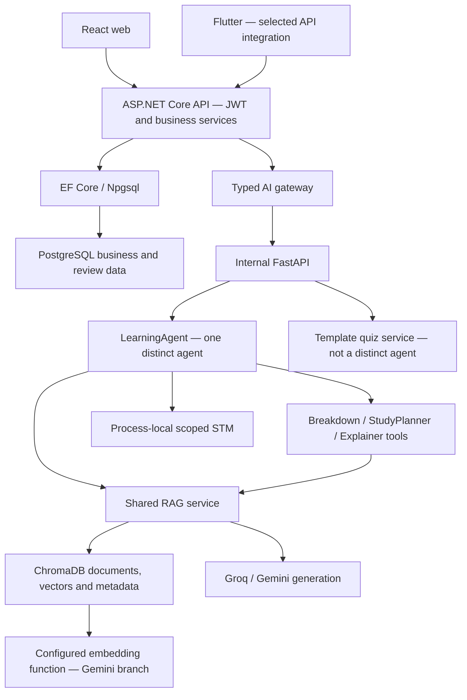
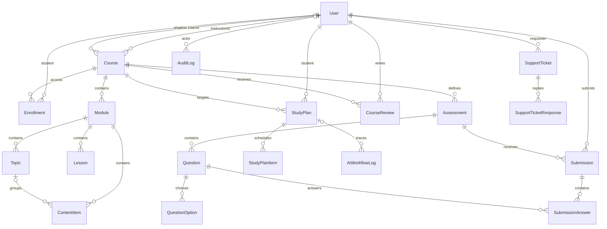
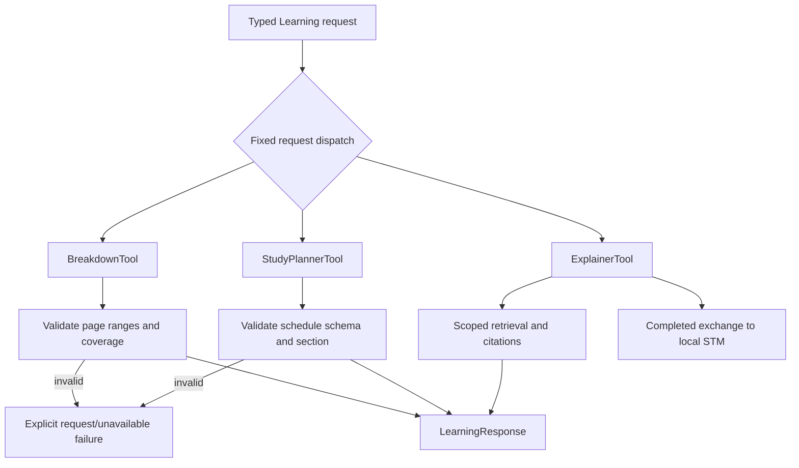

# SE3090 Software Engineering Frameworks
# EduFlowAi — Integrated Full-Stack and Agentic AI Application

## Front Matter

| Field | Value |
|---|---|
| Module | SE3090 — Software Engineering Frameworks, Year 3 Semester 1, 2026 |
| Assignment | Assignment 1 — Integrated Full-Stack and Agentic AI Application Development |
| Project title | EduFlowAi |
| Group number | [TEAM TO PROVIDE] |
| Repository URL | https://github.com/Raashidh-Rizvi/EduFlowAi — established by Phase 7; evaluator access not independently checked in this synthesis |
| Submission date | [TEAM TO PROVIDE ACTUAL SUBMISSION DATE] |
| Official deadline | 30 September 2026, 23:50 Sri Lanka time, as recorded in Phases 0 and 7 |
| Draft preparation | 1 October 2026; this date does not establish submission or deadline compliance |
| Group AI usage declaration | Template in §20; TEAM MUST COMPLETE USING ACTUAL AI USAGE RECORDS |
| Document status | Master consolidated Markdown draft; personal material, runtime evidence and submission artifacts remain outstanding |

| Member | Student ID | Principal documented responsibility |
|---|---|---|
| Wazni / Ahamed M.A. | IT24103352 | Admin/governance and current Learning Agent integration |
| Raashidh Rizvi | IT24104191 | Instructor/curriculum/assessment, platform foundations and historical Quiz Generator work |
| Atheek Fareez | IT24103933 | Student/gamification/security, Flutter service integration and Simple RAG foundation |

**Evidence basis and reading convention.** This report synthesizes only Phases [0](00_REQUIREMENTS_AND_REPORT_MAP.md), [1](01_CURRENT_SCOPE_AND_EVIDENCE_PLAN.md), [2](02_BACKEND_DATABASE_SECURITY.md), [3](03_REACT_WEB.md), [4](04_FLUTTER_MOBILE.md), [5](05_AGENTIC_AI_RAG.md), [6](06_TESTING_CI_DEPLOYMENT.md) and [7](07_INDIVIDUAL_CONTRIBUTIONS.md). No source audit, test, build, Git change or provider call was performed for this consolidation. Technical statements describe the inspected evidence baseline, not an unseen later revision.

“VERIFIED IN SOURCE” identifies a static implementation fact. “PRESENT BUT RUNTIME UNVERIFIED” identifies source behavior without a current execution result. “PARTIAL,” “DOCUMENTED/PLANNED ONLY” and “NOT FOUND / UNVERIFIED” retain the earlier phases' limitations. “HISTORICAL EXECUTED EVIDENCE” refers only to dated prior results. These distinctions apply to the associated sections and tables without implying production certification.

Phase 7 supersedes earlier uncertainty about the repository URL and supplies contribution provenance. It does not supersede current-source agent findings. Its post-deadline PR #24 is excluded from pre-deadline implementation claims. The Phase 4 storage/device-feature wording is corrected in §7; earlier evidence files are preserved.

## Executive Summary

EduFlowAi combines course delivery, assessment, learner participation and lecture-grounded assistance in an education platform for Admin, Instructor and Student users. The inspected architecture uses React and Flutter clients, an ASP.NET Core API, EF Core/PostgreSQL business data, and an internal FastAPI service with ChromaDB retrieval and Groq/Gemini integrations.

Source-supported capabilities include administrative governance, curriculum and assessment operations, enrollment and review workflows, selected mobile API calls, and a Learning Agent with breakdown, planning and explanation tools. Focused Learning tests and live local observations were recorded on 28 September 2026. Comprehensive current execution was blocked in Phase 6.

The final inspected AI subsystem has one distinct Learning Agent. Quiz generation is service functionality, RAG is infrastructure, and a complete assessed execution-planning/delegation/approval workflow is absent. Flutter has significant local-only behavior and a likely constructor mismatch; complete cross-platform integration, cloud deployments and a runnable APK are unverified. Written lecturer approval for the three-member/two-intended-agent variation remains outstanding. This draft reports those limitations alongside the implemented work.

# PART A — GROUP REPORT

## 1. Project Overview and Scope

The documented problem is fragmented course material, assessment and learner progress, with limited support for studying lecture documents. EduFlowAi aims to bring administrative governance, academic authoring and learner participation into one system and offer explanations tied to indexed course material. These are product objectives, not measured claims of improved grades, motivation or productivity. [Evidence: Phase 1.]

The three primary responsibility areas are Admin/governance, Instructor/academic delivery, and Student/participation. Shared identity, courses, assessment records, client shells and AI boundaries connect them. Responsibility is not exclusive file ownership.

| Stack/area | Inspected implementation | Scope status |
|---|---|---|
| Backend | ASP.NET Core, .NET 8 projects; SDK selector 10.0.401 | VERIFIED IN SOURCE |
| Business persistence | EF Core/Npgsql, PostgreSQL model and migration source | PRESENT BUT RUNTIME UNVERIFIED |
| Web | React 18, Vite, React Router, Context/hooks/manual fetching | VERIFIED IN SOURCE; mixed persisted/local actions |
| Mobile | Flutter Material app, Dio, StatefulWidget/setState | PARTIAL; compile/runtime/APK unverified |
| AI | FastAPI, LearningAgent, three tools, process-local STM | VERIFIED IN SOURCE; complete assessed workflow incomplete |
| Retrieval | Parser/chunker, Chroma, provider generation and citations | VERIFIED IN SOURCE; scope/indexing limitations |
| Delivery | Local setup and GitHub Actions configuration | Cloud deployment and passing current CI unverified |

The implemented scope does not include a verified final distinct Quiz Generator Agent, multi-agent execution planner, complete durable approval workflow or fully persisted mobile assessment experience. A three-member allocation and two-agent intention do not replace official written scope approval.

## 2. Requirements and User Roles

Requirements derive from Phase 0; implementation status derives from Phases 2–6.

| Role/requirement | Source-supported operations | Status and remaining boundary |
|---|---|---|
| Admin governance | User provisioning/status/roles/guarded deletion, course inventory, support, audit, platform summary | PRESENT BUT RUNTIME UNVERIFIED; some UI/backend permissions differ |
| Instructor academic delivery | Owned curriculum, assessment/quiz authoring, publication, enrollment decisions, profiles/reviews | PRESENT BUT RUNTIME UNVERIFIED; local UI and resource-authorization gaps |
| Student participation | Discovery, enrollment requests, selected curriculum/quiz services, reviews, progress/rewards | PARTIAL across clients; local rewards/completions are not persisted success |
| Student Learning assistance | Indexed lecture discovery, chat, breakdown, whole/topic plans and citations | Source verified; focused HISTORICAL EXECUTED EVIDENCE only |
| Mobile interaction | Login, course hierarchy and quiz-start API calls | PARTIAL; registration, submission, live coach and device feature incomplete |
| Authenticated shared API | JWT/roles and selected ownership checks | PARTIAL security coverage |
| Data integrity | Relational constraints and selected transactions | PRESENT BUT RUNTIME UNVERIFIED; real PostgreSQL tests not executed |
| Complete Agentic workflow | Objective, execution plan, delegation, tools, durable state, validation, approval, outcome | NOT SATISFIED by current inspected implementation |
| Reliability/performance | Error handling and selected bounded provider calls | PARTIAL; benchmark and recovery evidence incomplete |
| Accessible/responsive UI | Responsive CSS and selected semantic/focus/error controls | PARTIAL; no conformance evaluation |
| Deployment/reproducibility | Setup/configuration names and CI commands | PARTIAL; public artifacts unverified |

The standard assignment expects four students with distinct primary components and at least four distinct agents, subject to written lecturer adjustment. The team documents three members and two intended agents; only one agent is verified in the final source. No waiver is asserted. Each member must also substantiate full-stack technical contribution and the required individual Agentic contribution; shared infrastructure alone does not settle that requirement.

## 3. Integrated System Architecture

The API is the shared business and identity boundary. React uses its Axios/service layer; Flutter uses Dio. Both target ASP.NET rather than calling Python directly in the inspected source. ASP.NET validates JWTs, applies role/resource rules and uses EF Core for business data. A typed HTTP gateway calls FastAPI for Learning and RAG operations. [Evidence: Phases 2–5.]

**Figure 1 — Source-derived architecture; arrows indicate implemented call/data paths, not runtime certification.**

The generation providers consume selected retrieved context through the RAG service; Chroma is not itself an agent or a direct chat-provider API. PostgreSQL business/review records, Chroma metadata and local memory are separate stores, with no complete shared execution ledger.

Login issues access/refresh credentials through ASP.NET. React stores tokens in localStorage; Flutter source uses flutter_secure_storage. JWT claims inform API identity, and Learning gateway requests replace caller-supplied student identity with the authenticated caller. Those controls do not establish complete enrollment-based retrieval or Python direct-service authorization.

## 4. Database Design and PostgreSQL

Phase 2 found 41 mapped entity types, EF Core/Npgsql configuration and seven migration source files. Most entities have UUID keys and CreatedAt/UpdatedAt fields; StudentXp and StudentStreak use StudentId, with different keys for Level and Badge. UpdatedAt is not universally maintained by a global interceptor. JSON-named payloads are generally text, not proof of jsonb or vector storage.

Curriculum comprises Course, Module, Topic, Lesson and ContentItem. Assessments connect Question, QuestionOption, QuizConfiguration, Submission and SubmissionAnswer. Enrollment and CourseReview connect learners to courses. SupportTicket/Response and AuditLog support governance. StudyPlan, StudyPlanItem and AiWorkflowLog represent backend review-related state, not the complete current Python workflow.

**Figure 2 — Selected source-derived ERD.** This is a readable subset of the Phase 2 inventory; omitted relationships and delete policies remain in that evidence document.

Unique constraints include email, course code, course/student enrollment and review pairs, one instructor profile per user, quiz configuration, earned badge pairs, team membership and support requester/client-request pairs. CourseReview includes a 1–5 rating check; SupportTicket has UUID version concurrency and query indexes. An additional nullable shadow Course.UserId relation is recorded alongside InstructorId and requires explicit model understanding.

Migrations cover initial schema, ownership/reviews, instructor profiles/moderation, marketplace metadata and support schema/version evolution. Migration names are not proof of actual operations; Phase 2 notes that one curriculum-named migration changes seed timestamps. Migration application and deployed schema consistency remain unverified.

Selected transaction controls exist for guarded user deletion, serializable enrollment decisions, atomic support updates and repeatable-read platform summaries. Quiz submission/reward and lesson completion/reward use separate operations without a demonstrated encompassing transaction. AI HTTP decisions and local persistence lack an outbox/distributed completion protocol. Governance audit metadata is allow-listed and bounded; raw AiWorkflowLog payloads have different privacy properties. Relational tests and deployment evidence are addressed in §§11 and 15.

## 5. ASP.NET Core Backend Design

The solution separates Api, Core, Infrastructure and Tests. Api owns controllers and HTTP/auth configuration; Core contains entities, DTOs and service interfaces; Infrastructure contains EF persistence, business services and the AI gateway. Controllers also use DbContext directly and retain substantial business logic. This is not described as a fully isolated Clean Architecture or repository-layer implementation. [Evidence: Phase 2.]

REST operations cover auth, course/curriculum, assessment, learner, governance and AI routes. DTOs and explicit projections provide selected response boundaries; some actions return entities/navigation graphs, so output isolation is incomplete. Manual validation covers password/email rules, publication, uploads, support transitions and ratings; coverage is not uniform.

Dependency injection registers scoped business services and a typed AiGatewayClient. JWT bearer validates signature, issuer, audience and lifetime; BCrypt password hashing uses work factor 12. Public registration is Student-only. Role policies and attributes are complemented by ownership checks in selected actions. Existing access tokens are not immediately invalidated by all account changes, and refresh does not universally recheck active status.

Swagger is configured but exposed through the Development middleware branch. Global exception handling emits generic production errors and logs exceptions, while action-specific envelopes vary. CORS permits broad local origins; production origin/transport configuration remains unverified. Startup applies database initialization/migrations and demo seeding, making startup against an existing database a mutating action.

The gateway preserves Learning status/body and returns explicit network/timeout failures. Several older non-Learning calls generate fallback JSON. Human-review endpoints provide pending/detail/decision and approve/reject/revise operations, but their local StudyPlan identity and remote decision calls are not fully linked to current LearningAgent execution.

Material gaps include public quiz-answer projections, incomplete quiz publication/enrollment/attempt gates, question regeneration ownership, focus-reward caller identity, broad staff reads, public static uploads and fail-open internal-key configuration. These source findings require remediation and isolated negative testing, not claims of observed exploitation.

## 6. React Web Application

React/Vite and React Router provide public marketplace routes and a role-selected console. Public paths include /courses, course details and instructor profiles; /console uses component state to select role views. Authentication is shared through Context; hooks manage component state and manual API effects. Browser storage persists credentials, preferences, selected tabs and some business objects. Declared Zustand is not the observed state architecture. [Evidence: Phase 3.]

Admin interfaces include platform summary, user/course management, support, audit, moderation and profile. Instructor interfaces support curriculum, enrollment, assessment, profile/reviews and shared staff views. Student interfaces provide catalog/enrollment, curriculum, quiz/reward presentation and Learning assistance.

The Learning Assistant discovers indexed decks and calls /api/aireview/coach/chat and /api/aireview/learn for chat, breakdown, whole-lecture/topic plans and explanations. It renders structured sections, durations/tasks, citations and explicit retry/error states. **React did not directly call Python in the inspected source**; calls pass through ASP.NET.

Forms use controlled inputs, HTML constraints and manual checks. Newer governance and Learning pages offer loading, empty, error, conflict and retained-input states. Accessibility evidence includes native controls, selected dialog/focus behavior, live regions and responsive marketplace CSS. Console layout, keyboard coverage, contrast, zoom and WCAG conformance remain unverified.

| Boundary | Observed limitation |
|---|---|
| Session | localStorage tokens are JavaScript-readable; cached user without tokens can render a shell; business caches are not account-scoped or fully cleared |
| Registration | UI offers privileged roles rejected by Student-only server registration |
| Curriculum | Some topic creation/deletion and lesson completion paths reconcile only locally or suppress errors |
| Rewards | Undefined mission method and focus-ID fallback can lead to local rewards or wrong supplied identity |
| Quiz | Local mirrors, fallback grading/publication and synthetic IDs can differ from persisted assessment state |
| AI review | Local edits/batch actions and failed-decision paths can still display success; traces/labels are partly synthetic |
| Security | Bundled privileged demo credentials, answer caches and direct public-document fetching remain concerns |

A visible success toast, animation or local proposal is not evidence of PostgreSQL persistence or authorized AI completion.

## 7. Flutter Mobile Application

The inspected Material app uses StatefulWidget/setState, a conditional login/navigation root and a five-tab bottom navigation for Home, Journey, AI Coach, Ranks and Profile. Quiz navigation uses Navigator/MaterialPageRoute. BLoC is declared as a dependency but not implemented as the state architecture. Dio targets the ASP.NET emulator address http://10.0.2.2:5204/api with token injection and connection/receive timeouts. No direct Flutter→Python call was found. [Evidence: corrected Phase 4, supplemented by Phase 6.]

**The Flutter source uses the flutter_secure_storage package for token/user storage; platform runtime configuration was not independently executed in the audit.** Package use does not certify a secure deployed session. Login is API-bound but includes a demo fallback capable of displaying a successful-looking local session without genuine authentication. Registration has no screen. Logout UI changes root state without invoking the full secure-session clearing path; global invalid-session recovery and role-sensitive UI are incomplete.

| Feature | Actual behavior | Status |
|---|---|---|
| Journey | Fetches enrolled courses then first-course hierarchy and maps nodes; loading/error/retry UI | PRESENT BUT RUNTIME UNVERIFIED |
| Quiz | Calls start endpoint and receives questions/attempt ID; scoring assumes correct option index 0 | PARTIAL |
| Quiz persistence | No answer/result submission; local XP/coin updates | NOT VERIFIED complete API persistence |
| Gamification | Service methods exist; screens largely use hardcoded/local profile values | PARTIAL / mostly local |
| Leaderboard/badges | Hardcoded displayed data | LOCAL, not live integration |
| AI Coach | Scripted local responses without AI request | SCRIPTED/LOCAL |
| Device feature | Quiz countdown timer | PARTIAL / NOT VERIFIED |
| APK/runtime | No verified build, installation or device execution | NOT FOUND / UNVERIFIED |

**PARTIAL / NOT VERIFIED — the current mobile source includes a quiz countdown timer but no clearly evidenced camera, GPS, QR, file upload, push-notification or comparable device-oriented feature.**

The MainNavigationScreen/QuizScreen constructor mismatch is a likely compilation blocker, not an observed compiler result. Android scaffold/APK evidence is missing. The stale widget test and local/copy-based service-labelled tests do not provide production-code coverage and were not executed. Mobile completeness cannot be inferred from Flutter API service contribution history.

## 8. Agentic AI and RAG Architecture

FastAPI declares nine current application routes: POST /api/v1/agent/learn; GET /health; GET /api/v1/ai/status; POST /api/v1/rag/index-pdf; POST /api/v1/rag/chat; POST /ai-coach-chat; GET /api/v1/rag/slide-decks; POST /api/v1/ai/slides/categorize-topics; POST /api/v1/ai/slides/generate-quiz. Framework documentation routes are separate. [Evidence: Phase 5.]

**One distinct current agent is verified: LearningAgent.** It has an identifiable tutoring responsibility, typed request/response contracts, fixed tool access and visible workflow participation. Coach is an adapter to the same agent. **RAG is infrastructure, not a distinct agent. Distinct final Quiz Generator Agent was not verified. Official minimum assessed Agentic workflow is not currently verified as complete.**

| Tool | Responsibility / deterministic controls |
|---|---|
| BreakdownTool | Builds source-grounded lecture sections; validates actual page coverage, ranges and overlap; stable fingerprint/section IDs and cached Chroma metadata |
| StudyPlannerTool | Produces a learner schedule; validates nonempty sessions/tasks, duration bounds, ordering and selected section reference |
| ExplainerTool | Retrieves selected evidence and generates explanation/citations; validates input and postfilters source/course/section/pages |

LearningRequest dispatches breakdown, plan or explain. A student study schedule is not a structured agent-execution plan. Fixed sequential tool calls are not agent-to-agent delegation. Learning JSON/schema generation has bounded attempts; selected errors return 404/422/503 rather than a fabricated plan.

Scoped STM retains three completed question/answer pairs under student/session/course/source/module scope. It is process-local, clears on restart and is not shared across instances; no overall key-count/TTL control is established. Fallback/failed exchanges are excluded. Chroma stores vector content and section metadata, not all nine required durable workflow fields.

PDF parsing uses pypdf text extraction; chunking uses 1,800-character windows with 180-character overlap, not true token-based segmentation. Chroma persistence is configured with provider-specific collections. Normal upload does not auto-index: the explicit index endpoint or mutating diagnostic utilities are separate. Re-index IDs omit source filename and shortened documents can retain stale tail chunks. Caller-controlled local file paths lack a verified approved-root boundary.

Retrieval creates page/source citations from selected chunks. Chat can drop/broaden course/module filters, and filenames are not authorization boundaries. Citation presence does not prove every generated claim is entailed. Default embedding behavior is runtime-unverified; configured Gemini embeddings and Groq/Gemini generation exist in source.

**Figure 3 — Current Learning flow.**

Quiz generation is a template service with generic questions, weak difficulty/scope/duplication controls and asserted ready/validation labels. It is not a distinct tool-using agent. Python orchestration/decision routes expected by older gateway paths are missing. Backend review records and React decisions therefore do not establish pause/resume for the current LearningAgent.

Security and observability are partial: fixed dispatch constrains tool selection, but Python key/identity enforcement is absent; prompt instructions alone do not prove injection resistance. Console diagnostics and local HTTP failures are useful but no complete measured/correlated execution trace exists. Some gateway/quiz fallbacks produce synthetic success. The required objective, execution plan, completed steps, tool results, validations, errors, approval and outcome are not linked under one durable workflow ID.

## 9. Cross-Platform Integration

React and Flutter share the ASP.NET API, JWT identity model and PostgreSQL-backed business entities. Source includes overlapping course/hierarchy and quiz interfaces. React Learning integrates through the API gateway, with dated focused live evidence. Flutter login/Journey/quiz-start calls are source-supported but current device execution is unverified. [Evidence: Phases 2–6.]

The complete sequence Flutter → API → PostgreSQL → Agentic AI → React authorized review → persisted outcome → initiating Flutter user is **NOT VERIFIED**. The mobile coach is local, mobile quiz results are not submitted, and the current Python service lacks the assessed execution/approval chain. Unrelated browser, database and mobile tests cannot be combined into one successful E2E trace.

## 10. Security and Privacy

| Control | Evidence | Status | Known limitation |
|---|---|---|---|
| Password protection | BCrypt, registration limits and duplicate identity controls (P2) | VERIFIED IN SOURCE | Demo seeding and literal configuration credentials require remediation; values omitted |
| JWT/RBAC | Signature/issuer/audience/lifetime and role policies (P2) | PARTIAL overall | Access-token invalidation/account-state refresh gaps; role is not resource ownership |
| Resource authorization | Course ownership, enrollment and governance checks (P2) | PARTIAL | Quiz answers/start/submit, regenerate, focus identity and broad staff reads have gaps |
| Web session | Bearer/refresh handling (P3) | PARTIAL | JavaScript-readable localStorage; cached shell and unscoped persistent business data |
| Mobile storage | flutter_secure_storage usage (P4 corrected) | PRESENT BUT RUNTIME UNVERIFIED | Platform configuration not executed; logout clearing path disconnected |
| Demo access | Seeded/bundled credentials and mobile fallback (P2–4) | PARTIAL / risk | Not production-safe authentication evidence; redact all values |
| Internal services | ASP.NET internal header/filter (P2, P5) | PARTIAL | Missing configured key fails open; Python enforcement absent |
| Uploaded material | Size/type/name checks (P2) | PARTIAL | Public static delivery; byte validation/private access incomplete |
| Retrieval boundaries | Metadata filters and selected Learning postchecks (P5) | PARTIAL | Chat scope broadening, filename collisions and arbitrary path input |
| Tool/prompt controls | Fixed dispatch, schemas, grounding instructions (P5) | PARTIAL | Not comprehensive injection/least-privilege enforcement or evaluated resistance |
| Governance privacy | Allow-listed bounded audit metadata (P2) | VERIFIED IN SOURCE | Not universal logging coverage; AI raw payloads have different privacy risks |
| Secrets/configuration | Environment support; literal sensitive values found (P2) | PARTIAL | Rotation/removal and deployed secret handling unverified |
| Transport/operations | HTTPS production branch, local CORS, timeout/error controls (P2, P5) | PRESENT BUT RUNTIME UNVERIFIED | Production TLS/ingress/rate-limits/retention not established |

AI requests can send lecture excerpts, questions and history to third-party providers. The report's privacy principle is to minimize that material, use authorized scopes, redact diagnostics and define retention/access rules for model inputs and durable logs. This is a design obligation and future verification task, not proof the current implementation satisfies it.

## 11. Testing Report

Phase 6 separated source inventories from execution. Windows process creation failed with access denied and a direct executable probe failed with EPERM. No comprehensive tests or builds ran; no failure/skip totals or overall pass percentage can be inferred.

| Layer | TEST SOURCE EXISTS | HISTORICAL EXECUTED EVIDENCE | CURRENT EXECUTION BLOCKED/NOT RUN |
|---|---|---|---|
| Backend | 25 C# files; controller/service/auth/business tests, mostly InMemory; gateway stubs | 12 focused gateway cases passed, 2026-09-28 | No current backend run; not whole-suite certification |
| Database | InMemory relationship tests plus opt-in real PostgreSQL audit/delete cases | No real PostgreSQL test execution established by Phase 6 | Opt-in cases mutate/create data; no safe disposable environment run |
| React | 14 Playwright specs; mocked, live Learning and business LMS scenarios | Four mocked Learning and two live Learning cases passed, 2026-09-28 | No current browser run; local services unavailable |
| Flutter | Three files; 29 local unit-style declarations plus stale widget smoke | None established | Not executed; no real production-service coverage |
| AI | Learning mocked/ephemeral suite; nonisolated RAG tests; stale missing-core reliability suite | 32 Learning cases passed, 2026-09-28 | No current run; broad suite unsafe/incompatible without isolation |
| Cross-platform E2E | Business/learning component scenarios | Focused React/API/Python Learning round trip only | Complete mobile/AI/review chain not verified |

Historical results are attributed to the 28 September record reproduced in Phase 6, with its recorded baseline plus working-tree extension. Existing UI last-run metadata/screenshots provide limited corroboration, not a comprehensive current report. Source declaration counts are not expanded case counts. Coverlet dependency presence does not establish coverage.

A valid follow-up must retain command, revision, environment, expected/observed assertions, pass/fail/skip counts and duration. InMemory cannot prove PostgreSQL constraints/transactions; local-expression Flutter tests cannot prove actual services. Isolated live-provider tests need explicit authorization and must not index or alter the current store unexpectedly.

## 12. Agentic AI Evaluation

| Golden-case requirement | Evidence | Assessment |
|---|---|---|
| Domain objective | Learning query/topic and separate goal records | PARTIAL tutoring objective |
| Execution planning | Learner schedule only | NOT SATISFIED as agent execution plan |
| Distinct roles/delegation | One LearningAgent, tools, no current handoff | NOT SATISFIED |
| Controlled tools | Fixed three-tool dispatch | PARTIAL; broader permission controls incomplete |
| Structured outputs | Learning schemas and JSON parsing | SATISFIED IN SOURCE for Learning subset |
| Deterministic validation | Page/scope/schedule checks | PARTIAL overall |
| Business rules | Selected Learning and backend ownership rules | PARTIAL workflow coverage |
| Human approval | Disconnected backend/UI pieces | NOT SATISFIED for complete current AI chain |
| Prompt-injection testing | Instructions but no complete adversarial evidence | UNVERIFIED |
| Recovery | Bounded generation retries/fallbacks | PARTIAL; no durable resume |
| Safe failure | Some explicit HTTP failures; synthetic successes elsewhere | PARTIAL; complete recorded failure absent |
| Auditable outcome | Separate records and temporary responses | NOT SATISFIED as unified assessed outcome |

The full golden workflow is **not verified** and cannot pass the missing implementation requirements merely by rerunning existing focused tests. Evaluation must combine deterministic assertions, appropriate golden cases and human review; LLM-as-judge cannot be the sole evidence. No score or correctness percentage is assigned. [Evidence: Phases 0, 5–6.]

## 13. Performance Report

Only these exploratory historical observations are supported by Phase 6's dated Learning record:

| Operation | Reported time | Qualification |
|---|---:|---|
| Fresh lecture breakdown | 6.02 s | Historical diagnostic, 2026-09-28 |
| Cached frontend breakdown | 0.055 s | Historical cached path |
| Selected-section plan | 3.227 s | Historical single operation |
| Selected subtopic explanation | 7.082 s | Historical single operation |

The record describes local Windows/services and an existing lecture; there is no complete raw benchmark dataset or current replication. These are not throughput, percentile or service-level guarantees. Full concurrency, database response, API distributions and success/failure-rate measurements are absent. Fixed/synthetic telemetry and constant confidence are excluded. Future measurement requires a controlled dataset, concurrency profile, hardware/deployment context and raw request/error/timing evidence.

## 14. CI/CD and Git Collaboration

Phase 6 verified .github/workflows/ci.yml configuration. Push and pull-request events target main and dev. Backend CI restores the solution, builds Release and runs tests; this satisfies the mandatory configuration structure. A PostgreSQL service exists but does not automatically enable opt-in PostgreSQL cases. Frontend CI builds without actual lint/Playwright execution; Flutter CI runs tests without APK build; Python CI runs a broad suite containing removed-core imports. No current successful CI run or deployment job is verified.

Phase 7 records sustained August/September work, feature branches, PRs and merge/conflict resolution. Representative pre-deadline evidence includes Wazni PRs #15–17, #19–20; Raashidh PR #22 and foundational commits; Atheek PRs #7–8, #13 and #21. This does not prove review quality, branch protection, issue/project-board completeness or runtime success. Commit counts are not quality scores and overlapping changes are not summed into invented contribution percentages.

The evidence cutoff is 30 September 2026, 23:50 Sri Lanka time. Phase 7 records PR #24 merged approximately 1 October 00:57; it is **post-deadline**, excluded from pre-deadline assessed implementation unless explicitly accepted by the lecturer. Later MCP/CRAG/intent-routing descriptions do not replace the current-source findings consolidated here.

## 15. Deployment and Evaluator Setup

Current instructions describe local React port 2174, ASP.NET port 5204, FastAPI port 8000 and a separately configured PostgreSQL prerequisite. Phase 6's read-only probes to those local services returned connection refused. Historical local health responses are not current availability or cloud deployment evidence.

**Documented startup order, not a new execution:** validate installed dependencies and private configuration; prepare a disposable/appropriate PostgreSQL environment and controlled migration policy; configure AI provider/index storage consistently; start the documented development runner or individually start API/AI/React, avoiding duplicates; verify health/contracts before client actions. Backend startup migrates/seeds and AI startup may initialize Chroma/provider probes, so this is not a harmless diagnostic instruction for existing production data.

| Configuration boundary | Names only |
|---|---|
| Backend | ConnectionStrings__DefaultConnection; JwtSettings__Secret, __Issuer, __Audience, __ExpiryMinutes; AiService__BaseUrl, __ApiKey, __TimeoutSeconds |
| React | VITE_API_BASE_URL |
| AI | INTERNAL_SERVICE_TOKEN; EMBEDDING_PROVIDER; LLM_PROVIDER; GEMINI_API_KEY; GEMINI_MODEL; GROQ_API_KEY; GROQ_MODEL; CHROMA_PERSIST_DIR |
| Test-only | EDUFLOW_AUDIT_TEST_POSTGRES; EDUFLOW_DELETE_POSTGRES_CONNECTION; EDUFLOW_LIVE_TESTS; PLAYWRIGHT_CHANNEL; E2E_API_BASE_URL |

Names do not prove controls are enforced. Secrets must be provisioned privately. AI local hosting is permitted where appropriate by the official requirement; a deployed AI service is not mandatory if complete reproducible local access is supplied.

Missing/unverified evaluator artifacts: public React URL, cloud API/health and Swagger URLs, deployed PostgreSQL evidence, hosted AI or verified reproducible local setup, runnable APK/installation guide, accessible demo video, evaluator accounts and group number. The AWS/S3/RDS/pgvector guide is a historical proposal, not a chosen/deployed current platform. No public URL or credential is invented.

## 16. Architecture Decision Records

All five entries are **DRAFT ADRs** reconstructed from evidence. “Options considered” below means alternatives for team comparison, not documented historical deliberations. **Draft rationale for team validation.** The team must confirm actual decisions, authors/date and rationale; no meeting or approval history is asserted.

### ADR 1 — React state management

**Context:** Shared identity/preferences coexist with page forms, queries and complex business views.  
**Options considered:** Context/hooks/manual fetching; centralized store; dedicated server-state cache. These alternatives were not confirmed as historically considered.  
**Decision:** Observed implementation uses Context, hooks, manual server-state fetching and browser storage.  
**Consequences:** Local control and limited framework machinery, but manual invalidation, account scoping, rollback and stale-response handling.  
**Current limitation:** Unscoped caches and mixed local/persisted actions; declared Zustand does not establish its use.

### ADR 2 — Flutter state management

**Context:** Login, navigation, Journey and quiz screens maintain per-screen/session state.  
**Options considered:** StatefulWidget/setState; BLoC/Cubit; another shared state provider, for team comparison.  
**Decision:** Observed StatefulWidget/setState with parent maps and imperative navigation.  
**Consequences:** Direct screen implementation; coordination and persistence must be handled explicitly.  
**Current limitation:** Declared BLoC is unused; local gamification/coach, logout gaps and likely constructor mismatch remain.

### ADR 3 — AI orchestration

**Context:** Lecture breakdown, study scheduling and explanation require constrained content and outputs.  
**Options considered:** Explicit deterministic dispatch; graph orchestration; distinct cooperating agents, as prospective alternatives.  
**Decision:** Current implementation is fixed LearningAgent dispatch to three tools with shared RAG. No current LangGraph implementation is verified.  
**Consequences:** Understandable contracts and deterministic checks, but no general execution planning/delegation.  
**Current limitation:** Does not satisfy the complete assessed Agentic workflow; historical multi-agent work is not final implementation.

### ADR 4 — AI workflow state and storage

**Context:** Business data, retrieval content and conversation context have different access/lifetime requirements.  
**Options considered:** Unified durable workflow ledger plus retrieval store; current separated stores; process-only execution, for comparison.  
**Decision:** PostgreSQL business/review state, Chroma vector/section metadata and process-local scoped STM are the observed architecture.  
**Consequences:** Distinct storage responsibilities, but explicit correlation and recovery are required across services.  
**Current limitation:** These stores do not form one complete durable workflow ledger; ID/objective/plan/steps/tools/validation/errors/approval/outcome remain disconnected.

### ADR 5 — Deployment

**Status: REQUIRES TEAM INPUT / DEPLOYMENT NOT COMPLETED.**  
**Context:** Evaluators require cloud API/React, secure PostgreSQL and reproducible AI/mobile access.  
**Options considered:** [TEAM TO RECORD ACTUAL OPTIONS AND COST/ACCESS CONSTRAINTS]. An AWS proposal exists but is not a verified decision.  
**Decision:** [TEAM TO PROVIDE IMPLEMENTED CLOUD DECISION; NONE VERIFIED].  
**Consequences:** [TEAM TO RECORD OBSERVED HOSTING, TLS, PERSISTENCE, CONFIGURATION AND OPERATIONS CONSEQUENCES].  
**Current limitation:** No verified cloud deployment, APK or complete evaluator links; do not choose a fictional platform to complete this ADR.

## 17. Third-Party Integration

Groq and Gemini support meaningful lecture-grounded generation; Gemini also supports embeddings. Their source integrations are business-relevant, with focused historical local Learning execution documented. No current account/model availability was checked. [Evidence: Phases 5–6.]

| Provider | Configuration | Failure/data considerations |
|---|---|---|
| Groq | LLM_PROVIDER, GROQ_API_KEY, GROQ_MODEL | 30 s client timeout and disabled client retries in source; selected Groq failure can try Gemini; context/questions/history sent externally |
| Gemini generation | GEMINI_API_KEY, GEMINI_MODEL, LLM_PROVIDER | Request timeout and extractive fallback; structured Learning rejects unavailable/extractive output; complete SDK retry behavior unverified |
| Gemini embeddings | EMBEDDING_PROVIDER, GEMINI_API_KEY | Indexed chunks/queries and startup probe transmitted; embedding timeout/default fallback needs verification |

Source defaults are not availability guarantees. No payment-provider integration is inferred from payment-gate logic. Privacy requires authorized/minimized content, private keys and explicit failure/rate-limit behavior; those operational controls remain to be verified.

## 18. Known Limitations and Future Work

| Priority | Current limitation | Future work, not implemented completion |
|---|---|---|
| Critical | Complete assessed planner/delegation/state/approval workflow absent | Implement and verify a coherent minimum workflow under lecturer-approved scope |
| Critical | No distinct final Quiz Generator Agent; scope approval missing | Clarify required roles/count and obtain authentic written adjustment |
| Critical | Flutter persistence/coach and likely compilation mismatch | Correct contracts, connect real submit/results and coach, verify compilation/device behavior |
| High | Meaningful mobile device feature unverified | Implement a justified device capability and retain real device evidence |
| High | Current comprehensive tests blocked/incomplete | Run isolated layer, PostgreSQL, golden and cross-platform tests; retain actual results |
| High | Cloud deployments/APK/evaluator artifacts unverified | Complete authorized deployment/build/access and installation evidence |
| High | Auth/resource/static-file/secret issues | Remediate and negatively test affected boundaries; rotate sensitive values privately |
| High | RAG scope/path/index collision and stale replacement risks | Enforce authorization/path boundaries and safe isolated index lifecycle |
| Important | Performance and observability incomplete | Measure real execution and load; remove misleading synthetic success evidence |
| Important | AI logs/reflections/declarations/reference details outstanding | Students supply actual records and personal writing |

No future work is presented as pre-deadline assessed implementation. Any later changes need an explicit baseline and lecturer acceptance where required.

## 19. Submission Artifact Checklist

| Artifact | Required | Current evidence | Status | Action required |
|---|---|---|---|---|
| One consolidated PDF with Group and all Individual reports | Yes | This Markdown draft contains structure/content | PARTIAL | Complete personal/open material, review and export later; no PDF generated here |
| Technical/design/ERD/security chapters | Yes | §§1–10, 16–18 and source-derived diagrams | PARTIAL | Team validate rationale and unresolved claims |
| Software testing report | Yes | §11 and Phase 6 | PARTIAL | Current executed results and missing coverage |
| AI evaluation report | Yes | §12 | NOT SATISFIED complete golden case | Implement/evaluate absent workflow |
| Performance report | Yes | §13 historical observations | PARTIAL | Real complete benchmark evidence |
| Deployment report/ADRs | Yes | §§15–16 drafts | PARTIAL | Actual deployment decision and evidence |
| Group AI declaration | Yes | §20 template | UNVERIFIED | Team complete from actual records |
| Each individual contribution/technical/Git/test/challenges/learning section | Yes | §§21–23 | PARTIAL | Personal details and source-aligned validation |
| Each individual AI log, personal reflection and signed declaration | Yes | Blank placeholders only | UNVERIFIED | Students personally supply and sign |
| Repository URL/access | Yes | Phase 7 canonical GitHub URL | PARTIAL | Verify evaluator permission and retained access |
| React live URL | Yes | None verified | UNVERIFIED | Supply and test |
| Cloud API/health and Swagger URLs | Yes | Local routes only | UNVERIFIED | Supply and test production-accessible documentation |
| PostgreSQL deployment evidence | Yes | Source/setup only | UNVERIFIED | Prove secure deployment/migration/access |
| AI setup/access/model requirements | Yes; local allowed as appropriate | §§8, 15, 17 | PARTIAL | Verify reproducible startup/index/provider context |
| Environment names and startup instructions | Yes | §15 and Phase 6 | PARTIAL | Validate without publishing secrets |
| Runnable Android APK or written-approved alternative; installation guide | Yes | No verified artifact | UNVERIFIED | Build, install/test and document |
| Accessible 10-minute demo-video link | Yes | None verified | UNVERIFIED | Record real system and verify link sharing |
| Evaluator test accounts/access instructions | Yes | Demo references, no verified deployed handoff | UNVERIFIED | Supply appropriate private evaluator access |
| Group number / SE3090_GroupNumber naming | Yes | Missing group number | UNVERIFIED | Confirm identity and name final artifacts |
| Single leader submission / deadline | Yes | No submission receipt | UNVERIFIED | Record actual status; deadline was 30 September 23:50; no backdating |
| Accessibility of repository/video/services through 21 October 2026 | Yes | Not verified | UNVERIFIED | Leader checks every link privately/incognito and maintains access |
| Written team/agent scope approval | Required for variation | Not supplied | UNVERIFIED | Obtain authentic lecturer confirmation |
| Demonstration/viva evidence | Yes | Technical draft inputs only | PARTIAL | Prepare real 10-minute integrated demo and 20-minute viva; all members attend and explain/test/debug own work |

Suggested report page ranges in Phase 0 are guidance, not graded limits. Separate group and individual PDFs must not replace the one consolidated submission.

## 20. Group AI Usage Declaration

**STRUCTURE / TEMPLATE ONLY — TEAM MUST COMPLETE USING ACTUAL AI USAGE RECORDS.**

| Date | Member | AI tool/model | Task | Output used | Changed/rejected | Verification method |
|---|---|---|---|---|---|---|
| [ACTUAL DATE] | [MEMBER] | [ACTUAL TOOL/MODEL] | [ACTUAL TASK] | [ACTUAL OUTPUT USED] | [ACTUAL CHANGES/REJECTIONS] | [ACTUAL CHECKS/RESULTS] |

[TEAM TO PROVIDE A VALIDATED DECLARATION CONFIRMING ALL AI USE HAS BEEN DISCLOSED AND THAT EVERY MEMBER CAN EXPLAIN, TEST AND MODIFY THE WORK SUBMITTED UNDER THEIR NAME.]

No tool history, date, usage entry, signature or verification result is fabricated. Group disclosure is separate from each student's personal log/reflection/signed declaration.

# PART B — INDIVIDUAL CONTRIBUTION SECTIONS

These sections use Phase 7 for provenance and Phases 2–6 for final technical status. Shared files remain shared. Git identifies contributions to revisions; it does not prove current operation, exclusive authorship or equal contribution.

## 21. Wazni — IT24103352

**Contribution summary and owned business component.** Wazni / Ahamed M.A. has strong current-source and Git alignment for Admin/governance and the Learning Agent. The documented business responsibility covers Admin user/course management and later support, audit, platform summary and profile work.

| Technical area | Evidence-supported contribution and limit |
|---|---|
| Backend | Guarded user deletion/provisioning, support workflow, governance audit and platform aggregation; shared controllers/auth are not exclusively owned |
| Database | Support schema/migrations, UUID concurrency, transaction/audit integration and deletion reference guards; PostgreSQL runtime evidence pending |
| React | Admin user/course/support/audit/summary/profile and Learning Assistant integration |
| Flutter relevance | Shared API/governance/session boundaries affect mobile; Phase 7 does not establish a separate direct Flutter implementation contribution for Wazni |
| Current AI | LearningAgent, Breakdown/StudyPlanner/Explainer, scoped STM, gateway and UI integration; not complete multi-agent acceptance |
| Testing | Focused Python, gateway and Playwright source; governance/backend tests; only dated focused historical execution may be claimed |

| Git/PR evidence from Phase 7 | Specific change | Interpretation |
|---|---|---|
| 463eae9; PR #17 | Admin user creation/guarded deletion and tests | Pre-deadline contribution, runtime limits remain |
| db85a81; PR #19 | Admin course workspace | Shared academic backend remains shared |
| 679d413, 2224b08, feadfcc; PR #20 | Support schema/service/tests/UI | Source-aligned governance contribution |
| ef66a27, 88b0e9a; PR #20 | Governance audit/backend tests and explorer | Selected safe audit coverage |
| b7dc552, 5cb34a1, c8a9496 | Learning tools, STM and agent | Current distinct LearningAgent alignment |
| 55f82ba, c763c2f; PRs #15–16 | Gateway/UI integration and baseline promotion | No claim of complete approval workflow |
| ebf4f13, 0427779, 70d8715, 1642bb0 | Python/gateway/mocked and live browser test source | Source contribution; results qualified by §11 |

**Technical challenges:** [STUDENT TO WRITE IN OWN WORDS, tied to actual changes and evidence].  
**Learning:** [STUDENT TO WRITE IN OWN WORDS].  
**Individual AI usage log:** [STUDENT TO SUPPLY ACTUAL Date; Tool/model; Task/section; Output used; Changed/rejected; Verification records].  
**Approximately one-page AI reflection:** [STUDENT MUST WRITE PERSONALLY — DO NOT AI-GENERATE].  
**Signed declaration:** [STUDENT TO PROVIDE THEIR OWN DECLARATION, SIGNATURE AND ACTUAL DATE].

## 22. Raashidh — IT24104191

**Contribution summary and owned business component.** Raashidh Rizvi contributed platform foundations and Instructor/curriculum/assessment/quiz functionality, including marketplace/profile/review integration. Phase 7 identifies substantial historical Quiz Generator and multi-agent development. **The historical distinct Quiz Generator implementation is not the current final implementation.**

| Technical area | Evidence-supported contribution and limit |
|---|---|
| Backend | Solution/auth/API foundations; curriculum/assessment/quiz and AI gateway integration |
| Database | Early EF entities and later course ownership/profile/review/marketplace migrations; not exclusive ownership of shared model |
| React | Instructor, course, assessment, marketplace and portal integration |
| Flutter relevance | Early full-stack scaffolding and cross-student/mobile test-source expansion; not proof of completed final mobile features |
| AI | Historical Quiz Generator/LangGraph/provider evolution and continuing quiz integration; current template service does not establish final distinct agent |
| Testing | CI/Playwright foundations and broad backend/academic tests; commit-message counts are not current passes |

| Git/PR evidence from Phase 7 | Specific change | Interpretation |
|---|---|---|
| 1ad94f2, e44a153, 9a29bf6 | Repository, .NET solution and full-stack scaffolding | Foundational contribution; later shared implementations differ |
| d0d2042, 0967a87 | EF/JWT and cross-layer foundations | Source evolution, not sole ownership |
| e191f6d, 931dce6, 9fbf91e | Assessments/quiz APIs, entities, gateway and UI/tests | Current academic responsibility relevance |
| e22f81e, a3da766, c76d55d | Ownership, marketplace, profiles/reviews and integration | Shared course surfaces |
| 25d47f6, 0da0576, b60cf72 | E2E/development runner, infrastructure/CI and tests | Test/CI source, no current aggregate success claim |
| 8c39dca, 5332e1d, 825effd, 023d87b | Historical Quiz Generator and orchestration | Historical implementation later replaced; not final agent count |
| PR #22 | Quiz/API/frontend update | Phase 7 records pre-deadline merge |

**Technical challenges:** [STUDENT TO WRITE IN OWN WORDS, including actual architecture/quiz integration decisions].  
**Learning:** [STUDENT TO WRITE IN OWN WORDS, distinguishing historical and final AI design].  
**Individual AI usage log:** [STUDENT TO SUPPLY ACTUAL Date; Tool/model; Task/section; Output used; Changed/rejected; Verification records].  
**Approximately one-page AI reflection:** [STUDENT MUST WRITE PERSONALLY — DO NOT AI-GENERATE].  
**Signed declaration:** [STUDENT TO PROVIDE THEIR OWN DECLARATION, SIGNATURE AND ACTUAL DATE].

## 23. Atheek — IT24103933

**Contribution summary and owned business component.** Atheek Fareez contributed Student/gamification/session security, Flutter API/auth integration and the Simple RAG foundation. **RAG is not a distinct agent.** Source-supported infrastructure contribution is substantial but does not automatically meet the individual distinct-agent requirement.

| Technical area | Evidence-supported contribution and limit |
|---|---|
| Backend | Student/gamification self-only authorization and active-session integration |
| Database | Work interacts with shared learner/reward data; Phase 7 does not establish exclusive schema ownership or a distinct student-owned migration set |
| React | Replaced hardcoded student identity with active session in relevant paths; final local/fallback gaps remain |
| Flutter | API/Auth/Gamification services, login wiring and platform configuration; secure-storage package usage is not runtime security certification |
| AI | Simple RAG parsing/chunking/vector-store/retrieval and Chroma/Groq integration; historical Domain Analysis code is not a current final agent |
| Testing/CI | Gamification tests, historical AI smoke source, CI solution-path correction and RAG setup support |

| Git/PR evidence from Phase 7 | Specific change | Interpretation |
|---|---|---|
| 30bf839; PR #7 | Student/gamification self-authorization | Source control contribution |
| 98f3d01; PR #8 | Active session identity in frontend | Does not eliminate every final fixed-ID/local path |
| 61d556d, ed29f25, fe4b2a9; PR #8 | Mobile setup, service layer and backend login | Partial final mobile integration; no APK/runtime claim |
| 9cd2724; PR #13 | Replaced complex agents with Simple RAG core | Explains historical/current agent discontinuity |
| b0886af, 4571995 | Chroma/Groq/scoped retrieval and build support | Current infrastructure evidence |
| b512765, c8d8e9c; PR #21 | CI .slnx correction, gamification tests and RAG guide | No claim that current CI passes |
| PR #24 | Later MCP/CRAG/intent routing | **POST-DEADLINE — excluded from pre-deadline assessed implementation** |

Corrected mobile findings remain binding: no registration, incomplete logout clearing, scripted coach, local gamification/leaderboard, no quiz result submission, option-zero correctness assumption and likely constructor mismatch. Contribution history does not override these limitations.

**Technical challenges:** [STUDENT TO WRITE IN OWN WORDS, including real RAG/mobile integration issues].  
**Learning:** [STUDENT TO WRITE IN OWN WORDS].  
**Individual AI usage log:** [STUDENT TO SUPPLY ACTUAL Date; Tool/model; Task/section; Output used; Changed/rejected; Verification records].  
**Approximately one-page AI reflection:** [STUDENT MUST WRITE PERSONALLY — DO NOT AI-GENERATE].  
**Signed declaration:** [STUDENT TO PROVIDE THEIR OWN DECLARATION, SIGNATURE AND ACTUAL DATE].

# PART C — FINAL EVIDENCE PLAN

## 24. Required Figures / Screenshots

The following 16 high-value figures are a recommended evidence plan, not a claim that screenshots exist or an additional official figure-count requirement. Figures 1–3 are source-derived diagrams; 4–16 require genuine capture and supporting records. Some captures are blocked by missing implementation. Do not substitute a synthetic UI or stitched unrelated trace. Detailed capture order/redactions are in [10_FIGURE_AND_SCREENSHOT_PLAN.md](10_FIGURE_AND_SCREENSHOT_PLAN.md).

| Figure | Caption | Source/page | What must be visible | Claim supported | Runtime required? | Status |
|---|---|---|---|---|---|---|
| 1 | Integrated architecture | Master §3 | Both clients, API, PostgreSQL, Learning/tools/RAG, Chroma/providers | Source architecture | No | DRAFT DIAGRAM |
| 2 | Selected relational ERD | Master §4 | Real FK/cardinality and key business/review/governance entities | Relational design | No | DRAFT DIAGRAM |
| 3 | Learning tool flow | Master §8 | Fixed dispatch, validators, citations, local STM and failures | One LearningAgent and tools | No | DRAFT DIAGRAM |
| 4 | Role and resource authorization | Login with authorized accounts; attempt owner and non-owner course actions | Allowed action plus real denied response | Authentication and authorization subset | Yes | CAPTURE REQUIRED |
| 5 | Admin support and audit transaction | /console → Support Desk; reply/resolve; Audit Logs | Expected version, persisted status and matching audit event | Governance business workflow | Yes | CAPTURE REQUIRED |
| 6 | Instructor curriculum and assessment lifecycle | /console → Courses/Assessments; create draft, validate and publish | Owned course, real assessment ID and server publication status | Academic business rules | Yes | CAPTURE REQUIRED |
| 7 | Student enrollment and access | /courses → course details → request enrollment; authorized instructor decision | Same learner/course/request; access changes after reload | Shared enrollment workflow | Yes | CAPTURE REQUIRED |
| 8 | Flutter login, Journey and persisted quiz result | Real backend login → Journey → quiz → submit/result | Real authenticated user, correct attempt/result and persisted reload | Mobile integration subset | Yes | BLOCKED: constructor/submission/runtime gaps |
| 9 | Indexed lecture and Learning outputs | /console → Student Learning Assistant; choose existing deck, breakdown, topic plan/explain | Source/page/section, output and resolvable citations | Grounded Learning behavior | Yes | CAPTURE REQUIRED |
| 10 | Learning failure and actual trace | Controlled isolated unavailable/malformed request; capture HTTP response and real logs | Actual error, bounded attempts and measured correlation | Safe failure subset | Yes | PARTIAL: complete durable trace absent |
| 11 | Complete cross-platform approved AI outcome | One mobile objective through planning/delegation, authorized review, resume and returned status | Same workflow ID across all steps and clients | Official minimum and cross-platform E2E | Yes | BLOCKED: workflow not implemented completely |
| 12 | Layer tests and golden assertions | Run isolated approved backend/PostgreSQL/React/Flutter/AI subsets | Exact commands, revision, date/environment and pass/fail/skip | Actual testing results | Yes | BLOCKED: execution environment and suite gaps |
| 13 | Measured performance | Authorized isolated workload with documented concurrency and cache conditions | Request count, latency distribution, failures, DB/AI measurements | Performance under stated conditions | Yes | CAPTURE REQUIRED: benchmark absent |
| 14 | CI and contribution provenance | Actual CI run for selected revision plus relevant PR evidence | Commit, event, job steps/results; pre/post-deadline boundaries | CI execution and collaboration | Yes | PARTIAL: PR evidence exists, passing CI unverified |
| 15 | Deployed evaluator access | Real public React, health and Swagger; safe deployment/schema proof | Actual URLs, response and deployment version | Cloud deployment | Yes | BLOCKED: deployment unverified |
| 16 | APK and meaningful device feature | Install actual artifact and demonstrate chosen genuine device capability | Version/install success and real device interaction | Runnable mobile artifact/device requirement | Yes | BLOCKED: APK/device feature unverified |

## 25. References

Evidence references below were read for this synthesis. External technical references are **bibliographic completion placeholders**, not claims that websites were accessed. No access dates or academic papers have been fabricated.

| Ref. | Source / use | Bibliographic status |
|---|---|---|
| R1 | Official SE3090 Assignment 1 specification and notice, preserved and extracted in Phase 0 | Official requirement authority; exact institutional citation/page references to be completed from supplied reference |
| E0 | [00 Requirements and Report Map](00_REQUIREMENTS_AND_REPORT_MAP.md) | Requirements, submission, rubric and disclosure |
| E1 | [01 Current Scope and Evidence Plan](01_CURRENT_SCOPE_AND_EVIDENCE_PLAN.md) | Domain objectives and allocation |
| E2 | [02 Backend, Database and Security](02_BACKEND_DATABASE_SECURITY.md) | Backend/schema/control findings |
| E3 | [03 React Web](03_REACT_WEB.md) | Web architecture/integration and limitations |
| E4 | [04 Flutter Mobile](04_FLUTTER_MOBILE.md) | Mobile source findings; corrected storage/device wording applied here |
| E5 | [05 Agentic AI and RAG](05_AGENTIC_AI_RAG.md) | Final agent inventory/workflow and retrieval |
| E6 | [06 Testing, CI and Deployment](06_TESTING_CI_DEPLOYMENT.md) | Test source, historical evidence, execution blockers and deployment status |
| E7 | [07 Individual Contributions](07_INDIVIDUAL_CONTRIBUTIONS.md) | Git/PR provenance, remote identity and deadline cutoff |
| T1 | Microsoft ASP.NET Core documentation | [TEAM TO PROVIDE EXACT DOCUMENTATION PAGE, VERSION AND ACTUAL ACCESS DATE] |
| T2 | Microsoft Entity Framework Core documentation | [TEAM TO PROVIDE EXACT DOCUMENTATION PAGE, VERSION AND ACTUAL ACCESS DATE] |
| T3 | PostgreSQL documentation | [TEAM TO PROVIDE EXACT DOCUMENTATION PAGE, VERSION AND ACTUAL ACCESS DATE] |
| T4 | React documentation | [TEAM TO PROVIDE EXACT DOCUMENTATION PAGE AND ACTUAL ACCESS DATE] |
| T5 | Flutter documentation | [TEAM TO PROVIDE EXACT DOCUMENTATION PAGE, VERSION AND ACTUAL ACCESS DATE] |
| T6 | FastAPI documentation | [TEAM TO PROVIDE EXACT DOCUMENTATION PAGE AND ACTUAL ACCESS DATE] |
| T7 | ChromaDB documentation | [TEAM TO PROVIDE EXACT DOCUMENTATION PAGE/VERSION AND ACTUAL ACCESS DATE] |
| T8 | Groq documentation | [TEAM TO PROVIDE EXACT SDK/MODEL DOCUMENTATION AND ACTUAL ACCESS DATE] |
| T9 | Google Gemini documentation | [TEAM TO PROVIDE EXACT GENERATION/EMBEDDING DOCUMENTATION AND ACTUAL ACCESS DATE] |

Source/evidence references support this draft's findings. The T-series placeholders must be completed before presenting a finished academic reference list; they do not supply new claims beyond the phase evidence.

## 26. Final Compliance Matrix

“SATISFIED IN SOURCE” means the named static requirement has evidence, not that runtime or grading is certified. Composite requirements retain PARTIAL/UNVERIFIED/NOT SATISFIED where mandatory elements are missing. No marks are assigned.

| Official requirement | Evidence section | Current status | Submission claim allowed? | Action needed before submission |
|---|---|---|---|---|
| Domain problem, roles and scope | 1–2 | SATISFIED IN SOURCE for documented design/roles | Describe objectives and roles; no measured benefit claim | Team confirm final scope |
| Approved group/component variation | Front matter, 2, 19 | UNVERIFIED | Three members documented, not approved variation | Authentic written lecturer confirmation |
| Meaningful business components beyond CRUD | 2, 4–6, 21–23 | PARTIAL | Named governance/academic/learner operations in source | Demonstrate per-member required endpoints/business operations and completeness |
| ASP.NET Core layered API/DTO/DI/REST | 5 | SATISFIED IN SOURCE | Actual mixed controller/service architecture | Execute representative APIs; do not claim full Clean Architecture |
| Authentication and role/resource security | 5, 10 | PARTIAL | Named checks with exceptions | Fix/test session, ownership and sensitive-output boundaries |
| EF Core/PostgreSQL relational design/ERD | 4 | SATISFIED IN SOURCE | Model/migration relationships and constraints | Verify actual PostgreSQL migrations/transactions/constraints |
| React state/forms/navigation/API/error handling | 6 | PARTIAL | Actual Context/hooks and selected workflows | Eliminate false success, test auth and persistence |
| Flutter state/navigation/API/storage | 7 | PARTIAL | Actual setState/Dio/package usage | Compile/run, repair session and submit/results |
| Meaningful mobile device feature | 7 | NOT SATISFIED by available evidence | Timer only; requirement not verified | Implement and demonstrate real justified device feature |
| Shared cross-platform business workflow | 9 | PARTIAL | Shared contracts and selected client calls | Same-identity/persisted-state cross-client execution |
| Complete assessed Agentic workflow | 8, 12 | NOT SATISFIED | Explicit incomplete status only | Implement missing planning/delegation/approval/state and golden case |
| Required distinct agents/individual AI roles | 8, 21–23 | NOT SATISFIED | One current LearningAgent; historical work/RAG qualified | Approved count/scope plus actual distinct contributions |
| Controlled allow-listed tools and validated I/O | 8, 10, 12 | PARTIAL | Fixed tools and specific validators | Complete caller/per-agent/path/scope enforcement |
| Durable structured workflow state | 4, 8, 12, ADR 4 | PARTIAL | Disconnected storage described honestly | Correlate all nine required fields, persistence and recovery |
| Deterministic/business validation | 8, 12 | PARTIAL | Specific Learning/backend checks | Workflow-wide rules and durable results |
| Authorized high-impact approval/resume | 8–9, 12 | NOT SATISFIED as complete chain | Local backend/UI pieces only | Pause/resume same actual workflow, approve/reject/revise tests |
| Observability and auditable outcome/safe failure | 8, 12–13 | PARTIAL | Actual diagnostic/error subset | Real correlated traces and durable outcomes; exclude synthetic data |
| Prompt/tool security and failure recovery | 10, 12 | PARTIAL | Source control limits | Negative injection/permissions/recovery evaluation |
| Meaningful third-party service | 17 | PARTIAL | Source integration plus dated focused historical use | Current reproducible failures/timeouts/privacy/access evidence |
| Backend test evidence | 11 | PARTIAL | Source and historical focused gateway results | Current layer/API tests with raw results |
| PostgreSQL test evidence | 11 | UNVERIFIED execution | Opt-in source; InMemory clearly separated | Safe disposable actual PostgreSQL run |
| React test evidence | 11 | PARTIAL | Historical focused UI/live cases | Current forms/routes/API/error/persistence tests |
| Flutter test evidence | 7, 11 | NOT SATISFIED meaningful current coverage | Local test limitations only | Production unit/widget/navigation/API tests and execution |
| Complete E2E test | 9, 11 | UNVERIFIED | No complete chain claimed | One reproducible full trace |
| Golden AI evaluation | 12 | NOT SATISFIED | Explicit missing workflow/evidence | Complete deterministic golden case; judge not sole evidence |
| Performance categories | 13 | PARTIAL | Four historical single-operation timings only | Concurrency/API/error-rate/DB/AI measurements |
| Mandatory main push/PR backend CI | 14 | SATISFIED IN SOURCE configuration | Restore/build/test configuration exists | Actual passing run and logs |
| Git/branches/PRs/contributions | 14, 21–23 | PARTIAL overall process evidence | Phase 7 provenance and merges | Supply review/issue/board evidence where required; preserve cutoff |
| Cloud API/health/Swagger and React | 15, 19 | UNVERIFIED | No deployment certification | Deploy and verify evaluator URLs |
| Secure PostgreSQL deployment | 15, 19 | UNVERIFIED | Setup/model source only | Actual deployment, restricted access and migration proof |
| AI deployment or reproducible local setup | 15, 17 | PARTIAL | Documented local setup/historical operation | Verify complete current setup/access/startup |
| Runnable APK/approved alternative | 7, 15, 19 | UNVERIFIED | No verified artifact | Build/install/test and supply instructions or written alternative approval |
| Required ADR topics | 16 | PARTIAL | Drafts; inferred rationale marked | Team validate rationale, actual cloud decision and one-page decision layout |
| Consolidated group and individual report | 1–27 | PARTIAL | Master draft only | Complete placeholders and later export one PDF |
| Group declaration/individual logs/reflections/signatures | 20–23 | UNVERIFIED | Templates/placeholders only | Actual records, personal approximately one-page reflections and signatures |
| References/diagrams/evidence | 3–4, 8, 24–25 | PARTIAL | Source diagrams and honest capture plan | Real captures and completed bibliographic details |
| Video/access/accounts/naming/submission | 19 | UNVERIFIED | Outstanding checklist | Leader verify links, actual submission status and access period |
| Demonstration/viva ownership | 19, 21–23 | UNVERIFIED readiness | Evidence areas to explain | All members prepare real 10-minute demo and 20-minute viva; no external AI assistance during evaluation |

## 27. Final Open-Items Checklist

**CRITICAL BEFORE SUBMISSION**

- [ ] TEAM: confirm group number, authentic lecturer team/agent adjustment and actual submission/late-change status; do not backdate evidence.
- [ ] TEAM: resolve the incomplete assessed Agentic workflow and required distinct contributions; retain an actual golden trace.
- [ ] Atheek/TEAM: resolve mobile constructor/session/submission/local-coach gaps, demonstrate a meaningful device feature, and verify APK installation.
- [ ] TEAM: remediate sensitive configuration/resource/file/service boundaries before external deployment.
- [ ] TEAM: supply verified React/API/Swagger/PostgreSQL access, reproducible AI setup, evaluator accounts and actual APK/video links.
- [ ] TEAM: run authorized isolated tests and complete cross-platform evidence; keep historical and current results separate.
- [ ] EACH STUDENT: provide personal challenges/learning, actual AI log, personally written reflection and signed declaration.

**IMPORTANT**

- [ ] TEAM: obtain current passing CI evidence, required Git/review/board artifacts and complete performance measurements.
- [ ] TEAM: validate all five ADRs and complete technical references without fabricated history/access dates.
- [ ] Assigned members: capture Figures 4–16 only when genuine supporting proof exists; keep blocked captions honest.
- [ ] TEAM: complete one consolidated PDF later, correct SE3090_GroupNumber naming and incognito link checks; retain access through the required period.

**OPTIONAL POLISH**

- [ ] TEAM: improve cross-references, figure typography and visual consistency after evidence/content is stable.
- [ ] TEAM: remove duplicated screenshots and tighten prose without removing limitations or provenance.

The operational details and consequences are maintained in [09_FINAL_OPEN_ITEMS.md](09_FINAL_OPEN_ITEMS.md). This draft does not authorize code changes, builds, deployments or post-deadline submission claims.
