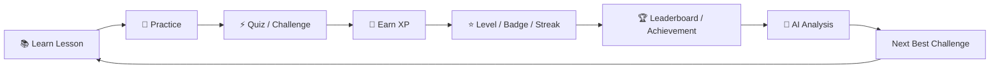
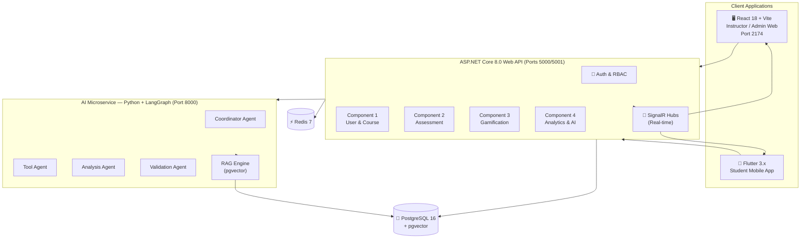

# EduFlow AI – SE3090 Assignment 1
## Integrated Gamified Education Platform with Agentic AI

> **Project vision:** EduFlow AI transforms traditional course delivery into an engaging, game-like learning experience. Students learn through lessons, quizzes, missions and challenges; earn XP, badges and achievements; maintain streaks; compete on leaderboards; and receive adaptive AI-generated learning challenges — all powered by a RAG-based AI knowledge system grounded in actual course materials.

> **Documentation start here:** See [INDEX.md](./INDEX.md) for a full navigation guide to all 20 documentation files.

---

## 1. The Problem We're Solving

```
Traditional LMS                        EduFlow AI
──────────────────────                 ──────────────────────
📋 PDFs and static content     →       🎮 Gamified learning journey
😴 No motivation               →       🔥 Streaks, XP, badges, leaderboard
🤷 Student disengaged          →       🤖 AI tutor available 24/7
📝 Same quiz for everyone      →       ⚡ Adaptive AI-personalized challenges
👨‍🏫 Instructor guesses gaps    →       📊 AI detects weak topics automatically
🗂️ Manual quiz creation        →       ✅ AI generates, instructor approves
```

**The core insight**: Students don't lack intelligence — they lack motivation and the right study experience. EduFlow AI fixes the experience, not the student.

---

## 2. Core Learning Loop



The AI layer makes the loop **adaptive** — it identifies what each student struggles with and tailors the next challenge to their specific gaps. The deterministic backend enforces the rules and rewards.

---

## 3. Team Structure

| Member | Business Component | Core Ownership | AI Agent |
|--------|------------------|----------------|----------|
| **Member 1** | User & Course Management | Users, roles, courses, modules, lessons, enrollments, document upload | Coordinator / Planner Agent |
| **Member 2** | Assessment & Quiz Engine | Quizzes, questions, quiz attempts, auto-grading, question bank, HITL review | Action / Tool Agent |
| **Member 3** | Gamification & Engagement | XP ledger, levels, badges, streaks, challenges, leaderboards | Domain Analysis Agent |
| **Member 4** | Analytics, Reporting & AI Validation | Analytics, reporting, HITL approval queue, audit logs, notifications | Validation / Safety Agent |

### Shared Responsibilities (All Members)

```text
✓ JWT authentication and RBAC integration
✓ API standards (DTOs, error codes, pagination)
✓ PostgreSQL migrations for owned tables
✓ React / Flutter integration contracts
✓ Unit and integration tests
✓ Documentation of owned component
✓ Error handling and audit logging
✓ CI/CD pipeline contribution
✓ Secure configuration (no hardcoded secrets)
```

---

## 4. System Architecture



---

## 5. Technology Stack

| Layer | Technology | Version | Purpose |
|-------|-----------|---------|---------|
| Backend | ASP.NET Core | 8.0 | REST API, SignalR, RBAC |
| Database | PostgreSQL + pgvector | 16 | Relational data + vector embeddings |
| Cache | Redis | 7.x | Leaderboards, hot-path cache |
| Web Frontend | React + Vite + Zustand | 18 | Instructor & Admin web portal |
| Mobile | Flutter + Riverpod | 3.x | Student learning app |
| AI Service | Python + FastAPI + LangGraph | 3.11 | Multi-agent AI orchestration |
| ORM | Entity Framework Core | 8 | Database access + migrations |
| Auth | JWT (RS256) + Refresh Tokens | — | Stateless authentication |
| Real-time | ASP.NET Core SignalR | — | XP toasts, badge alerts |
| Vector Search | pgvector (HNSW index) | — | Semantic document retrieval |
| LLM | OpenAI GPT-4o / local | — | Quiz generation, tutoring |
| CI/CD | GitHub Actions | — | Automated test + build |

---

## 6. Key Architectural Principles

### 6.1 Deterministic First, AI Second

```text
Deterministic backend (core rules, XP math, levels, badges)
                    +
         Gamification engine (events, streaks, missions)
                    +
            Agentic AI (LangGraph recommendations)
                    +
    Human-in-the-Loop review (instructor approval)
```

> **Mandate**: AI generates *drafts*. Instructors *approve*. Backend *enforces* rules.

### 6.2 AI Safety Boundary

The AI agents must NEVER directly:
- Assign grades or modify scores
- Write to the database
- Award XP or badges
- Publish content without instructor approval
- Access data from courses the student is not enrolled in

### 6.3 Human-in-the-Loop (HITL)

```text
Every AI-generated quiz question:
    Draft → Validation → Instructor Review → Approve/Edit/Reject → Publish

Every AI-generated study plan or challenge:
    Same pipeline

AI tutor chat responses:
    Auto-approved (informational, no grading impact)

AI document summaries:
    Auto-approved (read-only)
```

---

## 7. User Roles Summary

| Role | Interface | Key Power |
|------|-----------|-----------|
| **Admin** | React Web Portal | Full platform control, user management |
| **Instructor** | React Web Portal | Course authoring, AI quiz review, student monitoring |
| **Student** | Flutter Mobile App | Learning, quizzes, AI tutor, XP/badges, leaderboard |

**Critical rule**: Authorization is enforced **server-side by ASP.NET Core**. Frontend role checks are UI-only.

---

## 8. Database Entities Overview

```text
Member 1 owns:        Member 2 owns:        Member 3 owns:        Member 4 owns:
──────────────        ──────────────        ──────────────        ──────────────
users                 quizzes               xp_transactions       study_plans
roles                 questions             user_points           ai_workflows
user_roles            question_options      badges                ai_approvals
courses               quiz_submissions      user_badges           audit_logs
modules               submission_answers    streaks               notifications
lessons                                     challenges            reports
enrollments                                 student_challenges
course_documents
document_chunks
```

---

## 9. Core Domain Events

```text
UserRegistered          → Gamification initializes profile (C1 → C3)
LessonCompleted         → XP awarded, streak updated (C1 → C3)
QuizSubmitted           → XP, badges, streak, analytics (C2 → C3, C4)
QuizPerfectScore        → Bonus XP, PERFECT_SCORE badge (C2 → C3)
XPGranted               → Analytics tracks engagement (C3 → C4)
LevelUp                 → Animation in Flutter, analytics (C3 → C4)
BadgeUnlocked           → Notification, analytics (C3 → C4)
AtRiskStudentDetected   → Instructor alert, remedial challenge (C4 → C1, C3)
AIWorkflowCompleted     → Approval queue update (C4 → C2)
```

---

## 10. Implementation Order (10 Sprints)

| Sprint | Focus |
|--------|-------|
| 1 | Foundation: Git, Docker, PostgreSQL, ASP.NET Core 8, React setup, Flutter setup, JWT auth |
| 2 | Users, roles, profiles, courses, modules, lessons, enrollment |
| 3 | Quiz engine: questions, attempts, grading, attempt limits, timing |
| 4 | XP ledger, levels, badges, achievements, streak engine |
| 5 | Leaderboards (Redis), challenges, daily missions, engagement dashboard |
| 6 | Analytics, reports, notifications, at-risk detection |
| 7 | AI coordinator, tool agent, domain analysis agent, RAG pipeline |
| 8 | Validation/safety agent, HITL approval, audit trail, AI chat |
| 9 | End-to-end integration, real-time SignalR events, performance tuning |
| 10 | Testing (unit + integration + E2E), security hardening, deployment, documentation |

---

## 11. Definition of Done

A component is **NOT complete** when its API "works."

A component is **COMPLETE** when:

```text
✓ Database schema migrated (EF Core migrations)
✓ API endpoints implemented with proper DTOs
✓ Input validation on all endpoints
✓ Authorization enforced (role + ownership)
✓ React page or component exists for instructor/admin actions
✓ Flutter screen exists where student-facing
✓ Unit tests cover all business rules
✓ Integration tests cover critical flows
✓ Errors handled gracefully (no raw 500s to client)
✓ Audit logging for sensitive actions
✓ API documented in Swagger
✓ Component integrates via domain events
✓ AI responsibility demonstrated with HITL
✓ This component's doc file is updated
```

---

## 12. Important Design Rule

```text
AI should:    recommend, reason, generate, coordinate
Backend should: authorize, validate, calculate, persist, enforce

Example:
    AI: "Award 500 XP for this challenge."
              ↓
    Backend rule: "Maximum challenge XP = 150."
              ↓
    Backend normalizes to 150 XP and logs auto-fix.
    
The LLM is never the source of truth for grades, XP,
permissions, leaderboard scores, or database mutations.
```
