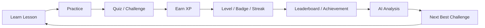
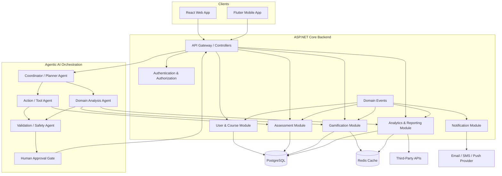
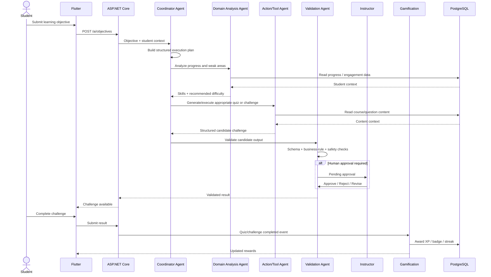

# EduFlow AI – SE3090 Assignment 1
## Integrated Gamified Education Platform with Agentic AI

> **Project vision:** EduFlow AI transforms traditional course delivery into an engaging, game-like learning experience. Students learn through lessons, quizzes, missions and challenges; earn XP, badges and achievements; maintain streaks; compete on leaderboards; and receive adaptive AI-generated learning challenges.

This implementation blueprint is organized around four business components owned by four members. Authentication/authorization and shared platform infrastructure are mandatory cross-cutting capabilities and should not be counted as one of the four main business components.

---

## 1. Core Product Goal

The product is **not simply an LMS with AI**.

The primary learning loop is:



The AI layer should make the loop adaptive rather than replacing deterministic platform rules.

### Product promise

> **Learn. Play. Compete. Master.**

---

# 2. Team Ownership

| Member | Business Component | Main Ownership | Agentic AI Role |
|---|---|---|---|
| Member 1 | User & Course Management | Users, roles, courses, modules, enrollments, profiles | Coordinator / Planner Agent |
| Member 2 | Assessments & Quizzes | Quizzes, questions, submissions, grading | Action / Tool Agent |
| Member 3 | Gamification & Engagement | XP, badges, streaks, achievements, leaderboards | Domain Analysis Agent |
| Member 4 | Analytics & Reporting | Analytics, reporting, external integration, audit/validation | Validation / Safety Agent |

### Shared mandatory responsibilities

All members contribute to:
- JWT authentication and RBAC integration
- API standards
- PostgreSQL migrations
- React/Flutter integration contracts
- automated testing
- documentation
- error handling
- audit logging
- CI/CD
- secure configuration

---

# 3. High-Level System Architecture



---

# 4. Integration Principle

The four components should behave as a **modular monolith first** unless the assignment specifically requires microservices.

Recommended internal structure:

```text
React Web
      \
       --> ASP.NET Core API --> Application Layer
      /                            |
Flutter                            +--> User/Course
                                   +--> Assessment
                                   +--> Gamification
                                   +--> Analytics
                                   +--> AI Orchestration
                                   |
                                   +--> PostgreSQL
                                   +--> Redis
                                   +--> External APIs
```

This avoids unnecessary operational complexity while preserving clean boundaries for future extraction.

---

# 5. Core End-to-End Workflow

## Example objective

A student submits:

> "I want to improve my Python programming and reach the next level."

### Workflow



---

# 6. Domain Events

The modules should communicate primarily through explicit domain events.

Recommended events:

```text
UserRegistered
CourseCreated
StudentEnrolled
LessonCompleted
QuizStarted
QuizSubmitted
QuizPassed
QuizPerfectScore
ChallengeCompleted
XPGranted
LevelUp
BadgeUnlocked
StreakUpdated
CompetitionJoined
LeaderboardChanged
AIObjectiveSubmitted
AIPlanCreated
AIGeneratedContentCreated
AIValidationPassed
AIValidationFailed
ApprovalRequested
ApprovalCompleted
NotificationRequested
ReportGenerated
```

### Event envelope

```json
{
  "eventId": "uuid",
  "eventType": "QuizCompleted",
  "occurredAt": "2026-08-16T18:30:00Z",
  "actorId": "uuid",
  "aggregateId": "uuid",
  "version": 1,
  "payload": {}
}
```

Rules:
1. Events must be immutable.
2. Handlers must be idempotent.
3. Event consumers must not trust client-provided XP.
4. Business rules remain server-side.

---

# 7. Shared Security Architecture

### Authentication

- JWT access token
- refresh token
- password hashing
- role-based authorization
- account status checks
- token rotation

### Roles

```text
Student
Instructor
Admin
```

### Authorization matrix

| Capability | Student | Instructor | Admin |
|---|---:|---:|---:|
| View published courses | ✓ | ✓ | ✓ |
| Enroll | ✓ | — | — |
| Take quiz | ✓ | — | — |
| View own progress | ✓ | — | ✓ |
| Manage course | — | ✓ | ✓ |
| Manage quizzes | — | ✓ | ✓ |
| Approve AI content | — | ✓ | ✓ |
| Configure gamification rules | — | Limited | ✓ |
| View system analytics | Limited | ✓ | ✓ |
| Manage users/roles | — | — | ✓ |

Never implement authorization only in React/Flutter. It must be enforced by ASP.NET Core.

---

# 8. Database Ownership

Each member owns the schema objects for their component, but cross-component foreign keys and shared audit conventions are agreed by the team.

Suggested ownership:

### Member 1

```text
users
roles
user_roles
profiles
courses
modules
lessons
enrollments
```

### Member 2

```text
quizzes
questions
answers
submissions
submission_answers
grades
```

### Member 3

```text
badges
achievements
user_points
xp_transactions
streaks
leaderboards
leaderboard_entries
gamification_rules
```

### Member 4

```text
analytics_snapshots
reports
report_history
ai_workflows
ai_workflow_steps
ai_approvals
audit_logs
integration_logs
notifications
```

---

# 9. Repository Structure

Recommended monorepo:

```text
eduflow-ai/
├── backend/
│   ├── EduFlow.Api/
│   ├── EduFlow.Application/
│   ├── EduFlow.Domain/
│   ├── EduFlow.Infrastructure/
│   └── EduFlow.Tests/
│
├── web/
│   └── eduflow-admin/
│
├── mobile/
│   └── eduflow-student/
│
├── ai/
│   ├── agents/
│   ├── tools/
│   ├── schemas/
│   └── tests/
│
├── docs/
│   ├── architecture/
│   ├── api/
│   ├── components/
│   └── ai/
│
├── docker/
├── .github/
└── README.md
```

---

# 10. Implementation Order

## Sprint 1
Foundation, Git, Docker, PostgreSQL, ASP.NET Core, React, Flutter, authentication.

## Sprint 2
Users, roles, profiles, courses, modules, lessons, enrollment.

## Sprint 3
Quiz engine, grading, attempts, question management.

## Sprint 4
XP, levels, badges, achievements, streak engine.

## Sprint 5
Leaderboards, challenges and engagement dashboard.

## Sprint 6
Analytics, reports, notifications and third-party integration.

## Sprint 7
AI coordinator, tool agent, domain analysis agent.

## Sprint 8
Validation/safety agent, human approval and audit trail.

## Sprint 9
End-to-end workflow integration, real-time events, performance.

## Sprint 10
Testing, security, deployment, documentation and final demo.

---

# 11. Definition of Done

A component is not complete when its API "works."

A component is complete when:

- DB schema is migrated
- API endpoints are implemented
- validation exists
- authorization exists
- React page exists
- Flutter page exists where applicable
- unit tests exist
- integration tests exist
- errors are handled
- audit requirements are covered
- API documentation is updated
- component integrates with domain events
- AI responsibility is demonstrated
- README/component document is updated

---

# 12. Important Design Rule

AI should **recommend, reason, generate and coordinate**.

Deterministic backend code should **authorize, validate, calculate, persist and enforce business rules**.

For example:

```text
AI: "Award 300 XP."
        ↓
Backend rule:
"Maximum XP for this challenge type = 150."
        ↓
Backend rejects/normalizes invalid value.
```

Do not let an LLM become the source of truth for grades, XP, permissions, leaderboards, eligibility, or database mutations.
