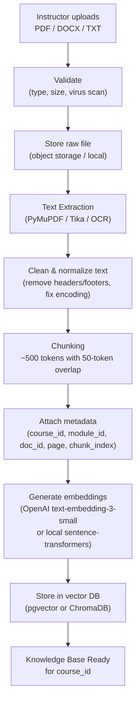
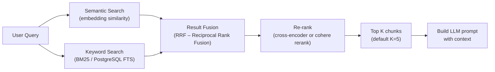
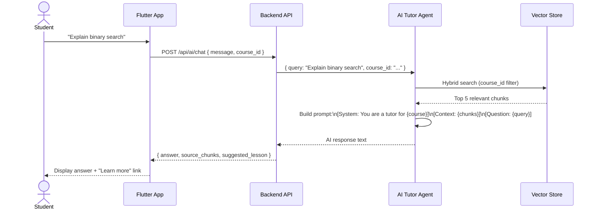
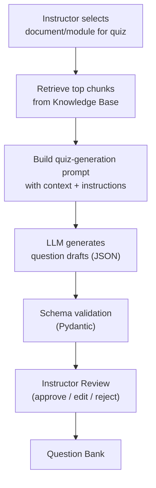

# EduFlow AI – RAG Architecture

> **Canonical design/reference document.** Read [Start here](../README.md) and the [responsibility matrix](../responsibilities/RESPONSIBILITY_MATRIX.md). Use [implementation status](17_IMPLEMENTATION_STATUS.md) and current source/evidence to distinguish implemented behavior from targets. Examples and proposed routes are not certified runtime results.

> **Reconciliation note:** The vector/chunk retrieval architecture below is DOCUMENTED ONLY in the [current audit](../responsibilities/RESPONSIBILITY_MATRIX.md). Existing document parsing and scope-based generation do not prove this full retrieval pipeline is operational. Student 2 owns academic document/topic/generation behavior, Student 3 learner guidance consumers and Student 1 shared access/safety governance. Database, storage and service contracts remain shared.

> The Retrieval-Augmented Generation (RAG) pipeline powers three core features:
> 1. **Document Summaries** – instructors and students get AI-generated summaries of uploaded materials
> 2. **AI Quiz Generation** – questions are grounded in actual course content
> 3. **AI Tutor Chat** – student questions are answered using course-specific knowledge

---

## 1. High-Level RAG Pipeline



---

## 2. Document Ingestion Detail

### 2.1 File Acceptance Rules

| Property | Rule |
|----------|------|
| Accepted formats | PDF, DOCX, TXT, MD |
| Max file size | 50 MB per file |
| Max files per course | 100 documents |
| Scoped to | Course (students can only query their enrolled courses) |

### 2.2 Text Extraction

```python
# Extraction strategy (priority order)
1. PyMuPDF (fitz) — for standard PDFs
2. Tesseract OCR — for scanned / image-based PDFs
3. python-docx — for DOCX files
4. Plain text reader — for TXT / MD
```

### 2.3 Chunking Strategy

```text
Strategy: Recursive character text splitter

chunk_size    = 500 tokens
chunk_overlap = 50 tokens
separators    = ["\n\n", "\n", ".", " "]

Why overlap? Preserves context across chunk boundaries so
answers don't get cut off mid-sentence.
```

### 2.4 Metadata per Chunk

```json
{
  "chunk_id": "uuid",
  "document_id": "uuid",
  "course_id": "uuid",
  "module_id": "uuid",
  "page_number": 5,
  "chunk_index": 12,
  "token_count": 487,
  "source_filename": "intro_to_python.pdf",
  "ingested_at": "2026-09-07T08:00:00Z"
}
```

---

## 3. Retrieval Strategy (Hybrid Search)

### 3.1 Hybrid = Keyword + Semantic



### 3.2 Why Hybrid?

| Approach | Strength | Weakness |
|----------|----------|----------|
| Semantic only | Understands meaning / paraphrase | Misses exact technical terms |
| Keyword only | Precise for exact terms (e.g., function names) | Fails for conceptual queries |
| **Hybrid** | **Best of both worlds** | Slightly more compute |

### 3.3 Course-Scoped Retrieval

```python
# Every retrieval call MUST filter by course_id
results = vector_store.similarity_search(
    query=user_query,
    filter={"course_id": student.enrolled_course_id},
    k=5
)
```

> ⚠️ **Security Rule**: Students must **never** be able to retrieve documents from courses they are not enrolled in. The `course_id` filter is enforced server-side, not client-side.

---

## 4. AI Tutor RAG Flow



### 4.1 Prompt Template

```text
SYSTEM:
You are an AI learning assistant for the course "{course_title}".
Your role is to help students understand course material.
Answer ONLY based on the provided context.
If the answer is not in the context, say so — do not invent information.
Always encourage the student to explore the related lesson.

CONTEXT (from course documents):
{retrieved_chunks}

STUDENT QUESTION:
{student_question}

RESPONSE FORMAT:
- Clear explanation (2-4 paragraphs)
- An example if relevant
- One follow-up question to check understanding
```

### 4.2 Anti-Hallucination Rules

```text
1. Always set temperature = 0.3 or lower for factual answers
2. Include source chunk references in response metadata
3. If retrieved chunks don't contain the answer:
   → Return: "I couldn't find information about this in your course materials.
               Please ask your instructor or check the lesson on {suggested_lesson}."
4. Never fabricate page numbers, formulas, or code examples not in the context
```

---

## 5. Document Summary Generation

### 5.1 Instructor-Requested Summary

```
POST /api/courses/{courseId}/documents/{docId}/summary

Body: { "scope": "full" | "module" | "page_range", "from_page": 1, "to_page": 20 }

Response:
{
  "title": "Chapter 3 – Recursion",
  "key_points": ["...", "...", "..."],
  "summary_text": "...",
  "topics_covered": ["recursion", "base case", "stack overflow"],
  "estimated_reading_time": "8 minutes"
}
```

### 5.2 Student-Requested Summary

Students can request summaries from the mobile app:

```text
Student → [📄 Get Summary] on a lesson
    │
    ▼
API retrieves chunks for that lesson's document
    │
    ▼
AI generates structured summary:
    ├── Key Points (bullet list)
    ├── Important Terms (glossary)
    └── Practice Suggestion (link to related quiz)
```

---

## 6. Quiz Generation RAG Flow

> Full detail in [11_QUIZ_PIPELINE.md](11_QUIZ_PIPELINE.md).



---

## 7. Vector Database Options

| Option | Use Case | Notes |
|--------|----------|-------|
| **pgvector** | Integrated into PostgreSQL | Simpler stack, good for MVP |
| **ChromaDB** | Standalone Python-native vector DB | Easy to set up locally |
| **Weaviate** | Production-grade, multi-modal | More infrastructure overhead |
| **Pinecone** | Cloud-managed, zero-ops | Paid service; good for scale |

**Recommended for MVP**: `pgvector` with PostgreSQL (already in the stack) → avoids a separate service.

### 7.1 pgvector Schema

```sql
CREATE EXTENSION IF NOT EXISTS vector;

CREATE TABLE document_chunks (
    id UUID PRIMARY KEY DEFAULT gen_random_uuid(),
    document_id UUID NOT NULL REFERENCES course_documents(id),
    course_id UUID NOT NULL REFERENCES courses(id),
    module_id UUID REFERENCES modules(id),
    chunk_index INTEGER NOT NULL,
    content TEXT NOT NULL,
    embedding vector(1536),  -- OpenAI text-embedding-3-small
    page_number INTEGER,
    token_count INTEGER,
    metadata JSONB,
    created_at TIMESTAMPTZ DEFAULT NOW()
);

-- HNSW index for fast approximate nearest neighbour search
CREATE INDEX ON document_chunks USING hnsw (embedding vector_cosine_ops);

-- Full-text search index for keyword retrieval
CREATE INDEX ON document_chunks USING gin(to_tsvector('english', content));
```

---

## 8. Performance & Scaling Considerations

| Concern | Solution |
|---------|----------|
| Large documents (500+ pages) | Process asynchronously; show "Processing..." status |
| Slow embeddings | Batch embedding API calls; cache results |
| High query volume | Cache common query embeddings for 10 minutes |
| Multi-language content | Use multilingual embedding model (e.g., `paraphrase-multilingual`) |
| Context window limits | Use top-K=5 chunks; summarize if total tokens > 3000 |

---

## 9. Privacy & Data Governance

```text
Rule 1: Documents are NEVER shared across institutions or courses
Rule 2: Student query logs are anonymized before AI analysis
Rule 3: Document content is NOT sent to third-party AI without instructor consent notice
Rule 4: All AI interactions are stored in audit_logs for compliance
Rule 5: Students can request deletion of their AI conversation history
```
