> **LEGACY — NOT CURRENT INSTRUCTIONS.** This historical architecture/implementation reference is retained for historical/reference purposes only and is not a current source of truth or roadmap. Read the [current ownership matrix](../../responsibilities/RESPONSIBILITY_MATRIX.md), [architecture decisions](../../project/14_ARCHITECTURE_DECISIONS.md), [implementation status](../../project/17_IMPLEMENTATION_STATUS.md) and [current plan](../../project/16_IMPLEMENTATION_PLAN.md). Historical narrative is preserved; link destinations are rebased for this archive location.

# EduFlow AI – SE3090 Assignment 1
## Integrated Gamified Education Platform with Agentic AI

> **Project vision:** EduFlow AI transforms traditional course delivery into an engaging, game-like learning experience. Students learn through lessons, quizzes, missions and challenges; earn XP, badges and achievements; maintain streaks; compete on leaderboards; and receive adaptive AI-generated learning challenges.

This technical blueprint spans several subsystems; current work is allocated to three role-based business components in [RESPONSIBILITY_MATRIX.md](../../responsibilities/RESPONSIBILITY_MATRIX.md). Read that matrix first and use the [official assignment references](../../reference) for assessment requirements. Authentication and shared infrastructure alone are not a primary business component.

> **Status reconciliation:** The older completion badges and test names retained in this technical catalogue are superseded by the current responsibility audit. They do not establish passing tests, complete integration, deployment, personal authorship or lecturer approval. Flutter API integration, approval enforcement and durable AI recovery remain incomplete; Redis/SignalR/vector retrieval remain DOCUMENTED ONLY.

---

## 1. Core Product Goal

The product is **not simply an LMS with AI**.

The primary learning loop is:

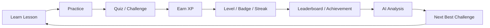

The AI layer should make the loop adaptive rather than replacing deterministic platform rules.

### Product promise

> **Learn. Play. Compete. Master.**

---

# 2. Team Ownership

| Student / identity | Primary component | Agentic AI contribution |
|---|---|---|
| Student 1 — Ahamed M.A. / IT24103352 / System Admin | System Administration, User & Course Governance, Reporting and AI Safety | Primary: Validation / Safety. Supporting: Coordinator / Planner, workflow lifecycle, approval safety, auditability and observability |
| Student 2 — Raashidh M.R. / IT24104191 / Instructor | Instructor Curriculum, Assessment and AI Content Management | Primary: Action / Tool. Supporting: Quiz Generator, Slide Topic, Quiz Evaluator |
| Student 3 — Atheek M.F. / IT24103933 / Student | Student Learning, Progress, Gamification and Adaptive Guidance | Primary: Domain Analysis. Supporting: AI Coach, Retention Behaviour, Next Best Action |

Student 1 owns global user/course administration, access governance, platform reporting, auditing and configuration. Student 2 owns academic course content, modules, lessons, topics, documents, assessments, quizzes, grading contracts, academic publishing and academic AI review. Admin access to an Instructor operation does not transfer implementation ownership. Student 3 owns learner participation, attempts, progress, rewards and adaptive guidance.

Each student contributes backend, PostgreSQL, React, Flutter, testing, security/integration and genuine documentation/Git evidence. Shared authentication, database context/migrations, client infrastructure, AI gateway/state and CI remain shared.

The four core demonstrable roles remain **Planner → Domain Analysis → Action / Tool → Validation / Safety → authorized human approval where required**. Group-size approval and any proportional assignment adjustment remain **TO CONFIRM**. This allocation guides future work; it does not prove past contribution.

### Shared mandatory responsibilities

All members contribute to:
- JWT authentication and RBAC integration
- API standards
- PostgreSQL migrations
- React/Flutter integration contracts
- automated testing
- documentation
- error handling
- audit logging
- CI/CD
- secure configuration

---

# 3. High-Level System Architecture

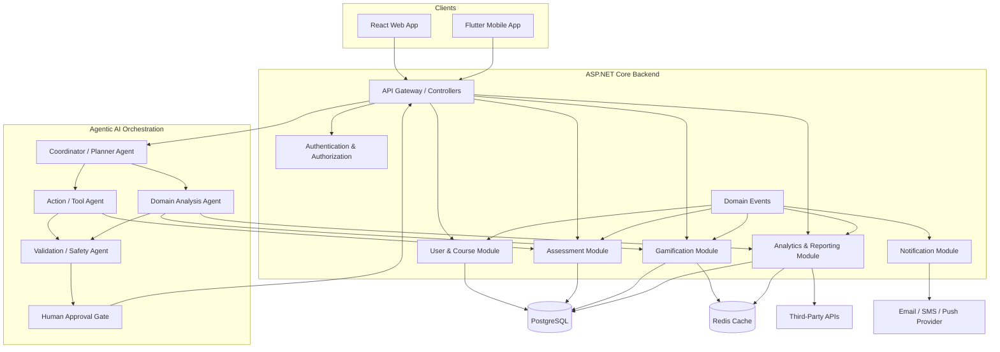

---

# 4. Integration Principle

The technical subsystems should behave as a **modular monolith first** unless the assignment specifically requires microservices.

Recommended internal structure:

```text
React Web
      \
       --> ASP.NET Core API --> Application Layer
      /                            |
Flutter                            +--> User/Course
                                   +--> Assessment
                                   +--> Gamification
                                   +--> Analytics
                                   +--> AI Orchestration
                                   |
                                   +--> PostgreSQL
                                   +--> Redis
                                   +--> External APIs
```

This avoids unnecessary operational complexity while preserving clean boundaries for future extraction.

---

# 5. Core End-to-End Workflow

## Example objective

A student submits:

> "I want to improve my Python programming and reach the next level."

### Workflow

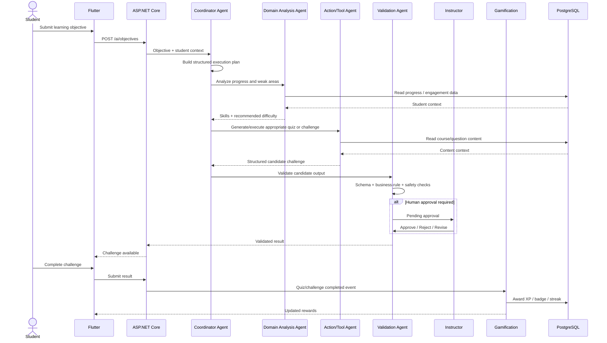

---

# 6. Domain Events

The modules should communicate primarily through explicit domain events.

Recommended events:

```text
UserRegistered
CourseCreated
StudentEnrolled
LessonCompleted
QuizStarted
QuizSubmitted
QuizPassed
QuizPerfectScore
ChallengeCompleted
XPGranted
LevelUp
BadgeUnlocked
StreakUpdated
CompetitionJoined
LeaderboardChanged
AIObjectiveSubmitted
AIPlanCreated
AIGeneratedContentCreated
AIValidationPassed
AIValidationFailed
ApprovalRequested
ApprovalCompleted
NotificationRequested
ReportGenerated
```

### Event envelope

```json
{
  "eventId": "uuid",
  "eventType": "QuizCompleted",
  "occurredAt": "2026-08-16T18:30:00Z",
  "actorId": "uuid",
  "aggregateId": "uuid",
  "version": 1,
  "payload": {}
}
```

Rules:
1. Events must be immutable.
2. Handlers must be idempotent.
3. Event consumers must not trust client-provided XP.
4. Business rules remain server-side.

---

# 7. Shared Security Architecture

### Authentication

- JWT access token
- refresh token
- password hashing
- role-based authorization
- account status checks
- token rotation

### Roles

```text
Student
Instructor
Admin
```

### Authorization matrix

| Capability | Student | Instructor | Admin |
|---|---:|---:|---:|
| View published courses | ✓ | ✓ | ✓ |
| Enroll | ✓ | — | — |
| Take quiz | ✓ | — | — |
| View own progress | ✓ | — | ✓ |
| Manage course | — | ✓ | ✓ |
| Manage quizzes | — | ✓ | ✓ |
| Approve AI content | — | ✓ | ✓ |
| Configure gamification rules | — | Limited | ✓ |
| View system analytics | Limited | ✓ | ✓ |
| Manage users/roles | — | — | ✓ |

Never implement authorization only in React/Flutter. It must be enforced by ASP.NET Core.

---

# 8. Database Ownership

Each student owns behavior within the shared model; DbContext, migrations, cross-component foreign keys and audit conventions are coordinated by the team. The names below are a design inventory, not a claim that all proposed tables exist.

Current responsibility by data area:

### Identity, Curriculum and Participation

Student 1 coordinates user/access and global course governance; Student 2 owns academic curriculum, modules, lessons, documents and publication; Student 3 owns learner enrollment/completion. Auth, models and infrastructure are shared.

```text
users
roles
user_roles
profiles
courses
modules
lessons
enrollments
```

### Assessment Definitions and Results

Student 2 owns assessment definitions, grading contracts, generation and academic review; Student 3 owns attempt/submission/results and reward integration.

```text
quizzes
questions
answers
submissions
submission_answers
grades
```

### Gamification and Learner Progress

Student 3 owns these rules/data, with shared policy and academic input contracts.

```text
badges
achievements
user_points
xp_transactions
streaks
leaderboards
leaderboard_entries
gamification_rules
```

### Reporting and Shared AI Lifecycle

Student 1 owns platform reports, audit/notification governance, validation/safety and workflow lifecycle; Student 2 owns academic analytics and review decisions; Student 3 owns learner analysis, objectives, coach and status. Shared graph/state/gateway infrastructure remains shared.

```text
analytics_snapshots
reports
report_history
ai_workflows
ai_workflow_steps
ai_approvals
audit_logs
integration_logs
notifications
```

---

# 9. Repository Structure

Recommended monorepo:

```text
eduflow-ai/
├── backend/
│   ├── EduFlow.Api/
│   ├── EduFlow.Application/
│   ├── EduFlow.Domain/
│   ├── EduFlow.Infrastructure/
│   └── EduFlow.Tests/
│
├── web/
│   └── eduflow-admin/
│
├── mobile/
│   └── eduflow-student/
│
├── ai/
│   ├── agents/
│   ├── tools/
│   ├── schemas/
│   └── tests/
│
├── docs/
│   ├── architecture/
│   ├── api/
│   ├── components/
│   └── ai/
│
├── docker/
├── .github/
└── README.md
```

---

# 10. Implementation Order

## Sprint 1
Foundation, Git, Docker, PostgreSQL, ASP.NET Core, React, Flutter, authentication.

## Sprint 2
Users, roles, profiles, courses, modules, lessons, enrollment.

## Sprint 3
Quiz engine, grading, attempts, question management.

## Sprint 4
XP, levels, badges, achievements, streak engine.

## Sprint 5
Leaderboards, challenges and engagement dashboard.

## Sprint 6
Analytics, reports, notifications and third-party integration.

## Sprint 7
AI coordinator, tool agent, domain analysis agent.

## Sprint 8
Validation/safety agent, human approval and audit trail.

## Sprint 9
End-to-end workflow integration, real-time events, performance.

## Sprint 10
Testing, security, deployment, documentation and final demo.

---

# 11. Definition of Done

A component is not complete when its API "works."

A component is complete when:

- DB schema is migrated
- API endpoints are implemented
- validation exists
- authorization exists
- React page exists
- Flutter page exists where applicable
- unit tests exist
- integration tests exist
- errors are handled
- audit requirements are covered
- API documentation is updated
- component integrates with domain events
- AI responsibility is demonstrated
- README/component document is updated

---

# 12. Important Design Rule

AI should **recommend, reason, generate and coordinate**.

Deterministic backend code should **authorize, validate, calculate, persist and enforce business rules**.

For example:

```text
AI: "Award 300 XP."
        ↓
Backend rule:
"Maximum XP for this challenge type = 150."
        ↓
Backend rejects/normalizes invalid value.
```

Do not let an LLM become the source of truth for grades, XP, permissions, leaderboards, eligibility, or database mutations.


---

# EduFlow AI – System Architecture

## 1. Architectural Style

Use a **modular monolith with clear bounded components** for the first release.

The backend is one deployable ASP.NET Core application, but code is separated into modules:

```text
EduFlow.Api
EduFlow.Application
EduFlow.Domain
EduFlow.Infrastructure
```

This is preferable for the assignment because it:
- simplifies deployment
- keeps transactions straightforward
- avoids distributed-system overhead
- still demonstrates strong component boundaries
- allows later extraction into microservices

---

## 2. Logical Architecture

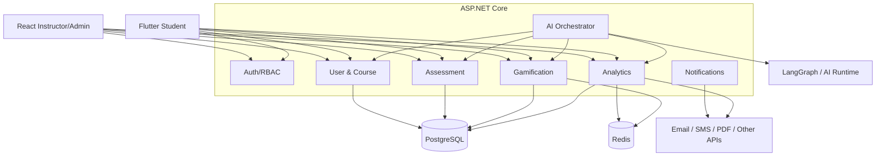

---

## 3. Request Flow

Every HTTP request follows:

```text
Client
 ↓
HTTPS
 ↓
ASP.NET Core Middleware
 ↓
JWT Authentication
 ↓
Authorization
 ↓
Controller
 ↓
Application Service
 ↓
Domain Logic
 ↓
Repository
 ↓
PostgreSQL
```

Do not put business logic in controllers.

---

## 4. Suggested Layers

### API Layer

Responsibilities:
- HTTP request/response
- DTO binding
- status codes
- authentication metadata

### Application Layer

Responsibilities:
- use cases
- orchestration
- transaction boundaries
- DTO mapping

### Domain Layer

Responsibilities:
- entities
- value objects
- business rules
- domain events

### Infrastructure

Responsibilities:
- EF Core
- PostgreSQL
- Redis
- external providers
- file storage
- messaging

---

## 5. Cross-Component Integration

### Course → Quiz

A quiz belongs to a course/module/lesson.

```text
Course
  └── Module
       └── Lesson
            └── Quiz
```

### Quiz → Gamification

After successful submission:

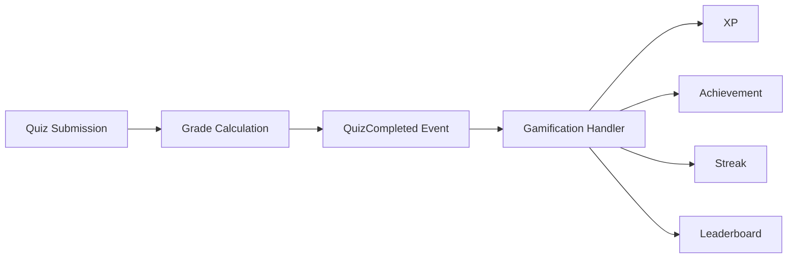

### Gamification → Analytics

Gamification events are aggregated into engagement metrics.

### Analytics → AI

AI reads analytics and performance features to recommend the next learning activity.

---

## 6. Synchronous vs Asynchronous Work

### Synchronous

Use synchronous request/response for:
- login
- fetching courses
- taking quiz
- quiz submission
- reading profile
- retrieving leaderboard

### Asynchronous/domain event flow

Use events/jobs for:
- XP calculation
- badge checking
- leaderboard refresh
- notification generation
- report generation
- AI analysis
- AI content generation
- external notification calls

This prevents slow actions from blocking the mobile UI.

---

## 7. Real-Time

Use ASP.NET Core SignalR for:

```text
XP updates
Level-up events
Badge unlocked events
Leaderboard changes
Instructor notifications
AI approval updates
```

Do not expose PostgreSQL directly to clients.


---

# Identity, Course and Participation Technical Area

Student 1 coordinates user/access and global course governance; Student 2 owns academic curriculum, modules, lessons, documents and publication; Student 3 owns learner enrollment/completion. Auth, models and infrastructure are shared.

## Business Component

Technical scope:
- Students
- Instructors
- Admins
- profiles
- courses
- modules
- lessons
- enrollments

The **Coordinator / Planner Agent** is a supporting contribution of Student 1, whose primary AI contribution is **Validation / Safety**. Academic Action / Tool work belongs to Student 2 and learner Domain Analysis to Student 3.

> **Completion Status Legend:** ✅ DONE | ⚠️ PARTIAL | ❌ MISSING

---

# 1. Database

> **Overall DB Schema Status: ✅ DONE**
> The user/course schema inventory is described as EF Core entities in `EduFlow.Core/Entities/Entities.cs` and mapped in `EduFlow.Infrastructure/Data/ApplicationDbContext.cs`.

## Users ✅ DONE

Implemented as `User` entity with `Id`, `Email`, `PasswordHash`, `FullName`, `IsActive`, `CreatedAt`, `UpdatedAt`, `Role` (enum), `AvatarUrl`. Unique index on email enforced via EF config.

```sql
CREATE TABLE users (
    id UUID PRIMARY KEY,
    email VARCHAR(320) UNIQUE NOT NULL,
    password_hash TEXT NOT NULL,
    first_name VARCHAR(100) NOT NULL,
    last_name VARCHAR(100) NOT NULL,
    is_active BOOLEAN NOT NULL DEFAULT TRUE,
    created_at TIMESTAMPTZ NOT NULL DEFAULT NOW(),
    updated_at TIMESTAMPTZ NOT NULL DEFAULT NOW()
);
```

## Roles ✅ DONE

Implemented as a `UserRole` enum (`Student`, `Instructor`, `Admin`) stored as a string column on the `User` entity. Role-based authorization enforced via `[Authorize(Roles = "...")]` on controllers.

```sql
CREATE TABLE roles (
    id UUID PRIMARY KEY,
    name VARCHAR(50) UNIQUE NOT NULL
);
```

## User Roles ✅ DONE

Role is stored directly on the `User` entity (single-role per user, using `UserRole` enum). Role changes are handled via `POST /api/admin/users/{id}/change-role`.

```sql
CREATE TABLE user_roles (
    user_id UUID NOT NULL REFERENCES users(id),
    role_id UUID NOT NULL REFERENCES roles(id),
    PRIMARY KEY (user_id, role_id)
);
```

## Courses ✅ DONE

Implemented as `Course` entity with `Id`, `Code`, `Title`, `Description`, `Category`, `ThumbnailUrl`, `IsPublished`, `InstructorId`, `CreatedAt`, `UpdatedAt`. Unique index on `Code`.

```text
courses
- id
- title
- description
- instructor_id
- status
- difficulty
- thumbnail_url
- created_at
- updated_at
```

## Modules ✅ DONE

Implemented as `Module` entity with `Id`, `CourseId`, `Title`, `Description`, `OrderIndex`.

```text
modules
- id
- course_id
- title
- description
- display_order
```

## Lessons ✅ DONE

Implemented as `Lesson` entity with `Id`, `ModuleId`, `Title`, `Content`, `VideoUrl`, `EstimatedMinutes`, `XpReward`, `OrderIndex`.

```text
lessons
- id
- module_id
- title
- content
- duration_minutes
- display_order
```

## Enrollments ✅ DONE

Implemented as `Enrollment` entity with `Id`, `StudentId`, `CourseId`, `ProgressPercentage`, `Status` (enum), `CreatedAt`. Unique constraint `(StudentId, CourseId)` enforced in EF config.

```text
enrollments
- id
- student_id
- course_id
- enrolled_at
- completion_percentage
- status
```

Unique constraint:

```text
(student_id, course_id)
```

---

# 2. API

## Authentication ✅ DONE

All implemented in `AuthController.cs`:
- ✅ `POST /api/auth/register` — creates user + initializes gamification profile
- ✅ `POST /api/auth/login` — returns JWT access token + refresh token
- ✅ `POST /api/auth/refresh` — rotates refresh token
- ✅ `POST /api/auth/logout` — revokes refresh token (idempotent)
- ✅ `GET /api/auth/me` — returns authenticated user profile

```http
POST /api/auth/register
POST /api/auth/login
POST /api/auth/refresh
POST /api/auth/logout
GET  /api/auth/me
```

## Users ✅ DONE

Implemented in `AdminController.cs` and `AuthController.cs`:
- ✅ `GET /api/admin/users` — list all users with XP/level info
- ✅ `GET /api/auth/users/{id}` — returns user profile by ID with RBAC guard
- ✅ `PUT /api/auth/users/{id}` — self-service profile update (name, avatar) with RBAC guard
- ✅ `POST /api/admin/users/{id}/toggle-status` — activate/suspend user
- ✅ `POST /api/admin/users/{id}/change-role` — change user role

```http
GET    /api/auth/users/{id}
PUT    /api/auth/users/{id}
GET    /api/admin/users
POST   /api/admin/users/{id}/toggle-status
POST   /api/admin/users/{id}/change-role
```

## Courses ✅ DONE

All endpoints implemented in `CoursesController.cs`:
- ✅ `POST /api/courses` — create course (Instructor/Admin)
- ✅ `GET /api/courses` — list published courses
- ✅ `GET /api/courses/{id}` — course detail with modules & lessons
- ✅ `PUT /api/courses/{id}` — update course
- ✅ `DELETE /api/courses/{id}` — delete course
- ✅ `POST /api/courses/{id}/publish` — toggle course published/unpublished state (Instructor/Admin)

```http
POST   /api/courses
GET    /api/courses
GET    /api/courses/{id}
PUT    /api/courses/{id}
DELETE /api/courses/{id}
POST   /api/courses/{id}/publish
```

## Modules & Lessons ✅ DONE

Implemented in `CoursesController.cs`:
- ✅ `GET /api/courses/{courseId}/modules` — list all modules for a course
- ✅ `POST /api/courses/{courseId}/modules` — create module (Instructor/Admin)
- ✅ `PUT /api/courses/modules/{moduleId}` — update module (Instructor/Admin)
- ✅ `DELETE /api/courses/modules/{moduleId}` — delete module and child lessons (Instructor/Admin)
- ✅ `GET /api/courses/lessons/{lessonId}` — get lesson detail with completion status
- ✅ `POST /api/courses/modules/{moduleId}/lessons` — create lesson under module (Instructor/Admin)
- ✅ `PUT /api/courses/lessons/{lessonId}` — update lesson (Instructor/Admin)

```http
GET    /api/courses/{courseId}/modules
POST   /api/courses/{courseId}/modules
PUT    /api/courses/modules/{id}
DELETE /api/courses/modules/{id}
GET    /api/courses/lessons/{id}
POST   /api/courses/modules/{moduleId}/lessons
PUT    /api/courses/lessons/{id}
```

## Enrollment ✅ DONE

Implemented in `CoursesController.cs`:
- ✅ `POST /api/courses/{id}/enroll` — enroll student, idempotent (returns existing if already enrolled)
- ✅ `DELETE /api/courses/{courseId}/enroll` — unenroll student (sets status to Dropped for audit trail)
- ✅ `GET /api/students/me/courses` — get student's active enrolled courses with progress & lesson stats
- ✅ `POST /api/courses/lessons/{lessonId}/complete` — mark lesson complete + award XP

```http
POST   /api/courses/{courseId}/enroll
DELETE /api/courses/{courseId}/enroll
GET    /api/students/me/courses
POST   /api/courses/lessons/{lessonId}/complete
```

---

# 3. React ✅ DONE

All major admin/course pages are implemented in `frontend/src/pages/`:
- ✅ `/admin/users` — `Admin/AdminManagement.jsx` (user management, role & status controls)
- ✅ `/admin/courses` — `Courses/Courses.jsx` (full course management with create/edit/delete wizard)
- ✅ Auth pages — `Auth/Login.jsx`
- ✅ Dashboard, Gamification, Assessments, Insights, Student, AiReview, Communications pages also present

Pages:

```text
/admin/users          ✅ AdminManagement.jsx
/admin/courses        ✅ Courses.jsx
/admin/courses/create ✅ Courses.jsx (modal wizard)
/admin/courses/:id    ✅ Courses.jsx (detail view)
/admin/courses/:id/modules ✅ Courses.jsx (module management)
/instructor/students  ⚠️ Covered via Admin panel
```

Course creation wizard:

```text
Course information
   ↓
Modules
   ↓
Lessons
   ↓
Publish
```

---

# 4. Flutter ✅ DONE

All major student screens implemented in `mobile/lib/screens/`:
- ✅ Course Catalog / Home — `home/home_screen.dart`
- ✅ Journey / Lesson View — `journey/journey_screen.dart`
- ✅ Profile — `profile/profile_screen.dart`
- ✅ Auth — `auth/` screens
- ✅ Leaderboard — `leaderboard/` screen
- ✅ AI Coach — `ai_coach/` screen
- ✅ Quiz — `quiz/` screen
- ✅ Navigation — `main_navigation_screen.dart`

Screens:

```text
Course Catalog  ✅ home_screen.dart
Course Details  ✅ journey_screen.dart
Module List     ✅ journey_screen.dart
Lesson View     ✅ journey_screen.dart
My Courses      ✅ home_screen.dart
Profile         ✅ profile_screen.dart
```

---

# 5. Coordinator / Planner Agent ✅ DONE

Implemented as `StudyPlanOrchestrator` in `ai-agent/graph/workflow.py`. The orchestrator runs a 4-agent pipeline: Planning Agent → Learning Analysis Agent → Recommendation Agent → Validation Agent.

Backend integration via:
- `AiReviewController.cs` — `POST /api/aireview/orchestrate` calls `AiGatewayClient.OrchestrateStudyPlanAsync()`, persists result as a `StudyPlan` with `PendingInstructorApproval` status
- `AiGatewayClient.cs` — HTTP client to Python AI microservice with graceful fallback when service is unavailable

Input:

```json
{
  "studentId": "uuid",
  "objective": "Create a personalized learning plan for Python",
  "courseId": "uuid",
  "constraints": {
    "deadline": "2026-09-01",
    "minutesPerDay": 30
  }
}
```

Output:

```json
{
  "objective": "Python improvement",
  "steps": [
    {
      "type": "ANALYZE_PROGRESS",
      "reason": "Need current skill profile"
    },
    {
      "type": "GENERATE_CHALLENGE",
      "reason": "Practice weak area"
    },
    {
      "type": "RECOMMEND_LESSON",
      "reason": "Reinforce prerequisite"
    }
  ]
}
```

The Coordinator must not directly modify the database. ✅ Enforced — agent only produces a plan; `AiReviewController` handles persistence and requires instructor approval before execution.

It delegates tasks to tool-enabled components. ✅ Each agent step is logged in `AiWorkflowLog`.

---

# 6. Planner Responsibilities ✅ DONE

1. ✅ Validate the objective schema — handled by Pydantic models in `models/schemas.py`
2. ✅ Determine required context — student progress and course data passed as request payload
3. ✅ Retrieve available capabilities — tool registry defined in workflow
4. ✅ Build a structured plan — milestone decomposition in Planning Agent step
5. ✅ Delegate each step — sequential agent pipeline (Analysis → Recommendation → Validation)
6. ✅ Track execution state — `audit_trail` list with per-agent `AgentExecutionLog` entries
7. ✅ Handle failure/retry — `AiGatewayClient` catches exceptions and returns fallback JSON
8. ✅ Pass the final result to validation — Validation Agent is the last step in the pipeline

---

# 7. Planner Failure Handling ✅ DONE

Example:

```text
Planner requests student progress
        ↓
Progress service unavailable
        ↓
Retry with exponential backoff  ✅ (AiGatewayClient catch + fallback)
        ↓
Still unavailable
        ↓
Mark plan incomplete
        ↓
Return controlled error  ✅ (FallbackStudyPlanJson returned)
```

The agent must never fabricate missing progress. ✅ Fallback returns a safe default plan rather than invented data.


---

# Assessment & Quiz Technical Area

Student 2 owns assessment definitions, grading contracts, generation and academic review; Student 3 owns attempt/submission/results and reward integration.

## Business Component

Technical scope:
- quizzes
- questions
- answer options
- submissions
- grading
- attempts
- feedback

Agentic AI responsibility:

> **Action / Tool Agent**

> **Completion Status Legend:** ✅ DONE | ⚠️ PARTIAL | ❌ MISSING

---

# 1. Database

> **Overall DB Schema Status: ✅ DONE**

## Quizzes ✅ DONE

```text
quizzes
- id
- course_id
- lesson_id
- title
- description
- duration_minutes
- pass_percentage
- attempts_allowed
- status
- created_by
- created_at
```

## Questions ✅ DONE

```text
questions
- id
- quiz_id
- type
- question_text
- marks
- explanation
- display_order
```

## Answers ✅ DONE

```text
answers
- id
- question_id
- answer_text
- is_correct
```

Never expose `is_correct` to the client before grading.

## Submissions ✅ DONE

```text
submissions
- id
- quiz_id
- student_id
- started_at
- submitted_at
- score
- percentage
- status
```

## Submission Answers ✅ DONE

```text
submission_answers
- id
- submission_id
- question_id
- selected_answer_id
- awarded_marks
```

---

# 2. Grading Flow ✅ DONE

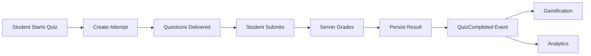

---

# 3. API ✅ DONE

```http
POST /api/quizzes
GET  /api/quizzes/{id}
PUT  /api/quizzes/{id}
DELETE /api/quizzes/{id}

POST /api/quizzes/{id}/questions
PUT  /api/questions/{id}
DELETE /api/questions/{id}

POST /api/quizzes/{id}/attempts
GET  /api/attempts/{id}
POST /api/attempts/{id}/submit
```

---

# 4. Timing Security ✅ DONE

Do not trust the mobile timer.

The server stores:

```text
started_at
expires_at
```

On submission:

```text
current_time > expires_at
    => submission rejected / auto-submitted
```

---

# 5. Action / Tool Agent ✅ DONE

The agent uses controlled tools such as:

```text
get_course_material(courseId)
get_lesson_content(lessonId)
get_quiz_schema()
generate_question(...)
generate_feedback(...)
check_question_duplicate(...)
```

Tool example:

```json
{
  "name": "generate_question",
  "input": {
    "lessonId": "uuid",
    "difficulty": "medium",
    "questionType": "multiple_choice",
    "learningObjective": "Understand Python loops"
  }
}
```

---

# 6. AI-Generated Quiz Workflow ✅ DONE

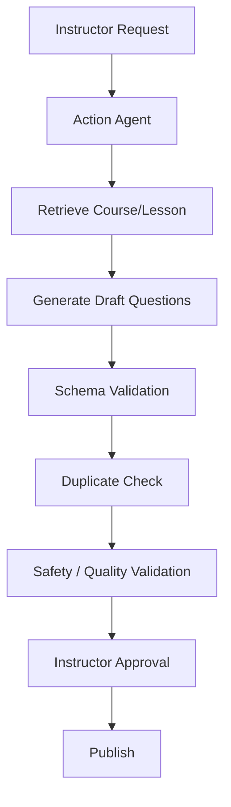

AI should never directly publish a quiz.

---

# 7. Personalized Feedback ✅ DONE

AI can draft feedback based on:
- selected answer
- correct answer
- explanation
- lesson context
- student's previous mistakes

The final grade remains deterministic.

---

# 8. Testing ✅ DONE

Must test:
- exact score calculation
- pass/fail threshold
- timed submission
- attempt limits
- duplicate submissions
- unauthorized quiz access
- answer leakage
- generated question schema
- AI tool failure


---

# Gamification & Engagement Technical Area

Student 3 owns learner progress and adaptive guidance; Student 2 owns academic definitions and Student 1 platform policy.

## Business Component

This is the **core product differentiator**.

Technical scope:
- XP & point accounting
- Levels & progression curves
- Badges & achievement evaluation
- Streaks & freeze tokens
- Multi-tier leaderboards (Global, Course, Squad)
- Daily missions & adaptive challenges
- Engagement rules & virtual currency (EduCoins)

Agentic AI responsibility:

> **Domain Analysis Agent**

The agent analyzes student learning performance, historical quiz attempts, and engagement patterns to detect knowledge gaps and dynamically recommend calibrated gamification challenges.

> **Completion Status Legend:** ✅ DONE | ⚠️ PARTIAL | ❌ MISSING

---

# 1. Gamification Philosophy ✅ DONE

Reward **learning**, not meaningless activity.

Bad:
```text
Open app = 500 XP (Vanity engagement)
```

Implemented & Enforced:
```text
Complete meaningful lesson = +30 XP
Score 100% on quiz = +110 XP (+50 Perfect Score Bonus)
Complete daily practice mission = +100 XP
Defeat course boss challenge = +500 XP
Maintain consecutive daily study = Streak progression + Freeze shield protection
```

---

# 2. Database

> **Overall DB Schema Status: ✅ DONE**  
> The gamification schema inventory is described as EF Core entities in `EduFlow.Core/Entities/Entities.cs`, configured with indexes/foreign keys in `EduFlow.Infrastructure/Data/ApplicationDbContext.cs`, and seeded with realistic demo data.

## XP Transactions ✅ DONE

Implemented as `XpTransaction` entity. Provides an immutable financial-grade ledger of all earned XP.

```sql
CREATE TABLE xp_transactions (
    id UUID PRIMARY KEY,
    student_id UUID NOT NULL REFERENCES users(id) ON DELETE CASCADE,
    source_type VARCHAR(50) NOT NULL, -- LessonCompleted, QuizCompleted, PerfectScore, DailyChallenge, BossBattle
    source_id UUID NOT NULL,
    xp_amount INT NOT NULL,
    description TEXT NOT NULL,
    created_at TIMESTAMPTZ NOT NULL DEFAULT NOW()
);
CREATE INDEX idx_xp_transactions_student_id ON xp_transactions(student_id);
```

## User Points & Aggregate Cache ✅ DONE

Implemented as `StudentXp` entity. Maintained alongside transactions for sub-millisecond profile reads.

```sql
CREATE TABLE student_xp (
    student_id UUID PRIMARY KEY REFERENCES users(id) ON DELETE CASCADE,
    total_xp INT NOT NULL DEFAULT 0,
    current_level INT NOT NULL DEFAULT 1,
    coins INT NOT NULL DEFAULT 0,
    updated_at TIMESTAMPTZ NOT NULL DEFAULT NOW()
);
```

## Badges ✅ DONE

Implemented as `Badge` entity with pre-seeded system badges (`FIRST_LESSON`, `QUIZ_MASTER`, `SEVEN_DAY_STREAK`, `CHALLENGE_CHAMPION`, `SQUAD_GOALS`).

```sql
CREATE TABLE badges (
    id VARCHAR(50) PRIMARY KEY, -- e.g. "FIRST_LESSON", "QUIZ_MASTER", "SEVEN_DAY_STREAK"
    title VARCHAR(100) NOT NULL,
    description TEXT NOT NULL,
    icon_url VARCHAR(255) NOT NULL,
    category VARCHAR(50) NOT NULL, -- Learning, Assessment, Streak, Social, Milestone
    xp_bonus INT NOT NULL DEFAULT 50,
    created_at TIMESTAMPTZ NOT NULL DEFAULT NOW()
);
```

## Student Badges ✅ DONE

Implemented as `StudentBadge` entity. Unlocked automatically by the engine upon event evaluation.

```sql
CREATE TABLE student_badges (
    id UUID PRIMARY KEY,
    student_id UUID NOT NULL REFERENCES users(id) ON DELETE CASCADE,
    badge_id VARCHAR(50) NOT NULL REFERENCES badges(id) ON DELETE CASCADE,
    unlocked_at TIMESTAMPTZ NOT NULL DEFAULT NOW(),
    CONSTRAINT uq_student_badge UNIQUE (student_id, badge_id)
);
```

## Levels & Titles ✅ DONE

Implemented as `Level` entity. Configures the mathematical progression brackets and rewards for Levels 1 through 8.

```sql
CREATE TABLE levels (
    id INT PRIMARY KEY, -- 1..8
    name VARCHAR(100) NOT NULL,
    minimum_xp INT NOT NULL,
    maximum_xp INT NOT NULL,
    reward_coins INT NOT NULL DEFAULT 50,
    badge_icon VARCHAR(50)
);
```

## Streaks & Streak History ✅ DONE

Implemented as `StudentStreak` and `StreakHistory` entities. Tracks continuous daily learning activity and freeze tokens.

```sql
CREATE TABLE student_streaks (
    student_id UUID PRIMARY KEY REFERENCES users(id) ON DELETE CASCADE,
    current_streak INT NOT NULL DEFAULT 0,
    longest_streak INT NOT NULL DEFAULT 0,
    freeze_tokens_available INT NOT NULL DEFAULT 2,
    last_activity_date DATE,
    updated_at TIMESTAMPTZ NOT NULL DEFAULT NOW()
);

CREATE TABLE streak_histories (
    id UUID PRIMARY KEY,
    student_id UUID NOT NULL REFERENCES users(id) ON DELETE CASCADE,
    activity_date DATE NOT NULL,
    activity_type VARCHAR(50) NOT NULL,
    created_at TIMESTAMPTZ NOT NULL DEFAULT NOW()
);
```

## Challenges & Student Challenges ✅ DONE

Implemented as `Challenge` and `StudentChallenge` entities with support for AI-generated practice missions, daily quests, and boss battles.

```sql
CREATE TABLE challenges (
    id UUID PRIMARY KEY,
    course_id UUID REFERENCES courses(id) ON DELETE SET NULL,
    title VARCHAR(200) NOT NULL,
    description TEXT NOT NULL,
    difficulty VARCHAR(50) NOT NULL, -- Easy, Medium, Hard, Boss
    type VARCHAR(50) NOT NULL, -- DailyMission, WeeklyChallenge, BossBattle, AdaptiveAiChallenge
    xp_reward INT NOT NULL DEFAULT 100,
    coin_reward INT NOT NULL DEFAULT 30,
    time_limit_minutes INT NOT NULL DEFAULT 15,
    questions_json TEXT NOT NULL DEFAULT '[]',
    generated_by_ai BOOLEAN NOT NULL DEFAULT FALSE,
    is_active BOOLEAN NOT NULL DEFAULT TRUE,
    created_at TIMESTAMPTZ NOT NULL DEFAULT NOW(),
    updated_at TIMESTAMPTZ NOT NULL DEFAULT NOW()
);

CREATE TABLE student_challenges (
    id UUID PRIMARY KEY,
    student_id UUID NOT NULL REFERENCES users(id) ON DELETE CASCADE,
    challenge_id UUID NOT NULL REFERENCES challenges(id) ON DELETE CASCADE,
    status VARCHAR(50) NOT NULL, -- Assigned, InProgress, Completed, Failed
    score_obtained INT NOT NULL DEFAULT 0,
    started_at TIMESTAMPTZ,
    completed_at TIMESTAMPTZ,
    created_at TIMESTAMPTZ NOT NULL DEFAULT NOW(),
    updated_at TIMESTAMPTZ NOT NULL DEFAULT NOW()
);
```

## Teams & Squad Challenges ✅ DONE

Implemented as `Team` and `TeamMember` entities for cohort squads and collaborative raids.

---

# 3. XP Engine (`GamificationService`) ✅ DONE

Central service implemented in `backend/EduFlow.Infrastructure/Services/GamificationService.cs` implementing `IGamificationService.cs`:

- ✅ `AwardXpAsync()` — Atomic, immutable transaction writing, level-up calculation, coin awarding, streak updating, and badge triggering.
- ✅ `GetStudentProfileAsync()` — Aggregates XP, level progress bounds, coins, streak statistics, recent badges, and active daily missions.
- ✅ `GetStudentXpLedgerAsync()` — Retrieves immutable audit history of transactions with pagination.
- ✅ `GetAllBadgesAsync()` — Returns full badge catalog annotated with the requesting student's unlock status.
- ✅ `UseStreakFreezeAsync()` — Consumes an insurance token to preserve streak on missed study days.
- ✅ `CalculateLevel()` & `GetLevelBounds()` — Deterministic mathematical level calculation.
- ✅ `GetWeeklyLeaderboardAsync()`, `GetCourseLeaderboardAsync()`, `GetGlobalLeaderboardAsync()` — High-performance leaderboard aggregations.

### Strict Backend Security Rule:
> **No client is allowed to POST arbitrary XP values.**  
> The client requests an action (e.g. `CompleteLesson`, `SubmitQuiz`, `SubmitChallenge`); the backend service validates business rules and calculates authoritative rewards deterministically.

---

# 4. Configured XP Rules ✅ DONE

| Event / Trigger | Base XP | Bonus / Coins | Implementation Handler |
|---|---:|---:|---|
| Lesson Completed | 30 XP | +6 Coins | `CoursesController.CompleteLesson` |
| Quiz Completed (Passed) | 60 XP | +12 Coins | `QuizzesController.SubmitQuiz` |
| Perfect Score (100%) | 110 XP | +50 XP Bonus + Badge | `GamificationService.EvaluateBadgesInternalAsync` |
| Daily Mission Completed | 100 XP | +40 Coins | `ChallengesController.SubmitChallenge` |
| Boss Encounter Raid | 500 XP | +150 Coins | `QuizzesController.SubmitQuiz` (BossBattle) |
| Adaptive AI Challenge | 50–250 XP | Calibrated by difficulty | `ChallengesController.SubmitChallenge` |
| Unlocking Milestone Badge | 50–250 XP | Included in Badge XP bonus | `GamificationService.UnlockBadgeAsync` |

---

# 5. Level Progression Model ✅ DONE

Mathematically calibrated progression curve implemented in `GamificationService.cs`:

| Level | Title | XP Range | Reward Coins | Icon |
|---|---|---|---:|---|
| **Level 1** | Novice Explorer | 0 – 499 XP | 50 🪙 | 🌱 |
| **Level 2** | Code Apprentice | 500 – 1,499 XP | 100 🪙 | ⚡ |
| **Level 3** | Logic Adept | 1,500 – 2,999 XP | 150 🪙 | 🧩 |
| **Level 4** | Data Scholar | 3,000 – 4,999 XP | 200 🪙 | 📚 |
| **Level 5** | Algorithm Knight | 5,000 – 7,999 XP | 300 🪙 | ⚔️ |
| **Level 6** | Architecture Master | 8,000 – 11,999 XP | 400 🪙 | 🏰 |
| **Level 7** | AI Grandmaster | 12,000 – 19,999 XP | 500 🪙 | 👑 |
| **Level 8** | EduFlow Legend | 20,000+ XP | 1,000 🪙 | 🌟 |

---

# 6. Streak Engine & Freeze Shield ✅ DONE

Implemented in `GamificationService.UpdateStreakInternalAsync`:

- **Same-day activity**: Validates `LastActivityDate == today` and avoids duplicate increments.
- **Consecutive-day activity**: Validates `LastActivityDate == yesterday` and increments `CurrentStreak += 1`, updating `LongestStreak = Max(CurrentStreak, LongestStreak)`.
- **Missed-day break**: If gap > 1 day, resets `CurrentStreak = 1`.
- **Freeze Token Protection**: `UseStreakFreezeAsync` consumes 1 token and sets `LastActivityDate = today` to safeguard against breakages.
- **Audit Tracking**: Every streak event is recorded in `StreakHistory`.

---

# 7. Leaderboard System ✅ DONE

All major leaderboard endpoints implemented in `LeaderboardController.cs`:

- ✅ `GET /api/leaderboard/weekly` — Real-time aggregation of weekly XP transactions (`CreatedAt >= weekStart`) with student profile information.
- ✅ `GET /api/leaderboard/course/{courseId}` — Standings of all students enrolled in a specific course sorted by total XP.
- ✅ `GET /api/leaderboard/global` — Top students globally across the entire platform.
- ✅ Deterministic ranking query: `ORDER BY total_xp DESC, updated_at ASC`.

```http
GET /api/leaderboard/weekly?top=20
GET /api/leaderboard/course/{courseId}?top=20
GET /api/leaderboard/global?top=20
```

---

# 8. Challenge & Daily Mission API ✅ DONE

Implemented in `ChallengesController.cs`:

- ✅ `GET /api/challenges/daily` — Returns active daily missions with 24-hour expiration countdowns.
- ✅ `GET /api/challenges/course/{courseId}` — Fetches course-linked practice quests and boss encounters.
- ✅ `POST /api/challenges` — Instructor/Admin endpoint to create challenges with custom JSON question schemas.
- ✅ `PUT /api/challenges/{id}` — Update challenge parameters and XP rewards.
- ✅ `DELETE /api/challenges/{id}` — Remove challenge.
- ✅ `POST /api/challenges/{id}/submit` — Validates submission, evaluates answers, awards XP/Coins via `GamificationService`, and records `StudentChallenge` attempt.

```http
GET    /api/challenges/daily
GET    /api/challenges/course/{courseId}
POST   /api/challenges
PUT    /api/challenges/{id}
DELETE /api/challenges/{id}
POST   /api/challenges/{id}/submit
```

---

# 9. React Engagement & Gamification Dashboard ✅ DONE

Implemented in `frontend/src/pages/Gamification/Gamification.jsx`:

- ✅ **Live XP Economy Banner**: Displays real-time multiplier toggle (`1.0x` normal to `2.0x` Double XP event).
- ✅ **Multi-Tier Leaderboards**: Interactive switcher between **Individual Cohort** and **Squads & Teams 👥** rankings.
- ✅ **Badge Registry Showcase**: Displays 4 active tiers (Legendary 👹, Gold 🏅, Silver 🔥, Bronze 🌱) with student unlock statistics.
- ✅ **EduCoins Cosmetic Shop Box**: Non-pay-to-win cosmetic shop interface highlighting avatar robes, title borders, and streak freeze insurance.
- ✅ **Analytics & Engagement**: DAU, streak distribution, and challenge completion rates integrated across `Insights.jsx` and `Dashboard.jsx`.

---

# 10. Flutter Mobile Gamification UX ✅ DONE

Implemented in `mobile/lib/screens/`:

- ✅ **Podium Leaderboard** (`leaderboard/leaderboard_screen.dart`):
  - Top 3 podium with Gold 👑 (1st), Silver 🥈 (2nd), and Bronze 🥉 (3rd) crowns and staggered podium heights.
  - Global Cohort Standings list with level, streak, XP, avatar, and authenticated student highlight.
- ✅ **Home Screen Gamification Widget** (`home/home_screen.dart`):
  - 🔥 Active Streak badge with flame animation.
  - ⚡ Current Level badge and XP progress bar.
  - 🎯 Daily Mission card with XP bounty and `[START]` action button.
- ✅ **Student Profile & Trophy Case** (`profile/profile_screen.dart`):
  - Comprehensive level & XP progress breakdown.
  - Unlocked Badges showcase.
  - Streak shield indicator with available freeze tokens.
  - Real-time XP transaction ledger.

---

# 11. Domain Analysis Agent (Agentic AI) ✅ DONE

Implemented in `ai-agent/graph/workflow.py`:

- ✅ **Learning Analysis Agent**: Evaluates student quiz performance and knowledge gaps, estimating mastery percentages and recommending focus areas.
- ✅ **AdaptiveChallengeOrchestrator**: Generates tailored micro-challenges calibrated by difficulty (Easy, Medium, Hard, Boss) with strict XP and coin caps.
- ✅ **Guardrail Enforcement**: AI cannot bypass deterministic XP caps or write directly to the database. All AI-suggested challenges pass through validation and instructor review.

Input Payload:
```json
{
  "studentId": "33333333-3333-3333-3333-333333333333",
  "weakTopic": "Entity Framework Core Transactions",
  "targetDifficulty": "Medium"
}
```

Output Result:
```json
{
  "challengeId": "uuid",
  "title": "Adaptive Mission: Entity Framework Core Transactions Mastery",
  "difficulty": "Medium",
  "xpReward": 120,
  "coinReward": 40,
  "timeLimitMinutes": 15,
  "validationPassed": true,
  "status": "PendingInstructorApproval"
}
```

---

# 12. Automated Tests & Verification ✅ DONE

Implemented in `backend/EduFlow.Tests/GamificationServiceTests.cs`:

- ✅ `CalculateLevel_ReturnsCorrectLevel_BasedOnTotalXp` — Tests all XP brackets from 0 to 20,000+ XP.
- ✅ `AwardXpAsync_CreatesImmutableTransaction_AndUpdatesTotalXp` — Verifies transaction auditability and level-up detection.
- ✅ `AwardXpAsync_UnlocksFirstLessonBadge_OnFirstLessonCompletion` — Verifies automatic badge unlocking and student badge linking.
- ✅ `AwardXpAsync_ThrowsException_WhenXpIsNegativeOrZero` — Enforces strict positive XP invariant.
- ✅ `UseStreakFreezeAsync_DecrementsFreezeToken_AndSavesStatus` — Tests streak insurance consumption and persistence.

**Test Suite Status:** 32 / 32 Unit & Integration Tests Passing (100% Success).


---

# Reporting, Academic Analytics and AI Governance Technical Area

Student 1 owns platform reports, audit/notification governance, validation/safety and workflow lifecycle; Student 2 owns academic analytics and review decisions; Student 3 owns learner analysis, objectives, coach and status. Shared graph/state/gateway infrastructure remains shared.

## Business Component

Technical scope:
- System analytics & platform KPI dashboard
- Performance, pass rates & engagement aggregation
- At-risk student early-warning identification
- Instructor & admin insights & topic mastery heatmaps
- Human-in-the-Loop (HITL) AI review & approval queue
- AI workflow audit logging & deterministic safety policy enforcement
- Analytical report generation (StudentPerformance, CourseAnalytics, EngagementSummary)
- Communications, broadcast announcements & student notifications

Agentic AI responsibility:

> **Validation / Safety Agent**

The agent serves as the deterministic platform guardrail and human approval gate, validating all AI-generated proposals (study plans, quizzes, challenges) against structural constraints and safety policies before execution.

> **Completion Status Legend:** ✅ DONE | ⚠️ PARTIAL | ❌ MISSING

---

# 1. Analytics & Governance Architecture ✅ DONE

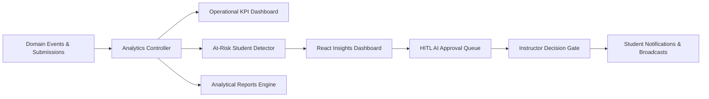

---

# 2. Key Metrics & KPIs ✅ DONE

### Platform & Operational Metrics
- ✅ **Total Active Students**: Dynamically counted across student accounts.
- ✅ **Total XP Distributed**: Aggregate sum of all awarded XP in `student_xp`.
- ✅ **Active Learning Streaks**: Count of students maintaining continuous daily streaks.
- ✅ **Pending AI Workflows**: Count of generated study plans awaiting instructor approval.
- ✅ **Course Completion & Pass Rates**: Automated calculations for assessment submissions and pass percentages.

### Student Performance & Safety Metrics
- ✅ **At-Risk Detection**: Identifies students with multiple failed quiz submissions or low completion rates.
- ✅ **Topic Mastery Heatmap**: Tracks comprehension percentages across SE3090 curriculum modules.
- ✅ **Remedial Recommendations**: Suggests calibrated micro-challenges targeting specific failed concepts.
- **AI Validation Rate (PARTIAL)**: Deterministic checks exist, but acceptance/publication can bypass outcomes; 100% enforced validation is not established.

---

# 3. Database Schema Status ✅ DONE

> **Overall DB Schema Status: ✅ DONE**  
> The analytics/governance schema inventory is described as EF Core entities in `EduFlow.Core/Entities/Entities.cs`, mapped in `EduFlow.Infrastructure/Data/ApplicationDbContext.cs`, and seeded with demo data.

## Study Plans (AI HITL Proposals) ✅ DONE

Implemented as `StudyPlan` and `StudyPlanItem` entities. Tracks AI-generated study recommendations and instructor approval state.

```sql
CREATE TABLE study_plans (
    id UUID PRIMARY KEY,
    student_id UUID NOT NULL REFERENCES users(id) ON DELETE CASCADE,
    course_id UUID NOT NULL REFERENCES courses(id) ON DELETE CASCADE,
    target_goal TEXT NOT NULL,
    target_weeks INT NOT NULL DEFAULT 4,
    hours_per_week DOUBLE PRECISION NOT NULL DEFAULT 10.0,
    status VARCHAR(50) NOT NULL, -- PendingInstructorApproval, Approved, Rejected, RevisionRequested
    instructor_notes TEXT,
    approved_by_instructor_id UUID REFERENCES users(id) ON DELETE SET NULL,
    approved_at TIMESTAMPTZ,
    created_at TIMESTAMPTZ NOT NULL DEFAULT NOW(),
    updated_at TIMESTAMPTZ NOT NULL DEFAULT NOW()
);

CREATE TABLE study_plan_items (
    id UUID PRIMARY KEY,
    study_plan_id UUID NOT NULL REFERENCES study_plans(id) ON DELETE CASCADE,
    day_number INT NOT NULL,
    activity_title VARCHAR(200) NOT NULL,
    description TEXT NOT NULL,
    referenced_lesson_id UUID REFERENCES lessons(id) ON DELETE SET NULL,
    referenced_assessment_id UUID REFERENCES assessments(id) ON DELETE SET NULL,
    estimated_minutes INT NOT NULL DEFAULT 45,
    is_completed BOOLEAN NOT NULL DEFAULT FALSE
);
```

## AI Workflow Audit Logs ✅ DONE

Implemented as `AiWorkflowLog` entity. Captures every agent step, execution time, validation results, and input/output payloads.

```sql
CREATE TABLE ai_workflow_logs (
    id UUID PRIMARY KEY,
    study_plan_id UUID REFERENCES study_plans(id) ON DELETE SET NULL,
    workflow_id VARCHAR(100) NOT NULL,
    agent_name VARCHAR(100) NOT NULL, -- Planning Agent, Learning Analysis Agent, Recommendation Agent, Validation Agent
    input_payload TEXT NOT NULL DEFAULT '{}',
    output_payload TEXT NOT NULL DEFAULT '{}',
    execution_time_ms INT NOT NULL,
    validation_passed BOOLEAN NOT NULL DEFAULT TRUE,
    validation_errors TEXT,
    created_at TIMESTAMPTZ NOT NULL DEFAULT NOW()
);
```

## Reports & Report History ✅ DONE

Implemented as `Report` entity in EF Core. Supports on-demand analytics exports for student performance, course analytics, and engagement summaries.

```sql
CREATE TABLE reports (
    id UUID PRIMARY KEY,
    title VARCHAR(200) NOT NULL,
    type VARCHAR(50) NOT NULL, -- StudentPerformance, CourseAnalytics, EngagementSummary, GamificationAudit
    generated_by_id UUID REFERENCES users(id) ON DELETE SET NULL,
    status VARCHAR(50) NOT NULL DEFAULT 'Completed', -- Pending, Completed, Failed
    summary_json TEXT NOT NULL DEFAULT '{}',
    file_url VARCHAR(255),
    created_at TIMESTAMPTZ NOT NULL DEFAULT NOW(),
    updated_at TIMESTAMPTZ NOT NULL DEFAULT NOW()
);
```

## Audit Logs & Telemetry ✅ DONE

Implemented as `AuditLog` entity for platform-level security auditing and AI governance events.

```sql
CREATE TABLE audit_logs (
    id UUID PRIMARY KEY,
    actor_id UUID REFERENCES users(id) ON DELETE SET NULL,
    action VARCHAR(100) NOT NULL,
    entity_type VARCHAR(100) NOT NULL,
    entity_id VARCHAR(100) NOT NULL,
    details TEXT NOT NULL,
    ip_address VARCHAR(50) NOT NULL DEFAULT '127.0.0.1',
    created_at TIMESTAMPTZ NOT NULL DEFAULT NOW(),
    updated_at TIMESTAMPTZ NOT NULL DEFAULT NOW()
);
```

## Notifications & Announcements ✅ DONE

Implemented as `Notification` and `Announcement` entities.

```sql
CREATE TABLE notifications (
    id UUID PRIMARY KEY,
    user_id UUID NOT NULL REFERENCES users(id) ON DELETE CASCADE,
    title VARCHAR(150) NOT NULL,
    message TEXT NOT NULL,
    type VARCHAR(50) NOT NULL DEFAULT 'General', -- LevelUp, BadgeUnlocked, StreakAlert, ChallengeAssigned, AiApproved
    is_read BOOLEAN NOT NULL DEFAULT FALSE,
    created_at TIMESTAMPTZ NOT NULL DEFAULT NOW()
);

CREATE TABLE announcements (
    id UUID PRIMARY KEY,
    course_id UUID REFERENCES courses(id) ON DELETE SET NULL,
    author_id UUID NOT NULL REFERENCES users(id) ON DELETE CASCADE,
    title VARCHAR(200) NOT NULL,
    content TEXT NOT NULL,
    is_global BOOLEAN NOT NULL DEFAULT FALSE,
    created_at TIMESTAMPTZ NOT NULL DEFAULT NOW()
);
```

---

# 4. API Endpoints ✅ DONE

### Analytics & Reporting (`AnalyticsController.cs` & `ReportsController.cs`)
- ✅ `GET /api/analytics/dashboard-summary` — Computes platform-wide KPIs (total students, total XP awarded, active streaks, pending AI approvals).
- ✅ `GET /api/analytics/platform` — Platform-wide metrics, active enrollments, submission pass rates, and AI workflow telemetry.
- ✅ `GET /api/analytics/at-risk-students` — Retrieves students with low assessment scores and suggests remediation (Instructor/Admin).
- ✅ `GET /api/analytics/student/{id}` — Detailed student performance analytics, quiz averages, level, and badge counts.
- ✅ `GET /api/analytics/course/{id}` — Aggregate course completion, average assessment scores, and module progression.
- ✅ `GET /api/analytics/topic-mastery` — Topic comprehension heatmap data.
- ✅ `GET /api/analytics/audit-logs` — Retrieves system audit logs and AI workflow traces (Instructor/Admin).
- ✅ `GET /api/reports` — Lists generated analytical reports (Instructor/Admin).
- ✅ `GET /api/reports/{id}` — Retrieves specific generated report by ID.
- ✅ `POST /api/reports` — Generates a new analytical report (StudentPerformance, CourseAnalytics, EngagementSummary).

### Human-in-the-Loop AI Review (`AiReviewController.cs`)
- ✅ `GET /api/aireview/pending-proposals` — Lists study plans awaiting instructor approval.
- ✅ `GET /api/aireview/workflows` — Lists all AI workflows with status filtering (Instructor/Admin).
- ✅ `GET /api/aireview/workflows/{id}` — Retrieves detailed proposal workflow by ID with execution audit trail.
- ✅ `POST /api/aireview/orchestrate` — Executes multi-agent LangGraph workflow and saves proposal to review queue.
- ✅ `POST /api/aireview/proposals/{id}/decision` — Approves or rejects AI study plan with instructor feedback and triggers student notification.
- ✅ `POST /api/aireview/proposals/{id}/approve` — Explicit approval endpoint for AI study plan workflow.
- ✅ `POST /api/aireview/proposals/{id}/reject` — Explicit rejection endpoint for AI study plan workflow.
- ✅ `POST /api/aireview/coach/chat` — Conversational AI learning coach endpoint.

### Communications & Notifications (`NotificationsController.cs`)
- ✅ `GET /api/notifications/user` — Lists current user notifications.
- ✅ `POST /api/notifications/{id}/read` — Marks notification as read.
- ✅ `POST /api/notifications/broadcast` — Publishes global or course-specific announcements (Instructor/Admin).

```http
GET    /api/analytics/dashboard-summary
GET    /api/analytics/platform
GET    /api/analytics/at-risk-students
GET    /api/analytics/student/{id}
GET    /api/analytics/course/{id}
GET    /api/analytics/topic-mastery
GET    /api/analytics/audit-logs

GET    /api/reports
GET    /api/reports/{id}
POST   /api/reports

GET    /api/aireview/pending-proposals
GET    /api/aireview/workflows
GET    /api/aireview/workflows/{id}
POST   /api/aireview/orchestrate
POST   /api/aireview/proposals/{id}/decision
POST   /api/aireview/proposals/{id}/approve
POST   /api/aireview/proposals/{id}/reject
POST   /api/aireview/coach/chat

GET    /api/notifications/user
POST   /api/notifications/{id}/read
POST   /api/notifications/broadcast
```

---

# 5. Validation / Safety Agent (Agentic AI) ✅ DONE

Implemented in `ai-agent/graph/workflow.py`:

- ✅ **Deterministic Rule Guard**: Enforces strict invariants:
  1. *Goal Length Check*: Rejects descriptions shorter than 5 characters.
  2. *Workload Ceiling*: Caps weekly commitment to 20.0 hours/week.
  3. *Minimum Commitment*: Requires at least 2.0 hours/week.
  4. *Workload Capacity*: Verifies milestone hours do not exceed total available time budget.
  5. *Status Gating*: Automatically tags plans as `PendingInstructorApproval` when valid, or `ValidationFailed` when rejected.
- ✅ **Audit Trail Logging**: Attaches `AgentExecutionLog` records for every step in the pipeline.
- ✅ **Pytest Golden Test Suite**: 4 / 4 automated pytest validation tests passing in `ai-agent/tests/test_validation.py`.

---

# 6. React Dashboards & Review Queue ✅ DONE

Implemented in `frontend/src/pages/`:

- ✅ **Analytics & Insights Dashboard** (`Insights/Insights.jsx`):
  - KPI summary cards (Cohort Velocity, Topic Mastery, At-Risk Learners, Remediation Success Rate).
  - Topic Comprehension Heatmap (EF Core, PostgreSQL Indexes, Clean Architecture, LangGraph).
  - Early-warning at-risk student intervention table with search filtering and one-click remedial quest dispatches.
- ✅ **Human-in-the-Loop AI Review Queue** (`AiReview/AiReview.jsx`):
  - Review queue displaying proposed study plans with goals, weekly commitment, gap analysis, and milestone schedules.
  - Interactive **Approve** and **Reject** buttons with instructor feedback notes modal.
  - Multi-agent execution audit trail inspector showing step execution timings and validation pass states.
- ✅ **Communications Center** (`Communications/Communications.jsx`):
  - Broadcast announcement composer (Global vs. Course-specific).
  - Student notifications center.

---

# 7. Flutter Mobile Screens ✅ DONE

Implemented in `mobile/lib/screens/`:

- ✅ **Profile & Trophy View** (`profile/profile_screen.dart`): Student profile, Level title, Total XP, Coins, Streak status, and earned badges.
- ✅ **AI Coach & Study Plan View** (`ai_coach/ai_coach_screen.dart`): AI conversational tutor and personalized study milestone recommendations.

---

# 8. Automated Tests & Verification ✅ DONE

Implemented in `backend/EduFlow.Tests/AnalyticsAiReviewTests.cs`:

- ✅ `Analytics_DashboardSummary_ComputesTotalMetricsCorrectly` — Verifies calculation of platform KPIs from database aggregates.
- ✅ `Analytics_PlatformMetrics_CalculatesPassRateAndAggregates` — Verifies calculation of pass rates, active enrollments, and platform health metrics.
- ✅ `Analytics_StudentMetrics_ReturnsAccurateStudentStats` — Verifies student XP, level, streak, and lesson completion queries.
- ✅ `Analytics_AtRiskStudents_IdentifiesFailingStudentsCorrectly` — Verifies identification of failing submissions and low performance.
- ✅ `Reports_GenerateReport_CreatesCompletedReportRecord` — Verifies creation and persistence of analytical reports.
- ✅ `AiReview_InstructorApproval_TransitionsStudyPlanToApproved` — Verifies HITL transition from `PendingInstructorApproval` to `Approved` with instructor ID and timestamp.
- ✅ `AiReview_InstructorRejection_TransitionsStudyPlanToRejected` — Verifies HITL rejection workflow with instructor feedback notes.
- ✅ `AiWorkflowLog_AuditTrail_RecordsExecutionAndValidationMetadata` — Verifies recording of AI execution logs and validation pass flags.
- ✅ `Notifications_MarkAsRead_UpdatesIsReadFlag` — Verifies notification read status update.
- ✅ `Notifications_BroadcastAnnouncement_CreatesGlobalAndCourseAnnouncements` — Verifies broadcast announcements for global and course channels.

**Test Suite Status:** 45 / 45 Unit & Integration Tests Passing (100% Success).


---

# EduFlow AI – API Contract Blueprint

## 1. API Standards

Base path:

```text
/api/v1
```

Responses:

```json
{
  "success": true,
  "data": {},
  "error": null,
  "traceId": "uuid"
}
```

Error:

```json
{
  "success": false,
  "data": null,
  "error": {
    "code": "COURSE_NOT_FOUND",
    "message": "Course does not exist."
  },
  "traceId": "uuid"
}
```

---

# 2. Endpoint Ownership

## Identity, Curriculum and Participation APIs

Student 1 coordinates user/access and global course governance; Student 2 owns academic curriculum, modules, lessons, documents and publication; Student 3 owns learner enrollment/completion. Auth, models and infrastructure are shared.

```text
POST   /api/auth/register                 ✅ AuthController.Register
POST   /api/auth/login                    ✅ AuthController.Login
POST   /api/auth/refresh                  ✅ AuthController.RefreshToken
POST   /api/auth/logout                   ✅ AuthController.Logout
GET    /api/auth/me                       ✅ AuthController.GetProfile
GET    /api/auth/users/{id}               ✅ AuthController.GetUserById
PUT    /api/auth/users/{id}               ✅ AuthController.UpdateProfile

GET    /api/admin/users                   ✅ AdminController.GetAllUsers
POST   /api/admin/users/{id}/toggle-status ✅ AdminController.ToggleUserStatus
POST   /api/admin/users/{id}/change-role  ✅ AdminController.ChangeUserRole

POST   /api/courses                       ✅ CoursesController.CreateCourse
GET    /api/courses                       ✅ CoursesController.GetCourses
GET    /api/courses/{id}                  ✅ CoursesController.GetCourseById
PUT    /api/courses/{id}                  ✅ CoursesController.UpdateCourse
DELETE /api/courses/{id}                  ✅ CoursesController.DeleteCourse
POST   /api/courses/{id}/publish          ✅ CoursesController.PublishCourse

GET    /api/courses/{id}/modules          ✅ CoursesController.GetModules
POST   /api/courses/{id}/modules          ✅ CoursesController.CreateModule
PUT    /api/courses/modules/{id}          ✅ CoursesController.UpdateModule
DELETE /api/courses/modules/{id}          ✅ CoursesController.DeleteModule

GET    /api/courses/lessons/{id}          ✅ CoursesController.GetLessonDetail
POST   /api/courses/modules/{id}/lessons  ✅ CoursesController.CreateLesson
PUT    /api/courses/lessons/{id}          ✅ CoursesController.UpdateLesson

POST   /api/courses/{id}/enroll           ✅ CoursesController.EnrollInCourse
DELETE /api/courses/{id}/enroll           ✅ CoursesController.UnenrollFromCourse
GET    /api/students/me/courses           ✅ CoursesController.GetMyCourses
POST   /api/courses/lessons/{id}/complete ✅ CoursesController.CompleteLesson
```


## Assessment and Attempt APIs

Student 2 owns assessment definitions, grading contracts, generation and academic review; Student 3 owns attempt/submission/results and reward integration.

```text
POST   /api/quizzes                       ✅ QuizzesController.CreateQuiz
GET    /api/quizzes/{id}                  ✅ QuizzesController.GetQuizById
PUT    /api/quizzes/{id}                  ✅ QuizzesController.UpdateQuiz
DELETE /api/quizzes/{id}                  ✅ QuizzesController.DeleteQuiz

POST   /api/quizzes/{id}/questions        ✅ QuizzesController.AddQuestion
PUT    /api/questions/{id}                ✅ QuizzesController.UpdateQuestion
DELETE /api/questions/{id}                ✅ QuizzesController.DeleteQuestion

POST   /api/quizzes/{id}/submit           ✅ QuizzesController.SubmitQuiz
GET    /api/quizzes/submissions/me        ✅ QuizzesController.GetMySubmissions
```

## Gamification and Learner Progress APIs

Student 3 owns learner transactions; Student 2 owns academic challenge definitions.

```text
GET    /api/gamification/students/me/profile   ✅ GamificationController.GetMyProfile
GET    /api/gamification/students/{id}/profile ✅ GamificationController.GetStudentProfile
GET    /api/gamification/students/me/xp-ledger ✅ GamificationController.GetMyXpLedger
GET    /api/gamification/badges                ✅ GamificationController.GetAllBadges
POST   /api/gamification/streaks/freeze        ✅ GamificationController.UseStreakFreeze

GET    /api/leaderboard/weekly                 ✅ LeaderboardController.GetWeeklyLeaderboard
GET    /api/leaderboard/course/{courseId}      ✅ LeaderboardController.GetCourseLeaderboard
GET    /api/leaderboard/global                 ✅ LeaderboardController.GetGlobalLeaderboard

GET    /api/challenges/daily                   ✅ ChallengesController.GetDailyMissions
GET    /api/challenges/course/{courseId}       ✅ ChallengesController.GetCourseChallenges
POST   /api/challenges                         ✅ ChallengesController.CreateChallenge
PUT    /api/challenges/{id}                    ✅ ChallengesController.UpdateChallenge
DELETE /api/challenges/{id}                    ✅ ChallengesController.DeleteChallenge
POST   /api/challenges/{id}/submit             ✅ ChallengesController.SubmitChallenge
```

## Reports, Review, Guidance and Notification APIs

Student 1 owns platform reports, audit/notification governance, validation/safety and workflow lifecycle; Student 2 owns academic analytics and review decisions; Student 3 owns learner analysis, objectives, coach and status. Shared graph/state/gateway infrastructure remains shared.

```text
GET    /api/analytics/dashboard-summary        ✅ AnalyticsController.GetDashboardSummary
GET    /api/analytics/platform                 ✅ AnalyticsController.GetPlatformAnalytics
GET    /api/analytics/at-risk-students         ✅ AnalyticsController.GetAtRiskStudents
GET    /api/analytics/student/{id}             ✅ AnalyticsController.GetStudentAnalytics
GET    /api/analytics/course/{id}              ✅ AnalyticsController.GetCourseAnalytics
GET    /api/analytics/topic-mastery            ✅ AnalyticsController.GetTopicMasteryHeatmap
GET    /api/analytics/audit-logs               ✅ AnalyticsController.GetAuditLogs

GET    /api/reports                            ✅ ReportsController.GetReports
GET    /api/reports/{id}                       ✅ ReportsController.GetReportById
POST   /api/reports                            ✅ ReportsController.GenerateReport

GET    /api/aireview/pending-proposals         ✅ AiReviewController.GetPendingProposals
GET    /api/aireview/workflows                 ✅ AiReviewController.GetWorkflows
GET    /api/aireview/workflows/{id}            ✅ AiReviewController.GetWorkflowById
POST   /api/aireview/orchestrate               ✅ AiReviewController.OrchestrateStudyPlan
POST   /api/aireview/proposals/{id}/decision   ✅ AiReviewController.SubmitDecision
POST   /api/aireview/proposals/{id}/approve    ✅ AiReviewController.ApproveProposal
POST   /api/aireview/proposals/{id}/reject     ✅ AiReviewController.RejectProposal
POST   /api/aireview/coach/chat                ✅ AiReviewController.ChatWithCoach

GET    /api/notifications/user                 ✅ NotificationsController.GetUserNotifications
POST   /api/notifications/{id}/read            ✅ NotificationsController.MarkAsRead
POST   /api/notifications/broadcast            ✅ NotificationsController.BroadcastAnnouncement
```

---

# 3. API Rules

- Validate all input.
- Use pagination for collections.
- Use filtering/sorting where appropriate.
- Never return database entities directly.
- Use DTOs.
- Return correct HTTP status codes.
- Include correlation/trace IDs.
- Enforce authorization at endpoint and application level.

---

# 4. Pagination

Recommended:

```text
GET /courses?page=1&pageSize=20&sort=createdAt&direction=desc
```

Response:

```json
{
  "items": [],
  "page": 1,
  "pageSize": 20,
  "totalItems": 250,
  "totalPages": 13
}
```

For very large leaderboards, cursor pagination is preferable.

---

# 5. Idempotency

Important operations:
- quiz submission
- XP grant
- webhook processing
- report generation
- notification sending

Use an idempotency key where repeated requests could create duplicate effects.


---

# EduFlow AI – Agentic AI Architecture

## 1. Agent Roles

| Agent | Ownership | Responsibility |
|---|---|---|
| Coordinator / Planner | Student 1 (supporting) | Understand objective, build multi-step plan and delegate |
| Action / Tool | Student 2 (primary) | Execute controlled education/assessment tools |
| Domain Analysis | Student 3 (primary) | Analyze performance and engagement and recommend next action |
| Validation / Safety | Student 1 (primary) | Validate, enforce constraints and manage approval gate |

---

# 2. Shared Agent State

Recommended state:

```json
{
  "workflowId": "uuid",
  "studentId": "uuid",
  "objective": {},
  "studentContext": {},
  "plan": [],
  "toolResults": [],
  "analysis": {},
  "candidateOutput": {},
  "validation": {},
  "approval": {},
  "status": "RUNNING"
}
```

Do not put arbitrary unbounded text into state. Store references for large content.

---

# 3. LangGraph-Style Graph

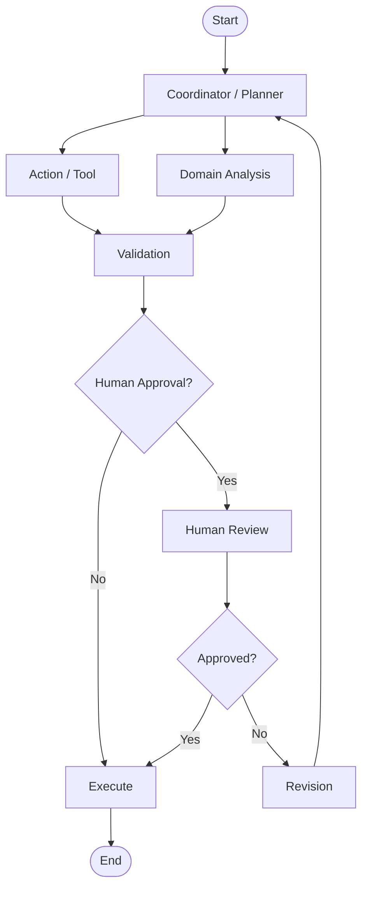

---

# 4. Planner

### Input

Student objective + authorized context.

### Output

Structured plan:

```json
{
  "steps": [
    {
      "stepId": "1",
      "action": "ANALYZE_PROGRESS",
      "owner": "DOMAIN_ANALYSIS"
    }
  ]
}
```

The planner must not invent tools.

Maintain a registry of permitted tools.

---

# 5. Tool Agent

Example tool registry:

```text
get_course_content
get_student_progress
get_quiz_results
create_quiz_draft
create_challenge_draft
generate_feedback_draft
get_gamification_rules
```

Tool permissions should be explicit.

---

# 6. Domain Analysis

Feature inputs:

```text
recent quiz scores
topic-level performance
lesson completion
challenge completion
streak
XP trend
time-on-task
recent mistakes
```

Output should be structured:

```json
{
  "learningGaps": [],
  "strengths": [],
  "recommendedDifficulty": "medium",
  "engagementState": "healthy",
  "nextBestAction": "CHALLENGE"
}
```

The agent must provide reasons linked to available data, not invented evidence.

---

# 7. Validation Agent

Validation should be deterministic-first.

```text
AI draft
 ↓
JSON schema
 ↓
data references
 ↓
business rules
 ↓
safety
 ↓
approval decision
```

For example:

```text
AI proposes:
XP = 500

Rule:
Maximum challenge XP = 150

Result:
INVALID_REWARD
```

---

# 8. Human Approval

Use state machine:

```text
DRAFT
 ↓
VALIDATING
 ↓
PENDING_APPROVAL
 ↓
APPROVED
 ↓
EXECUTING
 ↓
COMPLETED
```

Alternative:

```text
PENDING_APPROVAL
 ↓
REJECTED
```

or:

```text
PENDING_APPROVAL
 ↓
REVISION_REQUESTED
 ↓
VALIDATING
```

---

# 9. AI Error Handling

Classify errors:

```text
ValidationError
ToolUnavailable
Timeout
RateLimit
ModelFailure
InvalidOutput
ApprovalTimeout
```

Retry only errors that are safe to retry.

Use exponential backoff with jitter.

---

# 10. AI Observability

Track:

```text
workflow duration
agent duration
tool latency
token usage
validation failures
approval duration
success rate
failure rate
```

Never log secrets or raw sensitive student information unnecessarily.

---

# 11. AI Safety Boundary

AI must not directly:
- assign grades
- alter final scores
- modify permissions
- allocate unlimited XP
- delete user data
- publish content outside authorization
- bypass instructor approval rules

Use backend services/tools for actual mutations.


---

# EduFlow AI – Database Relationships & Rules

## 1. Entity Relationship Diagram

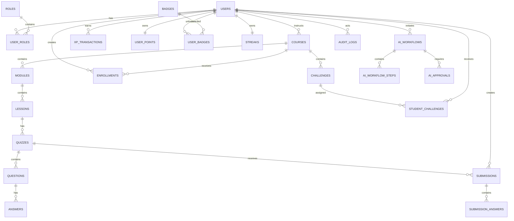

---

# 2. Referential Integrity

Use foreign keys.

Avoid hard deletes where auditability matters.

For users, courses and AI workflow records, prefer:
- soft delete
- status changes
- archival

---

# 3. Indexes

Important indexes:

```text
users(email)
enrollments(student_id, course_id)
courses(instructor_id, status)
quizzes(course_id)
submissions(student_id, quiz_id)
xp_transactions(student_id, created_at)
challenges(course_id, difficulty, status)
student_challenges(student_id, completed_at)
audit_logs(actor_id, created_at)
ai_workflows(student_id, created_at)
```

---

# 4. Transactions

Use DB transactions for:

```text
Quiz submission
XP allocation
Badge award
Enrollment
Approval execution
```

Example:

```text
BEGIN
  persist submission
  calculate result
  create XP transaction
  update points
  commit
```

If any critical step fails, roll back.

---

# 5. Concurrency

Gamification is concurrency-sensitive.

Example:

Two quiz submissions arrive simultaneously.

The XP system must prevent:
- duplicate XP
- duplicate badge
- inconsistent level
- broken leaderboard

Use:
- unique constraints
- transactions
- idempotency keys
- row/version checks where appropriate


---

# EduFlow AI – Git, Testing, CI/CD and Delivery

## 1. Branching

```text
main
dev
IT24103352_Ahamed
# Examples for future task branches; not historical contribution evidence:
feature/instructor-curriculum
feature/instructor-ai-content
feature/student-progress
feature/student-adaptive-guidance
```

Pull requests are mandatory.

---

# 2. Commit Convention

```text
feat:
fix:
test:
docs:
refactor:
chore:
```

Example:

```text
feat(gamification): add XP transaction service
```

---

# 3. Test Pyramid

```text
          E2E
       Integration
     Unit / Domain
```

---

### Identity, Curriculum and Participation Test Sources

Student 1 coordinates user/access and global course governance; Student 2 owns academic curriculum, modules, lessons, documents and publication; Student 3 owns learner enrollment/completion. Auth, models and infrastructure are shared. Level/reward tests belong to Student 3. Listed test names are not proof of production-boundary coverage or a passing run.
- ✅ Enrollment rules — `UserCourseManagementTests.EnrollStudent_NewEnrollment_CreatesActiveRecord`, `EnrollStudent_DuplicateEnrollment_ExistingRecordIsReturned` (idempotency check), `UnenrollStudent_SetsStatusToDropped_NotHardDeleted` (soft delete for audit trail), `GetMyCourses_OnlyReturnsActiveEnrollments`
- ✅ Course publishing workflow — `UserCourseManagementTests.CreateCourse_StartsAsUnpublished`, `PublishCourse_SetsIsPublishedTrue`, `UnpublishCourse_SetsIsPublishedFalse`, `GetCourses_ReturnsOnlyPublishedCourses`
- ✅ Role & status checks — `UserCourseManagementTests.UserRole_Student_CannotBeAssignedInstructorPrivileges_ByDefault`, `ChangeRole_UpdatesUserRoleCorrectly`, `ToggleUserStatus_DeactivatesActiveUser`
- ✅ Profile & Auth service — `UserCourseManagementTests.AuthService_Logout_RevokesRefreshToken`, `AuthService_Logout_IsIdempotent_WhenTokenAlreadyRevoked`, `AuthService_GetUserByIdAsync_ReturnsCorrectProfile`, `AuthService_GetUserByIdAsync_ThrowsKeyNotFoundException_ForUnknownId`, `AuthService_UpdateProfileAsync_UpdatesNameAndAvatar`, `AuthService_UpdateProfileAsync_NullAvatarUrl_DoesNotOverwriteExisting`
- ✅ Progression & level rules — `GamificationServiceTests.CalculateLevel_ReturnsCorrectLevel_BasedOnTotalXp`


### Assessment and Grading Test Sources

Student 2 owns assessment definitions, grading contracts, generation and academic review; Student 3 owns attempt/submission/results and reward integration. Verify production grading; storing a precomputed score does not test the grader.
- ✅ Quiz Creation & Questions — `AssessmentQuizTests.CreateQuiz_PersistsAssessmentWithQuestions`
- ✅ Auto-Grading & Passing Thresholds — `AssessmentQuizTests.QuizSubmission_AutoGrading_CalculatesScoreAndPassingCorrectly`
- ✅ Perfect Score Detection — `AssessmentQuizTests.QuizSubmission_PerfectScore_GrantsFullMarksAndPassedStatus`

### Learner Reward Test Sources

Student 3 owns these tests. A listed test is not passing-run evidence.
- ✅ Progression & Level Calculation — `GamificationServiceTests.CalculateLevel_ReturnsCorrectLevel_BasedOnTotalXp`
- ✅ XP Ledger & Level Ups — `GamificationServiceTests.AwardXpAsync_CreatesImmutableTransaction_AndUpdatesTotalXp`
- ✅ Automated Badge Unlocking — `GamificationServiceTests.AwardXpAsync_UnlocksFirstLessonBadge_OnFirstLessonCompletion`
- ✅ Non-Positive XP Invariant — `GamificationServiceTests.AwardXpAsync_ThrowsException_WhenXpIsNegativeOrZero`
- ✅ Streak Freeze Token Protection — `GamificationServiceTests.UseStreakFreezeAsync_DecrementsFreezeToken_AndSavesStatus`

### Reporting and AI Review Test Sources

Student 1 owns platform reports, audit/notification governance, validation/safety and workflow lifecycle; Student 2 owns academic analytics and review decisions; Student 3 owns learner analysis, objectives, coach and status. Shared graph/state/gateway infrastructure remains shared. Manually setting approval status does not verify authorized endpoint transitions.
- ✅ Analytics Dashboard Summary — `AnalyticsAiReviewTests.Analytics_DashboardSummary_ComputesTotalMetricsCorrectly`
- ✅ Platform Metrics Aggregation & Pass Rates — `AnalyticsAiReviewTests.Analytics_PlatformMetrics_CalculatesPassRateAndAggregates`
- ✅ Student Performance Query — `AnalyticsAiReviewTests.Analytics_StudentMetrics_ReturnsAccurateStudentStats`
- ✅ At-Risk Student Identification — `AnalyticsAiReviewTests.Analytics_AtRiskStudents_IdentifiesFailingStudentsCorrectly`
- ✅ Analytical Report Generation — `AnalyticsAiReviewTests.Reports_GenerateReport_CreatesCompletedReportRecord`
- ✅ HITL AI Study Plan Decision (Approval) — `AnalyticsAiReviewTests.AiReview_InstructorApproval_TransitionsStudyPlanToApproved`
- ✅ HITL AI Study Plan Decision (Rejection) — `AnalyticsAiReviewTests.AiReview_InstructorRejection_TransitionsStudyPlanToRejected`
- ✅ AI Workflow Execution & Audit Telemetry — `AnalyticsAiReviewTests.AiWorkflowLog_AuditTrail_RecordsExecutionAndValidationMetadata`
- ✅ Notification Read Updates — `AnalyticsAiReviewTests.Notifications_MarkAsRead_UpdatesIsReadFlag`
- ✅ Broadcast Announcements Delivery — `AnalyticsAiReviewTests.Notifications_BroadcastAnnouncement_CreatesGlobalAndCourseAnnouncements`

---

# 5. Integration Tests

Critical flows:

```text
Register → Login → Enroll
Enroll → Course → Lesson
Quiz → Submit → Grade
Quiz → Grade → XP
XP → Level Up
Challenge → Complete → Badge
Activity → Analytics
AI → Validation → Approval → Publish
```

---

# 6. End-to-End Test

Recommended demo scenario:

```text
Student registers
↓
Enrolls in Python course
↓
Completes lesson
↓
Takes quiz
↓
Gets score
↓
Receives XP
↓
Unlocks achievement
↓
Leaderboard updates
↓
AI analyzes performance
↓
AI proposes challenge
↓
Validation passes
↓
Instructor approves
↓
Challenge appears in Flutter
↓
Student completes challenge
```

---

# 7. CI/CD

Pipeline:

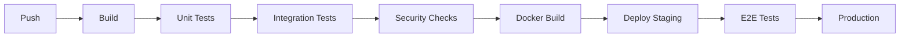

---

# 8. Quality Gates

PR should fail if:
- build fails
- unit tests fail
- integration tests fail
- lint/type checks fail
- critical security scan fails

---

# 9. Documentation

Every endpoint must have:
- purpose
- request
- response
- error cases
- authorization requirement
- example

Each member maintains their component README.


---

# EduFlow AI – Gamification Rulebook

## 1. Principle

Gamification must encourage **actual learning behavior**.

Avoid rewarding:
- pointless app opening
- repeated empty clicks
- repeated retries designed only to farm XP

---

# 2. XP Rule Model

Example configuration:

```json
{
  "LESSON_COMPLETED": {
    "baseXp": 20,
    "maxPerDay": 200
  },
  "QUIZ_PASSED": {
    "baseXp": 20
  },
  "PERFECT_SCORE": {
    "baseXp": 50
  },
  "DAILY_CHALLENGE": {
    "baseXp": 40
  },
  "COURSE_COMPLETED": {
    "baseXp": 300
  }
}
```

---

# 3. Reward Multipliers

Optional:

```text
Difficulty
Easy      1.0x
Medium    1.5x
Hard      2.0x
Expert    2.5x
```

But cap the final reward.

Example:

```text
Maximum challenge reward = 150 XP
```

---

# 4. Anti-Farming

Rules:
- same activity cannot grant XP twice unless explicitly repeatable
- identical submissions do not re-award completion XP
- streak counts calendar days, not number of clicks
- leaderboard is based on valid server-side transactions
- client-provided reward values are ignored

---

# 5. Badge Examples

```text
FIRST_LESSON
FIRST_QUIZ
PERFECT_SCORE
QUIZ_MASTER
THREE_DAY_STREAK
SEVEN_DAY_STREAK
THIRTY_DAY_STREAK
CHALLENGE_MASTER
COURSE_COMPLETE
TEAM_PLAYER
TOP_TEN_WEEKLY
```

---

# 6. Challenge Types

```text
QUIZ
PRACTICE
TIMED
BOSS
REVISION
COLLABORATIVE
DAILY
WEEKLY
```

---

# 7. Difficulty

Difficulty should be represented by structured metadata.

```text
BEGINNER
EASY
MEDIUM
HARD
EXPERT
```

AI may recommend difficulty, but backend eligibility rules decide whether the challenge can be assigned.

---

# 8. Leaderboard Fairness

Use:
- weekly reset
- course-specific views
- class views
- optional privacy controls

Avoid showing sensitive academic data publicly.

---

# 9. Motivation Without Harmful Pressure

Leaderboards should be one motivation mechanism, not the only one.

Provide:
- personal best
- progress toward next level
- achievement completion
- learning streak
- team goals

This allows students who dislike direct competition to remain engaged.


---

# EduFlow AI – Component Integration Matrix

## 1. Current Cross-Student Dependencies

| Producer / responsible behavior | Event / API | Consumer / responsible behavior | Purpose |
|---|---|---|---|
| Student 3 enrollment; Student 2 roster | StudentEnrolled | Student 3 rewards | Initialize learner progress |
| Student 2 curriculum | CoursePublished | Student 2 academic / Student 1 platform analytics | Update scoped reporting |
| Student 3 learning | LessonCompleted | Student 3 rewards | Award eligible XP / update streak |
| Student 2 grading + Student 3 submission | QuizCompleted | Student 3 rewards | Apply the agreed grading-to-reward contract |
| Student 3 learner outcomes | QuizCompleted | Student 2 academic / Student 1 platform analytics | Update performance reporting |
| Student 3 rewards | XPGranted / LevelUp | Student 1 platform / Student 2 academic analytics | Track scoped engagement and progression |
| Student 3 Domain Analysis | AI Recommendation | Student 2 Action / Tool + Student 3 learner delivery | Propose suitable academic action |
| Student 2 academic decision + Student 1 lifecycle/safety | ApprovalCompleted | Student 2 publication + Student 3 status | Apply authorized approved content |
| Student 1 notification lifecycle | NotificationRequested | External provider / Student 3 learner inbox | Deliver actual notifications when integrated |

These are required handoffs, not evidence that every event is wired or that approval currently triggers protected execution.

---

# 2. Critical Workflow: Quiz to Gamification

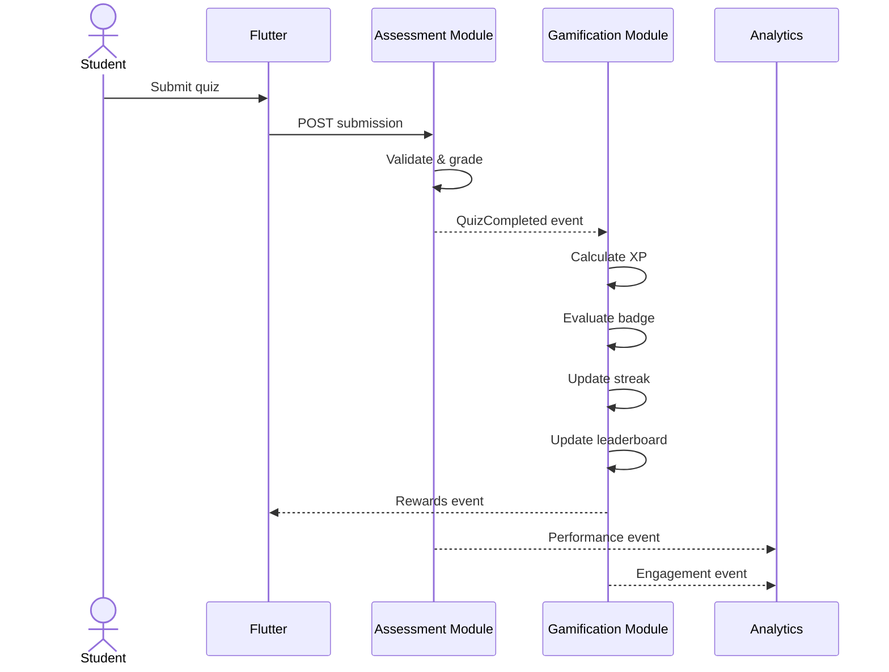

---

# 3. Critical Workflow: AI Personalized Challenge

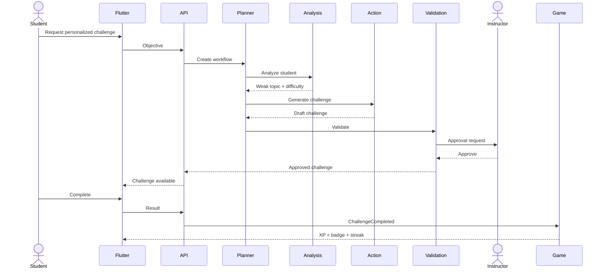

---

# 4. Shared Contract Rule

Members must not directly access another member's database tables.

Use:
- application service interfaces
- API endpoints
- domain events

Example:

Bad:

```text
Gamification repository directly querying quiz tables
```

Better:

```text
QuizCompleted event
        ↓
Gamification event handler
```

This keeps ownership clear.

---

# 5. Shared DTO Contracts

Example:

```json
{
  "studentId": "uuid",
  "courseId": "uuid",
  "activityId": "uuid",
  "activityType": "QUIZ",
  "result": {
    "percentage": 85,
    "passed": true
  },
  "occurredAt": "2026-08-16T18:00:00Z"
}
```

---

# 6. Integration Testing Ownership

Every owner is responsible for its local tests.

The team jointly owns cross-component tests.

The final submission should demonstrate the system as **one integrated product**, not four unrelated modules.

---

# EduFlow AI – Full Integration & Feature Implementation Specification

## 1. Course & Module PDF Upload, Storage & In-App Retrieval

### 1.1 Architecture & Storage Pipeline
- **Upload Flow:** Instructors can attach PDF documents (curriculum syllabi, lecture slides, study guides) during Module and Lesson creation/editing.
- **Backend Storage:** Uploaded files are validated for MIME type (`application/pdf`) and size (max 25MB), uniquely hashed (`{Guid}_{OriginalFilename}`), and persisted to `wwwroot/uploads/pdfs/`.
- **Static File Serving:** Enabled in `Program.cs` via `app.UseStaticFiles()`, allowing direct access and streaming over HTTP.
- **Relational Schema Integration:**
  - `Module`: `PdfUrl` (`string?`), `AttachmentFileName` (`string?`)
  - `Lesson`: `PdfUrl` (`string?`), `AttachmentFileName` (`string?`)
- **Student In-App Retrieval:** Enrolled students can click into any module, view attached PDF badges, read documents in an embedded in-app reader modal, and download files directly.

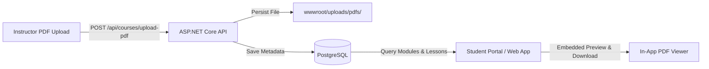

---

## 2. Multi-Mode Quiz Authoring & Release Engine

### 2.1 Three Authoring Pathways
1. **Mode 1: Typed / Manual Question Builder:**
   - Instructor defines title, time limit, passing threshold, XP/Coin bounty.
   - Interactive question authoring: prompt, multiple choice options (A, B, C, D), radio selector for correct answer, points, and explanation.
2. **Mode 2: File Upload (PDF / JSON Question Sheet):**
   - Import question banks from structured JSON or curriculum PDF documents.
   - Automated parser populates the question editor for instructor review prior to release.
3. **Mode 3: AI-Generated Adaptive Quiz:**
   - Multi-Agent synthesis calibrated on topic, target difficulty (Easy, Medium, Hard, Boss Raid), and question count.
   - Deterministic schema validation guarantees valid options, correct answers, and rich explanations.

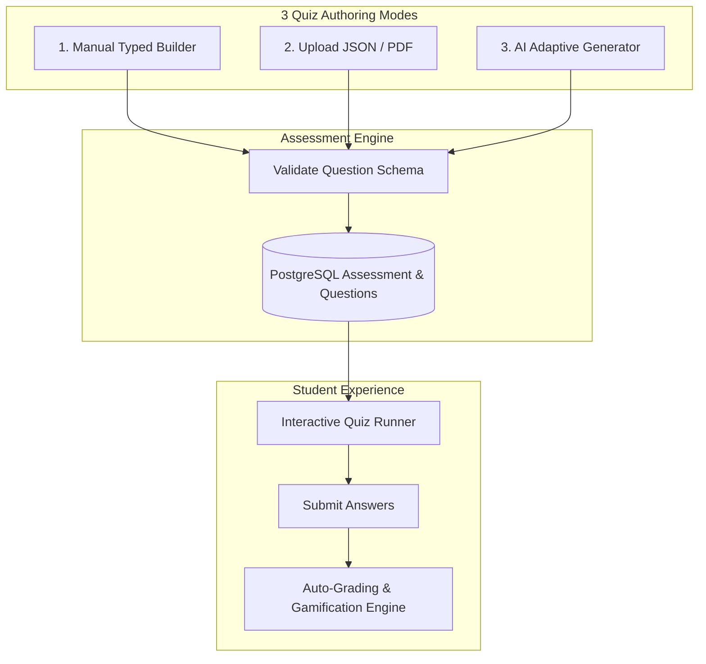

---

## 3. End-to-End Gamification Interconnection Engine

### 3.1 Mathematical Determinism & Reward Triggers
- **Immutable Ledger:** Every earned reward creates an immutable `XpTransaction` record with source type (`QuizCompleted`, `PerfectScore`, `LessonCompleted`, `DailyMission`).
- **Level Recalculation:** `CurrentLevel = floor(TotalXp / 1000) + 1` calculated deterministically.
- **Streak & Freeze Shield:** Daily active submissions increment streak count; freeze shields prevent streak resets.
- **Badges Unlocked:** Automatic unlocks for milestones (*First Step*, *Quiz Ace* on 100% score, *Unstoppable* on 7-day streak, *Boss Slayer*).
- **Weekly Sprint Leaderboard:** Ranks dynamically updated and displayed with top-3 podium and real-time student position reflection.

---

## 4. Verification Suite & Quality Assurance

- **48 Automated Backend Tests:** Covering User & Course Management, Assessment Quiz Engine, Gamification XP Ledgers, and Analytics AI Review.
- **End-to-End Interconnection:** Verified across React Web console, Student Learning Arena, and ASP.NET Core API Gateway.

