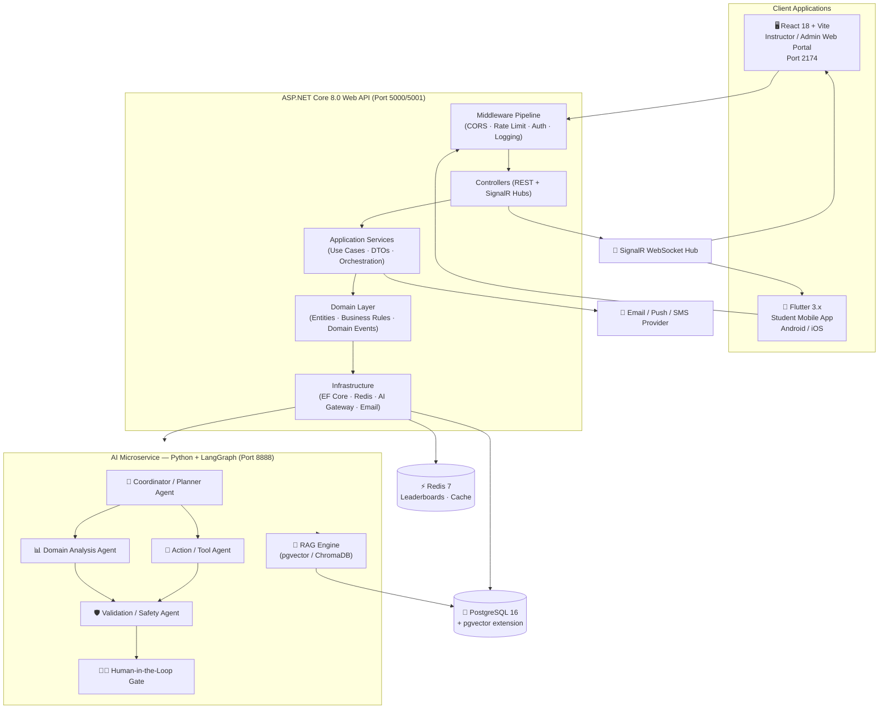
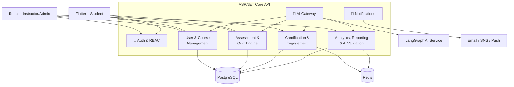
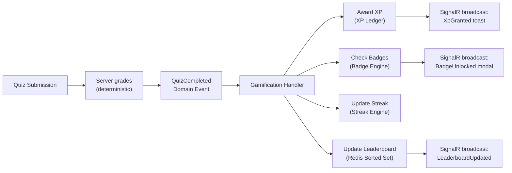
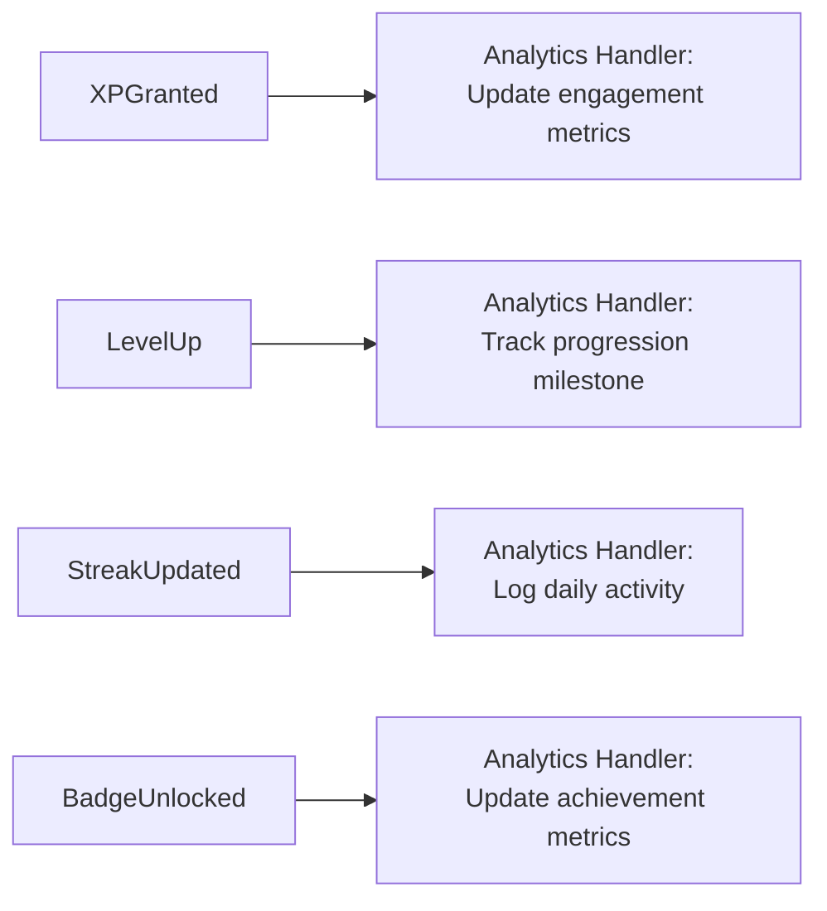
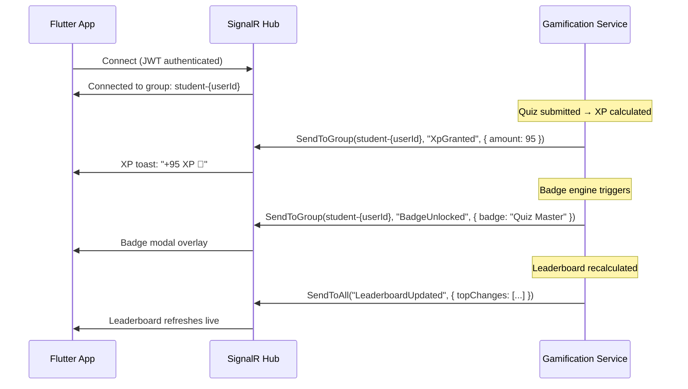

# EduFlow AI – System Architecture

> **Canonical design/reference document.** Read [Start here](../README.md) and the [responsibility matrix](../responsibilities/RESPONSIBILITY_MATRIX.md). Use [implementation status](17_IMPLEMENTATION_STATUS.md) and current source/evidence to distinguish implemented behavior from targets. Examples and proposed routes are not certified runtime results.

> This document describes the complete architectural design of the EduFlow AI platform: its layers, components, data flow, and design decisions.

---

## 1. Architectural Style: Modular Monolith

EduFlow AI uses a **modular monolith with clear bounded components** for the first release.

The backend is **one deployable ASP.NET Core 8.0 application**, but its code is cleanly separated into modules with enforced boundaries:

```text
EduFlow.Api            ← HTTP layer: controllers, SignalR hubs, middleware
EduFlow.Core           ← Domain layer: entities, interfaces, DTOs, domain events
EduFlow.Infrastructure ← Data layer: EF Core, PostgreSQL, Redis, AI gateway, external APIs
EduFlow.Tests          ← Test layer: xUnit unit + integration tests
```

**Why modular monolith?**
- Simplifies deployment (single process, single DB connection pool)
- Keeps transactions straightforward (no distributed two-phase commit)
- Avoids distributed-system overhead (no service mesh, no message broker needed at MVP)
- Still demonstrates strong component boundaries for SE3090 requirements
- Allows later extraction into microservices with minimal refactoring

---

## 2. Full System Topology



---

## 3. Logical Architecture — Technical Subsystems

C1–C4 label technical subsystems, not individual students. Their architecture can remain separate while three students own end-to-end business workflows. This is a design view; Redis/SignalR/vector retrieval are not established implementations in the current audit.



### Current Ownership Summary

Read [RESPONSIBILITY_MATRIX.md](../responsibilities/RESPONSIBILITY_MATRIX.md) first.

| Student / identity | Primary component | Agentic AI contribution |
|---|---|---|
| Student 1 — Ahamed M.A. / IT24103352 / System Admin | System Administration, User & Course Governance, Reporting and AI Safety | Primary: Validation / Safety. Supporting: Coordinator / Planner, workflow lifecycle, approval safety, auditability and observability |
| Student 2 — Raashidh M.R. / IT24104191 / Instructor | Instructor Curriculum, Assessment and AI Content Management | Primary: Action / Tool. Supporting: Quiz Generator, Slide Topic, Quiz Evaluator |
| Student 3 — Atheek M.F. / IT24103933 / Student | Student Learning, Progress, Gamification and Adaptive Guidance | Primary: Domain Analysis. Supporting: AI Coach, Retention Behaviour, Next Best Action |

Student 1 owns global user/course administration, access governance, platform reporting, auditing and configuration. Student 2 owns academic course content, modules, lessons, topics, documents, assessments, quizzes, grading contracts, academic publishing and academic AI review. Admin access to an Instructor operation does not transfer implementation ownership. Student 3 owns learner participation, attempts, progress, rewards and adaptive guidance.

Each student contributes backend, PostgreSQL, React, Flutter, testing, security/integration and genuine documentation/Git evidence. Shared authentication, database context/migrations, client infrastructure, AI gateway/state and CI remain shared.

The four core demonstrable roles remain **Planner → Domain Analysis → Action / Tool → Validation / Safety → authorized human approval where required**. Group-size approval and any proportional assignment adjustment remain **TO CONFIRM**. This allocation guides future work; it does not prove past contribution.

---

## 4. Request Flow — Every HTTP Request

```text
Client (React / Flutter)
    │
    ▼ HTTPS
ASP.NET Core Middleware Pipeline
    ├── CORS policy check
    ├── Rate limiting (per-IP, per-user)
    ├── Request logging (trace ID injected)
    ▼
JWT Authentication Middleware
    ├── Validate Bearer token (RS256 signature + expiry)
    ├── Extract claims (userId, roles, email)
    ▼
Authorization Middleware
    ├── [Authorize(Roles = "...")] checks
    ├── Resource ownership checks (in application layer)
    ▼
Controller
    ├── DTO binding + model validation
    ├── Return 400 if invalid
    ▼
Application Service (Use Case)
    ├── Business logic
    ├── Transaction boundary
    ├── Domain event publication
    ▼
Domain Layer
    ├── Entity invariants enforced
    ├── Business rules applied
    ▼
Repository (Infrastructure)
    ├── EF Core + PostgreSQL query
    ├── Redis read/write if caching applies
    ▼
Response DTO → Controller → HTTP Response
```

> **Rule**: Business logic never lives in controllers. Controllers only bind input and delegate to services.

---

## 5. Layer Responsibilities

### 5.1 API Layer (`EduFlow.Api`)

| Responsibility | Details |
|---------------|---------|
| HTTP request/response | Route matching, status codes, content negotiation |
| DTO binding | Input models bound and validated via Data Annotations / FluentValidation |
| Authentication metadata | JWT middleware, claims extraction |
| SignalR Hubs | Real-time event broadcasting to connected clients |
| Swagger / OpenAPI | Auto-generated API documentation |

### 5.2 Application Layer (`EduFlow.Core` — Application namespace)

| Responsibility | Details |
|---------------|---------|
| Use cases | One service class per business operation |
| Orchestration | Coordinates repositories, domain services, events |
| Transaction boundaries | `IUnitOfWork` wraps DB transactions |
| DTO mapping | Entity → DTO, DTO → Entity |
| Domain event dispatch | After successful operations |

### 5.3 Domain Layer (`EduFlow.Core` — Domain namespace)

| Responsibility | Details |
|---------------|---------|
| Entities | Rich domain objects with behaviour |
| Value objects | Immutable types (XP amounts, score %, difficulty) |
| Business rules | Enforced in entity methods (not in controllers or DB) |
| Domain events | `INotification` records published on business occurrences |
| Interfaces | `IRepository<T>`, `IUnitOfWork` defined here, implemented in Infrastructure |

### 5.4 Infrastructure Layer (`EduFlow.Infrastructure`)

| Responsibility | Details |
|---------------|---------|
| EF Core | DbContext, entity configurations, migrations |
| PostgreSQL | Primary relational database + pgvector extension |
| Redis | StackExchange.Redis for leaderboard sorted sets + hot-path cache |
| AI Gateway Client | HttpClient calling LangGraph FastAPI service |
| Email / Notifications | SMTP / SendGrid / Firebase Cloud Messaging |
| File Storage | Local disk or Azure Blob / AWS S3 for document uploads |

---

## 6. Cross-Component Integration

### 6.1 Course Hierarchy

```text
Course (instructor owns)
  └── Module (chapter)
       └── Lesson (video / text / slides)
            ├── Quiz (assessment)
            └── Documents (PDFs → RAG knowledge base)
```

### 6.2 Quiz → Gamification Event Flow



### 6.3 Gamification → Analytics Event Flow



### 6.4 Analytics → AI Recommendation

```text
Analytics Agent reads:
    ├── quiz_performance (per topic)
    ├── lesson_completion_rates
    ├── streak_history
    └── xp_trend (last 7 days)
    ▼
Domain Analysis Agent outputs:
    ├── weak_topics: ["recursion", "binary_trees"]
    ├── recommended_difficulty: "MEDIUM"
    └── next_action: "PRACTICE_CHALLENGE"
    ▼
Challenge Generator Agent creates draft
    ▼
Validation Agent checks (deterministic rules)
    ▼
Instructor HITL approval
    ▼
Challenge published to student
```

---

## 7. Synchronous vs. Asynchronous Operations

### Synchronous (immediate response required)

```text
✓ Login / logout
✓ Fetch courses / modules / lessons
✓ Take quiz (deliver questions)
✓ Submit quiz (grade + return results instantly)
✓ Read profile / leaderboard
✓ AI chat (streaming response)
```

### Asynchronous (domain events / background jobs)

```text
✓ XP calculation after quiz submission
✓ Badge rule evaluation
✓ Leaderboard refresh in Redis
✓ Notification generation + delivery
✓ Document processing (text extraction → chunking → embedding)
✓ Analytics aggregation
✓ AI challenge generation + validation workflow
✓ Report generation (PDF/CSV)
```

> Async operations prevent slow tasks from blocking the mobile UI. The student sees "✓ Quiz submitted!" instantly; XP and badges arrive via SignalR within seconds.

---

## 8. Real-Time Architecture (SignalR)



**SignalR Groups:**
- `student-{userId}` — personal notifications (XP, badges, reminders)
- `course-{courseId}` — course-wide events (new quiz published, instructor message)
- `leaderboard-weekly` — global leaderboard updates

---

## 9. Port Configuration Reference

| Service | Port | Protocol |
|---------|------|----------|
| ASP.NET Core API (HTTP) | 5000 | HTTP |
| ASP.NET Core API (HTTPS) | 5001 | HTTPS |
| LangGraph AI Microservice | 8888 | HTTP |
| React Dev Server | 2174 | HTTP |
| Flutter (device/emulator) | — | ADB / USB |
| PostgreSQL | 5432 | TCP |
| Redis | 6379 | TCP |
