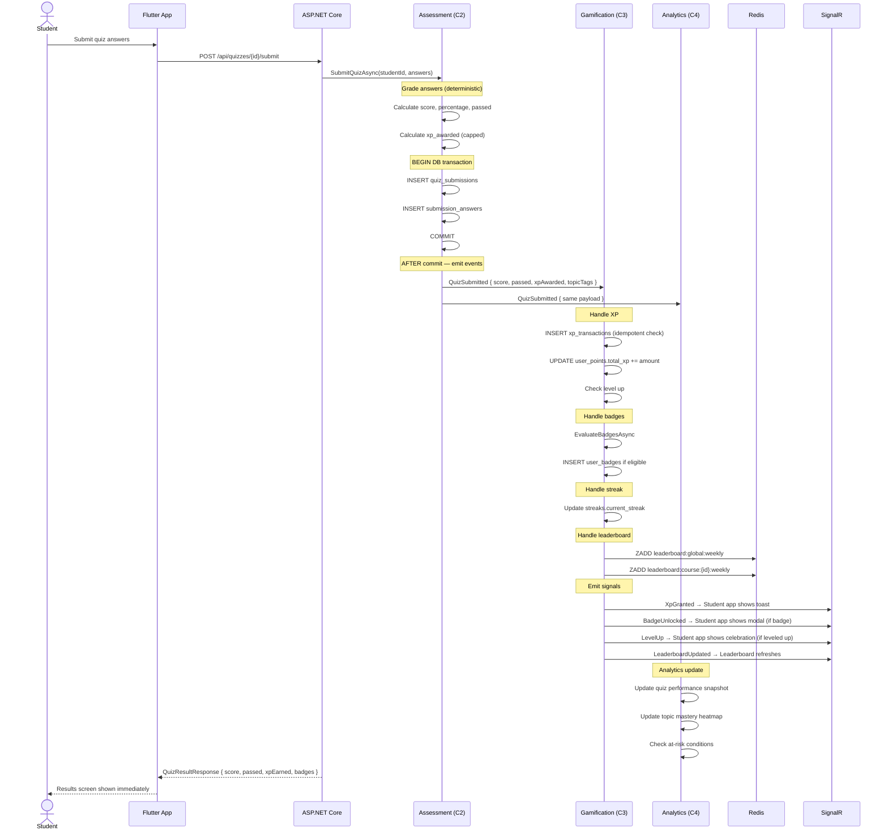
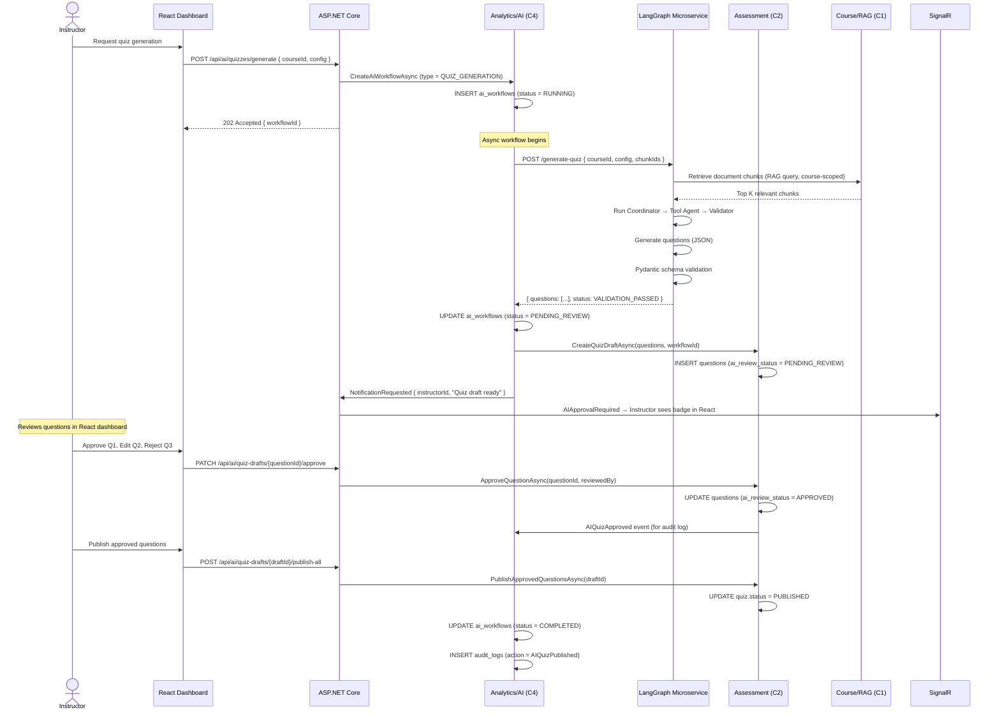
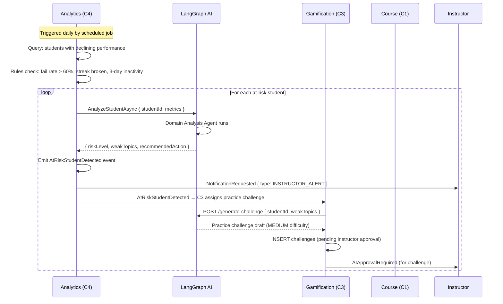

# EduFlow AI – Component Integration Matrix

> **Canonical design/reference document.** Read [Start here](../README.md) and the [responsibility matrix](../responsibilities/RESPONSIBILITY_MATRIX.md). Use [implementation status](17_IMPLEMENTATION_STATUS.md) and current source/evidence to distinguish implemented behavior from targets. Examples and proposed routes are not certified runtime results.

> This document describes technical subsystem contracts and event-based integration design. C1–C4 are subsystem identifiers, not student numbers or four personal allocations. Read [RESPONSIBILITY_MATRIX.md](../responsibilities/RESPONSIBILITY_MATRIX.md) first.

| Technical identifier | Scope | Current workflow owners |
|---|---|---|
| C1 | Identity, courses and participation | Student 1 access/global governance; Student 2 academic curriculum/roster; Student 3 enrollment/completion |
| C2 | Assessments | Student 2 definitions/grading/review; Student 3 attempts/results |
| C3 | Gamification | Student 3 rewards/progress; Student 2 academic challenge content |
| C4 | Analytics and AI lifecycle | Student 1 platform reports/safety/lifecycle; Student 2 academic analytics/review; Student 3 learner analysis/status |

These are intended contract boundaries, not a claim that an event bus, Redis/SignalR, separate DbContexts or full approval recovery is implemented. The current ApplicationDbContext, migrations, gateway, client infrastructure and graph/state are shared. Do not duplicate them merely to divide ownership. Group-size approval remains **TO CONFIRM**.

---

## 1. Golden Rule: No Cross-Component Table Access

```text
❌ NEVER:   Gamification module queries quiz tables directly
❌ NEVER:   Assessment module updates XP transactions directly
❌ NEVER:   Analytics reads from xp_transactions table bypassing C3

✅ ALWAYS:  Communicate through domain events or published API interfaces
✅ ALWAYS:  Each component owns and controls its own tables
✅ ALWAYS:  Cross-component queries go through application service interfaces
```

---

## 2. Domain Event Registry

All cross-component communication flows through domain events:

| Event | Publisher | Subscribers | Payload |
|-------|-----------|-------------|---------|
| `UserRegistered` | C1 | C3, C4 | userId, email, role |
| `CoursePublished` | C1 | C4 | courseId, instructorId |
| `LessonCompleted` | C1 | C3, C4 | studentId, lessonId, courseId |
| `StudentEnrolled` | C1 | C3, C4 | studentId, courseId, instructorId |
| `StudentUnenrolled` | C1 | C3, C4 | studentId, courseId |
| `DocumentIngested` | C1 | C4 | docId, courseId, chunkCount |
| `QuizStarted` | C2 | C4 | studentId, quizId, startedAt |
| `QuizSubmitted` | C2 | C3, C4 | studentId, quizId, score, passed, topics |
| `QuizPerfectScore` | C2 | C3, C4 | studentId, quizId |
| `AIQuizApproved` | C2 | C4 | questionId, reviewedBy, draftId |
| `AIQuizRejected` | C2 | C4 | questionId, reason |
| `XPGranted` | C3 | C4 | studentId, amount, sourceType |
| `LevelUp` | C3 | C4 | studentId, newLevel, tierName |
| `BadgeUnlocked` | C3 | C4 | studentId, badgeCode, badgeName |
| `StreakUpdated` | C3 | C4 | studentId, currentStreak |
| `StreakBroken` | C3 | C4 | studentId, previousStreak |
| `ChallengeCompleted` | C3 | C4 | studentId, challengeId, xpAwarded |
| `LeaderboardChanged` | C3 | C4 | topChanges[] |
| `AIWorkflowCompleted` | C4 | C1, C2, C3 | workflowId, type, result |
| `AIApprovalCompleted` | C4 | C2 | workflowId, decision, approvedContent |
| `AtRiskStudentDetected` | C4 | C1, C3 | studentId, courseId, riskReason |
| `NotificationRequested` | C4 | External | userId, type, title, body |
| `ReportGenerated` | C4 | — | reportId, type, downloadUrl |

---

## 3. Standard Event Envelope

All domain events use the same envelope format:

```json
{
  "eventId": "uuid",
  "eventType": "QuizSubmitted",
  "schemaVersion": 1,
  "occurredAt": "2026-09-07T08:30:00.000Z",
  "actorId": "student-uuid",
  "aggregateType": "Quiz",
  "aggregateId": "quiz-uuid",
  "correlationId": "trace-id-from-http-request",
  "payload": {
    "studentId": "uuid",
    "quizId": "uuid",
    "score": 85.0,
    "maxScore": 100.0,
    "percentage": 85.0,
    "passed": true,
    "xpAwarded": 95,
    "topicTags": ["recursion", "loops"]
  }
}
```

### Event Rules

```text
1. Events are IMMUTABLE — never modify a published event
2. Handlers must be IDEMPOTENT — processing the same event twice = same result
3. Handlers must not trust payload XP values — recalculate server-side
4. Events are published AFTER the originating transaction commits
5. Failed event handlers must retry (exponential backoff) or dead-letter queue
6. Sensitive student data (grades, scores) stays in payload — do not log raw events
```

---

## 4. Critical Workflow: Quiz Submission → Full Cascade



---

## 5. Critical Workflow: AI Quiz Generation Pipeline



---

## 6. Critical Workflow: At-Risk Student Detection



---

## 7. Cross-Component Service Interfaces

Components communicate through **application service interfaces** — not repository instances:

```csharp
// C2 (Assessment) publishes event — C3 subscribes:
public interface IQuizEventPublisher
{
    Task PublishQuizSubmittedAsync(QuizSubmittedEvent evt);
    Task PublishPerfectScoreAsync(PerfectScoreEvent evt);
}

// C3 (Gamification) exposes service to C2 (via event handler):
public interface IGamificationService
{
    Task HandleQuizCompletedAsync(QuizSubmittedEvent evt);
    Task AwardXpAsync(Guid studentId, XpSource source, int baseXp);
    Task EvaluateBadgesAsync(Guid studentId, DomainEvent trigger);
}

// C4 (Analytics) exposes service:
public interface IAnalyticsService
{
    Task RecordQuizPerformanceAsync(QuizPerformanceRecord record);
    Task RecordEngagementEventAsync(EngagementEvent evt);
    Task<AtRiskAnalysis> GetAtRiskStudentsAsync(Guid courseId);
}

// C1 (Course) exposes for C4 AI integration:
public interface IRagService
{
    Task<List<DocumentChunk>> SearchAsync(string query, Guid courseId, int topK = 5);
    Task<string> GenerateSummaryAsync(Guid documentId, SummaryScope scope);
}
```

---

## 8. Shared DTO Contracts

### 8.1 QuizSubmittedEvent

```json
{
  "eventId": "uuid",
  "eventType": "QuizSubmitted",
  "studentId": "uuid",
  "courseId": "uuid",
  "quizId": "uuid",
  "submissionId": "uuid",
  "score": 85.0,
  "maxScore": 100.0,
  "percentage": 85.0,
  "passed": true,
  "xpAwarded": 95,
  "difficulty": "MEDIUM",
  "topicTags": ["recursion", "loops"],
  "attemptNumber": 1,
  "occurredAt": "2026-09-07T08:30:00Z"
}
```

### 8.2 XPGrantedEvent

```json
{
  "eventId": "uuid",
  "eventType": "XPGranted",
  "studentId": "uuid",
  "amount": 95,
  "newTotal": 1345,
  "sourceType": "QUIZ_PASSED",
  "sourceId": "quiz-uuid",
  "occurredAt": "2026-09-07T08:30:05Z"
}
```

### 8.3 AtRiskStudentDetected

```json
{
  "eventId": "uuid",
  "eventType": "AtRiskStudentDetected",
  "studentId": "uuid",
  "courseId": "uuid",
  "riskLevel": "HIGH",
  "riskReasons": ["fail_rate_high", "streak_broken", "3_day_inactivity"],
  "weakTopics": ["recursion", "binary_trees"],
  "recommendedAction": "PRACTICE_CHALLENGE",
  "occurredAt": "2026-09-07T06:00:00Z"
}
```

---

## 9. Integration Testing Ownership

| Test | Owner | Description |
|------|-------|-------------|
| Quiz → XP flow | Students 2 + 3 | Submit quiz, verify XP ledger updated |
| XP → Level Up | Student 3 | Crossing threshold triggers LevelUp |
| Quiz → Badge | Students 2 + 3 | Submit first quiz, verify FIRST_QUIZ badge |
| AI Generation → Review → Publish | Students 1 + 2; Student 3 delivery | Full HITL workflow |
| At-Risk Detection → Instructor Alert | Student 3 analysis, Student 2 review, Student 1 delivery | Detection triggers notification |
| Leaderboard Redis sync (documented-only target) | Student 3 / shared infrastructure | XP award reflects in Redis within 1s |
| Event replay idempotency | All components | Replay same event → no duplicate effects |

---

## 10. Boundary Enforcement in Code

The separate-context example below is a design alternative, not the current shared ApplicationDbContext or a requirement to split schemas by student.

```csharp
// Each component's DbContext should ONLY have access to its own tables
// Achieved through DbContext separation or strict repository constraints

// ✅ Good — C3 GamificationDbContext only sees gamification tables
public class GamificationDbContext : DbContext
{
    public DbSet<XpTransaction> XpTransactions { get; set; }
    public DbSet<UserPoints> UserPoints { get; set; }
    public DbSet<Badge> Badges { get; set; }
    public DbSet<UserBadge> UserBadges { get; set; }
    public DbSet<Streak> Streaks { get; set; }
    public DbSet<Challenge> Challenges { get; set; }
    // No Courses, No Quizzes, No Users (use IDs only)
}

// ❌ Bad — C3 directly joins quiz tables
var result = await _db.QuizSubmissions  // NOT allowed
    .Where(s => s.StudentId == studentId)
    .ToListAsync();
// Use event payload or call C2's service interface instead
```
