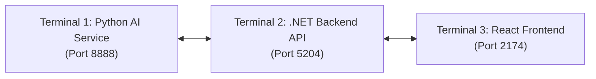

# EduFlow AI – Application Run & Deployment Guide 🚀

This guide describes local startup for the repository, not a verified deployment or completed end-to-end workflow. Run each terminal from the repository root unless a step explicitly changes directory. Source paths in commands are repository-relative, not relative to this document. See [implementation status](17_IMPLEMENTATION_STATUS.md) and [Start here](../README.md).

---

## 1. System Architecture & Port Mapping

| Subsystem | Technology | Default Port / URL | Documentation / UI |
|---|---|---|---|
| **Backend API** | ASP.NET Core (.NET 10), EF Core, PostgreSQL | HTTP launch profile: `http://localhost:5204`; HTTPS profile additionally uses port 7009 | `http://localhost:5204/swagger` |
| **Agentic AI Microservice** | Python 3.11+, FastAPI, LangGraph | `http://localhost:8888` | `http://localhost:8888/docs` |
| **Web Application** | React 18, Vite, Lucide Icons | `http://localhost:2174` | Web Dashboard & Portals |
| **Mobile App** | Flutter 3.x, Dart | Device / Emulator | Student Mobile Interface |

---

## 2. Prerequisites

Ensure the following tools are installed on your machine:
- **.NET SDK** compatible with the net10.0 target (a .NET 8 SDK is insufficient): `dotnet --version`
- **Node.js** (v18.0+ or v20.0+) and npm: `node -v` & `npm -v`
- **Python** (3.11 is used by the CI configuration; verify provider/dependency compatibility for other versions): `python --version`
- **Git**: `git --version`
- **Flutter SDK** *(optional, only for mobile app)*: `flutter --version`

> [!NOTE]
> Verify actual database/service settings in startup and configuration before running. The audit found hardcoded startup configuration, migration drift and demo initialization that can reset credentials/progress; do not assume a working or production-safe database from this guide. Keep secrets out of committed configuration.

---

## 3. Step-by-Step Execution Guide

Use separate terminals for Python, backend and web; use a fourth for Flutter when exercising the mobile application. Launching all processes does not prove cross-platform integration:



---

### Terminal 1: Python AI Multi-Agent Microservice

The retained core workflow roles are Planner → Domain Analysis → Action/Tool → Validation/Safety, with authorized human approval where required. Supporting agents are described in [AI orchestration](09_AI_ORCHESTRATION.md) and the [AI service README](../../ai-agent/README.md); do not equate class count with a complete assessed workflow.

1. Navigate to the `ai-agent` directory:
   ```powershell
   cd ai-agent
   ```

2. Activate the virtual environment (or create one if first time):
   ```powershell
   # Windows PowerShell
   .\venv\Scripts\Activate.ps1

   # If creating a new virtual environment:
   # python -m venv venv
   # .\venv\Scripts\Activate.ps1
   # pip install -r requirements.txt
   ```

3. *(Optional)* Configure OpenAI API Key:
   Create or edit `.env` inside `ai-agent/`:
   ```env
   OPENAI_API_KEY=your_openai_api_key_here
   ```
   Provider configuration depends on the selected path. Missing configuration can cause a fallback or error; neither is proof of grounded AI execution. Coordinate internal-service credentials on both sides and do not rely on fail-open defaults.

4. Start the FastAPI server:
   ```powershell
   python -m uvicorn main:app --reload --host 0.0.0.0 --port 8888
   ```
   - **Health Check**: [http://localhost:8888/health](http://localhost:8888/health)
   - **Interactive Swagger Docs**: [http://localhost:8888/docs](http://localhost:8888/docs)
   - **Agent Topology Endpoint**: [http://localhost:8888/agents/topology](http://localhost:8888/agents/topology)

---

### Terminal 2: ASP.NET Core Backend Web API

The backend serves the REST API, JWT authentication, gamification engine, database persistence, and AI gateway forwarding.

Run from the repository root:

~~~powershell
dotnet restore backend/EduFlow.slnx
dotnet run --project backend/EduFlow.Api --launch-profile http
~~~

For watch/restart during development:

~~~powershell
dotnet watch --project backend/EduFlow.Api run --launch-profile http
~~~

- Checked-in HTTP profile: [http://localhost:5204/swagger](http://localhost:5204/swagger).
- React API default is localhost:5204/api; override VITE_API_BASE_URL consistently if needed.
- Runtime URLs can be overridden; verify startup output rather than assuming the older 5000/5001 examples.


---

### Terminal 3: React Web Frontend

The frontend provides the interactive **Instructor AI Review & Governance Workspace**, **Student Portal**, **Course Curriculum Management**, **Gamification Dashboard**, and **Cohort Analytics**.

1. Navigate to the frontend directory:
   ```powershell
   cd frontend
   ```

2. Install dependencies *(first time only)*:
   ```powershell
   npm install
   ```

3. Start the Vite development server:
   ```powershell
   npm run dev
   ```
   - **Web Application URL**: [http://localhost:2174](http://localhost:2174)

---

### Terminal 4: Flutter Mobile App

Flutter can be omitted for a web-only local session, but it is required for the assignment and each student’s end-to-end contribution. The [current responsibility matrix](../responsibilities/RESPONSIBILITY_MATRIX.md) records mobile API integration as incomplete; launching the prototype does not demonstrate the assessed cross-platform workflow.

1. Navigate to the mobile directory:
   ```powershell
   cd mobile
   ```

2. Fetch dependencies and launch:
   ```powershell
   flutter pub get
   flutter run
   ```

---

## 4. Pre-Seeded Accounts & Demo Credentials

The database comes pre-seeded with 3 authorized role-based user accounts:

| Role | Email | Password | Access Rights |
|---|---|---|---|
| **System Admin** | `admin@eduflow.ai` | `Password123!` | Full platform administration, system settings, user management, audit logs |
| **Instructor** | `instructor@eduflow.ai` | `Password123!` | Human-in-the-Loop AI proposal review, course authoring, assessment publishing |
| **Student** | `student@eduflow.ai` | `Password123!` | Student portal, study quests, gamification XP & streaks, AI Coach tutor |

---

## 5. Key Workflows to Explore

### 1. Human-in-the-Loop (HITL) AI Review Console
- Navigate to: **[http://localhost:2174](http://localhost:2174)** $\to$ Click **"AI Review"** in the sidebar.
- Click **"+ Orchestrate AI Proposal"** to trigger the 4-agent LangGraph workflow.
- Inspect the **Multi-Agent Audit Trail**, deterministic validation results, and milestone schedule.
- Inspect **"Approve & Dispatch"**, but do not treat the button label or a status update as proof of publication/delivery. Workflow identity, validation enforcement and protected execution remain PARTIAL in the current responsibility audit.

### 2. Live Student Learning Portal & AI Coach
- Navigate to: **[http://localhost:2174](http://localhost:2174)** $\to$ Click **"Student Portal"** in the navigation bar.
- Review your current level, active streak, and daily mission quests.
- Open the **"AI Coach"** tab and ask conceptual questions (e.g., *"How do composite B-Tree indexes work in PostgreSQL?"*).
- Complete interactive lessons and quizzes to earn XP, level up, and unlock achievements.

### 3. Gamification & Leaderboard System
- Navigate to: **"Gamification"** or **"Cohort Rankings"** to view real-time leaderboards, earned badges, and streak protections.

---

## 6. Running Automated Tests

### Python Multi-Agent Microservice Tests
```powershell
cd d:\Project\EduFlow\ai-agent
.\venv\Scripts\pytest.exe -v
```
*(Executes tests verifying all 7 agents, deterministic validations, schemas, and topology).*

### Backend Integration & Unit Tests
```powershell
cd d:\Project\EduFlow\backend\EduFlow.Tests
dotnet test
```

### Frontend Production Bundle Build
```powershell
cd d:\Project\EduFlow\frontend
npm run build
```

---

## 7. Continuous Rebuild Watcher ("Build Reload") 🔨

To automatically trigger a clean background re-compilation/rebuild whenever any file changes across the entire repository:

```powershell
# From root workspace directory (d:\Project\EduFlow):
npm run watch:build
```

- **Backend (.NET)**: Watches `backend/**/*.cs`, `*.csproj` and automatically runs `dotnet build`.
- **Frontend (React/Vite)**: Watches `frontend/src/**/*.{jsx,js,css}` and continuously rebuilds `dist/` bundle.
- **AI Agent (Python)**: Watches `ai-agent/**/*.py` and compiles bytecode/validates syntax instantly.

You can also run continuous watch-building for individual layers:
```powershell
npm run watch:frontend          # Continuous Vite production bundle build
npm run watch:backend           # dotnet watch build for .NET backend
npm run dev:backend:build-reload# dotnet watch run with clean rebuild on save
```

---

## 8. Troubleshooting & FAQ

### Q: Port 8888 or 5000 is already in use
- Check running processes or change the port in `ai-agent/main.py` (`port=8888`) or `backend/EduFlow.Api/Properties/launchSettings.json`.

### Q: Python script execution policy error on Windows
- If `.\venv\Scripts\Activate.ps1` gives an execution policy error, run:
  ```powershell
  Set-ExecutionPolicy -Scope Process -ExecutionPolicy Bypass
  .\venv\Scripts\Activate.ps1
  ```
  Or run without activating:
  ```powershell
  .\venv\Scripts\python.exe -m uvicorn main:app --reload --port 8888
  ```

### Q: OpenAI API Key missing warning
- Missing provider configuration may produce a fallback or an error, depending on the path. Fallback output is not proof of grounded Agentic AI execution or accurate coverage of every topic; record its provenance and verify the configured workflow.
