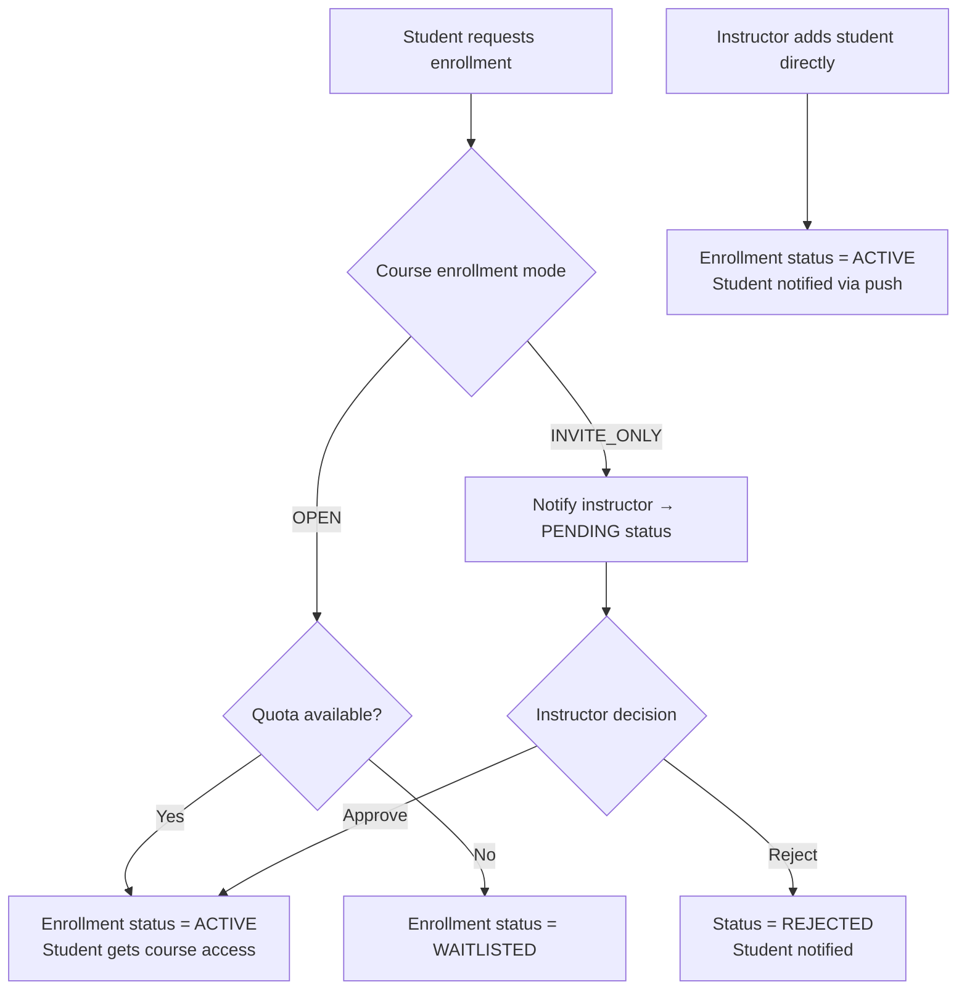

> **LEGACY — former four-member allocation.** Retained only for historical/reference purposes; this is **NOT** the current responsibility source. Current ownership is defined in [RESPONSIBILITY_MATRIX.md](../../responsibilities/RESPONSIBILITY_MATRIX.md). This archived body does not establish current ownership or change historical authorship.

# Member 1 – User & Course Management

> **Component Owner**: Member 1  
> **AI Agent Responsibility**: Coordinator / Planner Agent  
> **Interface**: React Web Portal (Instructor/Admin) + Flutter Mobile (Student enrollment)

---

## Business Component Scope

Member 1 owns the **foundation layer** of the platform. Every other component depends on users, roles, and courses being established first.

**Owns:**
- User accounts (Students, Instructors, Admins)
- Role-based access control (RBAC)
- User profiles and avatars
- Courses, modules, lessons, and content hierarchy
- Student enrollment (requests, approvals, invitations)
- Document uploads (PDFs → RAG knowledge base trigger)
- Coordinator / Planner AI Agent

---

## 1. Database Schema

### 1.1 Users

```sql
CREATE TABLE users (
    id UUID PRIMARY KEY DEFAULT gen_random_uuid(),
    email VARCHAR(320) UNIQUE NOT NULL,
    password_hash TEXT NOT NULL,
    first_name VARCHAR(100) NOT NULL,
    last_name VARCHAR(100) NOT NULL,
    is_active BOOLEAN NOT NULL DEFAULT TRUE,
    avatar_url TEXT,
    bio TEXT,
    timezone VARCHAR(50) DEFAULT 'UTC',
    last_login_at TIMESTAMPTZ,
    created_at TIMESTAMPTZ NOT NULL DEFAULT NOW(),
    updated_at TIMESTAMPTZ NOT NULL DEFAULT NOW()
);

CREATE INDEX idx_users_email ON users(email);
```

### 1.2 Roles & User Roles

```sql
CREATE TABLE roles (
    id UUID PRIMARY KEY DEFAULT gen_random_uuid(),
    name VARCHAR(50) UNIQUE NOT NULL  -- 'Admin', 'Instructor', 'Student'
);

CREATE TABLE user_roles (
    user_id UUID NOT NULL REFERENCES users(id) ON DELETE CASCADE,
    role_id UUID NOT NULL REFERENCES roles(id) ON DELETE CASCADE,
    PRIMARY KEY (user_id, role_id)
);
```

### 1.3 Courses

```sql
CREATE TABLE courses (
    id UUID PRIMARY KEY DEFAULT gen_random_uuid(),
    title VARCHAR(200) NOT NULL,
    description TEXT,
    instructor_id UUID NOT NULL REFERENCES users(id),
    status VARCHAR(20) NOT NULL DEFAULT 'DRAFT',  -- DRAFT | PUBLISHED | ARCHIVED
    difficulty VARCHAR(10) NOT NULL DEFAULT 'MEDIUM',  -- BEGINNER | EASY | MEDIUM | HARD | EXPERT
    thumbnail_url TEXT,
    enrollment_mode VARCHAR(20) NOT NULL DEFAULT 'INVITE_ONLY',  -- OPEN | INVITE_ONLY
    max_students INTEGER,
    created_at TIMESTAMPTZ NOT NULL DEFAULT NOW(),
    updated_at TIMESTAMPTZ NOT NULL DEFAULT NOW()
);

CREATE INDEX idx_courses_instructor ON courses(instructor_id, status);
```

### 1.4 Modules

```sql
CREATE TABLE modules (
    id UUID PRIMARY KEY DEFAULT gen_random_uuid(),
    course_id UUID NOT NULL REFERENCES courses(id) ON DELETE CASCADE,
    title VARCHAR(200) NOT NULL,
    description TEXT,
    display_order INTEGER NOT NULL,
    is_published BOOLEAN NOT NULL DEFAULT FALSE,
    created_at TIMESTAMPTZ NOT NULL DEFAULT NOW()
);
```

### 1.5 Lessons

```sql
CREATE TABLE lessons (
    id UUID PRIMARY KEY DEFAULT gen_random_uuid(),
    module_id UUID NOT NULL REFERENCES modules(id) ON DELETE CASCADE,
    title VARCHAR(200) NOT NULL,
    content_type VARCHAR(20) NOT NULL,  -- TEXT | VIDEO | SLIDES | MIXED
    content TEXT,                        -- markdown / HTML
    video_url TEXT,
    slides_url TEXT,
    duration_minutes INTEGER,
    display_order INTEGER NOT NULL,
    is_published BOOLEAN NOT NULL DEFAULT FALSE,
    created_at TIMESTAMPTZ NOT NULL DEFAULT NOW()
);
```

### 1.6 Enrollments

```sql
CREATE TABLE enrollments (
    id UUID PRIMARY KEY DEFAULT gen_random_uuid(),
    student_id UUID NOT NULL REFERENCES users(id) ON DELETE CASCADE,
    course_id UUID NOT NULL REFERENCES courses(id) ON DELETE CASCADE,
    status VARCHAR(20) NOT NULL DEFAULT 'PENDING',  -- PENDING | ACTIVE | COMPLETED | DROPPED
    enrolled_at TIMESTAMPTZ,
    completed_at TIMESTAMPTZ,
    completion_percentage DECIMAL(5,2) NOT NULL DEFAULT 0,
    created_at TIMESTAMPTZ NOT NULL DEFAULT NOW(),
    UNIQUE(student_id, course_id)
);

CREATE INDEX idx_enrollments_student ON enrollments(student_id, status);
CREATE INDEX idx_enrollments_course ON enrollments(course_id, status);
```

### 1.7 Course Documents (RAG source)

```sql
CREATE TABLE course_documents (
    id UUID PRIMARY KEY DEFAULT gen_random_uuid(),
    course_id UUID NOT NULL REFERENCES courses(id) ON DELETE CASCADE,
    module_id UUID REFERENCES modules(id),
    uploaded_by UUID NOT NULL REFERENCES users(id),
    original_filename VARCHAR(500) NOT NULL,
    stored_filename VARCHAR(500) NOT NULL,  -- UUID-renamed for security
    file_size_bytes BIGINT NOT NULL,
    mime_type VARCHAR(100) NOT NULL,
    processing_status VARCHAR(20) NOT NULL DEFAULT 'PENDING',
    -- PENDING | PROCESSING | READY | FAILED
    chunk_count INTEGER,
    error_message TEXT,
    uploaded_at TIMESTAMPTZ NOT NULL DEFAULT NOW()
);
```

---

## 2. API Endpoints

### 2.1 Authentication

```http
POST   /api/auth/register          Register new account (Student role by default)
POST   /api/auth/login             Login → returns access_token + refresh_token
POST   /api/auth/refresh           Exchange refresh_token for new access_token
POST   /api/auth/logout            Revoke refresh token
POST   /api/auth/change-password   Change own password
```

### 2.2 User Management

```http
GET    /api/users                  List all users [Admin only]
GET    /api/users/{id}             Get user profile
PUT    /api/users/{id}             Update own profile [Admin can update any]
PATCH  /api/users/{id}/status      Activate/deactivate account [Admin only]
GET    /api/users/me               Get current user's profile
```

### 2.3 Course Management

```http
POST   /api/courses                Create course [Instructor, Admin]
GET    /api/courses                List published courses [All]
GET    /api/courses/mine           List instructor's own courses [Instructor]
GET    /api/courses/all            List all courses [Admin]
GET    /api/courses/{id}           Get course details [Enrolled or instructor]
PUT    /api/courses/{id}           Update course [Instructor (own), Admin]
DELETE /api/courses/{id}           Delete course [Instructor (own), Admin]
POST   /api/courses/{id}/publish   Publish course [Instructor (own), Admin]
POST   /api/courses/{id}/archive   Archive course [Instructor (own), Admin]
```

### 2.4 Module & Lesson Management

```http
POST   /api/courses/{courseId}/modules      Add module
GET    /api/courses/{courseId}/modules      List modules
PUT    /api/modules/{id}                    Update module
DELETE /api/modules/{id}                    Delete module
PATCH  /api/modules/{id}/reorder            Change display order

POST   /api/modules/{moduleId}/lessons      Add lesson
GET    /api/modules/{moduleId}/lessons      List lessons
PUT    /api/lessons/{id}                    Update lesson
DELETE /api/lessons/{id}                    Delete lesson
GET    /api/lessons/{id}                    Get lesson content [enrolled student]
POST   /api/lessons/{id}/complete           Mark lesson as completed [Student]
```

### 2.5 Enrollment Management

```http
POST   /api/courses/{courseId}/enroll       Request enrollment [Student]
DELETE /api/courses/{courseId}/enroll       Unenroll self [Student]
GET    /api/students/me/courses             My enrolled courses [Student]
GET    /api/courses/{courseId}/students     Course roster [Instructor, Admin]

POST   /api/courses/{courseId}/students/{studentId}/approve   Approve enrollment
POST   /api/courses/{courseId}/students/{studentId}/reject    Reject enrollment
POST   /api/courses/{courseId}/students/invite                Add student directly [Instructor, Admin]
DELETE /api/courses/{courseId}/students/{studentId}           Remove student [Instructor, Admin]
```

### 2.6 Document Upload

```http
POST   /api/courses/{courseId}/documents           Upload document (multipart/form-data)
GET    /api/courses/{courseId}/documents           List course documents
DELETE /api/courses/{courseId}/documents/{docId}   Delete document
GET    /api/courses/{courseId}/documents/{docId}/status   Check processing status
POST   /api/courses/{courseId}/documents/{docId}/summary  Request AI summary
```

---

## 3. React Web Pages (Instructor/Admin)

```text
/admin/users                   → User management table + create/deactivate
/admin/courses                 → All courses overview
/instructor/courses            → Instructor's courses
/instructor/courses/create     → Course creation wizard
/instructor/courses/:id        → Course detail (modules, students, analytics)
/instructor/courses/:id/edit   → Edit course settings
/instructor/courses/:id/modules → Module/lesson editor
/instructor/students           → Student roster with enrollment approval queue
/instructor/documents          → Document library + upload + processing status
```

### Course Creation Wizard

```text
Step 1: Basic Info
    │   title, description, difficulty, thumbnail, enrollment mode
    ▼
Step 2: Modules
    │   Add modules + drag-to-reorder
    ▼
Step 3: Lessons
    │   Add lessons to each module (text / video / slides)
    ▼
Step 4: Documents
    │   Upload PDFs/DOCX → triggers RAG pipeline
    ▼
Step 5: Review & Publish
```

---

## 4. Flutter Mobile Screens (Student)

```text
Course Catalog     → Browse published courses, request enrollment
My Courses         → List enrolled courses with progress bars
Course Detail      → Modules, lessons, quiz links
Lesson View        → Render text/video/slides content
Module Progress    → Visual completion tracker
Profile            → Avatar, level, XP, stats
```

---

## 5. Coordinator / Planner Agent

The Planner Agent orchestrates the AI workflow. It is the **entry point** for all AI-driven actions.

### 5.1 Responsibilities

```text
1. Receive objective from instructor or system trigger
2. Validate the objective schema (Pydantic)
3. Determine required context (student data, course data)
4. Retrieve available tool capabilities from registry
5. Build a structured, step-by-step execution plan
6. Delegate each step to the appropriate specialist agent
7. Track execution state across multi-step workflow
8. Handle failures with retry / fallback
9. Pass final candidate output to Validation Agent
```

### 5.2 Input Schema

```json
{
  "workflowId": "uuid",
  "triggerType": "INSTRUCTOR_REQUEST | AUTO_TRIGGER | STUDENT_OBJECTIVE",
  "studentId": "uuid",
  "courseId": "uuid",
  "objective": {
    "type": "GENERATE_QUIZ | GENERATE_CHALLENGE | ANALYZE_PERFORMANCE | GENERATE_SUMMARY",
    "parameters": {
      "moduleId": "uuid",
      "questionTypes": ["MCQ", "FILL_BLANK"],
      "questionCount": 10,
      "difficulty": "MEDIUM"
    }
  },
  "constraints": {
    "maxXpReward": 150,
    "deadline": "2026-09-15T23:59:59Z"
  }
}
```

### 5.3 Output: Execution Plan

```json
{
  "planId": "uuid",
  "steps": [
    { "stepId": "1", "action": "RETRIEVE_STUDENT_CONTEXT", "owner": "DOMAIN_ANALYSIS" },
    { "stepId": "2", "action": "RETRIEVE_COURSE_CONTENT", "owner": "TOOL_AGENT", "dependsOn": [] },
    { "stepId": "3", "action": "GENERATE_QUIZ_DRAFT", "owner": "TOOL_AGENT", "dependsOn": ["2"] },
    { "stepId": "4", "action": "VALIDATE_OUTPUT", "owner": "VALIDATION_AGENT", "dependsOn": ["3"] },
    { "stepId": "5", "action": "AWAIT_INSTRUCTOR_APPROVAL", "owner": "HITL_GATE", "dependsOn": ["4"] }
  ]
}
```

### 5.4 Failure Handling

```text
Planner requests student progress
    ↓
Service unavailable (503)
    ↓
Retry with exponential backoff (1s → 2s → 4s, max 3 attempts)
    ↓
Still unavailable
    ↓
Mark plan step as FAILED
    ↓
Return controlled error: { "error": "CONTEXT_UNAVAILABLE", "retryable": true }
```

> **Critical rule**: The Planner must never fabricate missing context. If data is unavailable, the workflow stops safely.

---

## 6. Enrollment Domain Logic



---

## 7. Testing Requirements

```text
Unit tests (must cover):
✓ Email uniqueness validation
✓ Role assignment rules (only Admin assigns Instructor role)
✓ Course publishing pre-conditions (must have ≥1 published module)
✓ Enrollment state transitions
✓ Duplicate enrollment prevention (UNIQUE constraint)
✓ Lesson completion idempotency (completing same lesson twice = 1 record)
✓ Document MIME type validation

Integration tests (must cover):
✓ Register → Login → JWT returned
✓ Instructor creates course → publishes → student can see it
✓ Student requests enrollment → Instructor approves → student gets access
✓ Instructor uploads document → RAG pipeline triggered
✓ Unauthorized access to course content returns 403
```
