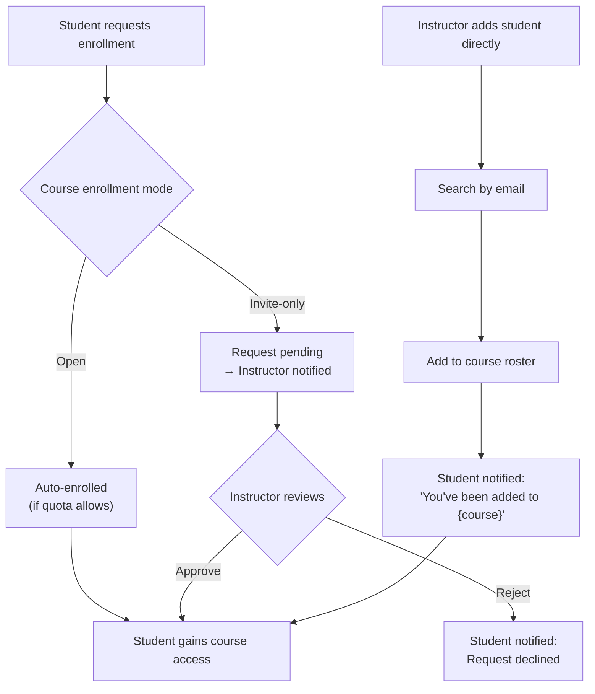

> **RETAINED HISTORICAL DESIGN — OWNER REVIEW PENDING (2026-09-28).** The body below is preserved domain/design material, not verified current implementation or an active task list. Historical labels such as "canonical", "current", "implemented" and "enforced" apply to its earlier snapshot only. Any old agent topology, route, library, database or completion claim is historical/proposed until checked against current source. Do not restore removed architecture. Follow the [source of truth](../00_SOURCE_OF_TRUTH.md), [catalog](../INDEX.md) and [current status](../current/IMPLEMENTATION_STATUS.md). Other members' subsystem completion is not certified here.

> **Specific interpretation:** Preserve useful intended permissions, but use the current responsibility matrix for ownership. Old vulnerability findings and permission-enforcement claims need a new software audit.

# EduFlow AI – Roles & Permissions

> **Canonical design/reference document.** Read [Start here](../README.md) and the [responsibility matrix](../legacy/responsibilities/RESPONSIBILITY_MATRIX.md). Use [implementation status](../legacy/project/17_IMPLEMENTATION_STATUS.md) and current source/evidence to distinguish implemented behavior from targets. Examples and proposed routes are not certified runtime results.

> **Reconciliation note:** This matrix describes intended permissions, not verified enforcement. The [current responsibility audit](../legacy/responsibilities/RESPONSIBILITY_MATRIX.md) records caller-selected registration roles, incomplete token/suspension behavior, missing resource checks and unprotected reward/team mutations. Student 1 owns access/global course governance; Student 2 owns academic content, publishing and review even where Admin has permission; Student 3 owns learner participation. Runtime access roles are not exclusive code ownership.

> This document defines the complete Role-Based Access Control (RBAC) model for EduFlow AI, covering all three user roles: **Admin**, **Instructor**, and **Student**.

---

## 1. Role Definitions

| Role | Who They Are | Primary Interface | Description |
|------|-------------|-------------------|-------------|
| **Admin** | Platform administrators | React Web Portal | Full platform control, user management, system configuration |
| **Instructor** | Teachers / Course creators | React Web Portal | Course authoring, student management, AI quiz review |
| **Student** | Learners | Flutter Mobile App | Learning, quiz-taking, AI tutor, gamification |

> **Important**: Authorization is enforced **server-side by ASP.NET Core**. Frontend role checks are UI convenience only — never the security boundary.

---

## 2. Master Permission Matrix

### 2.1 User Management

| Capability | Student | Instructor | Admin |
|------------|:-------:|:----------:|:-----:|
| Register own account | ✅ | — | — |
| View own profile | ✅ | ✅ | ✅ |
| Edit own profile | ✅ | ✅ | ✅ |
| View other users' profiles (basic) | ✅ | ✅ | ✅ |
| Create Instructor accounts | ❌ | ❌ | ✅ |
| Create Admin accounts | ❌ | ❌ | ✅ |
| Activate / Deactivate accounts | ❌ | ❌ | ✅ |
| Delete accounts | ❌ | ❌ | ✅ |
| Assign / change roles | ❌ | ❌ | ✅ |
| View all users list | ❌ | Limited* | ✅ |
| Reset any user's password | ❌ | ❌ | ✅ |

> *Instructors can view students enrolled in their courses only.

### 2.2 Course Management

| Capability | Student | Instructor | Admin |
|------------|:-------:|:----------:|:-----:|
| View published courses | ✅ | ✅ | ✅ |
| View course details | ✅ (enrolled) | ✅ | ✅ |
| Create a course | ❌ | ✅ | ✅ |
| Edit course details | ❌ | ✅ (own) | ✅ |
| Delete a course | ❌ | ✅ (own) | ✅ |
| Publish / unpublish course | ❌ | ✅ (own) | ✅ |
| Add modules to course | ❌ | ✅ (own) | ✅ |
| Add lessons to module | ❌ | ✅ (own) | ✅ |
| Upload documents to course | ❌ | ✅ (own) | ✅ |
| Delete documents from course | ❌ | ✅ (own) | ✅ |
| View all courses | ❌ | Own only | ✅ |

### 2.3 Enrollment Management

| Capability | Student | Instructor | Admin |
|------------|:-------:|:----------:|:-----:|
| Browse courses and request enrollment | ✅ | — | — |
| Self-enroll (open enrollment mode) | ✅ | — | — |
| Approve student enrollment requests | ❌ | ✅ (own course) | ✅ |
| Add student directly to course | ❌ | ✅ | ✅ |
| Remove student from course | ❌ | ✅ (own) | ✅ |
| Unenroll self | ✅ | — | — |
| View course roster | ❌ | ✅ (own) | ✅ |

### 2.4 Quiz & Assessment

| Capability | Student | Instructor | Admin |
|------------|:-------:|:----------:|:-----:|
| Take a published quiz | ✅ | ❌ | ❌ |
| View own quiz results | ✅ | — | — |
| View all student quiz results | ❌ | ✅ (own course) | ✅ |
| Create quiz manually | ❌ | ✅ | ✅ |
| Request AI quiz generation | ❌ | ✅ | ✅ |
| Review AI-generated quizzes (HITL) | ❌ | ✅ | ✅ |
| Approve / reject AI questions | ❌ | ✅ | ✅ |
| Publish quiz to students | ❌ | ✅ | ✅ |
| Delete a quiz | ❌ | ✅ (own) | ✅ |
| View question bank | ❌ | ✅ (own course) | ✅ |

### 2.5 AI Features

| Capability | Student | Instructor | Admin |
|------------|:-------:|:----------:|:-----:|
| Chat with AI Tutor | ✅ (enrolled courses) | — | — |
| Request document summary | ✅ (enrolled) | ✅ | ✅ |
| Request AI quiz generation | ❌ | ✅ | ✅ |
| View AI audit trail | ❌ | Limited* | ✅ |
| Configure AI settings | ❌ | ❌ | ✅ |
| Override AI-generated content | ❌ | ✅ | ✅ |

> *Instructors see AI generation logs for their own courses only.

### 2.6 Gamification

| Capability | Student | Instructor | Admin |
|------------|:-------:|:----------:|:-----:|
| Earn XP | ✅ | ❌ | ❌ |
| View own XP / level | ✅ | — | — |
| View leaderboard | ✅ | ✅ | ✅ |
| Earn badges | ✅ | ❌ | ❌ |
| View own badges | ✅ | — | — |
| View student badges | ❌ | ✅ (own course) | ✅ |
| Configure XP rules | ❌ | ❌ | ✅ |
| Configure badge rules | ❌ | ❌ | ✅ |
| Manually award XP | ❌ | ❌ | ✅ |
| Reset leaderboard | ❌ | ❌ | ✅ |

### 2.7 Analytics & Reporting

| Capability | Student | Instructor | Admin |
|------------|:-------:|:----------:|:-----:|
| View own learning analytics | ✅ | — | — |
| View course analytics | ❌ | ✅ (own) | ✅ |
| View student analytics | ❌ | ✅ (own course) | ✅ |
| Export reports (CSV/PDF) | ❌ | ✅ (own) | ✅ |
| View platform-wide analytics | ❌ | ❌ | ✅ |
| View audit logs | ❌ | ❌ | ✅ |
| Configure analytics integrations | ❌ | ❌ | ✅ |

### 2.8 Notifications

| Capability | Student | Instructor | Admin |
|------------|:-------:|:----------:|:-----:|
| Receive push notifications | ✅ | ✅ | ✅ |
| Send notification to course | ❌ | ✅ (own) | ✅ |
| Send platform-wide notification | ❌ | ❌ | ✅ |
| Configure notification settings | ✅ (own) | ✅ (own) | ✅ |

---

## 3. Enrollment Workflow (Detailed)



---

## 4. API Authorization Examples

### 4.1 Controller-Level Policy

```csharp
// Only Instructors and Admins can create courses
[Authorize(Roles = "Instructor,Admin")]
[HttpPost("api/courses")]
public async Task<IActionResult> CreateCourse(CreateCourseDto dto) { ... }

// Students take quizzes
[Authorize(Roles = "Student")]
[HttpPost("api/quizzes/{id}/submit")]
public async Task<IActionResult> SubmitQuiz(Guid id, QuizSubmissionDto dto) { ... }

// AI review is instructor/admin only
[Authorize(Roles = "Instructor,Admin")]
[HttpPatch("api/ai/quiz-drafts/{questionId}/approve")]
public async Task<IActionResult> ApproveQuestion(Guid questionId) { ... }
```

### 4.2 Resource-Level Authorization

Beyond role checks, **resource ownership** is also enforced:

```csharp
// Instructor can only edit their OWN courses
var course = await _courseRepo.GetByIdAsync(id);
if (course.InstructorId != currentUserId && !User.IsInRole("Admin"))
    return Forbid(); // 403
```

---

## 5. JWT Token Structure

```json
{
  "sub": "user-uuid",
  "email": "instructor@eduflow.ai",
  "roles": ["Instructor"],
  "name": "Dr. Sarah Jenkins",
  "iat": 1725000000,
  "exp": 1725003600,
  "jti": "token-uuid"
}
```

- Access token lifetime: **1 hour**
- Refresh token lifetime: **7 days**
- Role changes take effect on next token refresh

---

## 6. Security Principles

```text
1. Role checks are ALWAYS enforced server-side
2. Never trust role claims from the client payload
3. Resource ownership is verified in addition to role
4. Inactive accounts cannot authenticate (is_active check on login)
5. Admin accounts require MFA (recommended for production)
6. All permission violations are logged to audit_logs
7. Rate limiting applied per role:
   - Student: 100 req/min
   - Instructor: 200 req/min
   - Admin: 500 req/min
```
