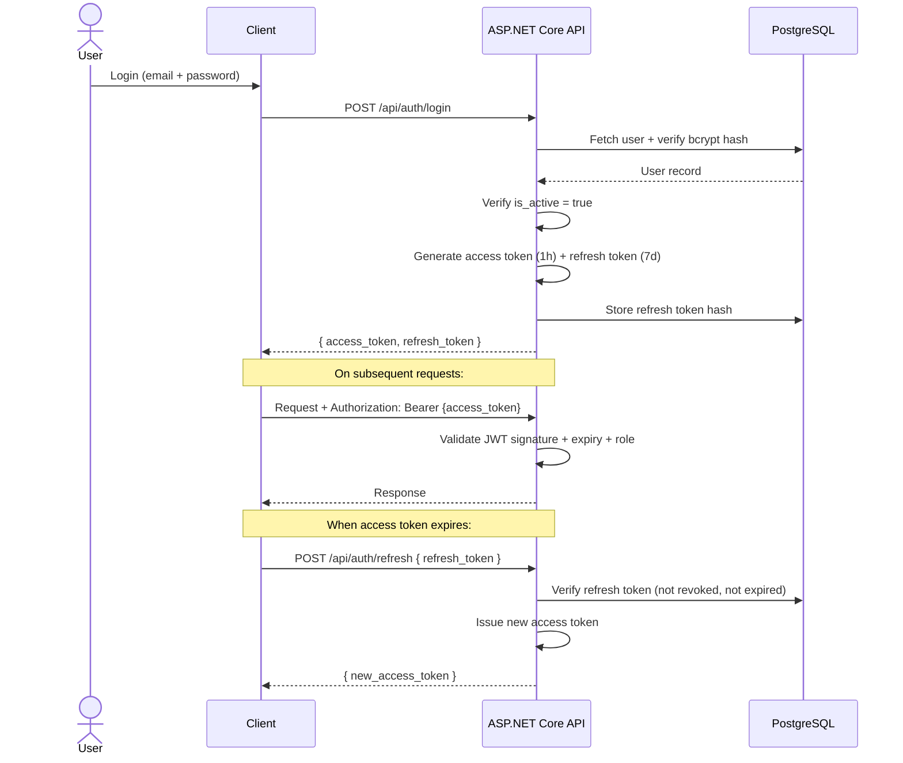

> **RETAINED HISTORICAL DESIGN — OWNER REVIEW PENDING (2026-09-28).** The body below is preserved domain/design material, not verified current implementation or an active task list. Historical labels such as "canonical", "current", "implemented" and "enforced" apply to its earlier snapshot only. Any old agent topology, route, library, database or completion claim is historical/proposed until checked against current source. Do not restore removed architecture. Follow the [source of truth](../00_SOURCE_OF_TRUTH.md), [catalog](../INDEX.md) and [current status](../current/IMPLEMENTATION_STATUS.md). Other members' subsystem completion is not certified here.

> **Specific interpretation:** Controls below are requirements/design examples; historical vulnerability findings are not re-certified here. Current code and targeted security verification must establish enforcement.

# EduFlow AI – Security & Privacy

> **Canonical design/reference document.** Read [Start here](../README.md) and the [responsibility matrix](../legacy/responsibilities/RESPONSIBILITY_MATRIX.md). Use [implementation status](../legacy/project/17_IMPLEMENTATION_STATUS.md) and current source/evidence to distinguish implemented behavior from targets. Examples and proposed routes are not certified runtime results.

> **Reconciliation note:** Treat the controls below as requirements/design examples, not a security certification. The [current audit](../legacy/responsibilities/RESPONSIBILITY_MATRIX.md) records missing authorization/resource checks, caller-selected registration roles, incomplete token revocation, hardcoded startup configuration and internal-service authentication that fails open without a secret. Student 1 coordinates shared identity/safety; Students 2 and 3 enforce their own academic/learner resource boundaries. No complete mitigation or passing security-test result is asserted.

> This document defines the security architecture, OWASP mitigation strategies, data privacy rules, and compliance requirements for EduFlow AI.

---

## 1. Security Principles

```
1. Defence in depth   — Multiple layers; no single point of failure
2. Least privilege    — Each role/service gets minimum required permissions
3. Zero trust         — Verify every request; never trust client claims
4. Secure by default  — Secure configurations out of the box
5. Fail safely        — On error, deny access rather than allow it
6. Audit everything   — All sensitive actions are logged immutably
```

---

## 2. Authentication Architecture

### 2.1 JWT Token Flow



### 2.2 Token Security Rules

```text
Access Token:
- Algorithm: RS256 (asymmetric key)
- Lifetime: 60 minutes
- Contains: user_id, email, roles, jti (unique token ID)
- NOT stored in localStorage (use httpOnly cookies or memory)

Refresh Token:
- Stored as bcrypt hash in database
- Single-use: rotated on every refresh
- Revoked on logout
- Revoked on password change
- Revoked on account deactivation
```

### 2.3 Password Security

```text
Algorithm: BCrypt
Work factor: 12 (tuned for ~250ms on server hardware)
Minimum requirements:
  - 8 characters
  - 1 uppercase letter
  - 1 lowercase letter
  - 1 number
  - 1 special character

Do NOT: store plaintext, MD5, SHA1, or unsalted hashes
```

---

## 3. Authorization Security

### 3.1 Server-Side Enforcement

```csharp
// ALWAYS validate at controller + service layer
// Never rely on client-provided role info

// Bad ❌ — trusting client header
var role = Request.Headers["X-User-Role"];

// Good ✅ — reading from validated JWT claim
var role = User.FindFirst(ClaimTypes.Role)?.Value;
var userId = User.FindFirst(ClaimTypes.NameIdentifier)?.Value;
```

### 3.2 Resource Ownership Checks

```csharp
// For every resource modification:
// 1. Check role (Instructor, Admin, etc.)
// 2. ALSO check that the resource belongs to the requesting user

var course = await _courses.GetAsync(courseId);

// Role check
if (!User.IsInRole("Instructor") && !User.IsInRole("Admin"))
    return Forbid(); // 403

// Ownership check (unless Admin)
if (!User.IsInRole("Admin") && course.InstructorId != currentUserId)
    return Forbid(); // 403
```

---

## 4. OWASP Top 10 Mitigations

| # | OWASP Risk | Mitigation in EduFlow AI |
|---|------------|--------------------------|
| A01 | Broken Access Control | Server-side RBAC + resource ownership checks; no client-side-only gates |
| A02 | Cryptographic Failures | BCrypt for passwords; RS256 JWT; HTTPS only; no sensitive data in logs |
| A03 | Injection | EF Core parameterized queries; no raw SQL concatenation; input validation |
| A04 | Insecure Design | Threat model documented; security requirements in Definition of Done |
| A05 | Security Misconfiguration | No default passwords; CORS restricted; Swagger disabled in production |
| A06 | Vulnerable Components | Dependabot alerts enabled; regular `dotnet list package --vulnerable` |
| A07 | Auth & Session Failures | RS256 JWT; short-lived tokens; refresh token rotation; logout revocation |
| A08 | Software Integrity Failures | GitHub Actions CI validates builds; signed Docker images |
| A09 | Logging & Monitoring | All auth events logged; suspicious patterns alert admin |
| A10 | SSRF | AI agent outbound calls allowlisted; no user-controlled URLs in server calls |

---

## 5. Input Validation & Injection Prevention

### 5.1 API Input Validation

```csharp
// All DTOs use Data Annotations or FluentValidation
public class CreateCourseDto
{
    [Required]
    [MaxLength(200)]
    public string Title { get; set; }

    [MaxLength(2000)]
    public string Description { get; set; }

    [Range(1, 5)]
    public int DifficultyLevel { get; set; }
}
```

### 5.2 SQL Injection Prevention

```csharp
// GOOD ✅ — EF Core parameterized query
var courses = await _db.Courses
    .Where(c => c.InstructorId == instructorId && c.Status == status)
    .ToListAsync();

// BAD ❌ — raw string interpolation (NEVER do this)
var courses = await _db.Database.ExecuteSqlRawAsync(
    $"SELECT * FROM courses WHERE instructor_id = '{instructorId}'"
);
```

### 5.3 File Upload Security

```text
File Upload Validation:
1. Check MIME type (not just file extension)
2. Check file size ≤ 50 MB
3. Scan with antivirus/ClamAV before processing
4. Store outside web root
5. Serve via signed URLs, not direct paths
6. Never execute uploaded files
7. Rename file to UUID on storage (prevent path traversal)
```

---

## 6. Rate Limiting

```csharp
// Applied globally + per endpoint

// Global rate limits (per IP)
builder.Services.AddRateLimiter(options =>
{
    options.GlobalLimiter = PartitionedRateLimiter.Create<HttpContext, string>(
        ctx => RateLimitPartition.GetFixedWindowLimiter(
            ctx.Connection.RemoteIpAddress?.ToString() ?? "unknown",
            _ => new FixedWindowRateLimiterOptions
            {
                PermitLimit = 100,
                Window = TimeSpan.FromMinutes(1)
            }
        )
    );
});
```

| Endpoint | Limit |
|----------|-------|
| `POST /api/auth/login` | 5 per minute per IP |
| `POST /api/auth/register` | 3 per hour per IP |
| `POST /api/ai/chat` | 30 per minute per user |
| `POST /api/ai/quizzes/generate` | 5 per minute per instructor |
| All other endpoints | 100 per minute per user |

---

## 7. Data Privacy

### 7.1 Student Data Classification

| Data Type | Classification | Storage | Retention |
|-----------|---------------|---------|-----------|
| Name, email | PII | PostgreSQL | Until account deletion |
| Password hash | Sensitive | PostgreSQL | Until account deletion |
| Learning progress | Educational record | PostgreSQL | 7 years (educational compliance) |
| Quiz answers | Educational record | PostgreSQL | 7 years |
| AI chat history | Behavioral | PostgreSQL | 1 year (configurable) |
| IP addresses | Metadata | Logs | 90 days |
| XP / badges | Gamification | PostgreSQL | Until account deletion |

### 7.2 AI Data Privacy Rules

```text
1. Student queries sent to AI are never used to train external models
2. If using OpenAI API, enable "no-training" opt-out
3. Student names are NOT included in AI prompts — use anonymized IDs
4. AI chat logs are accessible only to the student and admins
5. Instructors cannot read individual student AI chat histories
6. Document content is not sent to AI if the student is not enrolled
```

### 7.3 Student Rights

| Right | Implementation |
|-------|---------------|
| Right to access | `GET /api/students/me/data-export` — full JSON export |
| Right to erasure | `DELETE /api/students/me` — anonymize or delete |
| Right to correction | `PUT /api/students/me/profile` |
| Right to portability | Export in JSON format |

---

## 8. Audit Logging

Every sensitive action is logged to the `audit_logs` table:

```sql
CREATE TABLE audit_logs (
    id UUID PRIMARY KEY DEFAULT gen_random_uuid(),
    actor_id UUID,               -- who performed the action
    actor_role VARCHAR(50),
    action VARCHAR(100) NOT NULL, -- e.g., 'QuizSubmitted', 'AIContentApproved'
    resource_type VARCHAR(100),   -- e.g., 'Quiz', 'Course'
    resource_id UUID,
    ip_address INET,
    user_agent TEXT,
    details JSONB,               -- action-specific metadata
    occurred_at TIMESTAMPTZ NOT NULL DEFAULT NOW()
);

-- Audit logs are INSERT-ONLY (never updated or deleted)
-- Access requires Admin role
```

### 8.1 Events That Must Be Audited

```text
Authentication:
- Login (success / failure)
- Logout
- Password change
- Token refresh

User Management:
- Account creation
- Role assignment
- Account deactivation

Course Operations:
- Course published
- Student enrolled / removed

AI Operations:
- AI quiz generation requested
- AI question approved / rejected / edited
- AI tutor conversation started

Gamification:
- XP manually adjusted by admin
- Badge manually awarded by admin
- Leaderboard reset

Security:
- Unauthorized access attempt (403)
- Rate limit exceeded
- Suspicious pattern detected
```

---

## 9. Network Security

```text
Production requirements:
- HTTPS only (HSTS header with 1-year max-age)
- TLS 1.2+ only (disable TLS 1.0, 1.1)
- CORS restricted to known origins only
- Security headers:
    Content-Security-Policy: default-src 'self'
    X-Frame-Options: DENY
    X-Content-Type-Options: nosniff
    Referrer-Policy: strict-origin-when-cross-origin
    Permissions-Policy: camera=(), microphone=()
```

---

## 10. Secrets Management

```text
Do NOT:
- Hardcode secrets in source code
- Commit .env files to git
- Log connection strings or API keys

Do:
- Use environment variables for all secrets
- Use .NET User Secrets for local development
- Use Azure Key Vault / AWS Secrets Manager in production
- Rotate API keys regularly
- Ensure all secrets are excluded from logs
```

```bash
# .gitignore must include:
*.env
appsettings.Production.json
.env.local
secrets.json
```
