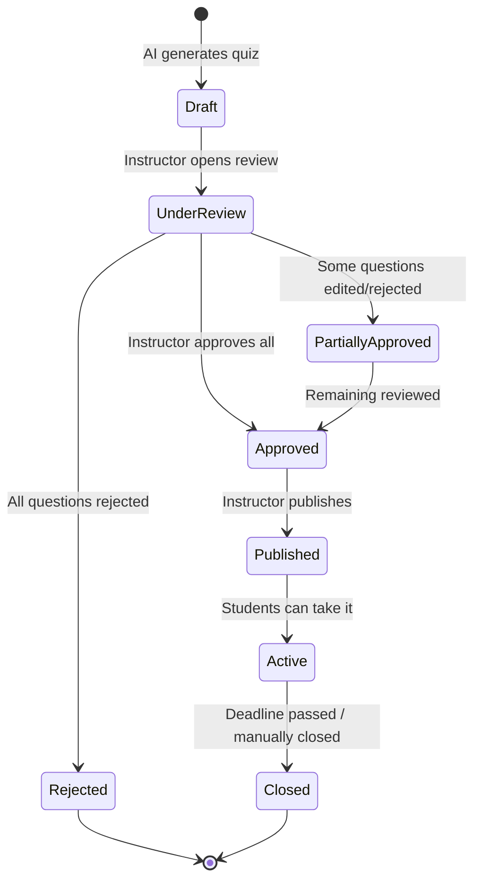
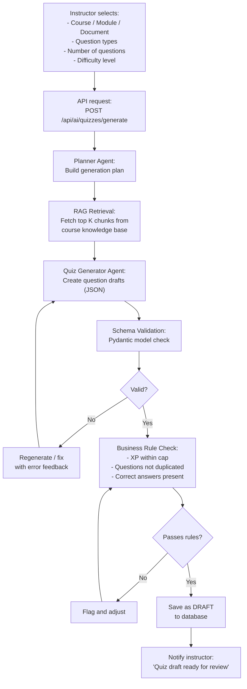
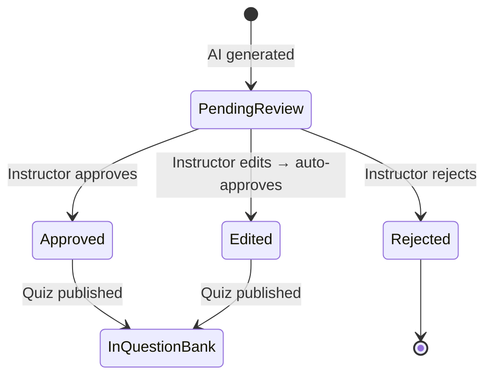
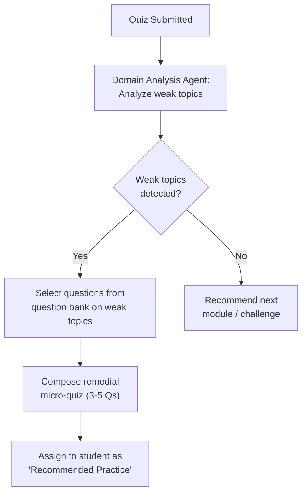

# EduFlow AI – Quiz Pipeline

> **Canonical design/reference document.** Read [Start here](../README.md) and the [responsibility matrix](../responsibilities/RESPONSIBILITY_MATRIX.md). Use [implementation status](17_IMPLEMENTATION_STATUS.md) and current source/evidence to distinguish implemented behavior from targets. Examples and proposed routes are not certified runtime results.

> **Reconciliation note:** The [current matrix](../responsibilities/RESPONSIBILITY_MATRIX.md) assigns academic definitions, grading contracts, generation/review and publishing to Student 2; learner attempts/results and rewards to Student 3; and lifecycle/validation safeguards to Student 1. The lifecycle below is a target: current AI generation can publish without review, attempts/timers are incomplete, and normal .NET submission does not invoke the Python AI evaluator. Do not claim this complete pipeline or its anti-cheat controls are implemented.

> This document describes the complete lifecycle of a quiz in EduFlow AI — from AI-assisted generation through instructor review to student delivery and grading.

---

## 1. Quiz Lifecycle Overview



---

## 2. Supported Question Types

| Type | Description | Example |
|------|-------------|---------|
| **Multiple Choice (MCQ)** | 4 options, one correct answer | "Which data structure is LIFO?" |
| **Multiple Select** | Multiple correct answers possible | "Select all sorting algorithms" |
| **Fill in the Blank** | Student types missing word(s) | "A _____ is a collection of key-value pairs" |
| **True / False** | Binary choice | "Python is statically typed: True / False" |
| **Dropdown Match** | Select correct answer from dropdown | "The time complexity of binary search is [dropdown]" |
| **Short Answer** | Free text, AI-graded | "Explain polymorphism in your own words" |

---

## 3. AI Quiz Generation Flow

### 3.1 Step-by-Step Pipeline



### 3.2 Generation Prompt Template

```text
SYSTEM:
You are an educational quiz creator for the course "{course_title}".
Generate {n} {question_type} questions at {difficulty} difficulty level.
Base ALL questions strictly on the provided course content.
Do NOT invent facts not present in the content.

COURSE CONTENT (retrieved chunks):
{context_chunks}

OUTPUT FORMAT (JSON array):
[
  {
    "question_text": "...",
    "question_type": "MCQ | FILL_BLANK | TRUE_FALSE | DROPDOWN | SHORT_ANSWER",
    "options": ["A", "B", "C", "D"],       // for MCQ/Dropdown
    "correct_answer": "A",
    "explanation": "Why this is correct...",
    "difficulty": "EASY | MEDIUM | HARD",
    "topic_tag": "recursion",
    "source_chunk_ids": ["chunk_uuid_1", "chunk_uuid_2"]
  }
]

RULES:
- Each question must be answerable from the provided content
- Distractors must be plausible but clearly wrong
- Explanations must reference the source material
- Do not repeat the same question concept
```

### 3.3 XP Assignment for Questions

```json
{
  "question_xp_by_difficulty": {
    "EASY": 5,
    "MEDIUM": 10,
    "HARD": 15,
    "EXPERT": 20
  },
  "quiz_completion_bonus": 20,
  "perfect_score_bonus": 50,
  "max_quiz_xp": 150
}
```

> **Backend enforces caps** — AI may suggest XP values, but the backend normalizes them to the configured rules.

---

## 4. Instructor Review Interface

### 4.1 Review Dashboard Features

```
Instructor opens: /instructor/quizzes/{draftId}/review

┌─────────────────────────────────────────────────┐
│  Quiz Draft: "Module 3 – Recursion Quiz"        │
│  Generated: 10 questions | Pending review: 10   │
├─────────────────────────────────────────────────┤
│  Q1. [MCQ] What is the base case in recursion?  │
│  Options: A) When stack overflows  B) When...   │
│  Correct: B  | XP: 10 | Source: Page 42        │
│  [✅ Approve] [✏️ Edit] [❌ Reject]              │
├─────────────────────────────────────────────────┤
│  Q2. [Fill in Blank] The _____ prevents...      │
│  Answer: "base case" | XP: 10 | Source: Page 43│
│  [✅ Approve] [✏️ Edit] [❌ Reject]              │
├─────────────────────────────────────────────────┤
│  [Approve All] [Reject All] [Publish Approved]  │
└─────────────────────────────────────────────────┘
```

### 4.2 Question State Machine



### 4.3 Edit Flow

When an instructor edits a question:
1. The instructor modifies question text, options, or correct answer
2. The edited version overwrites the draft
3. Status automatically changes to `EDITED` (which counts as approved)
4. Source chunk reference is preserved for traceability

---

## 5. Question Bank

All approved questions go into the **Question Bank** — a reusable pool per course.

```sql
CREATE TABLE questions (
    id UUID PRIMARY KEY,
    course_id UUID NOT NULL REFERENCES courses(id),
    module_id UUID REFERENCES modules(id),
    created_by UUID REFERENCES users(id),  -- instructor
    ai_generated BOOLEAN NOT NULL DEFAULT FALSE,
    ai_review_status VARCHAR(20),          -- APPROVED | EDITED | REJECTED
    question_type VARCHAR(30) NOT NULL,
    question_text TEXT NOT NULL,
    options JSONB,                          -- for MCQ, dropdown
    correct_answer TEXT NOT NULL,
    explanation TEXT,
    difficulty VARCHAR(10) NOT NULL,
    topic_tag VARCHAR(100),
    xp_reward INTEGER NOT NULL DEFAULT 10,
    source_chunk_ids UUID[],               -- RAG traceability
    created_at TIMESTAMPTZ DEFAULT NOW(),
    updated_at TIMESTAMPTZ DEFAULT NOW()
);
```

---

## 6. Quiz Publishing & Delivery

### 6.1 Quiz Configuration (Instructor)

```json
{
  "quiz_id": "uuid",
  "title": "Module 3 – Recursion Quiz",
  "course_id": "uuid",
  "module_id": "uuid",
  "question_ids": ["q1", "q2", "q3", "..."],
  "settings": {
    "time_limit_minutes": 30,
    "max_attempts": 3,
    "shuffle_questions": true,
    "shuffle_options": true,
    "show_feedback": "after_submission",
    "available_from": "2026-09-08T09:00:00Z",
    "available_until": "2026-09-15T23:59:59Z",
    "passing_score_percent": 60
  }
}
```

### 6.2 Student Quiz Attempt Flow

```mermaid
sequenceDiagram
    actor Student
    participant App as Flutter App
    participant API as Backend API
    participant Gamification

    Student->>App: Open quiz
    App->>API: GET /api/quizzes/{id} (check eligibility)
    API->>API: Check: enrolled? attempts left? within time window?
    API-->>App: Quiz questions (shuffled)
    
    Student->>App: Answer all questions
    App->>API: POST /api/quizzes/{id}/submit { answers: [...] }
    
    API->>API: Grade answers (deterministic server-side)
    API->>Gamification: Emit QuizCompleted event { score, passed, xp_earned }
    Gamification->>API: Award XP, check badges, update streak
    
    API-->>App: {
        score: 85,
        passed: true,
        xp_earned: 95,
        badges_unlocked: ["QUIZ_MASTER"],
        feedback: [{ question_id, correct, explanation }]
    }
    App-->>Student: Results screen with rewards
```

---

## 7. Grading Logic (Current Implementation)

> **Important:** All grading is **rule-based** (deterministic C# heuristics). The AI evaluator exists but is not called during submission.

### 7.1 Grading by Question Type

| Question Type | Grading Method |
|---------------|----------------|
| MCQ | Exact match on correct_answer |
| Multiple Select | All correct options must be selected, none wrong |
| Fill in Blank | Case-insensitive, trimmed match (+ accepted synonyms list) |
| True/False | Exact boolean match |
| Dropdown | Exact match |
| Short Answer | Keyword-overlap heuristic (rule-based, not AI) — see §7.2 |

### 7.2 Short Answer Grading (Current Implementation)

Short answer grading uses a **deterministic keyword-overlap heuristic** in `QuizzesController.SubmitQuiz` (lines 1551–1568). The model answer is split into words >3 characters; the student answer is scored by keyword containment ratio, clamped to `[4, maxPoints]`, and passes at ≥70% of points.

The AI semantic rubric grader described below exists in `ai-agent/agents/quiz_evaluator_agent.py` but is **not invoked** by the .NET submission path. The `AiGatewayClient.AutoGradeQuizSubmissionAsync` method that would call it has zero callers.

### 7.3 Score Calculation

```
raw_score = (correct_questions / total_questions) × 100
passed    = raw_score >= quiz.passing_score_percent

xp_earned = Σ(question.xp_reward for each correct question)
          + quiz_completion_bonus
          + (perfect_score_bonus if raw_score == 100)

final_xp  = min(xp_earned, quiz.max_xp_cap)
```

---

## 8. Adaptive Quiz Assignment (AI-driven)

After each quiz submission, the AI analysis agent runs:



---

## 9. Quiz Anti-Cheat Measures

| Measure | Implementation |
|---------|---------------|
| Shuffled questions | `shuffle_questions: true` per attempt |
| Shuffled options | Options randomized per attempt |
| Time limit | Enforced server-side with attempt start timestamp |
| Max attempts | Enforced server-side; client cannot bypass |
| No XP farming | Same quiz attempt doesn't re-award full XP after first pass |
| Answer history | All submissions stored; patterns analyzed for anomalies |
